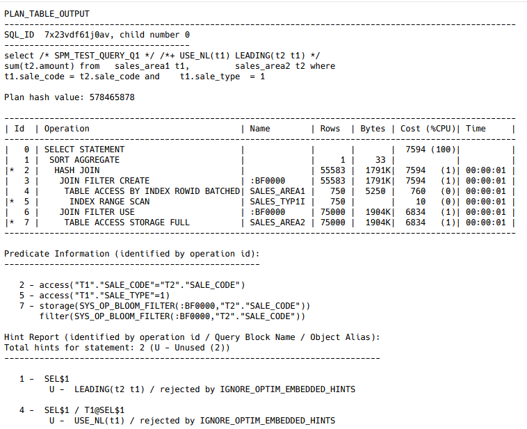

# Execute an Application Query With a Good Plan Again

## Introduction

In this lab you will execute and application query with a good plan. Its performance will be acceptable.

Estimated Time: 5mins

### Objectives
- Reset the lab, execute an application query with a good plan, and wait for it to be captured in the automatic SQL tuning set.

### Prerequisites
This lab assumes you have completed the following:

- Provision an Autonomous Database Instance
- Create an Application Schema
- Execute an Application Query With a Good Plan
- Execute the Application Query, Inducing a Poor Plan

## Task 1: Reset the Lab

1. It is important to remove the test query from the cursor cache and ensure that and references to the query are removed from SQL plan baselines and the autmatic SQL tuning set. You cannot "flush shared pool" in ADB so, instead, restart the database to ensure that the cursor cache is purged. Select "Restart" from "More Actions," confirm, and wait for the database to be available again.

    
    

2. If you have executed and tasks in this lab report, use the SQL worksheet to remove references to the test query from the automatic SQL tuning set and SQL plan baselines.

	```
	<copy>        
    --
    -- Remove the query from SQL plan baslelines
    --
    DECLARE
      l_plans_dropped  PLS_INTEGER;
    BEGIN
      FOR REC IN (SELECT DISTINCT sql_handle FROM DBA_SQL_PLAN_BASELINES 
              WHERE sql_text LIKE 'select /* SPM_TEST_QUERY_Q1 */%')
      LOOP
          l_plans_dropped := dbms_spm.drop_sql_plan_baseline (
            sql_handle => rec.sql_handle,
            plan_name  => NULL);
      END LOOP;
    END;
    /
    --
    -- Remove the query from the automatic SQL tuning set
    --
    BEGIN
       dbms_sqltune.delete_sqlset(sqlset_name=>'SYS_AUTO_STS',
           basic_filter=>'sql_text LIKE ''select /* SPM_TEST_QUERY_Q1 */%''',
    	   sqlset_owner=>'SYS');
    END;
    /
	</copy>
	```

## Task 2: Run the Application Query (Good Performance)

1. Run the following script. It is *essential* that you use the run script button (highlighted). The hints in this SQL statement will induce a bad plan. However, the *alter session* will ensure that they are ignored so that the initial plan will be good.

    

    ```
    <copy>
    alter session set optimizer_ignore_hints = true;

    select /* SPM_TEST_QUERY_Q1 */ /*+ USE_NL(t1) LEADING(t2 t1) */ sum(t2.amount)
    from   sales_area1 t1, 
           sales_area2 t2
    where  t1.sale_code = t2.sale_code
    and    t1.sale_type  = 1;

    SELECT *
    FROM table(DBMS_XPLAN.DISPLAY_CURSOR(sql_id=>'7x23vdf61j0av'));
    </copy>
    ```

    

## Task 3: Wait for the SQL Statement to be Captured

1. Wait for the auto SQL tuning set task to run. Real-time SPM checks SQL execution plans against those recorded in the automatic SQL tuning set. For this reason, we need to wait for the initial good plan to be captured. This step may take a few minutes.

    ```
    <copy>
    --
    -- For demonstration purposes, we'll increase the frequency of task execution
    -- so we don't have to wait too long for the SQL statement to be captured.
    --
    begin
        dbms_auto_task_admin.modify_autotask_setting('Auto STS Capture Task', 
            'INTERVAL', 120);
    end;
    /
    --
    -- Loop until the auto task has completed
    --
    declare
        lasttime timestamp ;
        thistime timestamp ;
        executed boolean := false;
        sts varchar2(20);
        n number := 0;
        cursor c1 is
            select last_schedule_time,status
            into   thistime,sts
            from   dba_autotask_schedule_control 
            where  dbid = sys_context('userenv','con_dbid')
            and    task_name = 'Auto STS Capture Task';
    begin
        open c1;
        fetch c1 into lasttime,sts;
        close c1;
        while not executed
        loop 
            open c1;
            fetch c1 into thistime,sts;
            close c1;
            if thistime>lasttime and sts = 'SUCCEEDED' and n > 0
            then
                executed := true;
            else
                dbms_lock.sleep(2);
            end if;
            n := n + 1;
        end loop;
    end;
    /
    --
    -- Back to the default
    --
    begin
        dbms_auto_task_admin.modify_autotask_setting('Auto STS Capture Task', 
            'INTERVAL', 900);
    end;
    /
    </copy>
    ```

## Task 4: View Automatic SQL Tuning Set Task Details

1. Optionally, you can view task details using the following query.
    
    ```
    <copy>
    select task_name, 
           interval,
           status, 
           last_schedule_time, 
           systimestamp-last_schedule_time ago
    from  dba_autotask_schedule_control 
    where dbid = sys_context('userenv','con_dbid')
    and   task_name = 'Auto STS Capture Task';
	</copy>
	```

## Task 5: Check the Test Query Has Been Captured in the Automatic SQL Tuning Set

1. Before proceeding, check that the following query returns a row to confirm that the SQL statement has been captured in the automatic SQL tuning set. If this query returns no rows, re-run Task 3, Step 1 (above).

    ```
	<copy>
    select substr(sql_text,1,50) txt,
           executions,decode(executions,0,-1,round(buffer_gets/executions)) bget_per_exec,
           plan_hash_value
    from dba_sqlset_statements 
    where sqlset_name = 'SYS_AUTO_STS' 
    and sql_text like 'select /* SPM_TEST_QUERY_Q1 */%';
    </copy>
	```

2. Notice the plan hash value here matches the plan hash value shown in the explain plan output, above. Your value for BGET\_PER\_EXEC might be slightly different.

    

You may now *proceed to the next lab.*

## Acknowledgements
* **Author** - Nigel Bayliss, Dec 2024
* **Last Updated By/Date** - Nigel Bayliss, Dec 2024