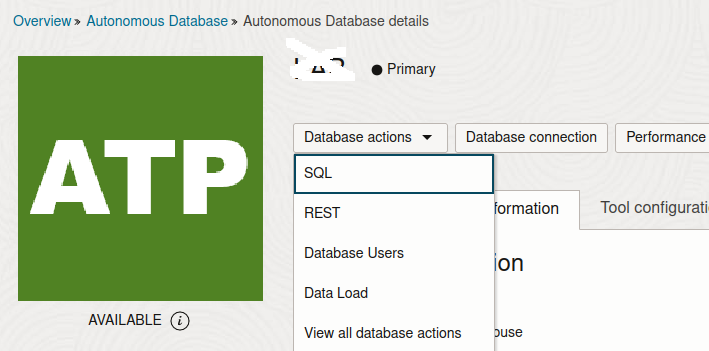
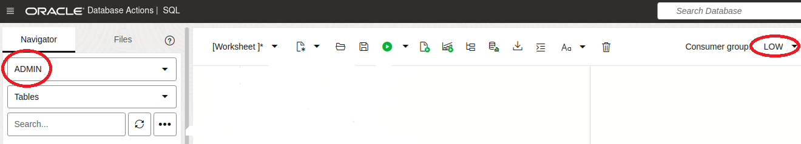

# Create an Application Schema

## Introduction

In this lab you will create a test schema and enable real-time SPM.

Estimated Time: 5mins

### Objectives
- Create a schema for an application test query and enable real-time SQL plan management.

### Prerequisites
This lab assumes you have completed the following:

- Provision an Autonomous Database Instance

## Task 1: Prepare to Execute SQL statements in a SQL Query Window using Database Actions 

We will now prepare to execute SQL statements. 


1. From your Autonomous Database Details page, click "Database actions" and then "SQL":

	

2. Ensure you are connected to ADMIN via the LOW service (circled in red):	

	

## Task 2: Create and Populate an Application Tables

1. Drop the test table if it exists already.

    ```
	<copy>
    declare
        ORA_00942 exception; pragma Exception_Init(ORA_00942, -00942);
    begin
        execute immediate 'drop table sales_area1 purge';
        exception when ORA_00942 then null;
    end;
    /
    declare
        ORA_00942 exception; pragma Exception_Init(ORA_00942, -00942);
    begin
        execute immediate 'drop table sales_area2 purge';
        exception when ORA_00942 then null;
    end;
    /
-- If you are using 23ai, you can use the following commands instead
-- drop table if exists sales_area1 purge;
-- drop table if exists sales_area2 purge;
	</copy>
	```

2. Create the tables

    ```
	<copy>
    create table sales_area1 (
		sale_code number(10), 
		b varchar2(2000), 
		amount number(10,2), 
		sale_type number(10), 
		c varchar2(1000));

    insert /*+ APPEND */ into sales_area1
    select mod(rn,1000), 
	   dbms_random.string('u',2000), 
	   dbms_random.value(1,5), 
	   mod(rn,100),
	   dbms_random.string('u',50)
    from (
        select trunc((rownum+1)/2) as rn, mod(rownum+1,2) as parity
        from (select null from dual connect by level <= 150)
           , (select null from dual connect by level <= 500)
    );

    commit;

    create table sales_area2 as 
	select sale_code,
	   b,
	   dbms_random.value(1,3) amount,
	   sale_type,c 
	from sales_area1;

    create index sales_area2i on sales_area2 (sale_code,c);
    create index sales_typ1i on sales_area1 (sale_type,c);

    begin
        dbms_stats.gather_table_stats(user,'sales_area1',
		   method_opt=>'for all columns size 254',no_invalidate=>false);
		dbms_stats.gather_table_stats(user,'sales_area2',
		   method_opt=>'for all columns size 254',no_invalidate=>false);
	end;
	/
	</copy>
	```

## Task 3: Enable Real-time SPM

1. Use the DBMS_SPM API to enable real-time SPM.

    ```
	<copy>
    begin
        dbms_spm.configure('AUTO_SPM_EVOLVE_TASK', 'AUTO');
    end;
    /
	</copy>
	```

2. Confirm the mode is set to AUTO.

    ```
	<copy>
    select parameter_value spm_status
    from   DBA_SQL_MANAGEMENT_CONFIG
    where  parameter_name = 'AUTO_SPM_EVOLVE_TASK';
	</copy>
	```

    ```
    SPM_STATUS 
    ---------- 
    AUTO       
    ```

## Acknowledgements
* **Author** - Nigel Bayliss, Dec 2024
* **Last Updated By/Date** - Nigel Bayliss, Jan 2025