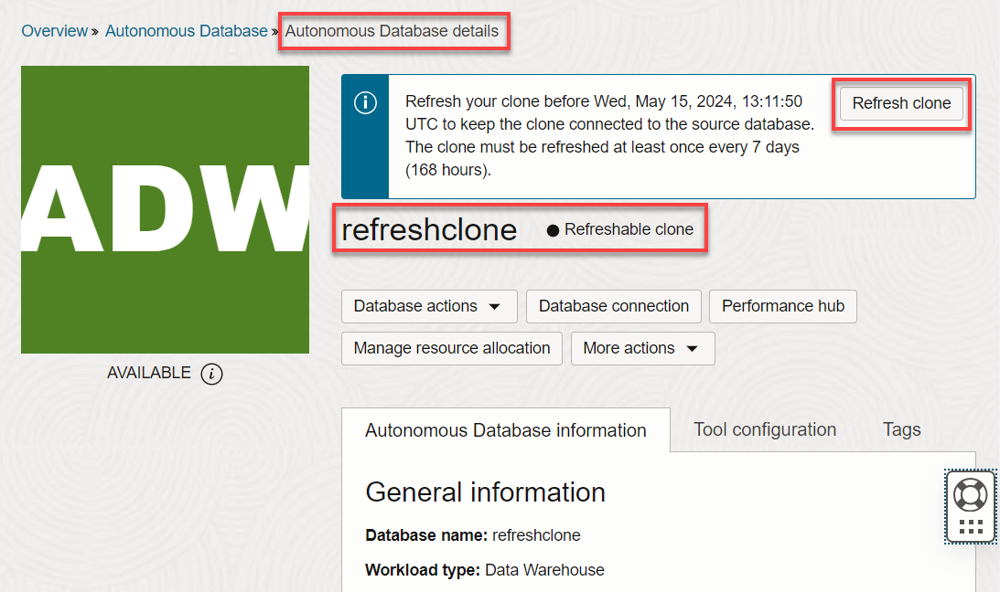
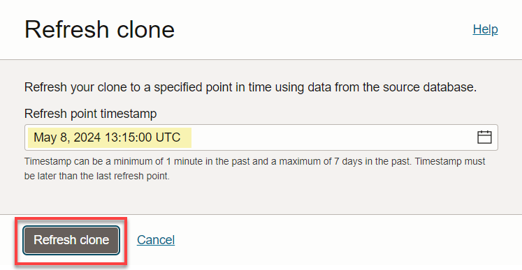
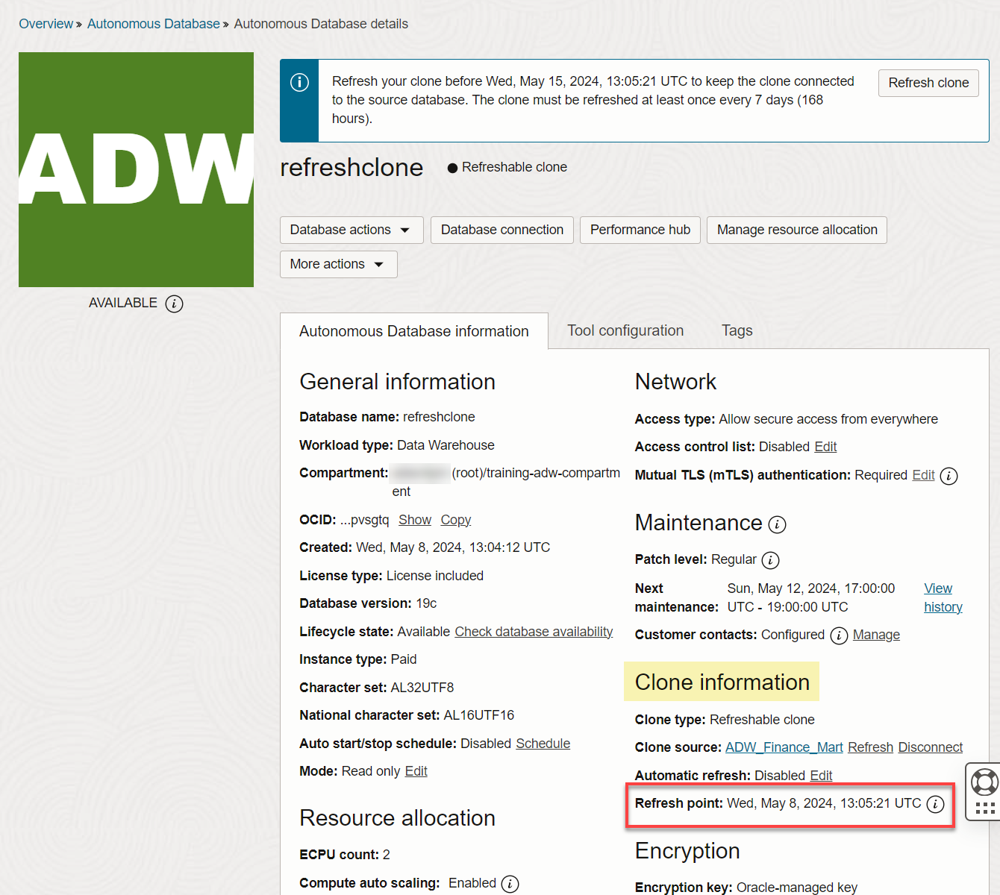

# Create Refreshable Clones in Autonomous AI Database

_**Important:** This lab uses features which are not available on Oracle's Always Free databases or on the Oracle LiveLabs Sandbox hosted environments (the Green button). If you run this lab using an Always Free database or a LiveLabs Sandbox environment, you can only review the steps and later practice the steps using your organization’s own tenancy._

## Introduction

One of the most widely used features in Autonomous AI Database Serverless is the ability to clone your database, no matter how big or small, with little to no effort.

  

The previous lab showed how to create a full clone from the currently running database or from a backup timestamp of that database. This lab shows how to create a refreshable read-only clone that **automatically refreshes** when the data in its source database changes.

A refreshable clone is a **read-only** clone that stays **connected to**, and has the ability to pull in (refresh data from), its **source** database with a simple click of a button. Before this feature was available, if you needed to update your clone's data from its source, you had two options:

1. Move new data from the source database to the clone (via data pump, database links etc.)
2. Create a new clone from the source database

Refreshable clones take away the friction of these above options by enabling you to refresh your clone's data by simply clicking a **refresh button** and providing the source database's timestamp to refresh to (aptly termed the **refresh point** <ins>)</ins>; the clone automatically looks at your source database's logs and pulls in all the data up to your inputted timestamp.

Here are some example use cases where this clone type can be useful to your team:

- Providing a routinely updated clone to a different business unit within your organization for reporting and analysis 
- Creating billing or workload separation for your databases between business units within the organization
- Providing up-to-date read-only test database environments to internal teams

As with everything OCI, your refreshable clone can also be refreshed via simple REST API calls (see [API documentation](https://docs.oracle.com/en/cloud/paas/atp-cloud/atpug/refreshable-clone-api.html#GUID-142E2A6E-2F75-4CAB-AD9A-427A368B004C)). Better still, with the ability to[ call cloud REST APIs from a controlling ADB instance](https://blogs.oracle.com/datawarehousing/how-to-run-cloud-rest-api-from-within-your-autonomous-database), you can quickly schedule automate your data refreshes to fit right into your data pipeline, without having to deploy any servers!

This lab shows you how to create a refreshable clone and refresh it with updated data from its source database.

Estimated Lab Time: 15 minutes

Watch the video below for a quick walk-through of the lab.

[Create Refreshable Clones in Autonomous AI Database](videohub:1_f2xmkhp9)

### Objectives

In this lab, you'll:

- Create a test table with data in your source database.
- Create a refreshable clone of the source database.
- Insert additional data into the source database.
- Define a refresh point timestamp of the source database and refresh the clone. 
- Confirm that the additional data in the source database is pulled into the clone.

**Note:**  This lab uses refreshable clones, which are not available with Oracle's Always Free databases. You can run the lab by reserving a hosted Livelabs environment, or by signing up for free trial credits, or by using your own tenancy.

## Task 1: Create a Table in the Source Database

1. On the **Autonomous AI Databases** page, click the **ADW Finance Mart** database instance that you created in the **Provision Autonomous AI Database** lab. Alternatively, you can create a new database as your source. You will insert a line of data into this source database before you clone it.

  

2. On the **Autonomous Databases details** page, click the **Database actions** drop-down list, and then click **SQL**.

  

    The SQL worksheet is displayed.

3. Create a table named **`refreshclonetests`** with a single row of data in it, before you proceed to clone the database. In the worksheet, note the time that you perform this action. Copy and paste the following code into your SQL Worksheet, and then click the **Run Script (F5)** icon in the Worksheet toolbar.

    ```
    <copy>
    CREATE TABLE refreshclonetests (testcol varchar(255));
    INSERT INTO refreshclonetests (testcol) values ('Is this great?');
    COMMIT;
    </copy>
    ```

    

    >**Note:** In our example, the code was executed at **`1:10:48 PM UTC time`**.

## Task 2: Create a Refreshable Clone from the Autonomous AI Database Instance

Now that you have created a table in the source database and populated it with a row of data, you will create a refreshable clone from the source database.

1. Return to the **Autonomous AI Database details** page of your source database. Click the **More actions** drop-down menu, and then select **Create clone**.

2. For the **Clone type**, accept the default **Full Clone**. Enable the **Refreshable clone** slider. A refreshable clone must be refreshed every 7 days or less; otherwise, it falls too far out of sync from the source and can no longer be refreshed.

  

3. In the **Basic information for the Autonomous AI Database clone** section, accept the currently selected region and compartment. Enter **`refreshclone`** for the display and database names.

  

4. In the **Database configuration** section, accept the default number of **ECPU Count**, `4`, for your refreshable clone. There is **no storage selection** necessary. Since this is a read-only clone that only brings in data from its source database, the amount of storage selected in TB is automatically the same as that of the source.

5. There is also no Admin password option for the refreshable clone, as that is taken from the source when refreshed.

6. In the **Choose network access** section, select **Secure access from everywhere**.

7. In the **Provide contacts for operational notifications and announcements** section, provide a contact email address to receive operational notifications and announcements.

8. Click **Clone**. The initial state is **`PROVISIONING`**. Once the clone is provisioned, you can see useful clone information such as the **Clone source database** that the clone is attached to and the **Refresh point** timestamp of the source from which the clone was refreshed.
  
  

9. Navigate back to your SQL Worksheet from the **refreshable clone's** OCI console. Close the information and warning boxes. Click **Allow** when you paste the query in the SQL Worksheet.

  

10. Query the table that you created and populated. Copy and paste the following query into your SQL Worksheet, and then click the **Run Statement** icon in the Worksheet toolbar.

    ```
    <copy>
    SELECT *
    FROM refreshclonetests;
    </copy>
    ```

    

  The result displays the table **`refreshclonetests`** that you created in the source database, with the single row of data that you inserted.

## Task 3: Insert Additional Data into the Source Database

You have proven that the refreshable clone contains the source database's table with one row of data. Now, you will add a second row of data to the source database, and learn how to refresh the clone to pick up that second row.

1. Switch back to the **source database's** SQL worksheet. This will be the **`ADW_Finance_Mart`** database instance that you created in the workshop's **Provision an Autonomous AI Database** lab, or another database that you might be using as the source.

  

2. Insert and commit an additional row into the source database. Copy and paste the following script into your SQL Worksheet, and then click the **Run Script (F5)** icon in the Worksheet toolbar.

    ```
    <copy>
    INSERT INTO refreshclonetests (testcol) VALUES ('You can refresh whenever you need!');
    COMMIT;
    </copy>
    ```

    

3. Query the updated table. Copy and paste the following query into your SQL Worksheet, and then click the **Run Statement** icon in the Worksheet toolbar.

    ```
    <copy>
    SELECT *
    FROM refreshclonetests;
    </copy>
    ```

    

    You now have 2 rows in the source but only a single row in the refreshable clone.

4. Make note of the time when you inserted the second row. Copy and paste the following code into your SQL Worksheet, and then click the **Run Script (F5)** icon. This will retrieve the current timestamp of the database.

    ```
    <copy>
    SELECT SYSTIMESTAMP
    FROM dual;
    </copy>
    ```

  

## Task 4: Refresh the Clone to View New Data

You will now learn how easy it is to refresh the clone with the new data you just added to the source.

1. Return to the **Autonomous AI Database details** page of your **`refreshclone`** clone database. Scroll-down to the **Clone information** section.

    

2. In the **Clone information** section, click the **Actions** icon (ellipsis), and then select **Refresh**. The **Refresh point** field displays the date and time before which you must refresh the clone (which is 7 days after the last refresh was performed), before it would lose the ability to sync with the source.

  

3. The **Refresh Clone** dialog box prompts you for a refresh point date and time of the source database to which you want to refresh. This makes refreshes consistent and intelligible, as it definitively refreshes to an exact timestamp of the source. For example, if you inserted the second row into the source at about `1:37 PM UTC`, you could input `1:47 PM UTC` as your refresh point. After you enter your refresh point timestamp, click **Refresh**.

  

4. While the clone is refreshing, the state of the refresh is **UPDATING**. During a refresh, connections are not dropped and any running queries on the clone simply wait until the refresh is completed. The refresh may take several seconds to several minutes depending on how long it has been since the last refresh, and the number of changes that have come in since then.

    

5. Once the refresh is completed, you can see exactly what timestamp of the source the clone has been refreshed to in the clone's **Autonomous AI Database details** page.

    

6. In the clone's SQL worksheet, query the **refreshclonetests** table. Copy and paste the following query into your SQL Worksheet, and then click the **Run Script** icon in the Worksheet toolbar.

    ```
    <copy>
    SELECT *
    FROM refreshclonetests;
    </copy>
    ```

    

    The result shows both rows of data from the source instead of just one row! The data in the clone has been seamlessly updated to reflect that which is in the source.

    With the Refreshable Clones feature, you can now keep cloned databases updated without any tedious manual export process. As new data comes into your source database each day, it can easily be refreshed into all its connected refreshable clones with a few button clicks.

You may now **proceed to the next lab**.

## Want to Learn More?

* [Using Refreshable Clones with Autonomous AI Database](https://docs.oracle.com/en/cloud/paas/autonomous-data-warehouse-cloud/user/autonomous-refreshable-clone.html#GUID-C49DA251-D347-491B-9C50-3D42EB3F93D9) 

## Acknowledgements

- **Author:** Lauran K. Serhal, Consulting User Assistance Developer
- **Contributor:** Nilay Panchal, ADB Product Management
- **Last Updated By/Date:**  Lauran K. Serhal, October 2025
