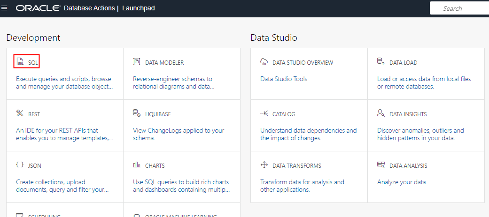
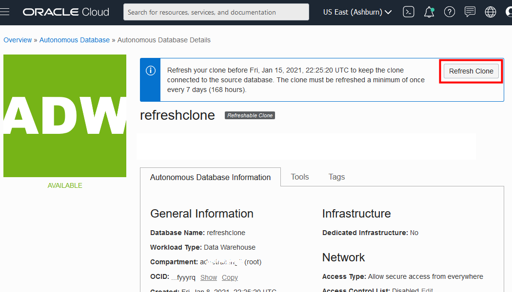

# Create Refreshable Clones in Autonomous Database

## Introduction

One of the most widely used features in Autonomous Database Serverless is the ability to clone your database, no matter how big or small, with little to no effort.

  

The previous lab showed how to create a full clone from the currently running database or from a backup timestamp of that database. This lab shows how to create a refreshable read-only clone that **automatically refreshes** when the data in its source database changes.

A refreshable clone is a **read-only** clone that stays **connected to**, and has the ability to pull in (refresh data from), its **source** database with a simple click of a button. Until now, if you needed to update your clone's data from its source, you had two options:

1. Move new data from the source database to the clone (via data pump, database links etc.)
2. Create a new clone from the source database

Refreshable clones take away the friction of these above options by enabling you to refresh your clone's data by simply clicking a **refresh button** and providing the source database's timestamp to refresh to (aptly termed the **refresh point** <ins>)</ins>; the clone automatically looks at your source database's logs and pulls in all the data up to your inputted timestamp.

Here are some example use cases where this clone type can be useful to your team:

- Providing a routinely updated clone to a different business unit within your organization for reporting and analysis 
- Creating billing or workload separation for your databases between business units within the organization
- Providing up-to-date read-only test database environments to internal teams

As with everything OCI, your refreshable clone can also be refreshed via simple REST API calls (see [API documentation](https://docs.oracle.com/en/cloud/paas/atp-cloud/atpug/refreshable-clone-api.html#GUID-142E2A6E-2F75-4CAB-AD9A-427A368B004C)). Better still, with the ability to[ call cloud REST APIs from a controlling ADB instance](https://blogs.oracle.com/datawarehousing/how-to-run-cloud-rest-api-from-within-your-autonomous-database), you can quickly schedule automate your data refreshes to fit right into your data pipeline, without having to deploy any servers!

This lab shows you how to create a refreshable clone and refresh it with updated data from its source database.

Estimated Lab Time: 15 minutes

Watch the video below for a quick walk-through of the lab.

[Create Refreshable Clones in Autonomous Database](videohub:1_f2xmkhp9)

### Objectives

In this lab, you'll:

- Create a test table with data in your source database.
- Create a refreshable clone of the source database.
- Insert additional data into the source database.
- Define a refresh point timestamp of the source database and refresh the clone. 
- Confirm that the additional data in the source database is pulled into the clone.

**Note:**  This lab uses refreshable clones, which are not available with Oracle's Always Free databases. You can run the lab by reserving a hosted Livelabs environment, or by signing up for free trial credits, or by using your own tenancy.

## Task 1: Create a Table in the Source Database

1. Navigate to your existing **ADW Finance Mart** database instance that you created in this workshop's "Provision Autonomous Database" lab. (Alternatively, create a new database as your source.) Insert a line of data into this source database before you clone it, by opening a Database Actions worksheet via the **Tools** tab in the Autonomous Database Details page of the OCI console. Connect to Database Actions as the user named **admin** with the password you created for the admin user in the Provision Autonomous Database lab. On the Database Actions **Launchpad**, under the **Development** heading, click **SQL**.

  

2. Create a table named refreshclonetests with a single row of data in it, before you proceed to clone the database. In the worksheet, note the time that you perform this action.

    ```
    <copy>create table refreshclonetests (testcol varchar(255));</copy>

    <copy>insert into refreshclonetests (testcol) values ('Is this great?');
    commit;</copy>
    ```

    

## Task 2: Create a Refreshable Clone from the Autonomous Database Instance

Now that you have created a table in the source database and populated it with a row of data, you will create a refreshable clone from the source database.

1. Return to the Autonomous Database details page of your source database. From the **More actions** drop-down menu, select **Create clone**.
  

2. Select the **Refreshable Clone** option. Note the text describing it; a refreshable clone must be refreshed every 7 days or less, otherwise it falls too far out of sync from the source and can no longer be refreshed.

  For this lab, name your clone's display name and database name **refreshclone**.
  

3. Select the number of ECPUs for your refreshable clone; for this lab, accept the default of 2 ECPUs. There is **no storage selection** necessary. Since this is a read-only clone that only brings in data from its source database, the amount of storage selected in TB is automatically the same as that of the source.

  There is also no Admin password option for the refreshable clone, as that is taken from the source when refreshed. Choose the network access type; for this lab, choose **Secure access from everywhere**. Select the license type; for this lab, accept the default of **License included**. Provide a contact email address to receive operational notifications and announcements. Click **Create Autonomous Database clone**.

  

4. Once the clone is provisioned, you can see useful clone information on the OCI console, including the **source database** that the clone is attached to, and the **refresh point** timestamp of the source from which the clone was refreshed.
  

5. Open a Database Actions SQL worksheet from the **refreshable clone's** OCI console<ins>,</ins> and query the database. It shows the table **refreshclonetests **that you created in the source, with the single row of data that you inserted.
  

## Task 3: Insert Additional Data into the Source Database

You have proven that the refreshable clone contains the source database's table with one row of data. Now add a second row of data to the source, and see how to refresh the clone to pick up that second row.

1. Switch back to the **source database's**  Database Actions SQL worksheet. (This will be the **ADW\_Finance\_ Mart** database instance that you created in this workshop's **Provision an Autonomous Database** lab, or another database you are using as the source.)  Insert and commit an additional row into the source database. You now have 2 rows in the source but only a single row in the refreshable clone. Make note of the time when you inserted the second row.

    ```
    <copy>insert into refreshclonetests (testcol) values ('You can refresh whenever you need!');

    commit;</copy>

    ```

    

## Task 4: Refresh the Clone to View New Data

Now see how easy it is to refresh the clone with the new data you just added to the source.

1. Return to the Database Details page of your **clone** database. Click the **Refresh** button in the banner. This banner also displays the date and time before which you must refresh the clone (which is 7 days after the last refresh was performed), before it would lose the ability to sync with the source.

  Also, note the **Disconnect Clone from Source Database option** from the **More Actions** drop-down menu. At any point, you may choose to disconnect your clone from its source, making it a regular, standalone, read/write database.
  

2. The **Refresh Clone** pop-up dialog asks for a refresh point timestamp of the source database to which you want to refresh. This makes refreshes consistent and intelligible, as it definitively refreshes to an exact timestamp of the source.

  So, if you inserted the second row into the source at about 17:59 PM UTC, you could input 18:00 PM UTC as your refresh point. After you enter your refresh point timestamp, click **Refresh Clone**.
  

3. While the clone is refreshing, it enters the &quot;UPDATING&quot; state. During a refresh, connections are not dropped and any running queries on the clone simply wait until the refresh is completed. The refresh may take several seconds to several minutes depending on how long it has been since the last refresh, and the number of changes that have come in since then.


4. Once the refresh is completed, you can see exactly what timestamp of the source the clone has been refreshed to in the clone's Database Details page.
  

5. In the clone's Database Actions SQL worksheet, you can now run a SELECT query on the **refreshclonetests** table and instead of a single row, you now see both rows of data from the source! The data in the clone has been seamlessly updated to reflect that which is in the source.

    ```
    <copy>select * from refreshclonetests;</copy>

    ```

    

  With the Refreshable Clones feature, you can now keep cloned databases updated without any tedious manual export process. As new data comes into your source database each day, it can easily be refreshed into all its connected refreshable clones with a few button clicks.

You may now **proceed to the next lab**.

## Want to Learn More?

- ADW Documentation: [Using Refreshable Clones with Autonomous Database](https://docs.oracle.com/en/cloud/paas/autonomous-data-warehouse-cloud/user/autonomous-refreshable-clone.html#GUID-C49DA251-D347-491B-9C50-3D42EB3F93D9) 

## Acknowledgements

- **Author** - Rick Green, Principal Developer, Database User Assistance
- **Contributor** - Nilay Panchal, ADB Product Management
- **Last Updated By/Date**  - Rick Green, August 2023
