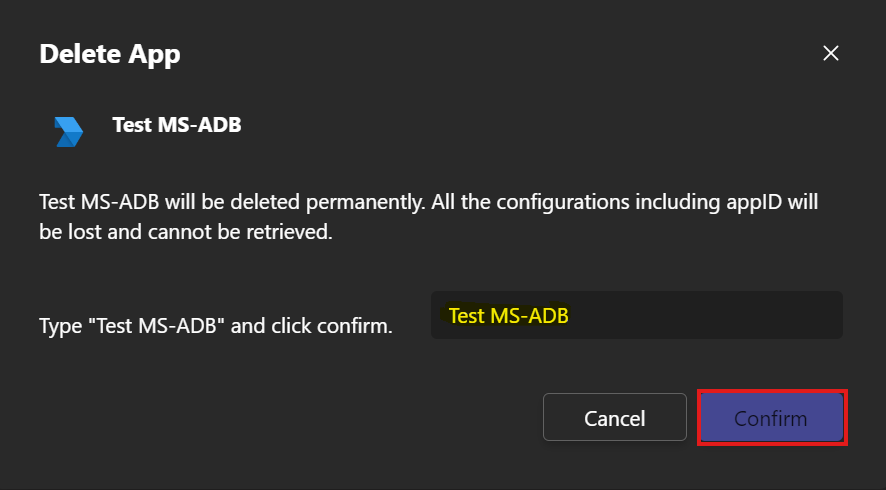
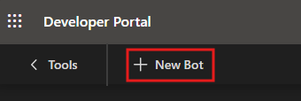
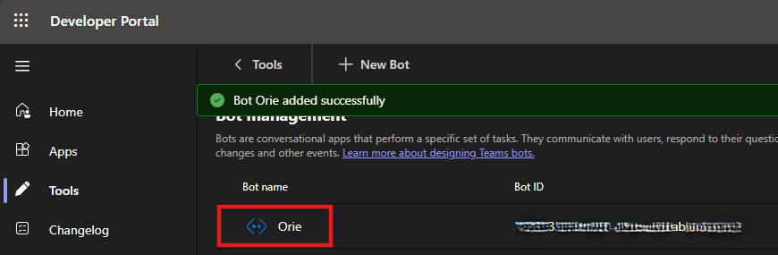
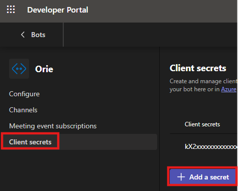
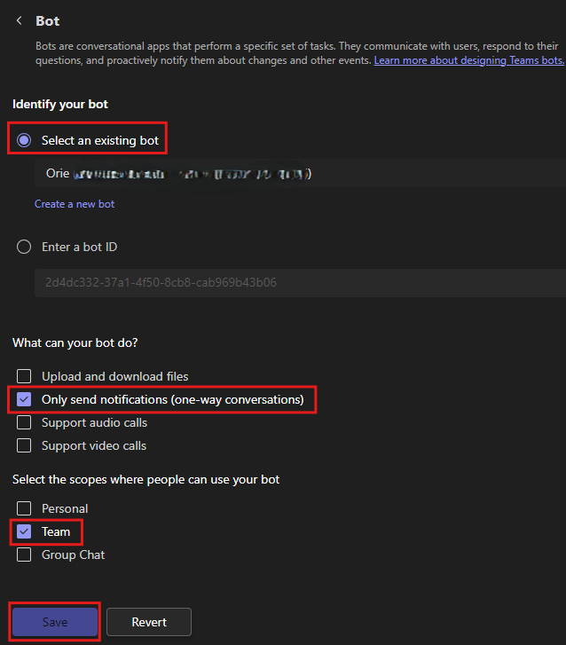
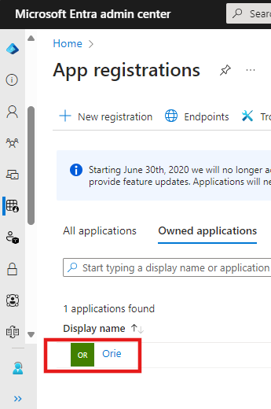
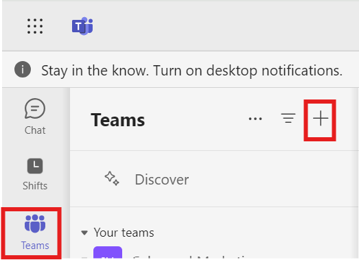
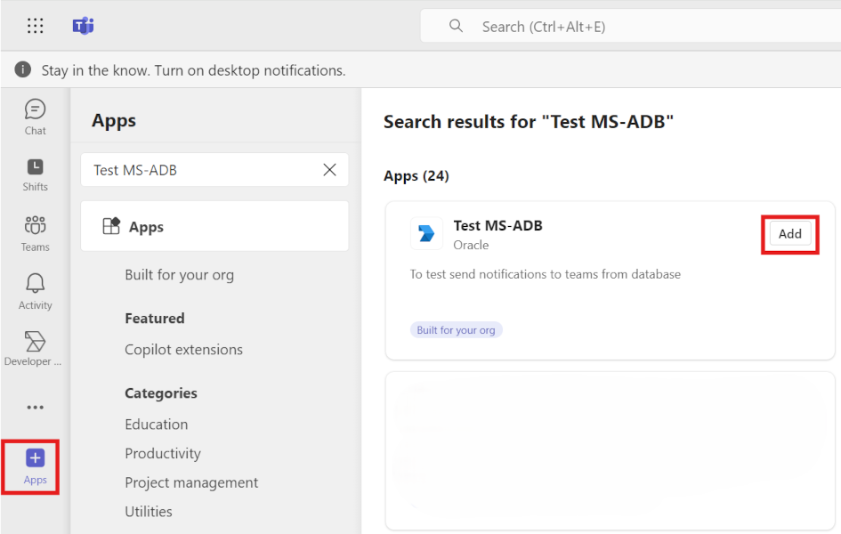
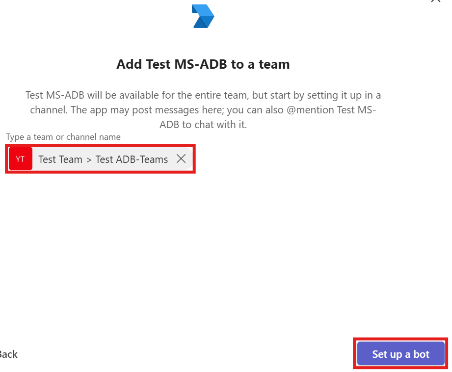

# Configure the Microsoft Teams Application

**Important:** This lab uses features which are not available on the Oracle LiveLabs Sandbox hosted environments (the Green button), and requires Microsoft Teams admin permissions.

## Introduction

Microsoft Teams serves as a comprehensive collaboration platform within the Microsoft 365 ecosystem, facilitating instant messaging, audio and video calls, and online meetings. With its seamless integration with other applications, Teams enhances productivity by streamlining communication and project management. Microsoft Teams supports a wide range of integrations with external apps and services.

This lab walks you through the steps to create your Microsoft Teams application and channel to receive messages, alerts and output of a query from Autonomous Database.

Estimated Time: 15 minutes

### Objectives

In this lab, you will:

+ Create your Microsoft Teams application
+ Create and configure a bot for your Microsoft Teams application
+ Publish your Microsoft Teams application
+ Configure your Microsoft Teams application using Azure Portal
+ Create your Microsoft Teams channel

### Prerequisites

+ Completion of the lab **Get Started** from the **Contents** menu on the left.
+ Microsoft Teams account and workspace
+ Microsoft Teams app and channel
+ Microsoft 365 Developer Account

> **Note:** The Microsoft 365 Developer Program offers a powerful sandbox environment through its Microsoft 365 E5 developer subscription. This subscription provides developers with a dedicated space to build and test solutions without impacting production systems. For more information, see [Set up a developer subscription](https://learn.microsoft.com/en-us/office/developer-program/microsoft-365-developer-program-get-started).

## Task 1: Create your Microsoft Teams application

1. To create a Microsoft Teams application, click [this link](https://dev.teams.microsoft.com/home) to access **Developer Portal for Teams**, and then select **Apps** from the navigation menu that is located on the left side panel.

    

    > **Note:** Please bookmark the [apps](https://dev.teams.microsoft.com/apps) link as you will need it for future tasks.

2. Click the plus sign next to **New app** to create a new application.

    

3. Enter a name for your app in the **Name** field, and then click **Add**.

    

4. Ensure that your app has been successfully created as shown in the screen capture.

    

5. If you want to delete your application, click the **3 dots** sign on the row for your app, and then click **Delete**.

    

6. Enter your application **name** in the field, and then click **Confirm**.

    

7. If successful, you will receive a message as shown in the screen capture.

    

## Task 2: Create and configure a bot for your Microsoft Teams application

For this task, you will create and configure a bot for your Microsoft Team application.  A bot is the application designed to interact through conversation and it is also referred to as a chatbot or conversational bot. It's an app that runs simple and repetitive tasks by users such as customer service or support staff. Everyday use of bots include, bots that provide information about the weather, make dinner reservations, or provide travel information. Interactions with bots can be quick questions and answers or complex conversations. For more information, see [Build bots for Teams](https://learn.microsoft.com/en-us/microsoftteams/platform/bots/what-are-bots).

1. Click the **Navigation menu** that is located on the left side panel.

    

2. Click **Tools** in the Navigation menu, and then click **Bot management** in the **Tools** section.

    

3. Click the plus sign next to **New Bot** to create your bot.

    

4. Enter your bot name in the **Bot name** field, and then click **Add**.

    

5. Ensure you receive a pop-up message confirming that your bot has been successfully added.

    

6. To create a secret key for your bot, click the **Bot Name**.

    

7. Select the **Client secrets**, and then click **Add a secret** to create a client secret for your bot.

    

8. After you create the client secret, click the **Copy** icon next to the code to copy the secret which you will need in later steps. This is the only time the generated secret will be displayed. Next, click **OK** close it.

    

9. Select **Apps** from the Navigation menu, and then click your application **Name**.

    

10. Scroll down to the **Configure** section, and then click **App features**.

    

11. In the **App features** section, click **Bot** to set up required scope and permission for your application.

   

    > **Note:** Bots are conversational apps that carry out a predetermined set of tasks. Bots interact with people, answering their inquiries and informing them in advance of changes and other happenings. For more information, see [Build bots for Teams](https://learn.microsoft.com/en-us/microsoftteams/platform/bots/what-are-bots?referrer=developerportal).

12. Specify the following parameters that are shown in the screen capture to set up your bot's scope, and then click **Save**.

    - Identify your bot: Click **Select an existing bot**
    - What can your bot do: Click **Only send notifications**
    - Select the scopes where people can use your bot: Click **Team**

   

    > **Note:** Selecting the "team" scope provides the bot functionalities such as accessing to team channels, ability to interact with multiple users in a team, and  retrieving team-specific data. Fore more information, see [App scope](https://learn.microsoft.com/en-us/microsoftteams/platform/concepts/design/understand-use-cases?referrer=developerportal#app-scope).

## Task 3: Publish your Microsoft Teams application

After creating your application successfully, the next crucial step is to publish it to your organization. This process ensures that your application becomes accessible to all users within your organization.

1. Go to your [Apps](https://dev.teams.microsoft.com/apps), click your application **Name**.

    

2. Scroll down to the **Configure** section, and then select **Basic information**.

    

3. On the **Basic Information** page, fill out the basic information about your application, and then click **Save**.

    

    > **Note:** If you do not enter the information on your app details page, you will not be able to  publish your app to org (MSFT). For more information, see [Create your Teams Store listing details](https://learn.microsoft.com/en-us/microsoftteams/platform/concepts/deploy-and-publish/appsource/prepare/submission-checklist?referrer=developerportal&tabs=desktop).

4. After completing the basic information, scroll down to the **Publish** section, and then click **Publish to org** to submit your app.

   

5. Verify that the submission **Status** shows **Submitted**.

   

6. Once your Microsoft Teams admin approves your app, the **Status** will change to **Published** as shown in the screen capture.

   

## Task 4: Configure your Microsoft Teams application using Microsoft Entra ID

1. After publishing your app, ensure your Microsoft Teams admin approves your app from the [Teams admin center](https://admin.teams.microsoft.com/policies/manage-apps) page.

    > **Note:** If your application is not approved by Microsoft Team admin, you will not be able to proceed to the next tasks.

2. Go to [Microsoft Entra admin center](https://entra.microsoft.com/#home), and then click the arrow down next to **Identity**.

   

3. Scroll down to the **Applications** section, and then click the arrow down next to **Applications** section.

   

4. From the drop-down list, click **App registrations**.

   

5. Select **Owned applications**, which will automatically populate your bot with the **Application(client) ID**.

    

    > **Note:** Please copy your **Application (client) ID**. It is unique identifier for an app and also known as the client ID for an app.

6. You can also enter your bot **name** in the **Search** field as shown in the screen capture.

    

7. Click **Display name** to see information about your application.

   

8. Scroll down to **Manage** section, an then select **API permissions**.

   

9. For your application, these following permissions are required:

    + **`Files.ReadWrite.All`**

     This permission will enable you to read, create, update and delete all files. For more information, see [Microsoft Graph permissions reference](https://learn.microsoft.com/en-us/graph/permissions-reference).

    + **`ChannelSettings.Read.All`**

     This permission will enable you to read all channel names, channel descriptions, and channel settings. For more information, see [Microsoft Graph permissions reference](https://learn.microsoft.com/en-us/graph/permissions-reference).

10. To request required permissions for your app, click **Add a permission**.

    

11. On the Request API permissions page,  set the following parameters, and then click **Add permissions**.

    + Microsoft APIs: Select **Microsoft Graph**
    + Type of permissions: Select **Application permissions**
    + Select permissions: Enter **ChannelSettings.Read.All** in the **search** field
    + Channel Settings: Click the **ChannelSettings.Read.All** box

    

    > **Note:** Microsoft Graph API for Teams offers powerful capabilities to enhance your applications. It provides access to crucial data about teams, channels, users, and messages, enabling the creation of rich features. Additionally, the notification APIs simplify sending alerts from your app directly to the Teams activity feed. For more information, see [Use the Microsoft Graph API to work with Microsoft Teams](https://learn.microsoft.com/en-us/graph/api/resources/teams-api-overview?view=graph-rest-1.0).

12. Repeat the step 11 to add **`Files.ReadWrite.All`** permission as well.

13. After adding permissions, ensure your admin approve requested permissions from **Microsoft Entra admin center**.

    

## Task 5: Create your Microsoft Teams Channel

1. Log into your [Microsoft Teams](https://www.microsoft.com/en-us/microsoft-teams/log-in), click **Teams** , click **+** sign next to **Teams**.

    

2. Select **Create channel** from the drop-down list.

    

3. To create a channel, specify the following parameters as shown in the screen capture and click **Create**.

    + Add the channel to a team: Select your preferred **team**, and click **Done** as shown in the screen capture.
    + Channel name: Enter your preferred **Channel name** in the name field.
    + Description: Enter your preferred **Description**.
    + Channel type: Choose a **channel type** as **Standard** so people on your team has access.

    

    

4. If successful, you will see your channel, which was created under your preferred team.

    

5. Select **Apps** from navigation menu, enter your **application name** in the search field, and then click **Add** to add your app to your channel.

    

6. Select **Add to a team**.

   

7. Enter your channel name in the name field or click the **search** icon to find your channel, and then select your **team or your channel** from the dropdown.

    

8. Click **Set up a bot** to proceed.

    

9. In the **About this bot** message box, click **OK** .

    

    > **Note:** To send a query result to a Microsoft Teams channel, you need to obtain your **team ID**, and  **tenant ID**. The tenant ID is a globally unique identifier (GUID) that differs from your organization’s name or domain.

10. Click on the **three dots(...)** next to your channel name, and then click **Get link to channel**.

    

    

11. Click **Copy** to copy the link as shown in the screen capture.

    

    > **Note:** Please save the URL to be able to proceed to next tasks.

12. Paste the URL into the text editor to copy your **tenant ID**, which is located at the end of the URL.

    

    > **Note:** For more information, see [Find your Microsoft 365 tenant ID](https://learn.microsoft.com/en-us/sharepoint/find-your-office-365-tenant-id).

13. Copy your **team ID** from the URL as shown in the screen capture.

    

14. Copy the **channel ID** from the URL as shown in the screen capture.

    

## Summary

You learned how to create a Microsoft Teams application and a channel to receive messages and query results form Autonomous Database. Autonomous Database supports sending alerts,messages and query results directly to your channels to enhance productivity. Next, let's see how to provision and configure a new Autonomous Database.

You may now **proceed to the next lab**.

## Acknowledgements

+ **Author:** Yonca Aksit, User Assistance Developer Intern

+ **Contributors:**

    + Lauran K. Serhal, Consulting User Assistance Developer
    + Marty Gubar, Director of Product Management, Autonomous Database

+ **Last Updated By/Date:** Yonca Aksit, October 2024

Copyright (C) 2024 Oracle Corporation.

Permission is granted to copy, distribute and/or modify this document
under the terms of the GNU Free Documentation License, Version 1.3
or any later version published by the Free Software Foundation;
with no Invariant Sections, no Front-Cover Texts, and no Back-Cover Texts.
A copy of the license is included in the section entitled [GNU Free Documentation License](files/gnu-free-documentation-license.txt)
