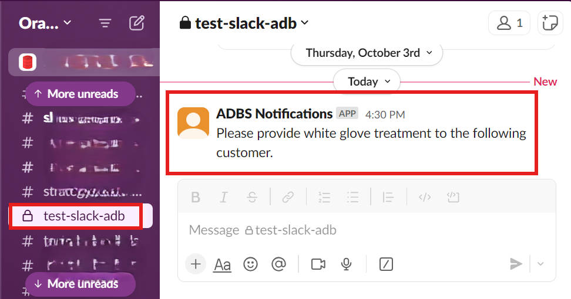
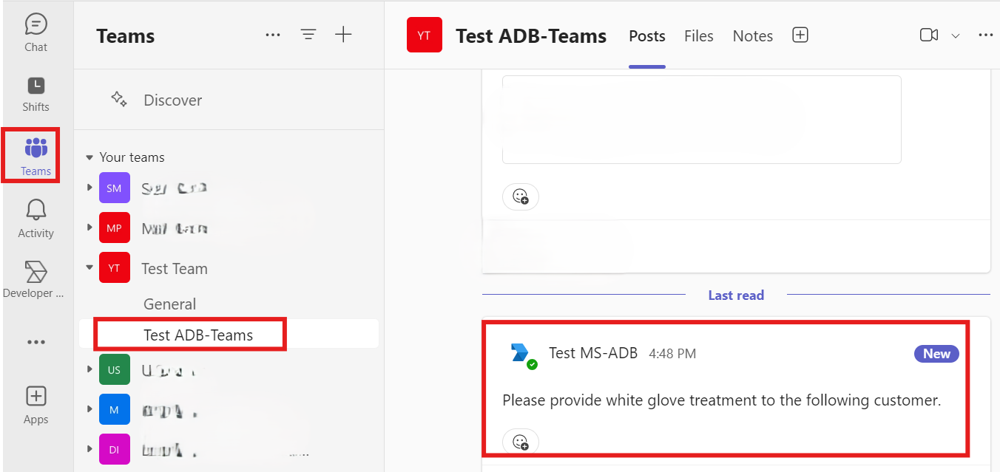
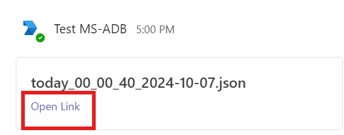

# Send Notifications from Autonomous Database to Slack and Microsoft Teams

**Important:** This lab uses features which are not available on the Oracle LiveLabs Sandbox hosted environments (the Green button), and requires Microsoft Teams admin permissions.

## Introduction

This lab walks you through the steps to send messages, alerts and output of a query from Autonomous Database to Slack and Microsoft Teams. Also, you will learn the procedures to send notifications to Microsoft Teams and Slack channels.

Estimated Time: 10 minutes

### Objectives

In this lab, you will:

+ Send messages to a Slack channel
+ Send query results to a Slack Channel
+ Send messages to a Microsoft Teams channel
+ Send query results to a Microsoft Teams channel

### Prerequisites

+ Completion of the lab **Get Started**, **Lab 1**, **Lab 2**, and **Lab 3** from the **Contents** menu on the left.
+ Slack account and workspace
+ Slack app
+ Slack channel
+ Microsoft Teams account and workspace
+ Microsoft Teams app and channel
+ Microsoft 365 Developer Account

## Task 1: Create a Luxury Car Dealership Story

Let's assume you work at a luxury car dealership that prides itself on providing exceptional customer service. The dealership offers a special **white glove** treatment for customers who purchase cars valued at over $40,000.

You will create the customers table based on few parameters, and then will notify the customer service who qualify for the treatment from Autonomous Database to Slack and Microsoft Teams channels.

+ name: Customer name
+ email: Customer email
+ product: Car type
+ amount: Price of the car

1. In the Oracle Cloud console, open the **Navigation menu**, navigate to **Oracle Database**, and then select **Autonomous Data Warehouse**.

    

2. Select your **Autonomous Database instance**.

    

3. Click **Database actions**, and then select **SQL** .

    

4. To create the generated **customers** table using the script, copy and paste the following code into your SQL Worksheet, and then click the **Run Script (F5)** icon in the Worksheet toolbar.

    ```
    <copy>
         CREATE TABLE customers
          (
             name varchar2(100),
             email varchar2(100),
             product varchar2(100),
             amount number
          );

     </copy>
    ```

    

5. This example is using the sample customers data. To insert sample data into the **customers** table, copy and paste the following code into your SQL Worksheet, and then click the **Run Script (F5)** icon in the Worksheet toolbar.

    ```
    <copy>

         Insert into CUSTOMERS (NAME,EMAIL,PRODUCT,AMOUNT) values ('John Doe','john.doe@example.com','Zypher A1',15000);
         Insert into CUSTOMERS (NAME,EMAIL,PRODUCT,AMOUNT) values ('Jane Smith','jane.smith@example.com','Zypher A2',18000);
         Insert into CUSTOMERS (NAME,EMAIL,PRODUCT,AMOUNT) values ('Emily Johnson','emily.j@example.com','Zypher A3',22000);
         Insert into CUSTOMERS (NAME,EMAIL,PRODUCT,AMOUNT) values ('Michael Brown','michael.b@example.com','Zypher B1',30000);
         Insert into CUSTOMERS (NAME,EMAIL,PRODUCT,AMOUNT) values ('Jessica Davis','jessica.d@example.com','Zypher B2',35000);
         Insert into CUSTOMERS (NAME,EMAIL,PRODUCT,AMOUNT) values ('David Wilson','david.w@example.com','Zypher B3',40000);
         Insert into CUSTOMERS (NAME,EMAIL,PRODUCT,AMOUNT) values ('Sarah Miller','sarah.m@example.com','Zypher C1',50000);
         Insert into CUSTOMERS (NAME,EMAIL,PRODUCT,AMOUNT) values ('James Anderson','james.a@example.com','Zypher C2',55000);
         Insert into CUSTOMERS (NAME,EMAIL,PRODUCT,AMOUNT) values ('Laura Thomas','laura.t@example.com','Zypher C3',60000);
         Insert into CUSTOMERS (NAME,EMAIL,PRODUCT,AMOUNT) values ('Robert Jackson','robert.j@example.com','Zypher D1',70000);
         commit;

     </copy>
    ```

    

   That's it. Now, you can notify customer service about the customers who qualify for the white glove treatment, which are customers who spent more than $40,000. Let's start!

## Task 2: Send messages to a Slack channel

 For this task, you will use the **`DBMS_CLOUD_NOTIFICATION.SEND_MESSAGE`** procedure to send a message to your Slack channel. For more information, see [SEND_MESSAGE Procedure](https://docs.oracle.com/en/cloud/paas/autonomous-database/serverless/adbsb/autonomous-dbms-cloud-notification.html#GUID-8A557984-BEC3-4F82-909E-4451E86F66E0).

1. In the source database SQL window, specify the following parameters that are used in the following code example.

    + provider: Enter **slack**
    + credential_name: Enter your credential name such as **`SLACK_CRED`**
    + message: Enter your preferred message such as **`Alert from Autonomous Database...`**
    + params: Substitute the **`C0....08`** place holder with your own Slack **channel ID**

2. Click the drop-down list next to your channel's name, scroll down to the bottom section, and then copy the **Channel ID**.

    

3. Copy and paste the following code into your SQL Worksheet, enter your **Channel ID**, and then click the **Run Script (F5)**.

    ```
    <copy>
    BEGIN
      DBMS_CLOUD_NOTIFICATION.SEND_MESSAGE(
        provider          => 'slack',
        credential_name   => 'SLACK_CRED',
        message           => 'Please provide white glove treatment to the following customer.',
        params            => json_object('channel' value 'C0....08'));
     END;

    </copy>
    ```

    

    > **Note:** Use the **params** parameter to specify the Slack channel. The Channel ID is unique ID for a channel and is different from the channel name. You can find your channel ID at the bottom of the channel page as shown in the previous screen capture.

4. Open your Slack channel, and confirm the receipt of the message.

    

## Task 3: Send query results to a Slack Channel

For this task, you will use the **`DBMS_CLOUD_NOTIFICATION.SEND_DATA`** procedure to send the output of a query to your Slack channel. For more information, see [`SEND_DATA Procedure`](https://docs.oracle.com/en/cloud/paas/autonomous-database/serverless/adbsb/autonomous-dbms-cloud-notification.html#GUID-B3375A5B-79B1-43A5-B043-A7FA646FBF54).

1. Copy your **Channel ID** from Task 2 (step 2).

2. Send query results in `json` format using the following script. In the source database SQL window, specify the following parameters that are used in the following script.

    + provider: Enter **slack**
    + credential_name: Enter your credential name such as **`SLACK_CRED`**
    + query: Enter your preferred query such as **`SELECT username, account_status, expiry_date FROM USER_USERS WHERE rownum < 3`**
    + channel: Substitute the **`C0....08`** place holder with your own Slack **channel ID**
    + type: Enter your preferred format such as **csv**

    Copy and paste the following code into your SQL Worksheet, and then click the **Run Script (F5)**.

    ```
    <copy>
    BEGIN
      DBMS_CLOUD_NOTIFICATION.SEND_DATA(
        provider => 'slack',
        credential_name => 'SLACK_CRED',
        query => 'select * from CUSTOMERS where amount >= 40000',
        params => json_object('channel' value 'C0....08',
                            'type' value 'csv'));
     END;
    </copy>
    ```

    

    > **Note:** To specify the output type, use **params** section. Valid output types include `csv` and `json`.

3. Open your Slack channel, and confirm the receipt of query result.

    

4. Send the results of query in `json` format using the following script. In the source database SQL window, specify the following parameters that are used in the following script.

    + provider: Enter **slack**
    + credential_name: Enter your credential name such as **`SLACK_CRED`**
    + query: Enter your preferred query such as **`SELECT username, account_status, expiry_date FROM USER_USERS WHERE rownum < 3`**
    + channel: Substitute the **`C0....08`** place holder with your own Slack **channel ID**
    + type: Enter your preferred format such as **`json`**

    Copy and paste the following code into your SQL Worksheet, and then click the **Run Script (F5)**.

    ```
    <copy>
    BEGIN
      DBMS_CLOUD_NOTIFICATION.SEND_DATA(
        provider => 'slack',
        credential_name => 'SLACK_CRED',
        query => 'select * from CUSTOMERS where amount >= 40000',
        params => json_object('channel' value 'C0....08',
                            'type' value 'json'));
     END;
    </copy>
    ```

    

5. Open your Slack channel, and confirm the receipt of query result.

    

## Task 4: Send messages to a Microsoft Teams Channel

For this task, you will use the **`DBMS_CLOUD_NOTIFICATION.SEND_MESSAGE`** procedure to send a message to your Microsoft Teams channel. For more information, see [SEND_MESSAGE Procedure](https://docs.oracle.com/en/cloud/paas/autonomous-database/serverless/adbsb/autonomous-dbms-cloud-notification.html#GUID-8A557984-BEC3-4F82-909E-4451E86F66E0).

1. In the source database SQL window, specify the following parameters that are used in the following script.

    + provider: Enter **msteams**
    + credential_name: Enter your credential name such as **`TEAMS_CRED`**
    + message: Enter your preferred message such as **`text from new teams api`**
    + params: Substitute the channel ID placeholder with your own  **channel ID**

    > **Note:** You will not be able to run the code without having your **channel ID**.
    Please see task 5, step 13 in **Lab 2** to obtain your **channel ID**.

  Copy and paste the following code into your SQL Worksheet, and then click the **Run Script (F5)**.

    ```
    <copy>
       BEGIN
         DBMS_CLOUD_NOTIFICATION.SEND_MESSAGE(
             provider        => 'msteams',
             credential_name => 'TEAMS_CRED',
             message         => 'Please provide white glove treatment to the following customer.',
             params          => json_object('channel' value 'channel ID'));
        END;
    </copy>
    ```

    

2. Open your Teams channel, and confirm the receipt of the message.

    

## Task 5: Send query results to a Microsoft Teams Channel

For this task, you will use the **`DBMS_CLOUD_NOTIFICATION.SEND_DATA`** procedure to send the output of a query to your Microsoft Teams Channel. For more information, see [`SEND_DATA Procedure`](https://docs.oracle.com/en/cloud/paas/autonomous-database/serverless/adbsb/autonomous-dbms-cloud-notification.html#GUID-B3375A5B-79B1-43A5-B043-A7FA646FBF54).

1. Send query results to a Microsoft Teams Channel using the following the script. Specify the following parameters that are used in the following script.

    + provider: Enter **msteams**
    + credential_name: Enter your credential name such as **`TEAMS_CRED`**
    + query: Enter your preferred query such as **`SELECT tablespace_name FROM dba_tablespaces`**
    + tenant: Substitute the **`5b743bc******c0286`** placeholder with your **tenant ID**
    + team: Substitute the **`0ae401*********5d2bd`** placeholder with your **team ID**
    + channel: Substitute the **`19%3a94be023*****%40thread.tacv2`** placeholder with your **channel ID**
    + title: Substitute **`today`** placeholder with your preferred **title**
    + type: Enter your preferred output format as **`csv` or `json`**

    Copy and paste the following code into your SQL Worksheet, and then click the **Run Script (F5)**.

    ```
     <copy>
      BEGIN
          DBMS_CLOUD_NOTIFICATION.SEND_DATA(
             provider => 'msteams',
             credential_name => 'TEAMS_CRED',
             query => 'select * from CUSTOMERS where amount >= 40000',
             params => json_object(
                'tenant'value '5b743bc******c0286',
                'team'value '0ae401*********5d2bd',
                'channel'value '19%3a94be023*****%40thread.tacv2',
                'title'value 'today',
                'type'value 'csv'));
        END;
     </copy>
    ```

    

    > **Note:** The maximum file size supported when using `DBMS_CLOUD_NOTIFICATION.SEND_DATA` for Microsoft Teams is `4MB`. For more information, see ['SEND_DATA Procedure'](https://docs.oracle.com/en/cloud/paas/autonomous-database/serverless/adbsb/autonomous-dbms-cloud-notification.html#GUID-B3375A5B-79B1-43A5-B043-A7FA646FBF54)

2. Go to your Teams channel, and confirm the receipt of the query result.

    

3. Click the **Open link** to see query results in csv format.

    

4. After you open the link, you will see your query results as shown in the screen capture.

    

5. To get your query results in **`json`** format, substitute specified parameters in step 1. Copy and paste the following code into your SQL Worksheet,and then click the **Run Script (F5)**.

    ```
     <copy>
      BEGIN
          DBMS_CLOUD_NOTIFICATION.SEND_DATA(
             provider => 'msteams',
             credential_name => 'TEAMS_CRED',
             query => 'select * from CUSTOMERS where amount >= 40000',
             params => json_object(
                'tenant'value '5b743bc******c0286',
                'team'value '0ae401*********5d2bd',
                'channel'value '19%3a94be023*****%40thread.tacv2',
                'title'value 'today',
                'type'value 'json'));
        END;
     </copy>
    ```

    

6. Go to your Teams channel, and confirm the receipt of the query result.

    

7. Click the **Open link** to download the file to your local device.

    

8. Click **Open file** from your downloads folder as shown in the screen capture.

    

9. After you open the file, you will see your query results in **`json`** format as shown in the screen capture.

    

## Summary

You learned how to send messages and query results to your Slack and Microsoft Teams channel to from an Autonomous Database. Autonomous Database supports sending alerts,messages and query results directly to your channels to enhance productivity.

## Acknowledgements

+ **Author:** Yonca Aksit, User Assistance Developer Intern

+ **Contributors:**

    + Lauran K. Serhal, Consulting User Assistance Developer
    + Marty Gubar, Director of Product Management, Autonomous Database

+ **Last Updated By/Date:** Yonca Aksit, October 2024

Copyright (C) 2024 Oracle Corporation.

Permission is granted to copy, distribute and/or modify this document
under the terms of the GNU Free Documentation License, Version 1.3
or any later version published by the Free Software Foundation;
with no Invariant Sections, no Front-Cover Texts, and no Back-Cover Texts.
A copy of the license is included in the section entitled [GNU Free Documentation License](files/gnu-free-documentation-license.txt)
