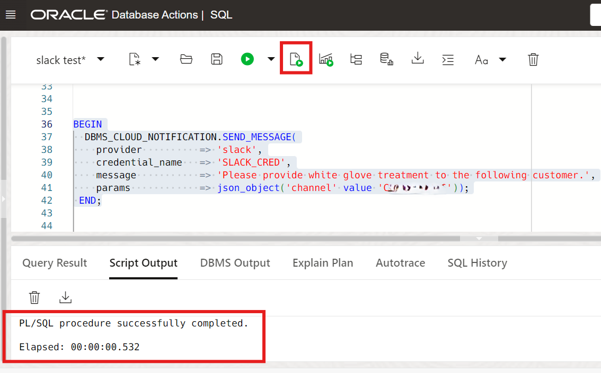
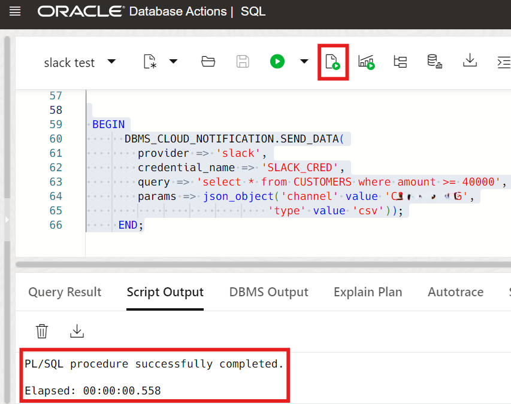
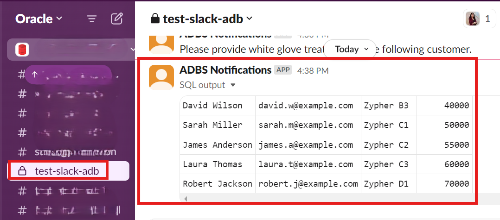
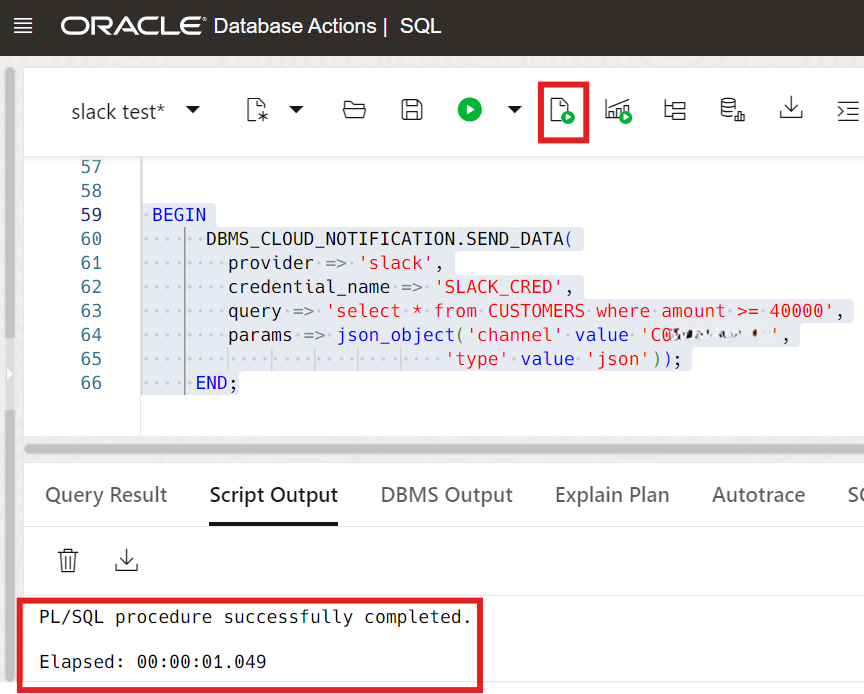
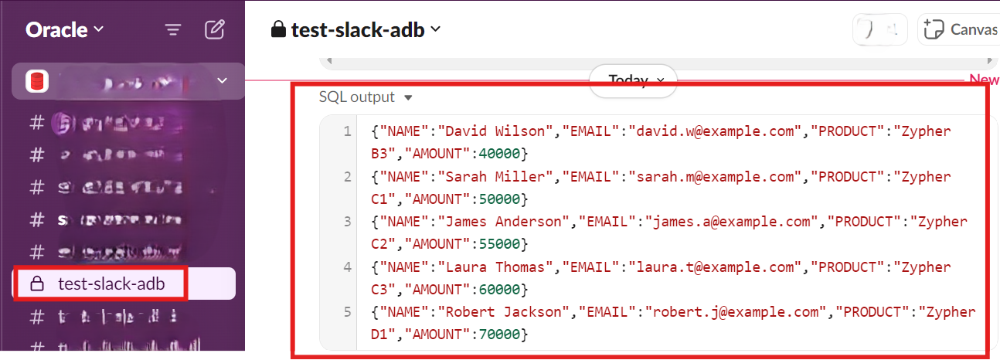
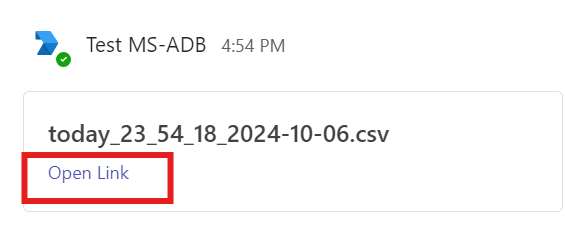
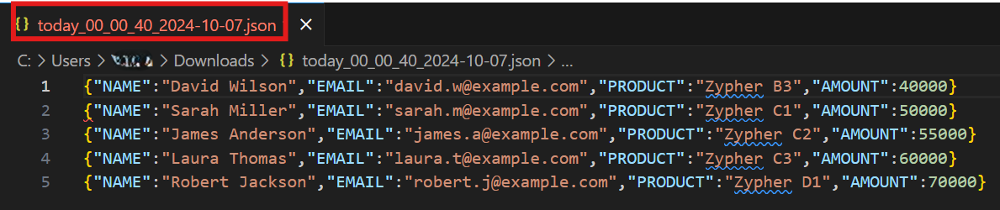

# Send Notifications from Autonomous Database to Slack and Microsoft Teams

**Important:** This lab uses features which are not available on the Oracle LiveLabs Sandbox hosted environments (the Green button), and requires Microsoft Teams admin permissions.

## Introduction

This lab walks you through the steps to send messages, alerts and output of a query from Autonomous Database to Slack and Microsoft Teams. Also, you will learn the procedures to send Microsoft Teams and Slack notifications.

Estimated Time: 25 minutes

### Objectives

In this lab, you will:

+ Send messages to a Slack channel
+ Send query results to a Slack Channel
+ Send messages to a Microsoft Teams channel
+ Send query results to a Microsoft Teams channel

### Prerequisites

+ Completion of the lab **Get Started**, **Lab 1**, **Lab 2**, and **Lab 3** from the **Contents** menu on the left.
+ Slack account and workspace
+ Slack app
+ Slack channel
+ Microsoft Teams account and workspace
+ Microsoft Teams app and channel
+ Microsoft 365 Developer Account

## Task 1: Send messages to a Slack channel

 For this task, you will use the **`DBMS_CLOUD_NOTIFICATION.SEND_MESSAGE`** procedure to send a message to your Slack channel. For more information, see [SEND_MESSAGE Procedure](https://docs.oracle.com/en/cloud/paas/autonomous-database/serverless/adbsb/autonomous-dbms-cloud-notification.html#GUID-8A557984-BEC3-4F82-909E-4451E86F66E0).

1. In the source database SQL window, specify the following parameters that are used in the following code example.

    - provider: Enter **slack**
    - credential_name: Enter your credential name such as **`SLACK_CRED`**
    - message: Enter your preferred message such as **`Alert from Autonomous Database...`**
    - params: Substitute the **`C0....08`** place holder with your own Slack **channel ID**

2. Click the drop-down list next to your channel's name, scroll down to the bottom section, and then copy the **Channel ID**.

    

3. Copy and paste the following code into your SQL Worksheet, enter your **Channel ID**, and then click the **Run Script (F5)**.

    ```
    <copy>
    BEGIN
      DBMS_CLOUD_NOTIFICATION.SEND_MESSAGE(
        provider          => 'slack',
        credential_name   => 'SLACK_CRED',
        message           => 'Alert from Autonomous Database...',
        params            => json_object('channel' value 'C0....08'));
     END;

    </copy>
    ```

    

    > **Note:** Use the **params** parameter to specify the Slack channel. The Channel ID is unique ID for a channel and is different from the channel name. You can find your channel ID at the bottom of the channel page as shown in the previous screen capture.

4. Open your Slack channel, and confirm the receipt of the message.

    

## Task 2: Send query results to a Slack Channel

For this task, you will use the **`DBMS_CLOUD_NOTIFICATION.SEND_DATA`** procedure to send the output of a query to your Slack channel. For more information, see [`SEND_DATA Procedure`](https://docs.oracle.com/en/cloud/paas/autonomous-database/serverless/adbsb/autonomous-dbms-cloud-notification.html#GUID-B3375A5B-79B1-43A5-B043-A7FA646FBF54).

1. Copy your **Channel ID** from Task 1 (step 2).

2. Send query results in `json` format using the following script. In the source database SQL window, specify the following parameters that are used in the following script.

    - provider: Enter **slack**
    - credential_name: Enter your credential name such as **`SLACK_CRED`**
    - query: Enter your preferred query such as **`SELECT username, account_status, expiry_date FROM USER_USERS WHERE rownum < 3`**
    - channel: Substitute the **`C0....08`** place holder with your own Slack **channel ID**
    - type: Enter your preferred format such as **csv**

    Copy and paste the following code into your SQL Worksheet, and then click the **Run Script (F5)**.

    ```
    <copy>
    BEGIN
      DBMS_CLOUD_NOTIFICATION.SEND_DATA(
        provider => 'slack',
        credential_name => 'SLACK_CRED',
        query => 'SELECT username, account_status, expiry_date FROM USER_USERS WHERE rownum < 3',
        params => json_object('channel' value 'C0....08',
                            'type' value 'csv'));
     END;
    </copy>
    ```

    

    > **Note:** To specify the output type, use **params** section. Valid output types include `csv` and `json`.

3. Open your Slack channel, and confirm the receipt of query result.

    

4. Send the results of query in `json` format using the following script. In the source database SQL window, specify the following parameters that are used in the following script.

    - provider: Enter **slack**
    - credential_name: Enter your credential name such as **`SLACK_CRED`**
    - query: Enter your preferred query such as **`SELECT username, account_status, expiry_date FROM USER_USERS WHERE rownum < 3`**
    - channel: Substitute the **`C0....08`** place holder with your own Slack **channel ID**
    - type: Enter your preferred format such as **`json`**

    Copy and paste the following code into your SQL Worksheet, and then click the **Run Script (F5)**.

    ```
    <copy>
    BEGIN
      DBMS_CLOUD_NOTIFICATION.SEND_DATA(
        provider => 'slack',
        credential_name => 'SLACK_CRED',
        query => 'SELECT username, account_status, expiry_date FROM USER_USERS WHERE rownum < 3',
        params => json_object('channel' value 'C0....08',
                            'type' value 'json'));
     END;
    </copy>
    ```

    

5. Open your Slack channel, and confirm the receipt of query result.

    


## Task 3: Send messages to a Microsoft Teams Channel

For this task, you will use the **`DBMS_CLOUD_NOTIFICATION.SEND_MESSAGE`** procedure to send a message to your Microsoft Teams channel. For more information, see [SEND_MESSAGE Procedure](https://docs.oracle.com/en/cloud/paas/autonomous-database/serverless/adbsb/autonomous-dbms-cloud-notification.html#GUID-8A557984-BEC3-4F82-909E-4451E86F66E0).

1. In the source database SQL window, specify the following parameters that are used in the following script.

    - provider: Enter **msteams**
    - credential_name: Enter your credential name such as **`TEAMS_CRED`**
    - message: Enter your preferred message such as **`text from new teams api`**
    - params: Substitute the channel ID placeholder with your own  **channel ID**

    > **Note:** You will not be able to run the code without having your **channel ID**. 
    Please see Lab 2: Task 5, step 13 to obtain your **channel ID**.

  Copy and paste the following code into your SQL Worksheet, and then click the **Run Script (F5)**.

    ```
    <copy>
       BEGIN
         DBMS_CLOUD_NOTIFICATION.SEND_MESSAGE(
             provider        => 'msteams',
             credential_name => 'TEAMS_CRED',
             message         => 'text from new teams api',
             params          => json_object('channel' value 'channel ID'));
        END;
    </copy>
    ```

    

2. Open your Teams channel, and confirm the receipt of the message.

    

## Task 4: Send query results to a Microsoft Teams Channel

For this task, you will use the **`DBMS_CLOUD_NOTIFICATION.SEND_DATA`** procedure to send the output of a query to your Microsoft Teams Channel. For more information, see [`SEND_DATA Procedure`](https://docs.oracle.com/en/cloud/paas/autonomous-database/serverless/adbsb/autonomous-dbms-cloud-notification.html#GUID-B3375A5B-79B1-43A5-B043-A7FA646FBF54).

1. Send query results to a Microsoft Teams Channel using the following the script. Specify the following parameters that are used in the following script.

    - provider: Enter **msteams**
    - credential_name: Enter your credential name such as **`TEAMS_CRED`**
    - query: Enter your preferred query such as **`SELECT tablespace_name FROM dba_tablespaces`**
    - tenant: Substitute the **`5b743bc******c0286`** placeholder with your **tenant ID**
    - team: Substitute the **`0ae401*********5d2bd`** placeholder with your **team ID**
    - channel: Substitute the **`19%3a94be023*****%40thread.tacv2`** placeholder with your **channel ID**
    - title: Substitute **`today`** placeholder with your preferred **title**
    - type: Enter your preferred output format as `csv` or `json`

    Copy and paste the following code into your SQL Worksheet, and then click the **Run Script (F5)**.

    ```
     <copy>
      BEGIN
          DBMS_CLOUD_NOTIFICATION.SEND_DATA(
             provider => 'msteams',
             credential_name => 'TEAMS_CRED',
             query => 'SELECT tablespace_name FROM dba_tablespaces',
             params => json_object(
                'tenant'value '5b743bc******c0286',
                'team'value '0ae401*********5d2bd',
                'channel'value '19%3a94be023*****%40thread.tacv2',
                'title'value 'today',
                'type'value 'csv'));
        END;
     </copy>
    ```

    

    > **Note:** The maximum file size supported when using `DBMS_CLOUD_NOTIFICATION.SEND_DATA` for Microsoft Teams is `4MB`. For more information, see ['SEND_DATA Procedure'](https://docs.oracle.com/en/cloud/paas/autonomous-database/serverless/adbsb/autonomous-dbms-cloud-notification.html#GUID-B3375A5B-79B1-43A5-B043-A7FA646FBF54)

2. Go to your Teams channel, and confirm the receipt of the query result.

    

3. Click the **Open link** to see query results in csv format.

    

4. After you open the link, you will see your query results as shown in the screen capture.

    

5. To get your query results in `json` format, substitute previously specified parameters in step 1. Copy and paste the following code into your SQL Worksheet,and then click the **Run Script (F5)**.

    ```
     <copy>
      BEGIN
          DBMS_CLOUD_NOTIFICATION.SEND_DATA(
             provider => 'msteams',
             credential_name => 'TEAMS_CRED',
             query => 'SELECT tablespace_name FROM dba_tablespaces',
             params => json_object(
                'tenant'value '5b743bc******c0286',
                'team'value '0ae401*********5d2bd',
                'channel'value '19%3a94be023*****%40thread.tacv2',
                'title'value 'today',
                'type'value 'json'));
        END;
     </copy>
    ```

    

6. Go to your Teams channel, and confirm the receipt of the query result.

    

7. Click the **Open link** to download the file to your local device.

    

8. Click **Open file** from your downloads folder as shown in the screen capture.

    

9. After you open the file, you will see your query results in json format as shown in the screen capture.

    

## Summary

You learned how to send messages and query results to your Slack and Microsoft Teams channel to from an Autonomous Database. Autonomous Database supports sending alerts,messages and query results directly to your channels to enhance productivity.

## Acknowledgements

+ **Author:** Yonca Aksit, User Assistance Developer Intern

+ **Contributors:**

    * Lauran K. Serhal, Consulting User Assistance Developer
    * Nilay Panchal, Principal Product Manager, Autonomous Database
    * Marty Gubar, Director of Product Management, Autonomous Database

+ **Last Updated By/Date:** Yonca Aksit, October 2024

Copyright (C) 2024 Oracle Corporation.

Permission is granted to copy, distribute and/or modify this document
under the terms of the GNU Free Documentation License, Version 1.3
or any later version published by the Free Software Foundation;
with no Invariant Sections, no Front-Cover Texts, and no Back-Cover Texts.
A copy of the license is included in the section entitled [GNU Free Documentation License](files/gnu-free-documentation-license.txt)
