# Send Microsoft Teams Notifications from Autonomous Database

**Important:** This lab uses features which are not available on the Oracle LiveLabs Sandbox hosted environments (the Green button), and requires Microsoft Teams admin permissions. If you run this lab using a LiveLabs Sandbox environment, you can only review the steps and later practice the steps using your organization’s Microsoft Teams workspace.

## Introduction

Microsoft Teams serves as a comprehensive collaboration platform within the Microsoft 365 ecosystem, facilitating instant messaging, audio and video calls, and online meetings. With its seamless integration with other applications, Teams enhances productivity by streamlining communication and project management. Microsoft Teams supports a wide range of integrations with external apps and services.

This lab walks you through the steps to configure your Microsoft Teams application to receive messages, alerts and output of a query from Autonomous Database. Also, you will learn the procedures to send Microsoft Teams notifications.

Estimated Time: 25 minutes

### Objectives

In this lab, you will:

+ Create your Microsoft Teams application
+ Create and configure a bot for your Microsoft Teams application
+ Publish your Microsoft Teams application
+ Configure your Microsoft Teams application using Azure Portal
+ Create your Microsoft Teams channel
+ Create a credential object to access Microsoft Teams application from Autonomous Database
+ Configure access control to allow user access to external network services
+ Send messages to a Microsoft Teams channel
+ Send query results to a Microsoft Teams channel

### Prerequisites

+ Completion of the lab **Get Started**, and **Lab 1** from the **Contents** menu on the left.
+ Microsoft Teams account and workspace
+ Microsoft Teams app and channel
+ Microsoft 365 Developer Account

> **Note:** The Microsoft 365 Developer Program offers a powerful sandbox environment through its Microsoft 365 E5 developer subscription. This subscription provides developers with a dedicated space to build and test solutions without impacting production systems. For more information, see [Set up a developer subscription](https://learn.microsoft.com/en-us/office/developer-program/microsoft-365-developer-program-get-started).


## Task 1: Create your Microsoft Teams application

1. To create a Microsoft Teams application, click [this link](https://dev.teams.microsoft.com/home) to access **Developer Portal for Teams**, and then select **Apps** from the left side panel.

    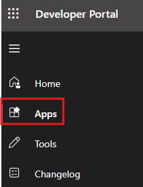

2. Click the plus sign next to **New App** to create a new application.

    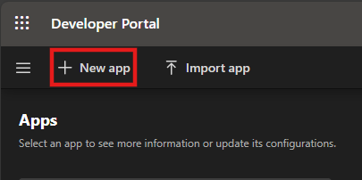

3. Enter your app **Name**, then click **Add**.

    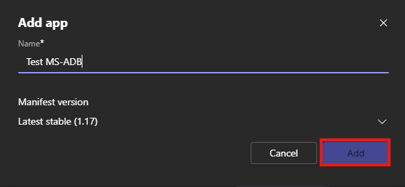

4. Ensure you receive a pop-up message confirming that your app has been successfully created.

## Task 2: Create and configure a bot for your Microsoft Teams application

1. Select **Tools** from the left side panel of the Developer Portal for Teams, and then click **Bot management**.

    

2. Click the plus sign next to **New Bot** to create your bot.

    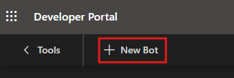

3. Enter your **Bot name**, and then click **Add**.

    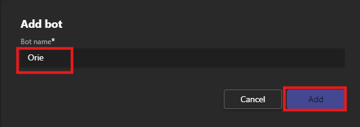

4. Ensure you receive a pop-up message confirming that your bot has been successfully added.

    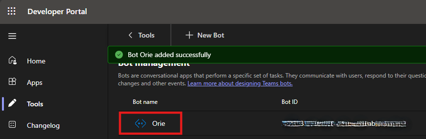

5. To create a secret key for your bot, click **Bot Name**.

    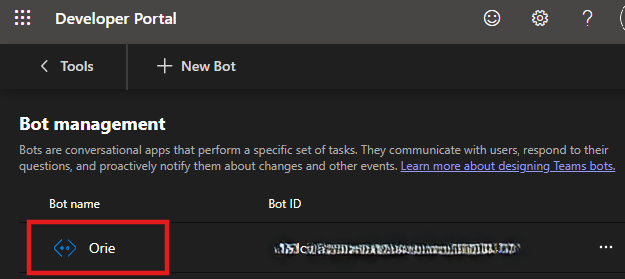

6. Select **Client Secrets**, and then click **Add a secret** to create client secrets for your bot.

    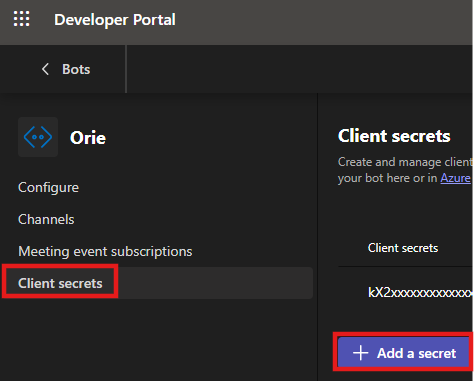

7. After creating client secret, make sure that you copy the secret by clicking **copy** near the code. Then, click **OK** to close it.

    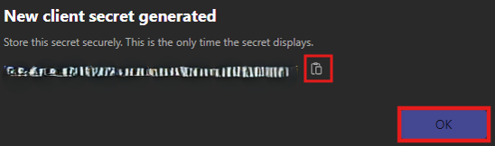

8. Select **Apps**, and then click **App features**.

    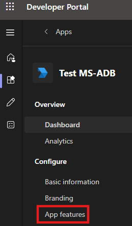

9. Click **Bot** to set up scope and permission.

   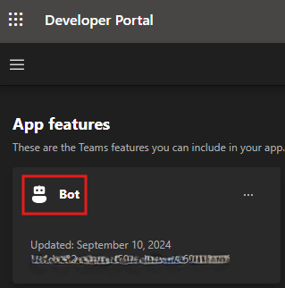

10. To identify your bot, click **select an existing bot**, select **Only send notifications** and **Team** as the scope, and then click **Save**.

   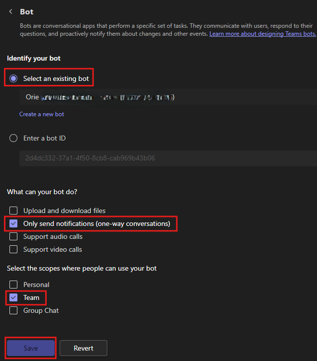

## Task 3: Publish your Microsoft Teams application

After creating your application, you must publish your application to your organization to make it available to users in your org.

1. Click on **Basic Information**, which is located under **Configure** section.

   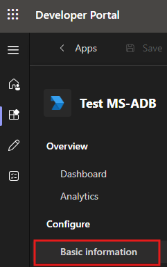

2. On the **Basic Information** page, fill out the basic information about your application, and then click **Save**.

    > **Note:** If you do not enter the information on your app details page, you will not be able to  publish your app to org. For more information, see [Create your Teams Store listing details](https://learn.microsoft.com/en-us/microsoftteams/platform/concepts/deploy-and-publish/appsource/prepare/submission-checklist?referrer=developerportal&tabs=desktop).

3. When your app is ready for use in production, click **Publish** to submit the app using the Teams App Submission API which can be called from Graph API.

   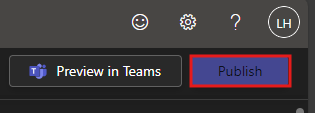

4. Verify that the submission **Status** shows **Submitted**.

   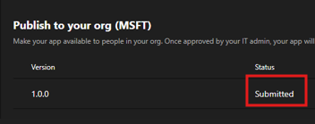

## Task 4: Configure your Microsoft Teams application using Microsoft Entra ID

1. After publishing your app, ensure your admin approves your app from [Teams admin center](https://admin.teams.microsoft.com/policies/manage-apps).

2. Sign in to the [Microsoft Entra admin center](https://entra.microsoft.com/#home), and click **App registrations**.

   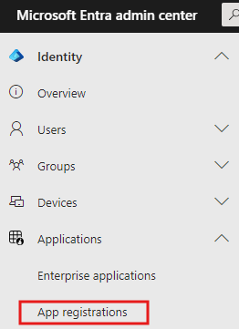

3. Select **Owned applications**, which will automatically populate your bot with **Application(client) ID**.

   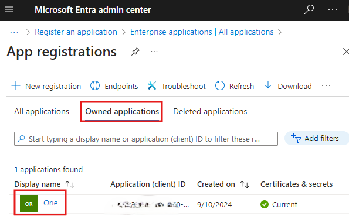

    > **Note:** Please copy your **Application (client) ID**. It is unique identifier for an app and also known as the client ID for an app. 

4. Click **Display name**.

   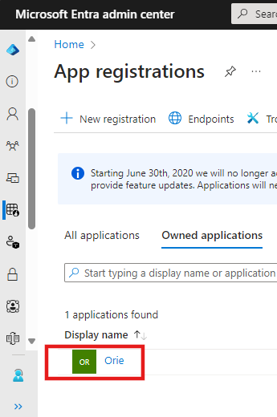

5. Select **API permissions** under the **Manage** section.

   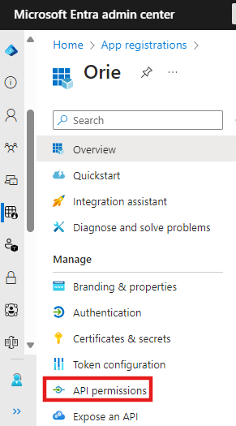

6. To request `Files.ReadWrite.All`  and `ChannelSettings.Read.All` permissions, click **Add a permission**.

   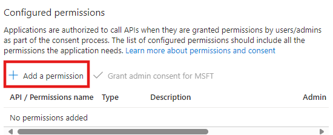

7. On the Request API permissions page,  set the following parameters, and then click **Add permissions**.

    - Microsoft APIs: Select **Microsoft Graph**
    - Type of permissions: Select **Application permissions**
    - Permissions: Enter **ChannelSettings.Read.All**
    - Channel Settings: Select **ChannelSettings.Read.All**

    

8. Repeat the task 7 above to add `Files.ReadWrite.All` permission as well.

9. After adding permissions, ensure your admin approve requested permissions from **Microsoft Entra admin center**.

    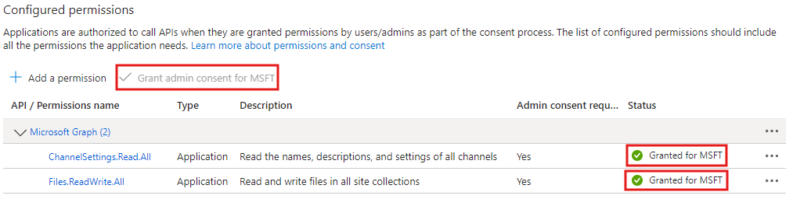

## Task 5: Create your Microsoft Teams Channel

1. Log into your Teams, click **+** sign, and then select **Create channel**.

    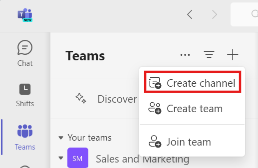

2. To create a channel, select **add the channel to a team** according your preference, enter  **channel name**, and then select **channel type** as **standard** so people on your team has access.

    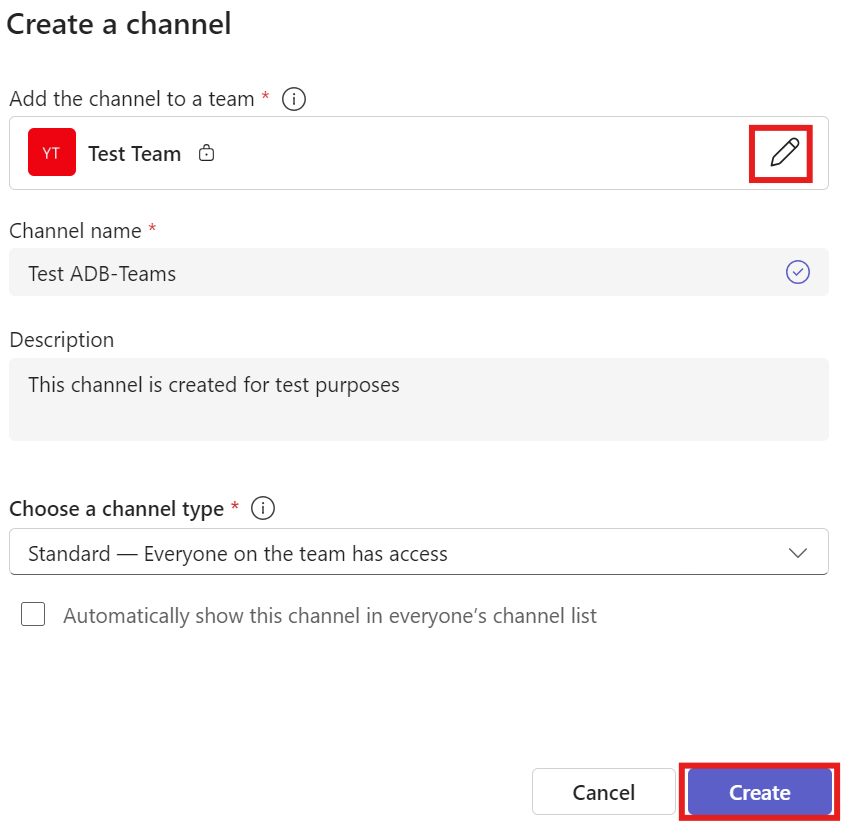

3. Select **Apps** from navigation menu, and click **Add** to add your app to your channel.

    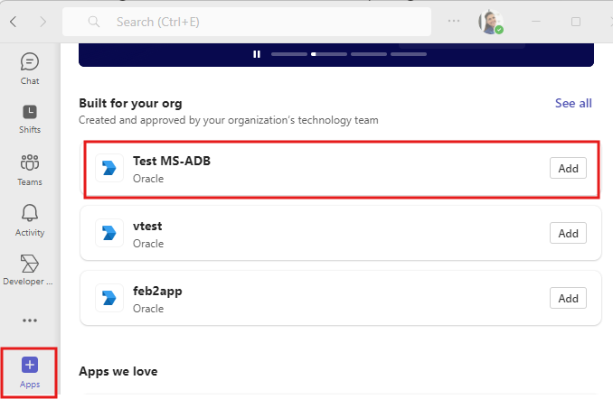

4. Select **Add to a team** , and then click your **team or your channel** from the dropdown.

    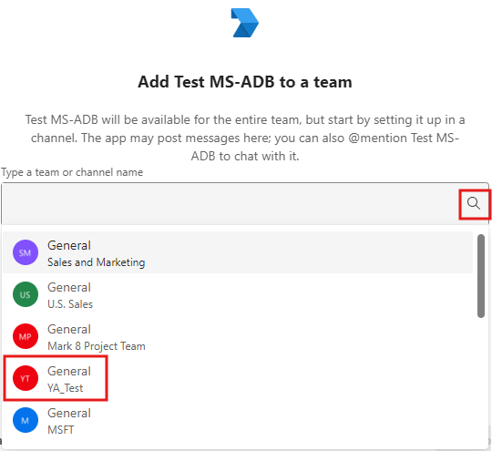

5. Click **Set up a bot** to proceed.

    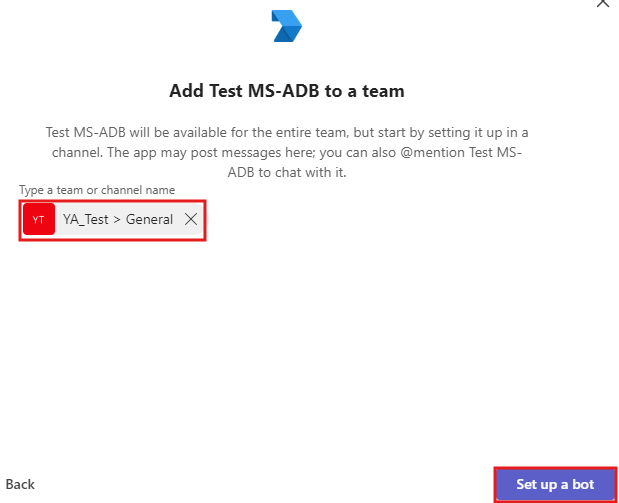

6. Click **OK** for the pop-up message.

    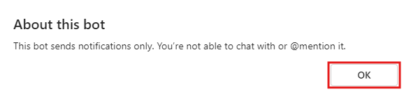

    > **Note:** To send a query result to a Microsoft Teams channel, you need to obtain the **team ID**, and  **tenant ID**, which will be explained in the step  7.

7. Click on the three dots(...) next to your team title, and then click on **Get link to team**

    

    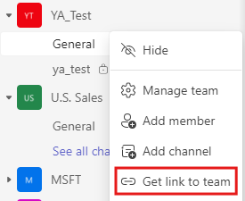

8. Copy the link and then grab the **tenant ID** from end of the URL.

    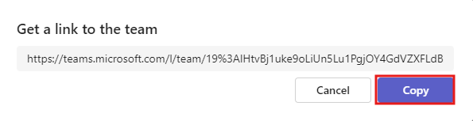

9. Paste the URL to text editor to copy your **tenant ID**.

    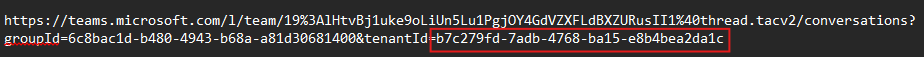

10. Repeat task 9 above to copy your **team ID**.

    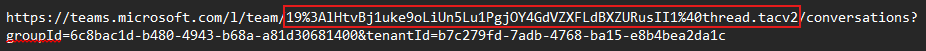

11. For channel ID, click on the three dots(...) next to your channel title, and then click **Get link to channel**

12. Copy the link. Take note of the **channel ID**.

    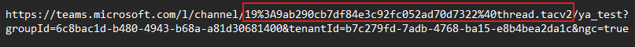

## Task 6: Create a credential object to access Microsoft Teams application from Autonomous Database

1. In the Oracle Cloud console, open the **Navigation menu**, navigate to **Oracle Database**, and then select **Autonomous Data Warehouse**.

    

2. Select your **Autonomous Database instance**.

    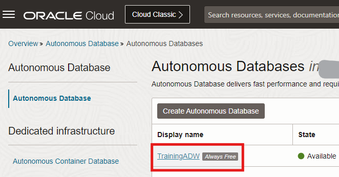

3. Click **Database actions** dropdown, and then select **SQL** .

    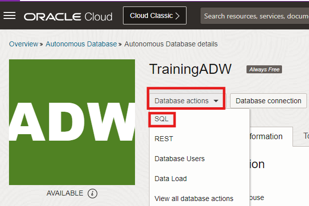

4. Copy and paste the following code into your SQL Worksheet. In the code, you will need to replace two parameters.

    - Replace **bot_id** with your **Application (client) ID.
    - Replace **bot_secret** with your bot's **client secret**.

5. After replacing parameters, click the **Run Script (F5)** icon in the Worksheet toolbar.

    ```
    <copy>
       BEGIN
          DBMS_CLOUD.CREATE_CREDENTIAL(credential_name => 'TEAMS_CRED',
                    username        => 'bot_id',
                    password        => 'bot_secret');
       END;
    </copy>
    ```

    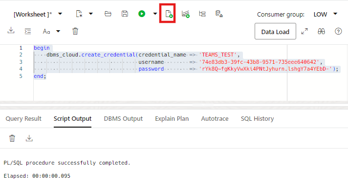

    > **Note:** To use Microsoft Teams app with **`DBMS_CLOUD_NOTIFICATION`** procedure, you need to run the procedure successfully. If you can not run the **`CREATE_CREDENTIAL`** procedure successfully, you can consult the ADMIN user to grant execute access on **`DBMS_CLOUD`** packages.

## Task 7: Send messages to a Microsoft Teams Channel

After creating the Microsoft Teams credential object, you can use the **`DBMS_CLOUD_NOTIFICATION.SEND_MESSAGE`** procedure to send a message to your Microsoft Teams channel.

1. Copy and paste the following code into your SQL Worksheet, and enter your **Team ID**, then click the **Run Script (F5)**.

    ```
    <copy>
       BEGIN
         DBMS_CLOUD_NOTIFICATION.SEND_MESSAGE(
             provider        => 'msteams',
             credential_name => 'TEAMS_CRED',
             message         => 'text from new teams api',
             params          => json_object('channel' value 'teamID'));
        END;
    </copy>
    ```

    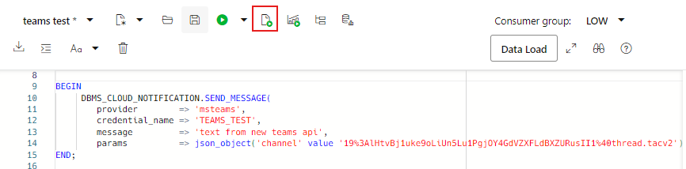

2. Open your Teams channel, and confirm the receipt of the message.

    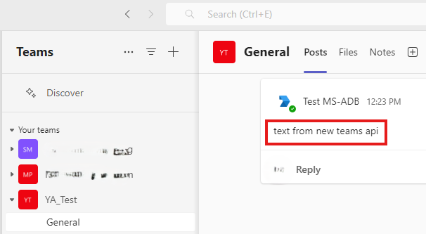

## Task 8: Send query results to a Microsoft Teams Channel

After creating required credential and configuration, you can use the **`DBMS_CLOUD_NOTIFICATION.SEND_DATA`** procedure to send the output of a query to your Microsoft Teams Channel.

1. Copy and paste the following code into your SQL Worksheet, enter the following parameters, and then click the **Run Script (F5)**.

    - Tenant: Enter your  **tenant ID**
    - Team: Enter your **team ID**
    - Channel: Enter **channel ID**
    - Title: Enter your preferred **title of the file**
    - Type: Output format can be `csv` or `json`

    ```
     <copy>
      BEGIN
          DBMS_CLOUD_NOTIFICATION.SEND_DATA(provider => 'msteams',
             credential_name => 'TEAMS_CRED',
             query           => 'SELECT tablespace_name FROM dba_tablespaces',
             params          => json_object('tenant'value '5b743bc******c0286',
                                       'team'value '0ae401*********5d2bd',
                                       'channel'value '19%3a94be023*****%40thread.tacv2',
                                       'title'value 'today',
                                       'type'value 'csv'));
        END;
     </copy>
    ```

    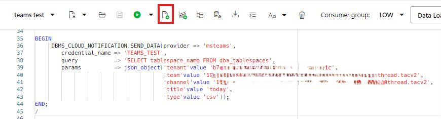

    > **Note:** The maximum file size supported when using `DBMS_CLOUD_NOTIFICATION.SEND_DATA` for Microsoft Teams is `4MB`.

2. Open your Teams channel, and confirm the receipt of the query result.

    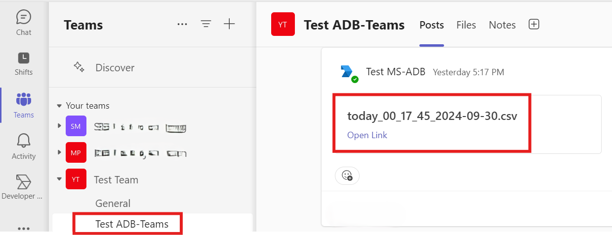

## Summary
You learned how to create  and configure a Microsoft app to receive messages and query results form Autonomous Database. Autonomous Database supports sending alerts,messages and query results directly to your channels to enhance productivity.

You may now **proceed to the next lab**.

## Acknowledgements

+ **Author:** Yonca Aksit, User Assistance Developer Intern

+ **Contributors:**

    * Lauran K. Serhal, Consulting User Assistance Developer
    * Nilay Panchal, Principal Product Manager, Autonomous Database
    * Marty Gubar, Director of Product Management, Autonomous Database

+ **Last Updated By/Date:** Yonca Aksit, October 2024

Copyright (C) Oracle Corporation.

Permission is granted to copy, distribute and/or modify this document
under the terms of the GNU Free Documentation License, Version 1.3
or any later version published by the Free Software Foundation;
with no Invariant Sections, no Front-Cover Texts, and no Back-Cover Texts.
A copy of the license is included in the section entitled [GNU Free Documentation License](files/gnu-free-documentation-license.txt)
