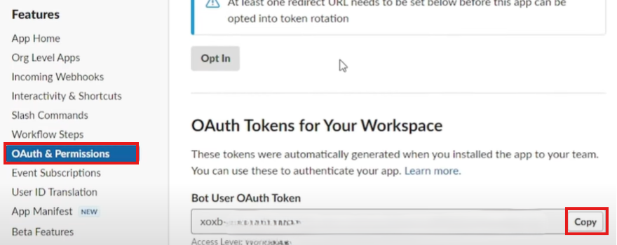
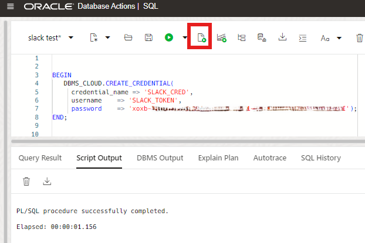

# Configure the Slack Application

**Important:** This lab uses features which are not available on the Oracle LiveLabs Sandbox hosted environments (the Green button), and requires Slack admin permissions.

## Introduction

Slack, a leading collaboration tool, enables teams with the ability to have seamless communication and efficient data management. Slack has cool integrations with external apps and sources.

This lab walks you through the steps to configure your Slack application to receive messages, alerts, and the output of a query from Autonomous Database. You will learn the required procedures to send Slack notifications.

Estimated Time: 25 minutes

### Objectives

In this lab, you will:

+ Create your Slack application
+ Configure your Slack application
+ Create your Slack channel
+ Create a credential object to access the Slack application from Autonomous Database
+ Configure access control to allow user access to external network services

### Prerequisites

+ Completion of the lab **Get Started** from the **Contents** menu on the left.
+ Slack account and workspace
+ Slack app
+ Slack channel

> **Note:** A Slack workspace is made up of channels, where team members can communicate and work together. To join a workspace, you can [create a Slack account](https://slack.com/get-started#/createnew) using your email address.

## Task 1: Create Your Slack application

1. To create a Slack application, click [this link](https://api.slack.com/apps) to access the **Your Apps** page, and select **Create an App**.

    

    > **Note:** Please bookmark the [Your Apps](https://api.slack.com/apps) link as you will need it for future tasks.

2. Select **From scratch**.

    

3. Enter your **App Name**, select your **Workspace**, and then click **Create App**.

    

    > **Note:** To create a Slack app successfully, you must select your preferred workspace as shown in the previous screen capture. After creating your app, you need to have your Slack admin approve your application.

4. Under the **Settings** section, you will see the **Basic Information** page after creating your Slack app. You can update your information, and then click **Save Changes** or you can click **Discard Changes** not to apply changes.

    

5. At the bottom of the **Basic Information** page, you will see **Delete App** section. If you want to delete your Slack app, you can click **Delete App**.

    

## Task 2: Configure your Slack application

After creating your application, you must request scopes which will grant your application permissions to perform actions such as viewing basic information, posting messages, and uploading files in your selected workspace.

These following scopes are  required:

+ **channels:read**

    This permission scope will enable you to view basic information about public channels in your workspace. For more information, see [channels:read](https://api.slack.com/scopes/channels:read).
+ **chat:write**

    This permission scope will enable you to post messages in approved channels and conversations. For more information, see [chat:write](https://api.slack.com/scopes/chat:write).
+ **files:write**

    This permission scope will enable you to upload, edit, and delete files from your Slack app. For more information, see [files:write](https://api.slack.com/scopes/files:write).

1. Go to [Your Apps](https://api.slack.com/apps), and then click your **App Name**.

    

2. Scroll down to the **Features** section, and click **OAuth & Permissions**.

    

3. Scroll down to the **Scopes** section, and then click **Add an OAuth Scope**.

    

4. For OAuth Scope, enter **`channels:read`**, and then select **channels:read** from dropdown. This scope allows your app to access public Slack channels.

    

5. If successful, you will see the recently added **OAuth Scope** with the **Description**.

    

6. Repeat step 4, to add the scopes **chat:write** and  **files:write** to your application as well.

    

7. After adding scopes, scroll up to the **OAuth Tokens** section, and then click **Request to Install**.

    

8. To request to install your application, add an **optional message** for your Slack admin, and then click **Submit Request**.

    

9. After submitting request, you will see the following message as shown in the screen capture.

    

    > **Note:** Have your Slack admin grant you access to install your Slack application in your workspace to proceed with the following tasks in this lab.

## Task 3: Create a  Slack channel

For this task, you will use **`DBMS_CLOUD_NOTIFICATION`** package which enables you to send messages, and the output of query to the supported providers. For more information, see [`DBMS_CLOUD_NOTIFICATION Package`](https://docs.oracle.com/en/cloud/paas/autonomous-database/serverless/adbsb/autonomous-dbms-cloud-notification.html#GUID-F3347243-2C65-4E9A-84AA-5FA93200058F).

You will learn how to add your Slack app to your channel so that you can send message through the **Integrations** in the channel by using the **`DBMS_CLOUD_NOTIFICATION`** procedure.

1. Open the Slack app, click the plus icon next to **Add channels**, and then select **Create a new channel**.

    

2. Select your workspace, and click **Next**.

    

3. Enter a **Name** for your channel, and then click **Next**.

    

4. Select the **Visibility** of your channel based on your preference, and then click **Create**.

    

5. If you can want to add people to your new channel, enter the **username or email** address, and then click **Add**. Click **Skip for now**.

   

6. If successful, you will see your channel in your workspace. Click the arrow icon next to your **Channel name**.

    

7. Select **Integrations**.

    

8. Click **Add an App** to integrate the application into your channel.

    

9. Enter your Slack app name in the **Search** field. Select your workspace from the drop-down list. Click your desired application from the **In your workspace** section, and then click **Add**.

    

    > **Note:** Have your Slack admin grant you access to install your Slack application in your workspace to proceed with the following tasks in this lab.

    > **Note:** **ADBS Notifications** is an internal Slack app developed for sending notifications from Autonomous Database to your Slack channel. Due to restrictions, the Slack app (Slack-ADB) created in Task 2, Step 3 cannot be installed in the workspace. Therefore, an existing app is being used to test in this workshop.

10. If successful, you will receive a message as shown in the screen capture below.

    

## Task 4: Create a credential object to access the Slack application from Autonomous Database

For this task, you will use **`DBMS_CLOUD.CREATE_CREDENTIAL`** procedure which enables you to access the cloud service for data loading, and querying external data in the cloud. For more information, see [`CREATE_CREDENTIAL procedure`](https://docs.oracle.com/en/cloud/paas/autonomous-database/serverless/adbsb/dbms-cloud-subprograms.html#GUID-742FC365-AA09-48A8-922C-1987795CF36A).

1. In the Oracle Cloud console, open the **Navigation menu**, navigate to **Oracle Database**, and then select **Autonomous Data Warehouse**.

    

2. Select your **Autonomous Database instance**.

    

3. Click **Database actions**, and then select **SQL** .

    

4. To create credential object to access the Slack app from Autonomous Database, you need to obtain your **Bot User OAuth Token**.

    > **Note:** Bot tokens are authentication tokens, enabling your bot to interact with the workspace's API to send and receive messages. For more information, see [Bot tokens](https://api.slack.com/concepts/token-types#bot).

5. Access the [Your Apps](https://api.slack.com/apps) page, and then click **Your Apps**.

6. Scroll down to the **Features** section, click **OAuth & Permissions**, and then copy your **Bot User OAuth Token**

    

    > **Note:** Once adding your application is approved by your Slack admin, **OAuth Token** will be generated. If the approval is not granted, you will not see the **OAuth Tokens for Your Workspace** section shown in the previous screen capture.

7. Create a credential object to access the Slack app from Autonomous Database using the following script. Specify the following parameters that are used in the script.

    - credential_name: Enter your preferred name such as **`SLACK_CRED`**
    - username: Enter **`SLACK_TOKEN`** as a username
    - password: Enter your **Bot User OAuth Token**

    > **Note:** If adding your application is not approved by you Slack admin, you will not be able to run the code without having the **Bot User OAuth Token**.

   Copy and paste the following code into your SQL Worksheet, and then click the **Run Script (F5)** icon in the Worksheet toolbar.

    ```
    <copy>
    BEGIN
     DBMS_CLOUD.CREATE_CREDENTIAL(
      credential_name => 'SLACK_CRED',
      username    => 'SLACK_TOKEN',
      password    => 'xoxb-34....96-34....52-zW....cy');
     END;
    </copy>
    ```

    

    > **Note:**If you can not run the `CREATE_CREDENTIAL` procedure successfully, you can consult the ADMIN user to grant execute access on `DBMS_CLOUD` packages. For more information, see [`DBMS_CLOUD`](https://docs.oracle.com/en/cloud/paas/autonomous-database/serverless/adbsb/dbms-cloud-subprograms.html#GUID-3D0A5361-672C-467D-AA90-656B1B4D4E37).

    You can leave the SQL window open and continue with the next task.

## Task 5: Configure access control to allow user access to external network services

In this task, you will use **`DBMS_NETWORK_ACL_ADMIN.APPEND_HOST_ACE`** procedure to grant the access control privileges to a user. For more information, see [Configuring Access Control for External Network Services](https://docs.oracle.com/en/database/oracle/oracle-database/19/dbseg/managing-fine-grained-access-in-pl-sql-packages-and-types.html#DBSEG-GUID-3D5B66BC-0277-4887-9CD1-97DB44EB5213).

1. In the source database SQL window, specify the following parameters that are used in the following script.

    - principal_name: Substitute the `enter_db_user_name_or_role` place holder with your database user name such as **`ADMIN`**.
    - principal_type: Enter **`xs_acl.ptype_db`** for a database user or role.

    Copy and paste the following code into your SQL Worksheet, and then click the **Run Script (F5)** icon in the Worksheet toolbar.

    ```
    <copy>
    BEGIN
       DBMS_NETWORK_ACL_ADMIN.APPEND_HOST_ACE (
          host         => 'slack.com',
          lower_port   => 443,
          upper_port   => 443,
          ace          => xs$ace_type(
          privilege_list => xs$name_list('http'),
          principal_name => enter_db_user_name_or_role,
          principal_type => xs_acl.ptype_db));
    END;
    </copy>
    ```

    

## Summary

You learned how to create  and configure a Slack app to receive messages and query results form Autonomous Database. Autonomous Database supports sending alerts,messages and query results directly to your channels to enhance productivity. Next, let's see how to create and configure Microsoft Teams.

You may now **proceed to the next lab**.

## Acknowledgements

+ **Author:** Yonca Aksit, User Assistance Developer Intern

+ **Contributors:**

    * Lauran K. Serhal, Consulting User Assistance Developer
    * Nilay Panchal, Principal Product Manager, Autonomous Database
    * Marty Gubar, Director of Product Management, Autonomous Database

+ **Last Updated By/Date:** Yonca Aksit, October 2024

Copyright (C) 2024 Oracle Corporation.

Permission is granted to copy, distribute and/or modify this document
under the terms of the GNU Free Documentation License, Version 1.3
or any later version published by the Free Software Foundation;
with no Invariant Sections, no Front-Cover Texts, and no Back-Cover Texts.
A copy of the license is included in the section entitled [GNU Free Documentation License](files/gnu-free-documentation-license.txt)
