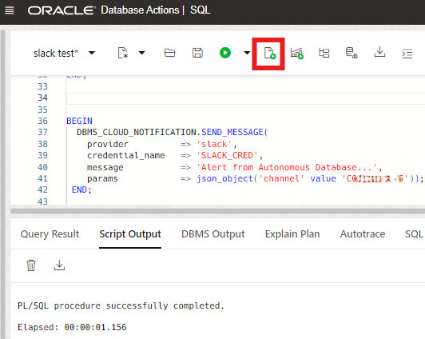
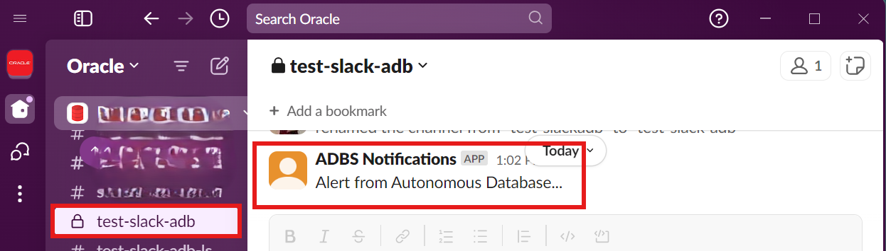
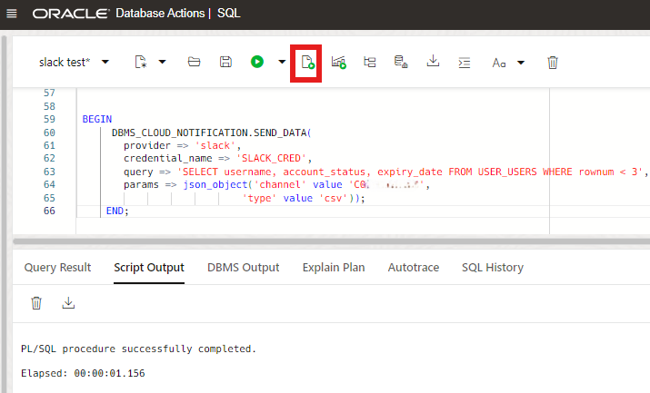
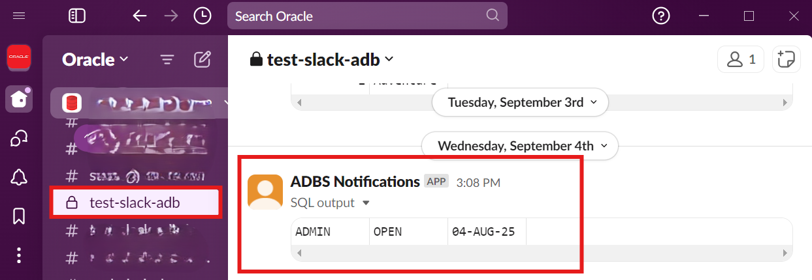

# Prepare to Send Slack Notifications from Autonomous Database

## Introduction

Slack, a leading collaboration tool, provides teams to have seamless communication and efficient data management. Slack has cool integrations with external app and sources. This is precisely what unites Oracle Autonomous Database and Slack in this lab.

This lab walks you through the steps to configure your Slack application to receive messages, alerts, and output of a query from Autonomous Database. You will learn the required procedures to send Slack notifications.

Estimated Time: 25 minutes

### Objectives

In this lab, you will:

+ Create your Slack application
+ Configure your Slack application
+ Create your Slack channel
+ Create a credential object to access the Slack application from Autonomous Database
+ Configure access control to allow user access to external network services
+ Send messages to a Slack channel
+ Send query results to a Slack Channel

### Prerequisites

+ Completion of the lab **Set up the environment** from the **Contents** menu on the left.
+ Slack account and workspace
+ Slack app
+ Slack channel

> **Note:** A Slack workspace is made up of channels, where team member can communicate and work together. To join a workspace, you can [create an account](https://slack.com/get-started#/createnew) using your email address.

## Task 1: Create your Slack application

1. To create a Slack application, click [this link](https://api.slack.com/apps) to access **Your Apps** page, and select **Create New App**.

    

2. Select **From scratch**.

    

3. Enter your **App Name**, select your **Workspace**, and then click **Create App**.

    

## Task 2: Configure your Slack application

After creating your application, you must request scopes which will give your application permission to perform actions such as viewing basic information, posting messages, and uploading files in your workspace.

These following scopes are  required:

+ channels:read
+ chat:write
+ files:write

1. Go to [main application page](https://api.slack.com/apps), and then click your **App Name**.

    

2. Scroll down to **Features**, and click **OAuth & Permissions**.

    

3. Scroll down to **Scopes**, and then click **Add an OAuth Scope**.

    

4. For OAuth Scope, enter **`channels:read`**, and then select **channels:read** from dropdown. This scope allows your app to access public Slack channels.

    

5. If successful, you will see recently added **OAuth Scope** with **Description**.

    

6. Repeat Task 4, to add the scopes **chat:write** and  **files:write** to your application as well.

## Task 3: Create a  Slack channel

To use Slack with the **`DBMS_CLOUD_NOTIFICATION`** procedure, your Slack admin must add the Slack app to the channels so that you can send message through the **Integrations** in the channel.

1. Open the Slack app, click the plus icon next to **Add channels**, and then select **Create a new channel**.

    

2. Select your workspace, and click **Next**.

    

3. Enter a **Name** for your channel, and then click **Next**.

    

4. If successful, you will see your channel in your workspace. Click the arrow icon next to your **Channel name**, and then select **Integrations**.

    

5. Click **Add apps** to integrate the application into your channel.

    

## Task 4: Create a credential object to access the Slack application from Autonomous Database

1. In the Oracle Cloud console, open the **Navigation menu**, navigate to **Oracle Database**, and then select **Autonomous Data Warehouse**.

    

2. Select your **Autonomous Database instance**.

    

3. Click **Database actions**, and then select **SQL** .

    

4. To create credential object to access the Slack app from Autonomous Database, obtain the **password** from your Slack admin. Copy and paste the following code into your SQL Worksheet, and then click the **Run Script (F5)** icon in the Worksheet toolbar.

    ```
    <copy>
    BEGIN
     DBMS_CLOUD.CREATE_CREDENTIAL(
      credential_name => 'SLACK_CRED',
      username    => 'SLACK_TOKEN',
      password    => 'xoxb-34....96-34....52-zW....cy');
     END;
    </copy>
    ```

    

    For more information, see [CREATE_CREDENTIAL Procedure](https://docs.oracle.com/en/cloud/paas/autonomous-database/serverless/adbsb/dbms-cloud-subprograms.html#GUID-742FC365-AA09-48A8-922C-1987795CF36A).

    > **Note:** If you can not run the `CREATE_CREDENTIAL` procedure successfully, you can consult the ADMIN user to grant execute access on `DBMS_CLOUD` packages.

    You can leave the SQL window open and continue with the next Task.

## Task 5: Configure access control to allow user access to external network services

In this task, you will use **`DBMS_NETWORK_ACL_ADMIN.APPEND_HOST_ACE`** procedure to grant the access control privileges to a user. For more information, see [Configuring Access Control for External Network Services](https://docs.oracle.com/en/database/oracle/oracle-database/19/dbseg/managing-fine-grained-access-in-pl-sql-packages-and-types.html#DBSEG-GUID-3D5B66BC-0277-4887-9CD1-97DB44EB5213).

1. In the source database SQL window, enter the following script, edit your **principal_name** according to your user name or user role, and then click **Run Statement**.

    ```
    <copy>
    BEGIN
       DBMS_NETWORK_ACL_ADMIN.APPEND_HOST_ACE (
          host         => 'slack.com',
          lower_port   => 443,
          upper_port   => 443,
          ace          => xs$ace_type(
          privilege_list => xs$name_list('http'),
          principal_name => enter_db_user_name_or_role,
          principal_type => xs_acl.ptype_db));
    END;
    </copy>
    ```

    

    You can leave the SQL window open and continue with the next Task.

## Task 6: Send messages to a Slack channel

After creating required credential and configuration, you can use the **`DBMS_CLOUD_NOTIFICATION.SEND_MESSAGE`** procedure to send a message to your Slack channel. For more information, see [SEND_MESSAGE Procedure](https://docs.oracle.com/en/cloud/paas/autonomous-database/serverless/adbsb/autonomous-dbms-cloud-notification.html#GUID-8A557984-BEC3-4F82-909E-4451E86F66E0).

1. Copy and paste the following code into your SQL Worksheet, enter your **Channel ID**, and then click the **Run Script (F5)**.


    ```
    <copy>
    BEGIN
      DBMS_CLOUD_NOTIFICATION.SEND_MESSAGE(
        provider          => 'slack',
        credential_name   => 'SLACK_CRED',
        message           => 'Alert from Autonomous Database...',
        params            => json_object('channel' value 'C0....08'));
     END;

    </copy>
    ```

    

2. Open your Slack channel, and confirm the receipt of the message.

    

    > **Note:** Use the **params** parameter to specify the Slack channel. The Channel ID is unique ID for a channel and is different from the channel name. You can find your channel ID at the bottom of the channel page.

3. Select your channel, click **Get Channel Details**, scroll down to the bottom, and then copy the **Channel ID**.

    

## Task 7: Send query results to a Slack Channel

After creating required credential and configuration, you can use the **`DBMS_CLOUD_NOTIFICATION.SEND_DATA`** procedure to send the output of a query to your Slack channel. For more information, see [SEND_DATA Procedure](https://docs.oracle.com/en/cloud/paas/autonomous-database/serverless/adbsb/autonomous-dbms-cloud-notification.html#GUID-B3375A5B-79B1-43A5-B043-A7FA646FBF54).

1. Copy your **Channel ID** from Task 6 (step 3).

2. Copy and paste the following code into your SQL Worksheet, enter your **Channel ID**, and then click the Run Script (F5).

    ```
    <copy>
    BEGIN
      DBMS_CLOUD_NOTIFICATION.SEND_DATA(
        provider => 'slack',
        credential_name => 'SLACK_CRED',
        query => 'SELECT username, account_status, expiry_date FROM USER_USERS WHERE rownum < 3',
        params => json_object('channel' value 'C0....08',
                            'type' value 'csv'));
     END;
    </copy>
    ```

    

    > **Note:** To specify the output type, use **params** section. Valid output types include `csv` and `json`.

3. Open your Slack channel, and confirm the receipt of query result.

    

## Summary
You learned how to create  and configure a Slack app to receive messages and query results form Autonomous Database. Autonomous Database supports sending alerts,messages and query results directly to your channels to enhance productivity. Next, let's see how to use Microsoft Teams with Autonomous Database.

You may now **proceed to the next lab**.

## Acknowledgements

+ **Author:** - Yonca Aksit, User Assistance Developer Intern

+ **Contributor:**

+ **Last Updated By/Date:** Yonca Aksit, September 2024

Copyright (C) Oracle Corporation.

Permission is granted to copy, distribute and/or modify this document
under the terms of the GNU Free Documentation License, Version 1.3
or any later version published by the Free Software Foundation;
with no Invariant Sections, no Front-Cover Texts, and no Back-Cover Texts.
A copy of the license is included in the section entitled [GNU Free Documentation License](files/gnu-free-documentation-license.txt)
