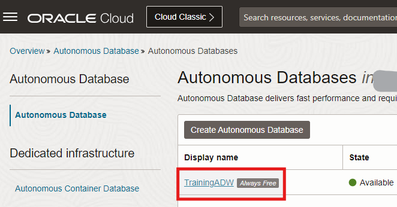
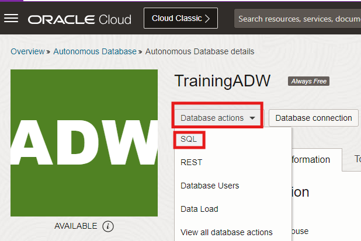
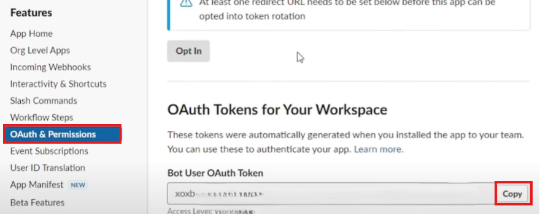
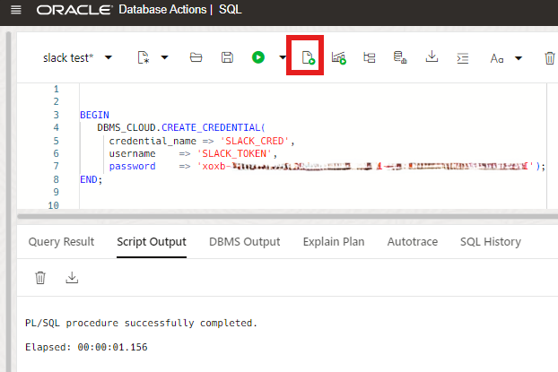
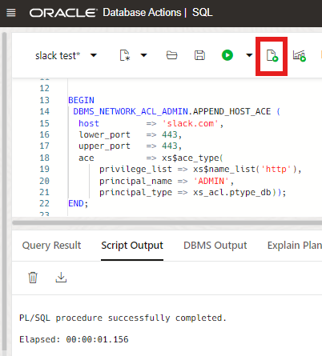
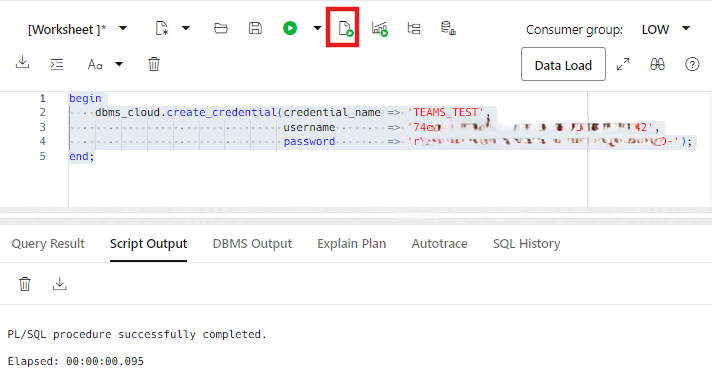

# Provision and Configure an Autonomous Database

## Introduction

In  this lab, you will learn the steps to get started using the Oracle Autonomous Database (Autonomous Data Warehouse). We will show you how to deploy a complete data warehousing platform that can scale to your requirements.

Also, you will learn how to configure your Slack and Microsoft Teams application and channel to receive messages, alerts, and output of a query from an Autonomous Database.

Estimated Time: 15 minutes

### Objectives

In this lab, you will:

- Provision a new Autonomous Database
- Create a credential object to access the Slack application from Autonomous Database
- Configure access control to allow user access to external network services
- Create a credential object to access Microsoft Teams application from Autonomous Database
- Configure access control to allow user access to external network services

### Prerequisites

- This lab requires completion of the **Get Started**, **Lab 1**, and **Lab 2** sections in the Contents menu on the left.

## Task 1: Choose Autonomous Database from the OCI Services Menu

[](include:adb-goto-service-body.md)

## Task 2: Create the Autonomous Database Instance

[](include:adb-provision-body.md)

## Task 3: Create a credential object to access the Slack application from Autonomous Database

For this task, you will use **`DBMS_CLOUD.CREATE_CREDENTIAL`** procedure which enables you to access the cloud service for data loading, and querying external data in the cloud. For more information, see [`CREATE_CREDENTIAL procedure`](https://docs.oracle.com/en/cloud/paas/autonomous-database/serverless/adbsb/dbms-cloud-subprograms.html#GUID-742FC365-AA09-48A8-922C-1987795CF36A).

1. In the Oracle Cloud console, open the **Navigation menu**, navigate to **Oracle Database**, and then select **Autonomous Data Warehouse**.

    

2. Select your **Autonomous Database instance**.

    

3. Click **Database actions**, and then select **SQL** .

    

4. To create credential object to access the Slack app from Autonomous Database, you need to obtain your **Bot User OAuth Token**.

    > **Note:** Bot tokens are authentication tokens, enabling your bot to interact with the workspace's API to send and receive messages. For more information, see [Bot tokens](https://api.slack.com/concepts/token-types#bot).

5. Access the [Your Apps](https://api.slack.com/apps) page, and then click **Your Apps**.

6. Scroll down to the **Features** section, click **OAuth & Permissions**, and then copy your **Bot User OAuth Token**

    

    > **Note:** Once adding your application is approved by your Slack admin, **OAuth Token** will be generated. If the approval is not granted, you will not see the **OAuth Tokens for Your Workspace** section shown in the previous screen capture.

7. Create a credential object to access the Slack app from Autonomous Database using the following script. Specify the following parameters that are used in the script.

    - credential_name: Enter your preferred name such as **`SLACK_CRED`**
    - username: Enter **`SLACK_TOKEN`** as a username
    - password: Enter your **Bot User OAuth Token**

    > **Note:** If adding your application is not approved by you Slack admin, you will not be able to run the code without having the **Bot User OAuth Token**.

   Copy and paste the following code into your SQL Worksheet, and then click the **Run Script (F5)** icon in the Worksheet toolbar.

    ```
    <copy>
    BEGIN
     DBMS_CLOUD.CREATE_CREDENTIAL(
      credential_name => 'SLACK_CRED',
      username    => 'SLACK_TOKEN',
      password    => 'xoxb-34....96-34....52-zW....cy');
     END;
    </copy>
    ```

    

    > **Note:**If you can not run the `CREATE_CREDENTIAL` procedure successfully, you can consult the ADMIN user to grant execute access on `DBMS_CLOUD` packages. For more information, see [`DBMS_CLOUD`](https://docs.oracle.com/en/cloud/paas/autonomous-database/serverless/adbsb/dbms-cloud-subprograms.html#GUID-3D0A5361-672C-467D-AA90-656B1B4D4E37).

    You can leave the SQL window open and continue with the next task.

## Task 4: Configure access control to allow user access to external network services

For this task, you will use **`DBMS_NETWORK_ACL_ADMIN.APPEND_HOST_ACE`** procedure to grant the access control privileges to a user. For more information, see [Configuring Access Control for External Network Services](https://docs.oracle.com/en/database/oracle/oracle-database/19/dbseg/managing-fine-grained-access-in-pl-sql-packages-and-types.html#DBSEG-GUID-3D5B66BC-0277-4887-9CD1-97DB44EB5213).

1. In the source database SQL window, specify the following parameters that are used in the following script.

    - principal_name: Substitute the `enter_db_user_name_or_role` place holder with your database user name such as **`ADMIN`**.
    - principal_type: Enter **`xs_acl.ptype_db`** for a database user or role.

    Copy and paste the following code into your SQL Worksheet, and then click the **Run Script (F5)** icon in the Worksheet toolbar.

    ```
    <copy>
    BEGIN
       DBMS_NETWORK_ACL_ADMIN.APPEND_HOST_ACE (
          host         => 'slack.com',
          lower_port   => 443,
          upper_port   => 443,
          ace          => xs$ace_type(
          privilege_list => xs$name_list('http'),
          principal_name => enter_db_user_name_or_role,
          principal_type => xs_acl.ptype_db));
    END;
    </copy>
    ```

    

    You can leave the SQL window open and continue with the next task.

## Task 5: Create a credential object to access Microsoft Teams application from Autonomous Database

For this task, you will use **`DBMS_CLOUD.CREATE_CREDENTIAL`** procedure which enables you to access the cloud service for data loading, and querying external data in the cloud. For more information, see [`CREATE_CREDENTIAL procedure`](https://docs.oracle.com/en/cloud/paas/autonomous-database/serverless/adbsb/dbms-cloud-subprograms.html#GUID-742FC365-AA09-48A8-922C-1987795CF36A).

1. In the Oracle Cloud console, open the **Navigation menu**, navigate to **Oracle Database**, and then select **Autonomous Data Warehouse**.

    

2. Select your **Autonomous Database instance**.

    

3. Click **Database actions** dropdown, and then select **SQL** .

    

4. Create a credential object to access the Microsoft Teams app from Autonomous Database using the following script. Specify the following parameters that are used in the script.

    - credential_name: Enter your preferred name such as **`TEAMS_CRED`**
    - username: Substitute **bot_id** with your **Application (client) ID**
    - password: Substitute **bot_secret** with your **client secret**

    Copy and paste the following code into your SQL Worksheet, and then click the **Run Script (F5)** icon in the Worksheet toolbar.

    ```
    <copy>
       BEGIN
          DBMS_CLOUD.CREATE_CREDENTIAL(
                    credential_name => 'TEAMS_CRED',
                    username        => 'bot_id',
                    password        => 'bot_secret');
       END;
    </copy>
    ```

    

    > **Note:** You will not be able to run the code without having your **Application (client) ID** and **client secret**. Please see  task 2, step 8 in **Lab 2** for the **client secret** and task 4, step 5 in **Lab 2** for the **Application (client) ID**.

    > **Note:** To use Microsoft Teams app with **`DBMS_CLOUD_NOTIFICATION`** procedure, you need to run the procedure successfully. If you can not run the **`CREATE_CREDENTIAL`** procedure successfully, you can consult the ADMIN user to grant execute access on **`DBMS_CLOUD`** packages. For more information, see [`DBMS_CLOUD`](https://docs.oracle.com/en/cloud/paas/autonomous-database/serverless/adbsb/dbms-cloud-subprograms.html#GUID-3D0A5361-672C-467D-AA90-656B1B4D4E37).

## Summary

You learned how to create provisions and configure an Autonomous Database. Next, let's see how to send notifications from an Autonomous Database to your Slack and Microsoft Teams channels.

You may now **proceed to the next lab**.

## Want to Learn More?

* [Using Oracle Autonomous Database Serverless](https://docs.oracle.com/en/cloud/paas/autonomous-database/serverless/adbsb/index.html#Oracle%C2%AE-Cloud)

## Acknowledgements

+ **Author:**

    * Lauran K. Serhal, Consulting User Assistance Developer
    * Yonca Aksit, User Assistance Developer Intern

+ **Contributors:**

    * Lauran K. Serhal, Consulting User Assistance Developer
    * Marty Gubar, Director of Product Management, Autonomous Database

+ **Last Updated By/Date:** Yonca Aksit, October 2024

Copyright (C) 2024 Oracle Corporation.

Permission is granted to copy, distribute and/or modify this document
under the terms of the GNU Free Documentation License, Version 1.3
or any later version published by the Free Software Foundation;
with no Invariant Sections, no Front-Cover Texts, and no Back-Cover Texts.
A copy of the license is included in the section entitled [GNU Free Documentation License](files/gnu-free-documentation-license.txt)
