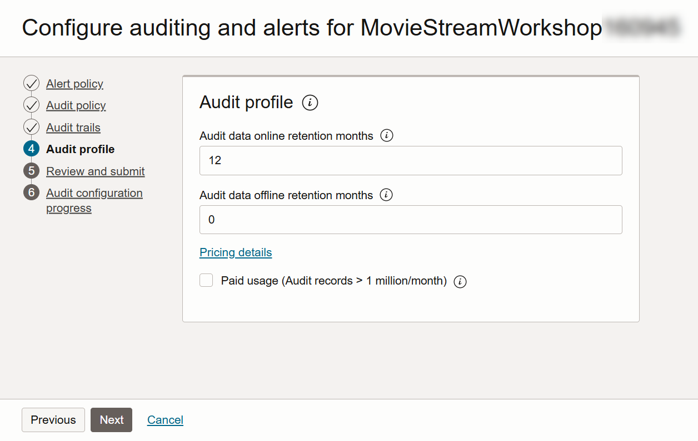
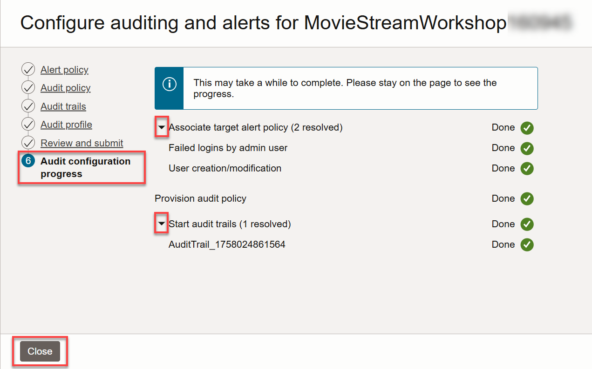
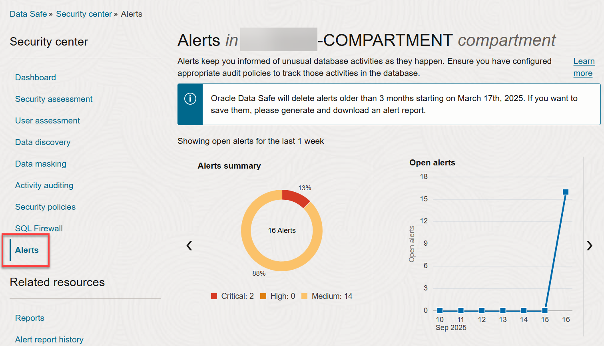
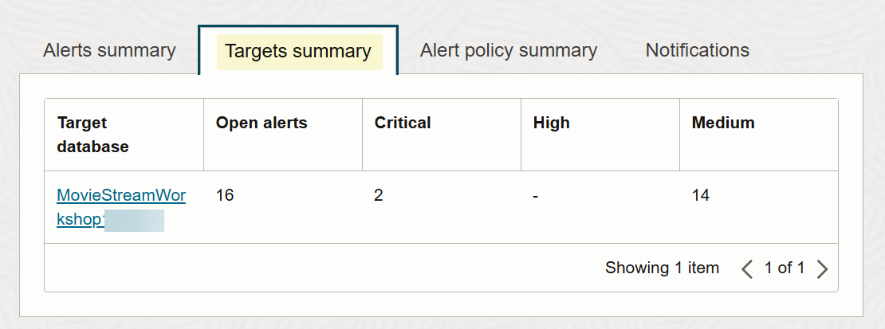
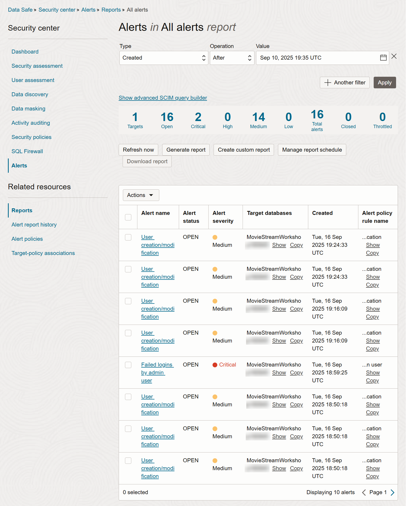
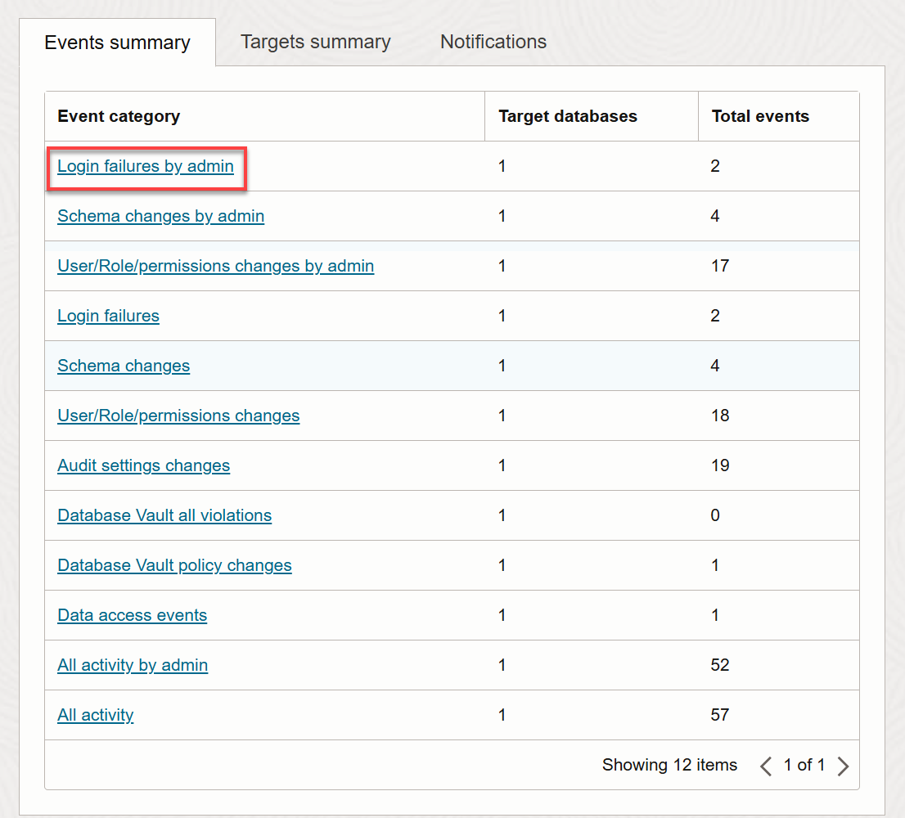
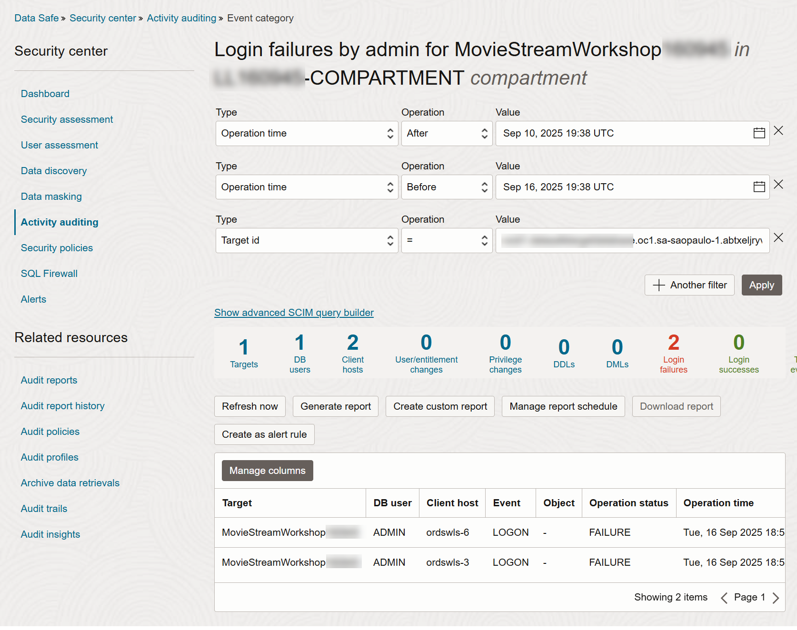

# Audit database activity

## Introduction

Audit resources for Oracle Data Safe (audit profiles, audit policies, and audit trails) are automatically created for all registered target databases. 

In this lab, you use the auditing wizard to enable alert and audit policies on your target database, start audit data collection in Oracle Data Safe, and configure the retention periods for your audit data. You then perform activity on your target database and review the alerts and audit events generated in Oracle Data Safe.

Estimated Lab Time: 10 minutes

### Objectives

In this lab, you will:

- Configure auditing and alerts for your target database
- Perform activities on your target database to generate audit data
- Review alerts in Oracle Data Safe
- Review audit events in Oracle Data Safe


### Prerequisites

This lab assumes you have:

- Obtained an Oracle Cloud account
- Signed in to the Oracle Cloud Infrastructure Console
- Prepared your environment for this workshop
- Registered your target database with Oracle Data Safe


### Assumptions

- Your data values may be different than those shown in the screenshots.
- Please ignore the dates for the data and database names. Screenshots are taken at various times and may differ between labs and within labs. 

## Task 1: Configure Auditing and Alerts for your Target Database

1. Return to the **Oracle Data Safe** browser tab. In the breadcrumbs at the top of the page, click **Data Safe**.

    
    
    The **Data Safe** page is displayed.

2. In the **Security center**, click **Activity auditing**.

    

    The **Activity auditing** page is displayed.

3. Click **Configure auditing and alerts** to start the Activity Auditing wizard.

    

4. For **Alert policy**, perform the following to enable alert policies, and then click **Next**.

    a) If needed, click the **Change Compartment** link and select your assigned compartment.
    
    b) Select your target database from the **Target Database** drop-down list. The list of available alert policies is displayed.

    c) Select the **Failed logins by admin user** and **User creation/modification** alert policies to enable them.

   
    
5. For **Audit policy**, select the following audit policies to enable them, and then click **Next**.

   a) Select **Exclude Data Safe user activity**.
   
   b) Under **Basic auditing**, select **Critical database activity** and **Database schema changes**.
   
   c) Under **Admin activity auditing**, select **Admin user activity**.
   
    

6. For **Audit trails**, select the following to start collecting audit data, and then click **Next**.

    a) Select **`UNIFIED_AUDIT_TRAIL`**: `NOT_STARTED`.

    b) For the start date, select the beginning of your current month.

    

7. For **Audit profile**, select the following configuration, and then click **Next**.

    - Audit data online retention months = `12`
    - Audit data offline retention months = `0`
    - Paid usage = not selected

    

    - Each regional Oracle Data Safe service in a tenancy has global settings for paid usage, online retention period, and archive retention period.
    - Global settings are applied to all target databases unless their audit profiles override them.
    - All initial audit profile settings for your target database are inherited from the global settings for Oracle Data Safe.
    - By default, paid usage is not enabled for all target databases. You cannot enable paid usage for a free trial account.

8. For **Review and submit**, review the configuration, and click **Submit** if everything is correct.

    

9. For **Audit configuration progress**, wait until the alert and audit policies are provisioned and the audit trail is started. 
    
    
    
10. Click **Close**.

## Task 2: Perform Activities on your Target Database to Generate Audit Data

In this task, you perform activities on your target database in Database Actions to generate some audit data. First, purposely try to log in as the `ADMIN` user with incorrect passwords. Then, you will sign in as the `ADMIN` user and create a new user account.

1. Click the **Database Actions** link in the **Reservation Information** panel. The **Sign-in** page is displayed.

2. In the **Username** field, enter `ADMIN`.

3. In the **Password** field, enter an incorrect password, and then click **Sign in**. An **Invalid credentials** message is displayed. Enter another incorrect password in the **Password** field, and then click **Sign in** again. An **Invalid credentials** message is displayed.

    

4. Enter the correct **ADB Admin Password** password that you can find in the **Reservation Information** panel, and then click **Sign in**.

5. The **Database Actions Launchpad** page is displayed. Click the **Development** > **SQL** tabs. Next, click **SQL**.

7. Clear the worksheet (click the **Clear** icon), if needed, and then paste the following SQL script. Replace `your-password` with a password of your choice. _The password must be between 12 and 30 characters long and must include at least one uppercase letter, one lowercase letter, and one numeric character. It cannot contain your username or the double quote (") character_.

    ```
    <copy>DROP USER malfoy CASCADE;
    CREATE USER malfoy IDENTIFIED BY your-password;
    GRANT PDB_DBA TO malfoy;
    </copy>
    ```

8. Click the **Run Script** icon on the toolbar.

9. In the **Script Output** tab, verify that the `MALFOY` user was successfully dropped and then recreated.

    

10. Return to the browser tab for **Oracle Data Safe** and wait a couple of minutes for Oracle Data Safe to produce the alerts.

## Task 3: Review Alerts in Oracle Data Safe

1. In the **Security center** section on the left, click **Alerts**.

    

2. In the **Filters** section on the left, select your target database.

    

3. Review the alerts dashboard.

    - The **Alerts summary** chart compares the number of critical, high, and medium alerts.
    - The **Open alerts** chart shows that there are open alerts on the current day.
    - The **Top 10 alert policies by volume** chart shows you the number of alerts for the alert policies you just configured.
    - The **Alerts summary** tab shows the number of critical, high, and medium alerts along with target database counts. It also shows you the total number of alerts and target databases. 
    - The **Targets summary** tab shows the number of open, critical, high, and medium alerts.

        
    
        


4. In the **Related resources** section, click **Reports**.

5. In the **Report name** column on the right, click the **All alerts** report and review it.

    

    - The report is automatically filtered to show you all alerts for all target databases in the selected compartment for the past one week. To create filters, you can use the **+ Another filter** button or the **SCIM query builder**. 
    - You can view several totals, including the total number of target databases; total number of open and closed alerts, the total number of critical, high, medium, and low alerts; and the total number of alerts. You can click the **Targets** total to view the list of target databases. You can click the other totals to toggle a filter on the list of alerts.
    - At the bottom of the report, you can view the list of alerts. By default, the table shows you the alert name, alert status, alert severity, target databases on which the audited event occurred, when the alert was created, and the alert policy rule name.
    - You have options to create a PDF or XLS report, create a custom report, schedule a custom report, open and close alerts, and specify which table columns you want displayed on the page.

        
    
## Task 4: Review Audit Events in Oracle Data Safe

1. In the **Security center** section, click **Activity auditing**.

2. In the **Filters** section, select your target database from the **Target databases** drop-down list. 

3. On the **Events summary** tab, click one of the event categories, for example, **Login failures by admin** to view more detail.

    
    
   
    

You may now **proceed to the next lab**.

## Learn More

* [Activity Auditing Overview](https://www.oracle.com/pls/topic/lookup?ctx=en/cloud/paas/data-safe&id=UDSCS-GUID-A73D8630-E59F-44C3-B467-F8E13041A680)
* [View and Manage Audit Reports](https://www.oracle.com/pls/topic/lookup?ctx=en/cloud/paas/data-safe&id=UDSCS-GUID-364B6431-9861-4B42-B24D-103D5F43B44A)

## Acknowledgements

- **Author** - Jody Glover, Consulting User Assistance Developer, Database Development
- **Contributors:** 
    * Lauran K. Serhal, Consulting User Assistance Developer, Database Development
    * Michelle Malcher, Director, Product Management  
- **Last Updated By/Date:** - Lauran K. Serhal, September 2025