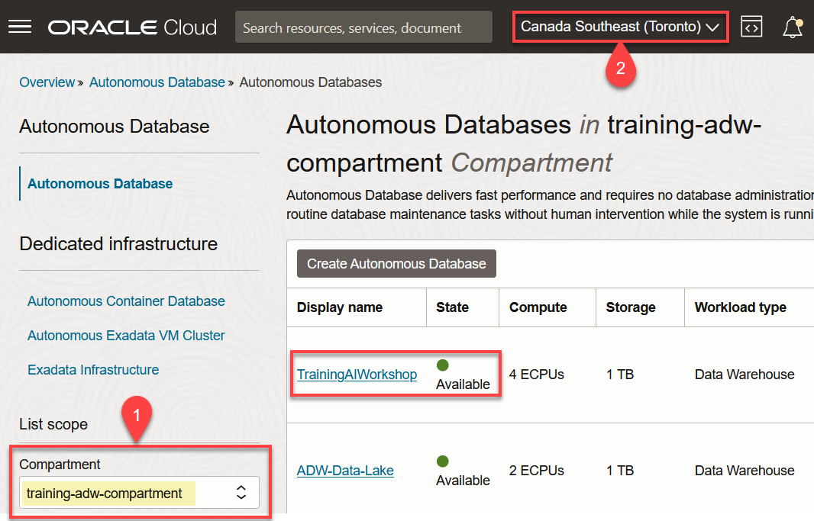
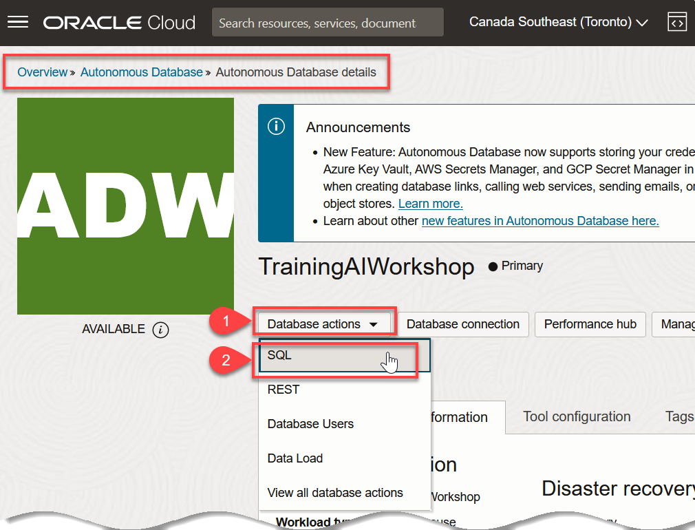
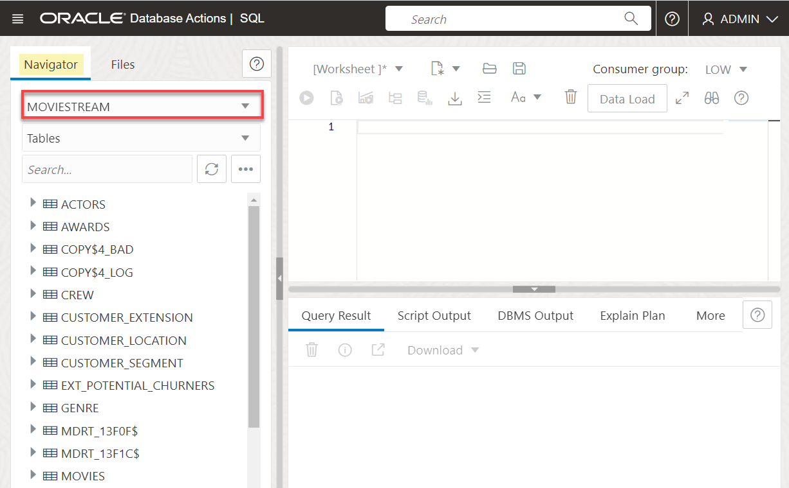
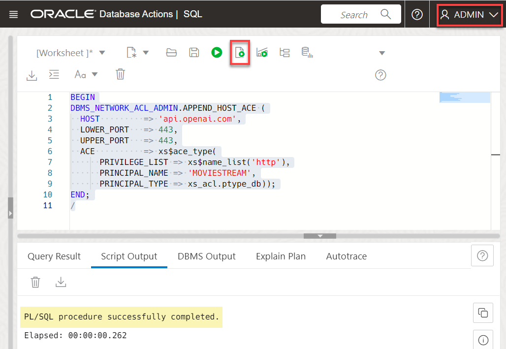

# Allow Users to Connect to Your LLM

<!---
I removed this lab from the manifest.json on July 24 since we are using oci genai. 
I am keeping the lab in case we need instruction in the future on using OpenAI as the model.
--->
## Introduction

You can use different large language models (LLM) with Autonomous Database. In this lab, you will enable the user **`MOVIESTREAM`** to use the LLM that you set up in the previous lab.

Estimated Time: 10 minutes.

### Objectives

In this lab, you will:
* As the `ADMIN` user, enable users to connect to the LLM REST endpoint
* Grant users privileges to use the **Select AI** APIs

### Prerequisites
- This lab requires the completion of **Lab 1: Set up Your Workshop Environment** in the **Contents** menu on the left.

## Task 1: Navigate to the SQL Worksheet

Although you can connect to your Oracle Autonomous Database using desktop tools such as Oracle SQL Developer, you can conveniently access the browser-based SQL Worksheet directly from your Autonomous Database Console.

1. Log in to the **Oracle Cloud Console**, if you are not already logged as the Cloud Administrator, **`ADMIN`**.

2. Open the **Navigation** menu and click **Oracle Database**. Under **Oracle Database**, click **Autonomous Database**.

3. On the **Autonomous Databases** page, click your ADB instance name, **`TrainingAIWorkshop`** in our example.

    

4. On the **Autonomous Database details** page, click the **Database actions** drop-down list, and then click **SQL**.

    

    The SQL Worksheet is displayed. If a **Logged in as ADMIN user** warning box is displayed, close the box. The first time you access the SQL Worksheet, a series of pop-up informational boxes may appear, providing you a tour that introduces the main features. If not, click the Tour button (labeled with binoculars symbol) in the upper right corner. Click **Next** to take a tour through the informational boxes.

    

    In this example, close the **Data Loading** box.

    

5. In the **Navigator** tab on the left, select the **`moviestream`** user from the drop-down list. This user was created when you created and ran the stack. The tables that were created for this user are displayed.

    

## Task 2: Grant the MOVIESTREAM User Permissions to Use Select AI

The first thing you need to do is grant the **`moviestream`** user permissions to make REST calls to **api.open.com**. This is done by adding the user to the network Access Control List (ACL). For more details, see the [`DBMS_NETWORK_ACL_ADMIN` PL/SQL Package](https://docs.oracle.com/en/database/oracle/oracle-database/19/arpls/DBMS_NETWORK_ACL_ADMIN.html#GUID-254AE700-B355-4EBC-84B2-8EE32011E692) documentation.

Next, you will grant permissions to the **`moviestream`** user to use the **Select AI** by granting access to the `DBMS_CLOUD_AI` package.

1. Open access to the LLM's rest endpoint. For this workshop, specify **`api.openai.com`** as the Host value and the **`moviestream`** as the principal_name. Copy and paste the following code into your SQL Worksheet, and then click the **Run Script (F5)** icon in the Worksheet toolbar.

    ```
    <copy>
    BEGIN
    DBMS_NETWORK_ACL_ADMIN.APPEND_HOST_ACE (
      HOST         => 'api.openai.com',
      LOWER_PORT   => 443,
      UPPER_PORT   => 443,
      ACE          => xs$ace_type(
          PRIVILEGE_LIST => xs$name_list('http'),
          PRINCIPAL_NAME => 'MOVIESTREAM',
          PRINCIPAL_TYPE => xs_acl.ptype_db));
    END;
    /
    </copy>
    ```

    
    
2. Grant the **`moviestream`** user the required privileges to use the `DBMS_CLOUD_AI` PL/SQL package. Copy and paste the following code into your SQL Worksheet, and then click the **Run Script (F5)** icon in the Worksheet toolbar.

    ```
    <copy>
    GRANT EXECUTE ON DBMS_CLOUD_AI TO moviestream;
    </copy>
    ```

    

You may now proceed to the next lab.

## Learn More
* [DBMS\_NETWORK\_ACL\_ADMIN PL/SQL Package](https://docs.oracle.com/en/database/oracle/oracle-database/19/arpls/DBMS_NETWORK_ACL_ADMIN.html#GUID-254AE700-B355-4EBC-84B2-8EE32011E692)
* [DBMS\_CLOUD\_AI Package](https://docs.oracle.com/en-us/iaas/autonomous-database-serverless/doc/dbms-cloud-ai-package.html)
* [Using Oracle Autonomous Database Serverless](https://docs.oracle.com/en/cloud/paas/autonomous-database/adbsa/index.html)

## Acknowledgements
  * **Author:** Lauran K. Serhal, Consulting User Assistance Developer
  * **Contributors:** Marty Gubar, Product Management
* **Last Updated By/Date:** Lauran K. Serhal, March 2025

Data about movies in this workshop were sourced from **Wikipedia**.

Copyright (c) 2025 Oracle Corporation.

Permission is granted to copy, distribute and/or modify this document
under the terms of the GNU Free Documentation License, Version 1.3
or any later version published by the Free Software Foundation;
with no Invariant Sections, no Front-Cover Texts, and no Back-Cover Texts.
A copy of the license is included in the section entitled [GNU Free Documentation License](files/gnu-free-documentation-license.txt)
