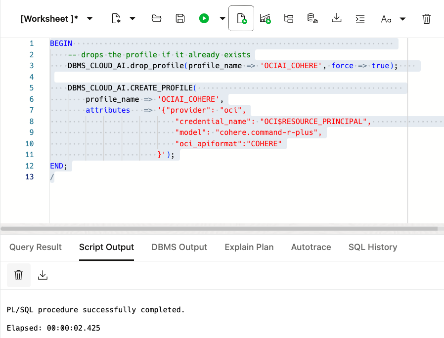
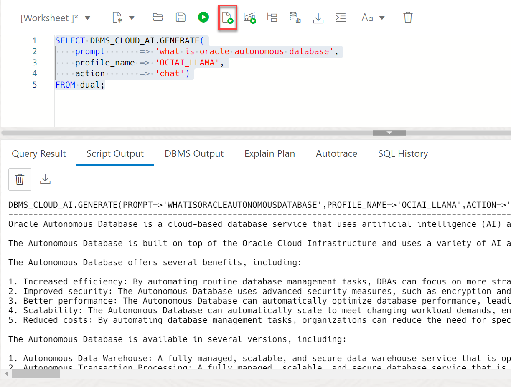

# Integrate OCI Generative AI with Autonomous Database

## Introduction

In the previous lab, you saw a snapshot of the creative responses that can be produced by LLMs. Let's now apply that creativity to your data. The first step is to integrate OCI Generative AI with Autonomous Database.

You can use different LLMs with Autonomous Database. This lets you pick the best model for your use case. Select AI profiles encapsulate the connections to each model; you specify which profile to use when generating results. In this lab, you will enable the user **`MOVIESTREAM`** to use multiple LLMs offered by the OCI Generative AI service. 

Estimated Time: 10 minutes.

### Objectives

In this lab, you will:

* Enable use of Resource Principals for the **`MOVIESTREAM`** user
* Create Select AI Profile for OCI GenAI
* Test the AI profile

### Prerequisites

- This lab requires the completion of **Labs 1 and 2** in the **Contents** menu on the left.

## Task 1: Enable Resource Principal Usage for the MOVIESTREAM User

The **`MOVIESTREAM`** user will connect to **OCI Generative AI** using resource principals (for more information, see [Use Resource Principal to Access Oracle Cloud Infrastructure Resources](https://docs.oracle.com/en/cloud/paas/autonomous-database/serverless/adbsb/resource-principal.html#GUID-E283804C-F266-4DFB-A9CF-B098A21E496A)). This means that the ADB resource (i.e. your ADB instance) needs access to OCI Generative AI. The OCI policy you created in the previous lab authorized that access.

In ADB, enable the use of resource principals for the **`MOVIESTREAM`** user.

1. From the **Console,** Open the **Navigation** menu and click **Oracle Database.** Under **Oracle Database,** click **Autonomous Database.**

2. On the **Autonomous Database** page, click your ADB instance name link, **TrainingAIWorkshop** in our example.

    

3. On the **Autonomous Database details** page, click the **Database actions** drop-down list, and then click **SQL**.

    

    >**Note:** The setup script automatically enabled Resource Principals usage for MovieStream. The following 2 steps are optional.

4. _The deployment in Lab 1 already set up resource principals in your database_. To better understand the use of resource principals, let's undo that enablement and recreate it. Disable the use of resource principals for the **`MOVIESTREAM`** user. Copy and paste the following code into your SQL Worksheet, and then click the **Run Script (F5)** icon in the Worksheet toolbar.

    ```
    <copy>
    begin
      dbms_cloud_admin.disable_resource_principal(username  => 'MOVIESTREAM');
    end;
    /
    </copy>
    ```

    

5. Now let's re-enable the use of the resource principal by the **`MOVIESTREAM`** user. Copy and paste the following code into your SQL Worksheet, and then click the **Run Script** icon.

    ```
    <copy>
    begin
      dbms_cloud_admin.enable_resource_principal(username  => 'MOVIESTREAM');
    end;
    /
    </copy>
    ```
    
    

6. Sign out of the **`ADMIN`** user. On the **Oracle Database Actions | SQL banner**, click the drop-down list next to the **`ADMIN`** user, and then select **Sign Out** from the drop-down menu.

    

## Task 2: Create an AI Profile for OCI Generative AI

A Select AI profile encapsulates connection information for an AI provider. This includes:

1. A security credential (e.g. the resource principal)
2. The name of the provider
3. The name of the LLM (optional)
4. A list of target tables that will be used for natural language queries (required when using NL2SQL)
You can create as many profiles as you need, which is useful when comparing the quality of the results of different models.

For a complete list of the Select AI profile attributes, see the [DBMS\_CLOUD\_AI\_Package] (https://docs.oracle.com/en/cloud/paas/autonomous-database/serverless/adbsb/dbms-cloud-ai-package.html#GUID-D51B04DE-233B-48A2-BBFA-3AAB18D8C35C) in the Using Oracle Autonomous Database Serverless documentation. 

>**Note:** The deployment script that you ran in **Lab 1 > Task 1 > Step 1** created a `Select AI` profile named **genai** using the code shown in this task; however, you'll practice dropping the file and then recreating it. For the **region** parameter, specify the region name where the OCI GenAI service is running and to which your tenancy is subscribed. In our example, we used **us-chicago-1** (the default). If you are subscribed to **Frankfurt**, then use `eu-frankfurt-1` as the value for the **region** parameter. If you are subscribed to **London**, then use `uk-london-1` as the value for the **region** parameter.

1. Sign into the SQL worksheet as the **`MOVIESTREAM`** user with the password **`watchS0meMovies#`**. On the **Database Actions Launchpad** page, click the **Development** tab, and then click the **SQL** tab. The SQL Worksheet is displayed.

    >**Note:** the **`MOVIESTREAM`** user was created as part of the setup and tables that were created in that schema. You can find the Moviestream password by navigating to **Developer Services** from the Navigation menu. Next, click **Resource Manager** > **Stacks** > Select the stack we created, **Deploy-ChatDB-Autonomous-Database...** > Select the job we created, **ormjob2024117214431** (use your own stack number)> Select **Outputs** under **Resources**.

    

2. Create an AI profile for the **Meta Llama 3** model. Copy and paste the following code into your SQL Worksheet, and then click the **Run Script** icon.

```
<copy>
BEGIN
    -- drops the profile if it already exists
    DBMS_CLOUD_AI.drop_profile(
        profile_name => 'genai',
        force => true
    );     

    -- Meta Llama 3 (this is the default model, so you could skip the model attribute if you like)      
    DBMS_CLOUD_AI.create_profile (                                              
        profile_name => 'genai',
        attributes   =>
        '{"provider": "oci",
            "credential_name": "OCI$RESOURCE_PRINCIPAL",
            "object_list": [
                {"owner": "moviestream", "name": "GENRE"},
                {"owner": "moviestream", "name": "CUSTOMER"},
                {"owner": "moviestream", "name": "PIZZA_SHOP"},
                {"owner": "moviestream", "name": "STREAMS"},            
                {"owner": "moviestream", "name": "MOVIES"},
                {"owner": "moviestream", "name": "ACTORS"}
            ],
             "region": "us-chicago-1"
            }');
END;                                                                         
/
</copy>
```


<!--

3. Create an AI profile for the **Cohere model**. This model will not be used for SQL generation - it will only be used for generating innovative content. Copy and paste the following code into your SQL Worksheet, and then click the **Run Script** icon.
    
    ```
    <copy>
    BEGIN                                                                        
        -- drops the profile if it already exists
        DBMS_CLOUD_AI.drop_profile(profile_name => 'OCIAI_COHERE', force => true);    

        DBMS_CLOUD_AI.CREATE_PROFILE(                                              
            profile_name => 'OCIAI_COHERE',
            attributes   => '{"provider": "oci",
                                "credential_name": "OCI$RESOURCE_PRINCIPAL",                        
                                "model": "cohere.command-r-plus",
                                "oci_apiformat":"COHERE"
                            }');
    END;
    /
    </copy>
    ```
    

-->

## Task 3: Test the AI profile

We will use the PL/SQL API to generate a response from the **Meta Llama 3** model. This example is using the **chat** action. It is not using any private data coming from your database.

1. Test the LLM and learn about Autonomous Database as the MOVIESTREAM user using the **genai** model. Copy and paste the following code into your SQL Worksheet, and then click the **Run Script** icon.

    ```
    <copy>
    SELECT DBMS_CLOUD_AI.GENERATE(
        prompt       => 'what is oracle autonomous database',
        profile_name => 'genai',
        action       => 'chat')
    FROM dual;
    </copy>
    ```
    

<!--
2. Compare the **genai** model to the **Llama** model. Copy and paste the following code into your SQL Worksheet, and then click the **Run Script** icon.

    ```
    <copy>
    SELECT DBMS_CLOUD_AI.GENERATE(
        prompt       => 'what is oracle autonomous database',
        profile_name => 'OCIAI_LLAMA',
        action       => 'chat')
    FROM dual;
    </copy>
    ```
    
-->


## Summary
You learned how to integrate Autonomous Database with OCI Generative AI. And, you chatted with different models hosted on OCI Generative AI. Next, let's see how to use our private data with LLMs.
 
You may now proceed to the next lab.

## Learn More
* [DBMS\_NETWORK\_ACL\_ADMIN PL/SQL Package](https://docs.oracle.com/en/database/oracle/oracle-database/19/arpls/DBMS_NETWORK_ACL_ADMIN.html#GUID-254AE700-B355-4EBC-84B2-8EE32011E692)
* [DBMS\_CLOUD\_AI Package](https://docs.oracle.com/en-us/iaas/autonomous-database-serverless/doc/dbms-cloud-ai-package.html)
* [Using Oracle Autonomous Database Serverless](https://docs.oracle.com/en/cloud/paas/autonomous-database/adbsa/index.html)
* [Overview of Generative AI Service](https://docs.oracle.com/en-us/iaas/Content/generative-ai/overview.htm)

## Acknowledgements

  * **Authors:** 
    * Lauran K. Serhal, Consulting User Assistance Developer
    * Marty Gubar, Product Management
  * **Contributors:**
    * Stephen Stuart, Cloud Engineer
    * Nicholas Cusato, Cloud Engineer
    * Olivia Maxwell, Cloud Engineer
    * Taylor Rees, Cloud Engineer
    * Joanna Espinosa, Cloud Engineer

* **Last Updated By/Date:** Lauran K. Serhal, December 2024

Data about movies in this workshop were sourced from **Wikipedia**.

Copyright (c) 2024  Oracle Corporation.

Permission is granted to copy, distribute and/or modify this document
under the terms of the GNU Free Documentation License, Version 1.3
or any later version published by the Free Software Foundation;
with no Invariant Sections, no Front-Cover Texts, and no Back-Cover Texts.
A copy of the license is included in the section entitled [GNU Free Documentation License](files/gnu-free-documentation-license.txt)
