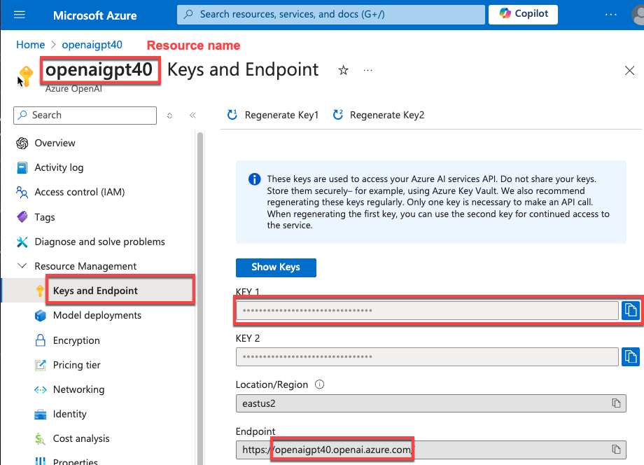
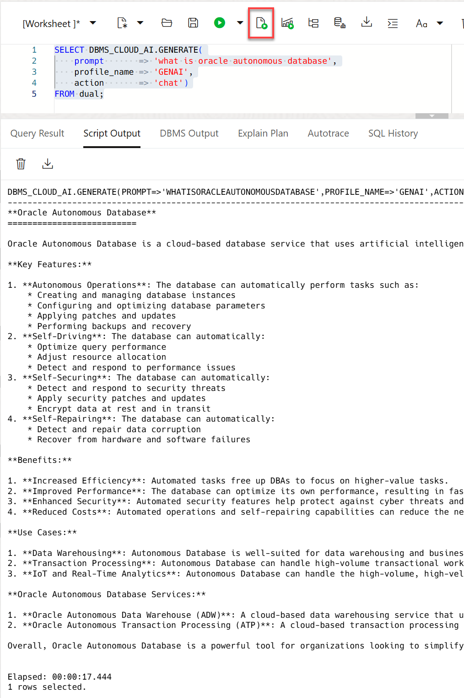

# Integrate GenAI models with Autonomous AI Database

## Introduction

LLMs can produce incredibly creative responses to prompts, generate SQL from natural language, and so much more. In order to be most effective, you want to leverage LLMs with your organization's private data. The first step is to integrate your models with Autonomous AI Database. 

You can use different LLMs with Autonomous AI Database. This lets you pick the best model for your use case. Select AI profiles encapsulate the connections to each model; you specify which profile to use when generating results. In this lab, you will enable the user **`MOVIESTREAM`** to connect to models from Oracle OCI GenAI, Azure OpenAI and Google Gemini. 

Estimated Time: 10 minutes.

### Objectives

In this lab, you will:
* Connect Autonomous AI Database to an AI provider
* Test the AI profile

### Prerequisites
- This lab requires the completion of the previous labs that deployed your Autonomous AI Database.

## Task 1: Log into SQL Worksheet

>**Note:** the **`MOVIESTREAM`** user and its tables were created as part of the setup. You can find the Moviestream password by navigating to **Developer Services** from the Navigation menu. Next, click **Resource Manager** > **Stacks** > Select the stack we created, **Deploy-ChatDB-Autonomous-Database...** > Select the job we created, **ormjob2025.....** > Click **Outputs** under **Resources**.


1. On your Autonomous AI Database details page, click the **Database Actions** drop-down list, and then select **SQL**. 

    >**Note:** Make sure you are in the correct compartment and region where you ADB instance was provisioned.

    

    The SQL Worksheet is displayed.

    Logging in from the OCI service console requires you to be the **`ADMIN`** user. Log in as the **`ADMIN`** user if you are not automatically logged in.
    
    * **Username:** **`ADMIN`**
    * **Password:** *your password*

2. The first time you open SQL Worksheet, a series of pop-up informational boxes appears. Click the **Tour** icon (binoculars) in the upper right corner to get a tour that introduces the main features. Close the boxes.

    

    You can expand the SQL Worksheet editor area by collapsing the left navigation area.

    

3. We'll run the SQL analytics as the **`MOVIESTREAM`** user. Sign out of the **`ADMIN`** user. Click the the drop-down list next to the **`ADMIN`** user in the banner, and then click **Sign Out**.

4. Log in to the SQL Worksheet using the following credentials, and then click **Sign in** to display the Database Actions Launchpad.

    - **Username:** **`MOVIESTREAM`**
    - **Password:** `your-password` (e.g. `watchS0meMovies#`)

    

5. The **Database Actions Launchpad** page is displayed. Click the **Development** tab, and then click the **SQL** tab.

    

    The SQL Worksheet is displayed. Close the Run Statement informational box.

    

## Task 2: Connect Autonomous AI Database to an AI provider and create an AI Profile

### Background

There are 3 things to do in order to connect Autonomous AI Database to an AI provider:
1. Grant the `MOVIESTREAM` user network access to the AI provider endpoint
2. Create a credential containing the secret used to sign requests to the AI provider
3. Create a Select AI profile (see below for more details) 

>**Note:** All of these steps have already been done for accessing OCI GenAI when you deployed your Autonomous AI Database. You can review the deployment steps below. You will need to execute these steps when connecting to non-Oracle AI providers.

A Select AI profile encapsulates connection information for an AI provider. This includes: 
1. A security credential (e.g. the resource principal for OCI GenAI or a credential that captures a secret for a 3rd party AI provider)
2. The name of the provider
3. The name of the LLM (optional)
4. A list of target tables that will be used for natural language queries (required when using NL2SQL)

You can create as many profiles as you need, which is useful when comparing the quality or performance of the results of different models.

For a complete list of the Select AI profile attributes, see the [DBMS\_CLOUD\_AI\_Package] (https://docs.oracle.com/en/cloud/paas/autonomous-database/serverless/adbsb/dbms-cloud-ai-package.html#GUID-D51B04DE-233B-48A2-BBFA-3AAB18D8C35C) in the Using Oracle Autonomous AI Database Serverless documentation. 

### Connect to one of the following AI providers using each provider's default model:

<details>
    <summary>**OCI Generative AI** (default)</summary>
1. Grant `MOVIESTREAM` network access to the endpoint:

    This is not required when using OCI GenAI    

2. Create a credential:

    The workshop deployment step already set up a resource principal for your database and enabled the `MOVIESTREAM` user to use that principal (for more information, see [Use Resource Principal to Access Oracle Cloud Infrastructure Resources](https://docs.oracle.com/en/cloud/paas/autonomous-database/serverless/adbsb/resource-principal.html#GUID-E283804C-F266-4DFB-A9CF-B098A21E496A)). This means that the ADB resource (i.e. your ADB instance) needs access to OCI Generative AI. The OCI policy you created in the previous lab authorized that access.

3. Create a Select AI profile

    ```sql
    <copy>
    begin    
    -- Drop the profile in case it already exists
    dbms_cloud_ai.drop_profile(
        profile_name => 'genai',
        force => true
        );    -- Create an AI profile that uses the default LLAMA model on OCI

    dbms_cloud_ai.create_profile(
        profile_name => 'genai',
        attributes =>
        '{"provider": "oci",
        "credential_name": "OCI$RESOURCE_PRINCIPAL",
        "region": "us-chicago-1",
        "comments":"true",
        "object_list": [
            {"owner": "MOVIESTREAM", "name": "GENRE"},
            {"owner": "MOVIESTREAM", "name": "CUSTOMER"},
            {"owner": "MOVIESTREAM", "name": "PIZZA_SHOP"},
            {"owner": "MOVIESTREAM", "name": "STREAMS"},
            {"owner": "MOVIESTREAM", "name": "MOVIES"},
            {"owner": "MOVIESTREAM", "name": "ACTORS"}
        ]
        }'
    );
    end;
    /
    </copy>  
    ```

    

    >**Note:** The **region** attribute indicates the location of the Generative AI cluster that you want to use. 
    The default region is **`us-chicago-1`**. If you are using another region such as Frankfurt, **`eu-frankfurt-1`**, replace the **`us-chicago-1`** region's attribute value in the above code with **`eu-frankfurt-1`**. For the current list of regions with OCI Generative AI, see [Regions with Generative AI](https://docs.oracle.com/en-us/iaas/Content/generative-ai/overview.htm).


</details>

<details>
    <summary>**OpenAI**</summary>
You will need a [paid OpenAI account](https://platform.openai.com/docs/overview) and [an API key](https://platform.openai.com/docs/quickstart) in order to use OpenAI GPT models. 

1. Grant MOVIESTREAM network access to the OpenAI endpoint.    
    ```sql
    <copy>
    BEGIN
    DBMS_NETWORK_ACL_ADMIN.APPEND_HOST_ACE(
        host => 'api.openai.com',
        ace  => xs$ace_type(privilege_list => xs$name_list('http'),
                            principal_name => 'MOVIESTREAM',
                            principal_type => xs_acl.ptype_db)
    );
    END;
    /    
    </copy>
    ```

2. Create a credential
    ```sql
    <copy>
    BEGIN                                                                          
        dbms_cloud.create_credential (                                                 
            credential_name => 'openai_credential',                                            
            username => 'openai',                                                 
            password => 'your-api-key-goes-here'
        );                             
    END;                                                                           
    /  
    </copy>
    ```

3. Create a Select AI profile
    ```sql
    <copy>
    BEGIN
        -- Drop the profile in case it already exists
        dbms_cloud_ai.drop_profile(
            profile_name => 'genai',
            force => true
        );        
        
        -- Create an AI profile that uses the default GPT model
        dbms_cloud_ai.create_profile(
            profile_name => 'genai',
            attributes =>       
                '{"provider": "openai",
                "credential_name": "openai_credential",
                "comments":"true",            
                "object_list": [
                    {"owner": "MOVIESTREAM", "name": "GENRE"},
                    {"owner": "MOVIESTREAM", "name": "CUSTOMER"},
                    {"owner": "MOVIESTREAM", "name": "PIZZA_SHOP"},
                    {"owner": "MOVIESTREAM", "name": "STREAMS"},            
                    {"owner": "MOVIESTREAM", "name": "MOVIES"},
                    {"owner": "MOVIESTREAM", "name": "ACTORS"}
                ]
                }'
            );          
    END;
    /    
    </copy> 
    ```
</details>


<details>
    <summary>**Azure OpenAI**</summary>
You will need an Azure subscription and an [Azure OpenAI resource](https://learn.microsoft.com/en-us/azure/ai-services/openai/how-to/create-resource?pivots=web-portal) in order to use the GPT models. After creating the Azure OpenAI resource, navigate to the resource page and select **Resource Management -> Keys and Endpoint**. Copy its **Endpoint** (the server name only - not including "https://" or "/") and a **KEY**. For example, consider a resource named **openaigpt40** (your name will be different):


You will also need the Azure OpenAI deployment name. In that same portal page, navigate to **Resource Management -> Model Deployments** and click **Manage Deployments**. Copy the **Deployment name** for your GPT model.

1. Grant MOVIESTREAM network access to the Azure OpenAI resource endpoint.    
    ```sql
    <copy>
    BEGIN
    DBMS_NETWORK_ACL_ADMIN.APPEND_HOST_ACE(
        host => 'your-azure-openai-resource-endpoint',
        ace  => xs$ace_type(privilege_list => xs$name_list('http'),
                            principal_name => 'MOVIESTREAM',
                            principal_type => xs_acl.ptype_db)
    );
    END;
    /    
    </copy>
    ```

2. Create a credential
    ```sql
    <copy>
    BEGIN                                                                          
    dbms_cloud.create_credential (                                                 
        credential_name => 'azure_openai_credential',                                            
        username => 'azure',                                                 
        password => 'your-api-key-goes-here'
    );                             
    END;                                                                           
    /  
    </copy>
    ```

3. Create a Select AI profile
    ```sql
    <copy>
    begin    
        -- Drop the profile in case it already exists
        dbms_cloud_ai.drop_profile(
            profile_name => 'genai',
            force => true
        );    

        -- Create an AI profile that uses the default Gemini model
        dbms_cloud_ai.create_profile(
            profile_name => 'genai',
            attributes =>       
                '{"provider": "azure",
                "azure_resource_name": "your-azure-resource-name",                    
                "azure_deployment_name": "your-azure-deployment-name",
                "credential_name": "azure_openai_credential",                
                "comments":"true",            
                "object_list": [
                    {"owner": "MOVIESTREAM", "name": "GENRE"},
                    {"owner": "MOVIESTREAM", "name": "CUSTOMER"},
                    {"owner": "MOVIESTREAM", "name": "PIZZA_SHOP"},
                    {"owner": "MOVIESTREAM", "name": "STREAMS"},            
                    {"owner": "MOVIESTREAM", "name": "MOVIES"},
                    {"owner": "MOVIESTREAM", "name": "ACTORS"}
                ]
                }'
            );          
    end;
    /    
    </copy> 
    ```
</details>

<details>
    <summary>**Google Gemini**</summary>
You will need a [Google AI Studio account](https://ai.google.dev) and [an API key](https://aistudio.google.com/app/apikey) in order to use Google Gemini. 

1. Grant MOVIESTREAM network access to the Google Gemini endpoint.    
    ```sql
    <copy>
    BEGIN
    DBMS_NETWORK_ACL_ADMIN.APPEND_HOST_ACE(
        host => 'generativelanguage.googleapis.com',
        ace  => xs$ace_type(privilege_list => xs$name_list('http'),
                            principal_name => 'MOVIESTREAM',
                            principal_type => xs_acl.ptype_db)
    );
    END;
    /    
    </copy>
    ```

2. Create a credential
    ```sql
    <copy>
    BEGIN                                                                          
    dbms_cloud.create_credential (                                                 
        credential_name => 'gemini_credential',                                            
        username => 'google',                                                 
        password => 'your-api-key-goes-here'
    );                             
    END;                                                                           
    /  
    </copy>
    ```

3. Create a Select AI profile
    ```sql
    <copy>
    begin    
        -- Drop the profile in case it already exists
        dbms_cloud_ai.drop_profile(
            profile_name => 'genai',
            force => true
        );    

        -- Create an AI profile that uses the default Gemini model
        dbms_cloud_ai.create_profile(
            profile_name => 'genai',
            attributes =>       
                '{"provider": "google",
                "credential_name": "gemini_credential",
                "comments":"true",            
                "object_list": [
                    {"owner": "MOVIESTREAM", "name": "GENRE"},
                    {"owner": "MOVIESTREAM", "name": "CUSTOMER"},
                    {"owner": "MOVIESTREAM", "name": "PIZZA_SHOP"},
                    {"owner": "MOVIESTREAM", "name": "STREAMS"},            
                    {"owner": "MOVIESTREAM", "name": "MOVIES"},
                    {"owner": "MOVIESTREAM", "name": "ACTORS"}
                ]
                }'
            );          
    end;
    /    
    </copy> 
    ```
</details>


## Task 3: Test the AI profile

We will use the Select AI PL/SQL API to generate a response from the AI model. This example is using the **chat** action. It is not using any private data coming from your database.

1. Test the LLM and learn about Autonomous AI Database as the **`MOVIESTREAM`** user. Copy and paste the following code into your SQL Worksheet, and then click the **Run Script** icon. Your answer may differ!

    ```
    <copy>
    SELECT DBMS_CLOUD_AI.GENERATE(
        prompt       => 'what is oracle autonomous ai database',
        profile_name => 'GENAI',
        action       => 'chat')
    FROM dual;
    </copy>
    ```
    

## Summary
You learned how to integrate Autonomous AI Database with your AI provider. And, you asked the model your first question using the "chat"action. Next, let's see how to use our private data with LLMs.
 
You may now proceed to the next lab.

## Learn More
* [DBMS\_NETWORK\_ACL\_ADMIN PL/SQL Package](https://docs.oracle.com/en/database/oracle/oracle-database/19/arpls/DBMS_NETWORK_ACL_ADMIN.html#GUID-254AE700-B355-4EBC-84B2-8EE32011E692)
* [DBMS\_CLOUD\_AI Package](https://docs.oracle.com/en-us/iaas/autonomous-database-serverless/doc/dbms-cloud-ai-package.html)
* [Using Oracle Autonomous AI Database Serverless](https://docs.oracle.com/en/cloud/paas/autonomous-database/adbsa/index.html)
* [Overview of Generative AI Service](https://docs.oracle.com/en-us/iaas/Content/generative-ai/overview.htm)

## Acknowledgements

  * **Authors:** 
    * Marty Gubar (Retired), Product Management 
    * Lauran K. Serhal, Consulting User Assistance Developer
  * **Last Updated By/Date:** Lauran K. Serhal, November 2025

Data about movies in this workshop were sourced from **Wikipedia**.

Copyright (c) 2025  Oracle Corporation.

Permission is granted to copy, distribute and/or modify this document
under the terms of the GNU Free Documentation License, Version 1.3
or any later version published by the Free Software Foundation;
with no Invariant Sections, no Front-Cover Texts, and no Back-Cover Texts.
A copy of the license is included in the section entitled [GNU Free Documentation License](files/gnu-free-documentation-license.txt)
