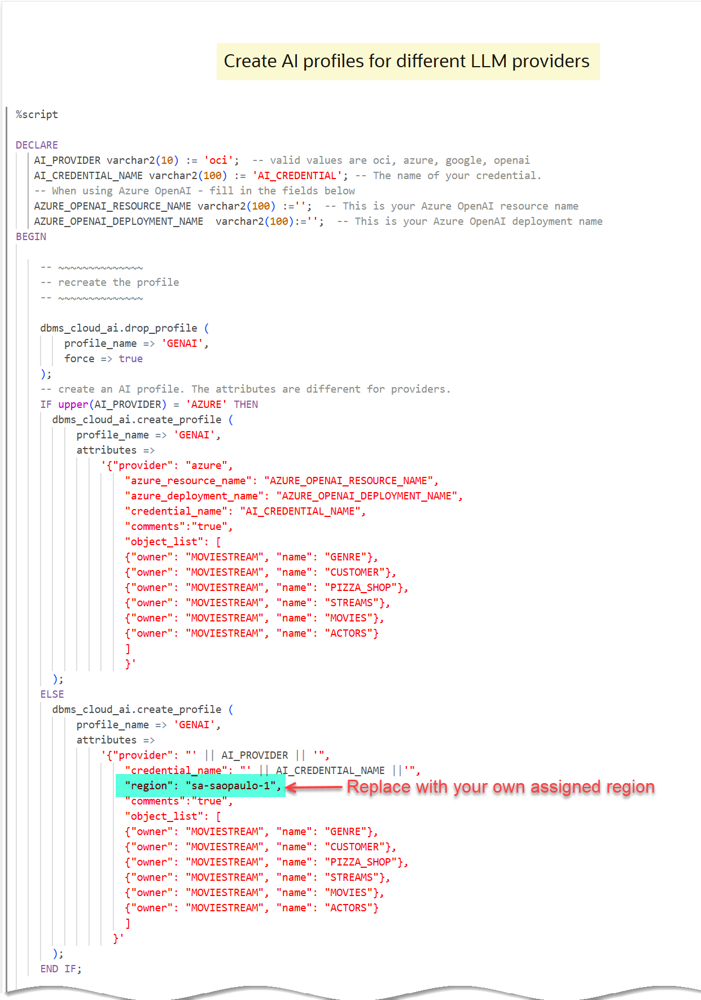
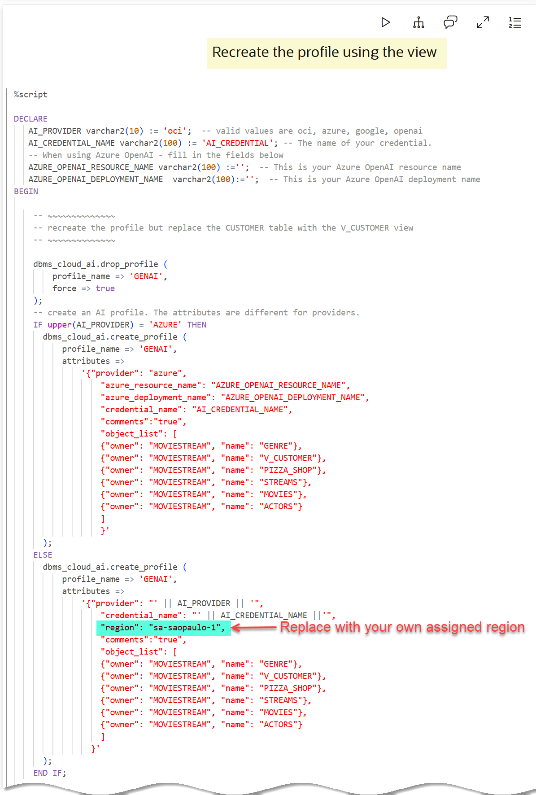
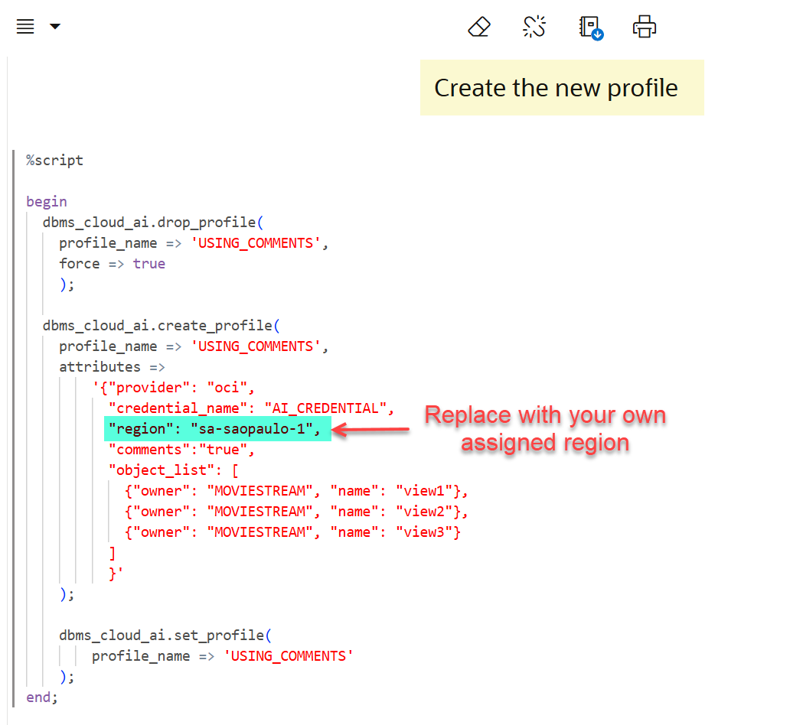

# Use Natural Language Queries with ADB Select AI

## Introduction

Autonomous Database makes it simple to query your data using natural language. The person asking the question doesn't need to know where the data is stored, its structure or how to combine it with other data to get results. All these tasks are handled by a large language model and Autonomous Database.

As you can see from the previous labs, Select AI makes it easy to build apps that take advantage of natural language queries. In this lab, you'll experiment with a demo app that was built using Oracle APEX. When you ran the scripts to set up your environment, the APEX demo application was also installed. The app is probably the easiest way to get answers about your business and general internet content. Simply ask a question! You can then explore the result, get an understanding of the generated SQL (and even update it if you like), and manage conversations.

Estimated Time: 15 minutes.

### Objectives

In this lab, you will:

* Create a credential that is used to sign LLM API requests
* Create a profile that describes your LLM provider and the metadata (schemas, tables, views, etc.) that can be used for natural language queries.
* Ask natural language questions using an **Select AI** extension
* Modify the configuration to improve natural language results

### Prerequisites

- This lab requires completion of the first two labs in the **Contents** menu on the left.

## Task 1: Overview of Important Concepts

Before diving into the OML notebook in this lab, let's review some of the important concepts that you should know.

### **Use AI profiles to access your LLM**

An AI profile captures the properties of your LLM provider plus the tables and views you want to enable for natural language queries. You can create multiple profiles (e.g. for different providers), although only one is active for a given session or a particular invocation.

### **Create an AI Profile**

You can have multiple profiles where each one is pointing to different models or enabling different tables and views.

>**Note:** In this workshop, we are using OCI Generative AI and the resource principal.

To get started, you'll need to create a profile using the **`DBMS_CLOUD_AI.CREATE_PROFILE`** PL/SQL package that describes your _LLM provider_ and _the metadata such as schemas, tables, views, and so on that can be used for natural language queries_. You can have multiple profiles where each one is pointing to different models. For additional information, see the [CREATE_PROFILE procedure](https://docs.oracle.com/en-us/iaas/autonomous-database-serverless/doc/dbms-cloud-ai-package.html#GUID-D51B04DE-233B-48A2-BBFA-3AAB18D8C35C) documentation.

_**Don't run the following code**_. This is for informational purpose in this task. In **Task 4** in this lab, you will import and run a Notebook that contains a paragraph that creates the following profile.

```
begin
    dbms_cloud_ai.drop_profile(
        profile_name => 'genai',
        force => true);
    dbms_cloud_ai.create_profile(
        profile_name => 'genai',
        attributes =>
        '{"provider": "oci",
        "credential_name": "AI_CREDENTIAL",
        "comments":"true",
        "object_list": [
        {"owner": "MOVIESTREAM", "name": "GENRE"},
        {"owner": "MOVIESTREAM", "name": "CUSTOMER"},
        {"owner": "MOVIESTREAM", "name": "PIZZA_SHOP"},
        {"owner": "MOVIESTREAM", "name": "STREAMS"},       
        {"owner": "MOVIESTREAM", "name": "MOVIES"},
        {"owner": "MOVIESTREAM", "name": "ACTORS"}
        ]
        }'
        );
end;
/
```

Since you can have multiple **Select AI** profiles, you need to pick the one to use for your session. Use the **`DBMS_CLOUD_AI.SET_PROFILE`** procedure to specify which profile to use as follows:

```
<copy>
BEGIN
    DBMS_CLOUD_AI.SET_PROFILE(profile_name => 'genai');
END;
/
</copy>
```

### **Ask Natural Language Questions**

You can now ask questions using **`SELECT AI`**. **`AI`** is a special keyword in the `SELECT` statement that tells Autonomous Database that the subsequent text will be either an action or the natural language question.

Here are the actions:

1. **`chat`**: Use for general AI chat.
2. **`runsql`** [default]: Use to ask a question and get a structured result.
3. **`narrate`**: Use to ask a question and get a conversational result.
4. **`showsql`**: Use to show the SQL code that was used to produce the result.

Let's look at a couple of examples:

1. **`Chat`** simply makes a request to the LLM provider using your prompt.

    ```
    SELECT AI chat
    What is Tom Hanks best known for
    ```

    **Result:**

    `Tom Hanks is best known for his acting career, particularly for his roles in popular films such as "Forrest Gump," "Saving Private Ryan," "Cast Away," "Apollo 13," and "Toy Story" (as the voice of Woody). He is widely regarded as one of the greatest actors of his generation and has won numerous awards, including two Academy Awards for Best Actor.`

2. The default for `SELECT AI` is `runsql`. This will run queries against your private data:

    ```
    SELECT AI
    What are total sales of tom hanks movies
    ```
    **Result:**

    `70,318.23`

 3. View the SQL code that is generated by the following question:

    ```
    SELECT AI showsql
    What are total sales of tom hanks movies
    ```
    **Result:**

    `SELECT SUM(sales_sample.list_price) AS total_sales
    FROM moviestream.sales_sample
    JOIN moviestream.movie ON sales_sample.movie_id = movie.movie_id
    WHERE movie.cast LIKE '%Tom Hanks%' `

    Notice that to answer the previous question, the sales data was joined to the movie table and a filter was applied to the CAST column.

    >**Note:** _LLMs are remarkable at inferring intent - and getting better all the time. But, they are not perfect! It is very important to verify the results._

    For example, let's say you ask the question "What are our total streams for Tom Hanks movies this month?". The LLM will interpret the question and produce SQL that will provide an answer.

    ```
    SELECT m.title AS movie_title, COUNT(s.views) AS total_streams
    FROM movie m
    JOIN sales_sample s ON m.movie_id = s.movie_id
    JOIN actors a ON m.movie_id = a.movie_id
    WHERE a.actor = 'Tom Hanks' AND EXTRACT(MONTH FROM s.day_id) = EXTRACT(MONTH FROM SYSDATE)
    GROUP BY m.title;
    ```

    

  We can see the total number of views for each movie where Tom Hanks was an actor; however, what if you expected movies that he also produced and directed? This may not be what you expected.

_**In summary, using LLMs infer a lot from human language. It's always good to verify your results.**_

## Task 2: Access Oracle Machine Learning (OML) Notebooks

You can import, create, and work with notebooks in Oracle Machine Learning Notebooks. You can access Oracle Machine Learning Notebooks from Autonomous Database.

>**Note:** You can run **`Select AI`** SQL queries from most tools; however, it is not yet supported by the **SQL Worksheet**.

In this task, you will access Oracle Machine Learning (OML) as the **`moviestream`** user.

1. At the bottom of your **Reservation Information** panel, click the **Machine Learning URL** link.

    

2. On the **Sign In** page, enter **`moviestream`** in the **USERNAME** field. In the **Reservation Information** panel, click the **Copy value** button next to the **ADB User Password** field, and then paste it in the **PASSWORD** field. Next, click **Sign In**.

    

    >**Note:** You can also launch OML from the **Database Actions | Launchpad** page. Click the **Development** tab, and then click the **Machine Learning** tab.

    The **Oracle Machine Learning** Home page is displayed. You can use this landing page to access tutorials, model creation, notebooks, and much more.

    

3. In the **Quick Actions** section, click the **Notebooks** icon. The **Notebooks** page is displayed.

    

## Task 3: Import a Notebook into OML

You can import a notebook from a local disk or from a remote location if you provide the URL. A notebook named **adb-speaks-human-notebook** contains all the steps for setting up the **Select AI** profile and then run natural language queries. In this task, you will first download the **`adb-speaks-human-notebook.dsnb`** OML notebook to your local machine, and then import this notebook into OML.

1. Click the button below to download the notebook:

    <a href="../notebook/adb-speaks-human-notebook-aiw2025.dsnb" class="tryit-button">Download notebook</a>

2. Click **Import**. The **Open** dialog box is displayed. Navigate to your local folder where you downloaded the OML notebook, and select the **`adb-speaks-human-notebook-aiw2025.dsnb`** notebook file. The file is displayed in the **File name** field. Next, click **Open**.

    

    If the import is successful, a notification is displayed and the **`adb-speaks-human-notebook-aiw2025`** notebook is displayed in the list of available notebooks.

    

3. Open the imported notebook. Click the notebook's name link. The notebook is displayed in the Notebook **Editor**. Read the paragraphs in this notebook.

     >**Note:** If a **User Action Required** message is displayed when you open the notebook, click **Allow Run**.

## Task 4: Review and Run the Imported Notebook

A notebook is comprised of paragraphs that use different languages: SQL, PL/SQL, Python, R, markdown and more. The **ADB Speaks Human-aiw2025** notebook is well-documented using markdown code. Examine the paragraphs in the notebook and then execute the code. Feel free to run different types of queries!

1. In this notebook, the code sections of all paragraphs in the notebook are displayed. We already ran all the markdown paragraphs and the results (outputs) are displayed. To show or hide the code sections in all the paragraphs, on the notebook's banner, click the **Show Code** icon. This is a toggle icon that you can use to show or hide the code in all paragraphs.

    

    For example, paragraph 1 uses the **`%md`** (Markdown) interpreter.

    

    In this notebook, the **`%md`** (Markdown) paragraphs provide useful information about the paragraphs. The **`%md`** Markdown interpreter generates static html from plain Markdown text. In this lab, you will review the code in each paragraph one at a time, run that paragraph, and review the results as desired. It is a good idea to hide the code of any .md paragraph.

2. By default, when you imported the notebook, the results (output) sections of the .md paragraphs were run and displayed. On the notebook banner, click the **Show Result/Hide Result** icon to show the output sections of the paragraphs where the output section is not shown by default.

    

    The output section of each paragraph is displayed.

3. Hide the code sections for the **`%md`** paragraphs. Click the **Visibility** icon in a paragraph, and then select the checked **Code** checkbox.

    

    The code sections are hidden. It is good practice to hide the code section of a **`%md`** paragraph since you are only interested in looking at the formatted output.

4. _**Important:** Before you can run this notebook, you'll have to scroll down the notebook and make changes to the following three paragraphs if the **Generative AI Endpoint Region** that is assigned to your Sandbox reservation is not **Brazil East (Sao Paulo) (sa-saopaulo-1)** as in our example:_

    

    - **Create AI profiles for different LLM providers**  
    
  
    - **Recreate the profile using the view**    
    

    - **Create the new profile**    
    

5. To run a paragraph, click the **Run Paragraph** icon for the paragraph.

    

    >**Note:** If the status of one or more paragraphs shows **ERROR**, reset your notebook connection using the **Invalidate Session** icon in the banner, and then re-run the notebook.

    

6. Examine, run, and review the output of the remaining paragraphs, as desired. To run the entire notebook, click the **Run Paragraphs** icon on the notebook banner. A **Run all paragraphs** confirmation message box is displayed. Click **Confirm**.

  

The results of the code execution is displayed under the paragraph code. For query result sets, you can view the data as a table or a variety of chart types.

You may now proceed to the next lab.

## Learn More

* [OML Notebooks](https://docs.oracle.com/en/database/oracle/machine-learning/oml-notebooks/index.html)
* [Using Oracle Autonomous Database Serverless](https://docs.oracle.com/en/cloud/paas/autonomous-database/adbsa/index.html)
* [How to help AI models generate better natural language queries](https://blogs.oracle.com/datawarehousing/post/how-to-help-ai-models-generate-better-natural-language-queries-in-autonomous-database)

## Acknowledgements

* **Authors:**
    * Marty Gubar (Retired), Product Management
    * Lauran K. Serhal, Consulting User Assistance Developer
* **Contributors:** 
    * Michelle Malcher, Director, Product Management  
    * Marcos Arancibia, Senior Principal Product Manager, ADB-S
* **Last Updated By/Date:** Lauran K. Serhal, September 2025

Data about movies in this workshop were sourced from **Wikipedia**.

Copyright (c) 2025 Oracle Corporation.

Permission is granted to copy, distribute and/or modify this document
under the terms of the GNU Free Documentation License, Version 1.3
or any later version published by the Free Software Foundation;
with no Invariant Sections, no Front-Cover Texts, and no Back-Cover Texts.
A copy of the license is included in the section entitled [GNU Free Documentation License](https://oracle-livelabs.github.io/adb/shared/adb-15-minutes/introduction/files/gnu-free-documentation-license.txt)
