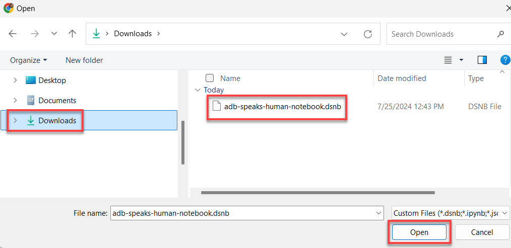
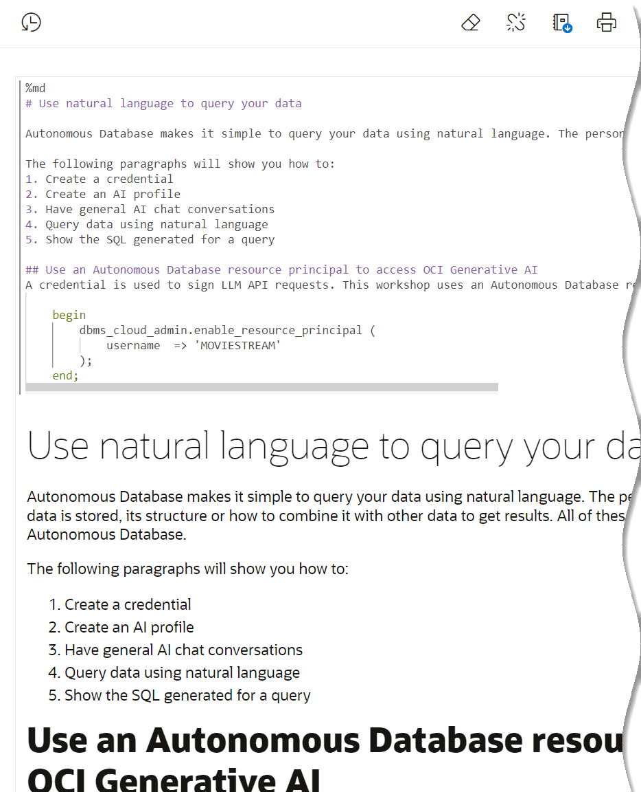
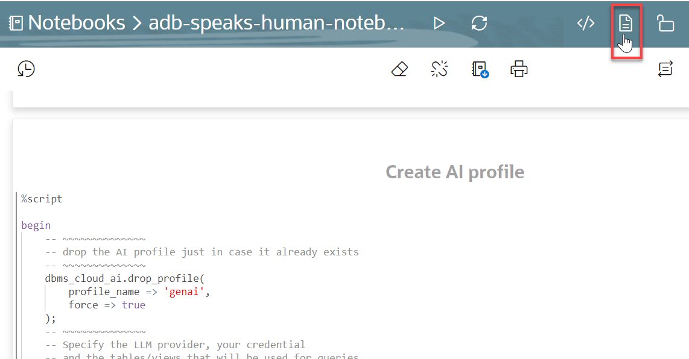
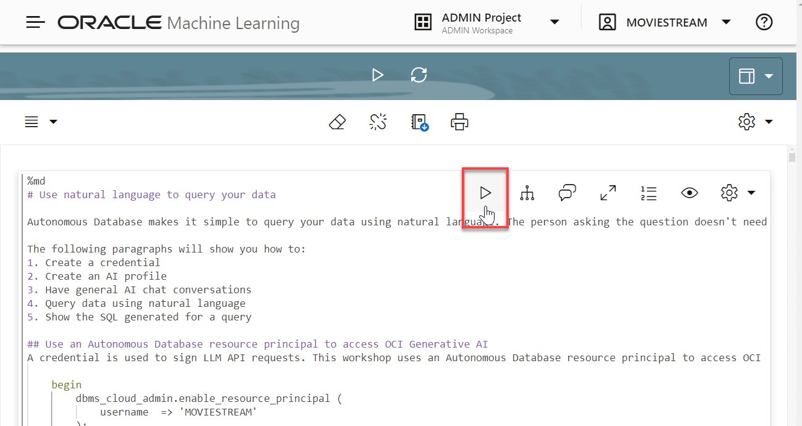

# Use Natural Language Queries with ADB Select AI

## Introduction

Autonomous Database makes it simple to query your data using natural language. The person asking the question doesn't need to know where the data is stored, its structure or how to combine it with other data to get results. All of these tasks are handled by a large language model and Autonomous Database.

In this lab, you will use an Oracle Machine Learning (OML) notebook to learn how to ask natural language queries with Autonomous Database. Although there are many SQL tools that you can use, we are using the notebook because it's a great way to illustrate the examples.

Estimated Time: 15 minutes.

### Objectives

In this lab, you will:

* Create a credential that is used to sign LLM API requests
* Create a profile that describes your LLM provider and the metadata (schemas, tables, views, etc.) that can be used for natural language queries.
* Ask natural language questions using an **Select AI** extension
* Modify the configuration to improve natural language results

### Prerequisites

- This lab requires completion of the first two labs in the **Contents** menu on the left.

## Task 1: Overview of Important Concepts

Before diving into the OML Notebook in this lab, let's review some of the important concepts that you should know.

### **Use AI profiles to access your LLM**

Profiles capture the properties of your LLM provider plus the tables and views you want to enable for natural language queries. You can create multiple profiles (e.g. for different providers), although only one is active for a given session.

### **Create an AI Profile**

You can have multiple profiles where each one is pointing to different models or enabling different tables and views.

To get started, you'll need to do the following:

* Create a credential that is used to sign LLM API requests using the **`DBMS_CLOUD.CREATE_CREDENTIAL`** PL/SQL package
* Create a profile using the **`DBMS_CLOUD_AI.CREATE_PROFILE`** PL/SQL package that describes your LLM provider and the metadata such as schemas, tables, views, and so on that can be used for natural language queries. You can have multiple profiles where each one is pointing to different models.
* Set up the profile for your session. Because we're accessing a single LLM, create a **`LOGON`** trigger that sets the profile for your session.

### **Ask Natural Language Questions**

You can now ask questions using **`SELECT AI`**. **AI** is a special keyword in the `SELECT` statement that tells Autonomous Database that the subsequent text will be either an action or the natural language question.

Here are the actions:

1. **`chat`**: Use for general AI chat.
2. **`runsql`** [default]: Use to ask a question and get a structured result.
3. **`narrate`**: Use to ask a question and get a conversational result.
4. **`showsql`**: Use to show the SQL code that was used to produce the result.

Let's look at a couple of examples:

1. **`Chat`** simply makes a request to the LLM provider using your prompt.

    ```
    SELECT AI chat
    What is Tom Hanks best known for
    ```

    **Result:**

    `Tom Hanks is best known for his acting career, particularly for his roles in popular films such as "Forrest Gump," "Saving Private Ryan," "Cast Away," "Apollo 13," and "Toy Story" (as the voice of Woody). He is widely regarded as one of the greatest actors of his generation and has won numerous awards, including two Academy Awards for Best Actor.`

2. The default for SELECT AI is `runsql`. This will run queries against your private data:

    ```
    SELECT AI
    What are total sales of tom hanks movies
    ```
    **Result:**

    `91,893.77`

 3. View the SQL code that is generated by the following question:

    ```
    SELECT AI showsql
    What are total sales of tom hanks movies
    ```
    **Result:**

    `SELECT SUM(sales_sample.list_price) AS total_sales
    FROM moviestream.sales_sample
    JOIN moviestream.movie ON sales_sample.movie_id = movie.movie_id
    WHERE movie.cast LIKE '%Tom Hanks%' `

    Notice that in order to answer the previous question, the sales data was joined to the movie table and a filter was applied to the CAST column.

    >**Note:** _LLMs are remarkable at inferring intent - and getting better all the time. But, they are not perfect! It is very important to verify the results._

    For example, let's say you ask the question "What are our total streams for Tom Hanks movies this month?". The LLM will interpret the question and produce SQL that will provide an answer.

    ```
    SELECT m.title AS movie_title, COUNT(s.views) AS total_streams
    FROM movie m
    JOIN sales_sample s ON m.movie_id = s.movie_id
    JOIN actors a ON m.movie_id = a.movie_id
    WHERE a.actor = 'Tom Hanks' AND EXTRACT(MONTH FROM s.day_id) = EXTRACT(MONTH FROM SYSDATE)
    GROUP BY m.title;
    ```

    

  We can see the total number of views for each movie where Tom Hanks was an actor; however, what if you expected movies that he also produced and directed? This may not be what you expected.

_**In summary, using LLMs infer a lot from human language. It's always good to verify your results.**_

## Task 2: Access Oracle Machine Learning (OML) Notebooks

You can import, create, and work with notebooks in Oracle Machine Learning Notebooks. You can access Oracle Machine Learning Notebooks from Autonomous Database.

If you already have the **SQL| Oracle Database Actions** browser tab open from the previous lab, click the **Database Actions | SQL banner** to display the Database **Actions | Launchpad** Home page. In the **Development** section, click the **Oracle Machine Learning** card to display the **Sign In** page. Continue with step **step 7** below.

   

If you are no longer logged in to your Cloud account, start with **step 1** below.

1. Log in to the **Oracle Cloud Console** as the Cloud Administrator.

    >**Note:** To access **Database Actions** from the Console, you must log in as an **`ADMIN`** user.

2. On the **Sign In** page, select your tenancy, enter your username and password, and then click **Sign In**. The **Oracle Cloud Console** Home page is displayed.

3. Open the **Navigation** menu and click **Oracle Database**. Under **Oracle Database**, click **Autonomous Database**.

4. On the **Autonomous Databases** page, make sure that the **`your-compartment`** is selected in the **Compartment** drop-down list in the **List Scope** section, and then click your **`MovieStreamWorkshop`** ADB that you provisioned earlier.

5. On the **Autonomous Database Details** page, click the **Database Actions** drop-down list, and then select **View all database actions** from the list.

   

6. On the **Database Actions | Launchpad** page, in the **Development** section, click the **ORACLE MACHINE LEARNING** card.

    

7. On the **SIGN IN** page, enter **`moviestream`** in the **Username** field, the **`adb_user_password`** that you saved in **Lab 1 > Task 2 Step 6** in the **Password** field, and then click **Sign In**.

    

    The **Oracle Machine Learning** Home page is displayed. You can use this landing page to access tutorials, model creation, notebooks, and much more.

    

8. In the **Quick Actions** section, click the **Notebooks** button. The **Notebooks** page is displayed.

    >**Note:** In this workshop, we are using the Early Adopter version of the notebook.

    

## Task 3: Import a Notebook into OML

You can import a notebook from a local disk or from a remote location if you provide the URL. A notebook named **ADB Speaks Human** contains all the steps for setting up the **Select AI** profile and then run natural language queries. In this task, you will first download the **ADB Speaks Human** OML notebook to your local machine, and then import this notebook into OML.

1. Click the following link to download the [ADB Speaks Human.dsnb](../notebook/ADB%20Speaks%20Human.dsnb) OML Notebook.

2. Click **Go to OML Notebooks EA**. The **OML Notebooks EA (Early Adopter)** page is displayed.

    

3. Click **Import**. The **Open** dialog box is displayed. Navigate to your local folder where you downloaded the OML notebook, and select the **`ADB Speaks Human.dsnb`** notebook file. The file is displayed in the **File name** field. Make sure that the **Custom Files (*.dsnb;\*.ipynb;\*.json;\*.zpln)** type is selected in the second drop-down field, and then click **Open**.

    

    If the import is successful, a notification is displayed and the **`ADB Speaks Human`** notebook is displayed in the list of available notebooks.

    

5. Open the imported notebook. Click the **ADB Speaks Human** notebook link. The notebook is displayed in the Notebook **Editor**.

    

## Task 4: Review and Run the Imported Notebook

A notebook is comprised of paragraphs that use different languages: SQL, PL/SQL, Python, R, markdown and more. The **ADB Speaks Human** notebook is well-documented using markdown code. Examine the paragraphs in the notebook and then execute the code. Feel free to run different types of queries!

1. Display the code sections of all paragraphs in the notebook. On the notebook banner, the **Show Code** icon. This is a toggle icon that you can use to show or hide the code in all paragraphs.

    

    The code section of each paragraph is displayed. For example, paragraph 1 uses the **`%md`** (Markdown) interpreter.

    

    In this notebook, the **`%md`** (Markdown) paragraphs provide useful information about the paragraphs. The **`%md`** Markdown interpreter generates static html from plain Markdown text. In this lab, you will review the code in each paragraph one at a time, run that paragraph, and review the results as desired.

2. Display the result (output) sections of all paragraphs in the notebook. On the notebook banner, click the **Show Result/Hide Result** icon to show the output sections of the paragraphs where the output section is not shown by default.

    

    The output section of each paragraph is displayed.

3. Hide the code sections for the any **`%md`** paragraphs. Click **Visibility** icon in a paragraph, and then select the checked **Code** checkbox.

    

    The code sections are hidden. It is a good practice to hide the code section of a **`%md`** paragraph since you are only interested in looking at the formatted output.

4. If you plan on running the notebook, you must update the password value place holder, **`your-LLM-secret-key-goes-here`**, in the **Create credential and AI Profile** with your own secret key that you created in **Lab 1 > Task 3**.

    

5. To run a paragraph, click the **Run Paragraph** icon for the paragraph.

    

    The status of the paragraph goes from `READY` to `PENDING` to `RUNNING` to `FINISHED`.

    >**Note:** If the status of one or more paragraphs shows **ERROR**, reset your notebook connection as follows: Click the **Navigation** menu on the Notebook banner, and then select **Notebook Sessions**. On the **Notebook Sessions** page, select your notebook, and then click **Stop**. Next, re-run the notebook.

6. Examine, run, and review the output of the remaining paragraphs, as desired. To run the entire notebook, click the **Run Paragraphs** icon on the notebook banner. A **Run all** confirmation message box is displayed. Click **Confirm**.

  

The results of the code execution is displayed under the paragraph code. For query result sets, you can view the data as a table or a variety of chart types.

## Learn More

* [OML Notebooks](https://docs.oracle.com/en/database/oracle/machine-learning/oml-notebooks/index.html)
* [Using Oracle Autonomous Database Serverless](https://docs.oracle.com/en/cloud/paas/autonomous-database/adbsa/index.html)

## Acknowledgements

* **Author** - Marty Gubar, Product Management
* **Contributors** -  Lauran K. Serhal, Consulting User Assistance Developer
* **Last Updated By/Date** - Lauran K. Serhal, Consulting User Assistance Developer, September 2023

Data about movies in this workshop were sourced from **Wikipedia**.

Copyright (C)  Oracle Corporation.

Permission is granted to copy, distribute and/or modify this document
under the terms of the GNU Free Documentation License, Version 1.3
or any later version published by the Free Software Foundation;
with no Invariant Sections, no Front-Cover Texts, and no Back-Cover Texts.
A copy of the license is included in the section entitled [GNU Free Documentation License](files/gnu-free-documentation-license.txt)
