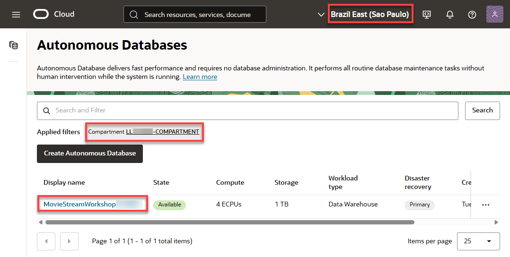
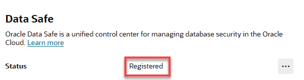
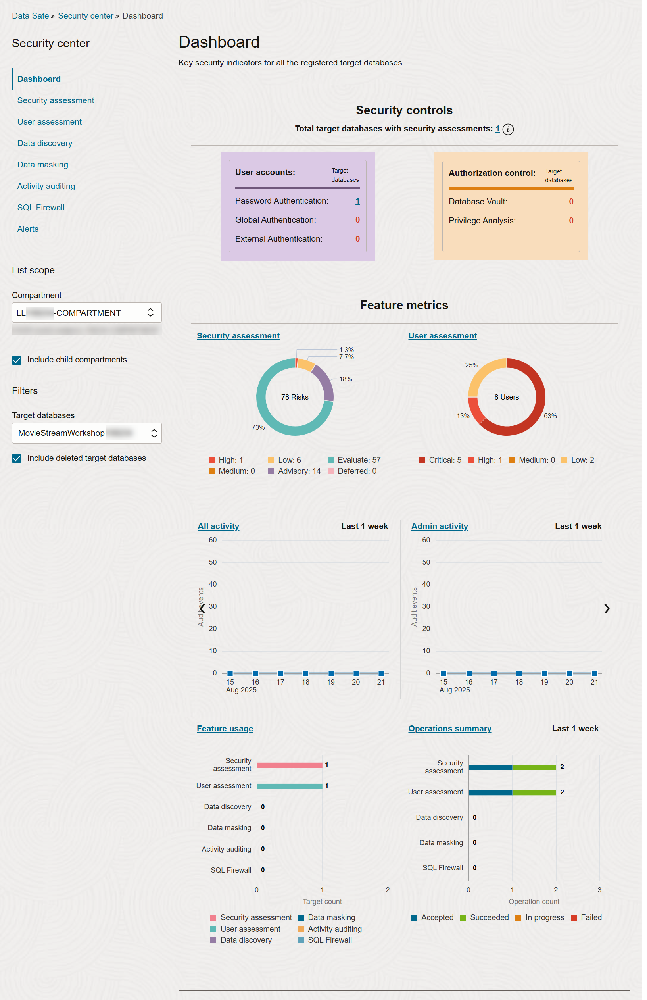

# Register Your Provisioned Autonomous Database Instance With Data Safe 

## Introduction

In this lab, You will navigate to your Sandbox provisioned Autonomous Database instance.

Estimated Time: 5 minutes

### Objectives

- Navigate to your Sandbox provisioned Autonomous Database instance

## Task 1: Navigate to your Autonomous Database Instance

1. From the Console, open the **Navigation** menu.

    

2.  Click **Oracle Database**, and then click **Autonomous Data**.

    

3. The **Autonomous Databases** page is displayed. Initially, the root compartment is selected and as a result, a **Couldn't load data** error is displayed. 

    

4. Click the **Compartment** field, and then select select your assigned compartment from the **Reservation Information** panel. 

    

    The Autonomous Database that was provisioned by the stack is displayed.

    

## Task 2: Register Your Autonomous Database Instance with Data Safe

To use a database with Oracle Data Safe, you first need to register it with Oracle Data Safe. A registered database is referred to as a _target database_ in Oracle Data Safe.

You have three options for registering your Autonomous Database:
- Use the **Register** button on the **Autonomous Databases** page (one-click method with no interaction).
- Use the Autonomous Databases wizard on the **Overview** page for the Oracle Data Safe service (guided method with customization options).
- Manually register your target database from the **Registered Targets** page (advanced method without guidance).

1. On the **Autonomous Databases** page, click your database display name link. 

    Your provisioned Autonomous Database details page is displayed. 
    
2. Scroll-down the page to the **Data Safe** section. 

    

    The current status of the target database is **Not registered**.

3. Click **Register**. A **Register database with Data Safe** confirmation message box is displayed. Click **Confirm**.

4. Wait for the target database status to change to **Registered**. This indicates it is currently registered with Oracle Data Safe.

    

5. Click the **Actions** icon (ellipsis), and then select **View** from the context menu.

    

6. The **Target database information** page is displayed. A target database with an **Active** status means that it is currently registered with Oracle Data Safe. Next, review the information and options provided on the page.

    - You can view/edit the target database name and description.
    - You can view the Oracle Cloud Identifier (OCID), the compartment name to where the target database is registered, when the target database was registered and updated, the database type (Autonomous Database), and the connection protocol (TLS). The information varies depending on the target database type.
    - You have options to edit connection details (for example, choose a connectivity option), move the target database to another compartment, deregister the target database, and add tags.

        

## Task 3: Access Oracle Data Safe and View your List of Registered Target Databases

1. In the breadcrumb at the top of the page, click **Target databases**.

2. Under **List scope**, make sure your assigned compartment is selected. Your registered target database is listed in the **Target databases** section on the page.

    - A target database with an **Active** status means that it is currently registered with Oracle Data Safe.
    - A target database with a **Deleted** status means that it is no longer registered with Oracle Data Safe. The listing is removed 45 days after the target database is deregistered.

    

## Task 4: Explore the Security Center

1. In the breadcrumbs at the top of the page, click **Data Safe**. The **Overview** page is displayed.

2. In the **Security center** section on the left, click **Dashboard** and review the dashboard. Scroll down to view the security controls and feature metrics (charts). Make sure your assigned compartment is selected in the **List scope** section. 

    

3. From the **Target databases** drop-down list, select your target database so that the data in the dashboard pertains to your target database only.

    

4. The **Security controls** and **Feature metrics** sections are displayed on the Dashboard.
    - In the Security center, you can access all the Oracle Data Safe features, including the dashboard, Security Assessment, User Assessment, Data Discovery, Data Masking, Activity Auditing, SQL Firewall, and Alerts.
    - When you register a target database, Oracle Data Safe automatically creates a security assessment and user assessment for you. That's why the **Security assessment**, **User assessment**, **Feature usage**, and **Operations summary** charts in the dashboard already have data.
    - During registration, Oracle Data Safe also discovers audit trails on your target database. That's why the **Audit trails** chart in the dashboard shows one audit trail with the status **In transition** for your Autonomous Database. Later you start this audit trail to collect audit data into Oracle Data Safe.

    

You may now **proceed to the next lab**.

## Learn More

* [Using Oracle Autonomous Database Serverless](https://docs.oracle.com/en/cloud/paas/autonomous-database/adbsa/index.html)
* [Oracle Cloud Infrastructure](https://docs.cloud.oracle.com/en-us/iaas/Content/GSG/Concepts/baremetalintro.htm)
* [OpenAI API Get Started](https://platform.openai.com/docs/introduction)

## Acknowledgements

* **Authors:** 
    - Lauran K. Serhal, Consulting User Assistance Developer
    - Jody Glover, Consulting User Assistance Developer, Database Development
* **Last Updated By/Date:** Lauran K. Serhal, August 2025

Data about movies in this workshop were sourced from **Wikipedia**.

Copyright (c) 2025 Oracle Corporation.

Permission is granted to copy, distribute and/or modify this document
under the terms of the GNU Free Documentation License, Version 1.3
or any later version published by the Free Software Foundation;
with no Invariant Sections, no Front-Cover Texts, and no Back-Cover Texts.
A copy of the license is included in the section entitled [GNU Free Documentation License](https://oracle-livelabs.github.io/adb/shared/adb-15-minutes/introduction/files/gnu-free-documentation-license.txt)
