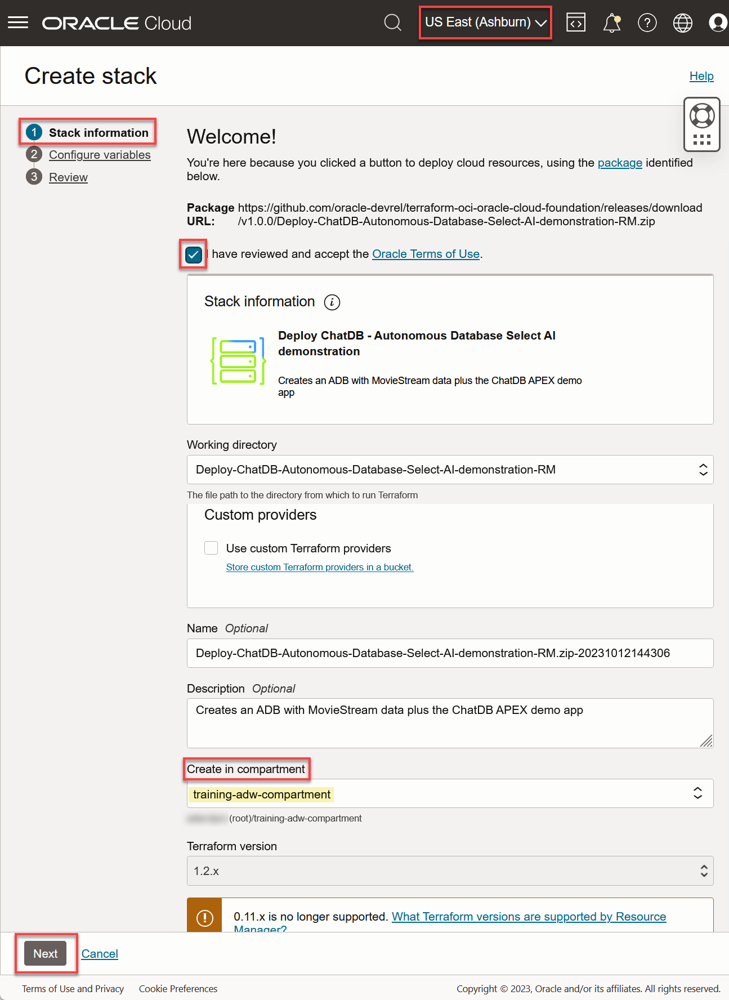
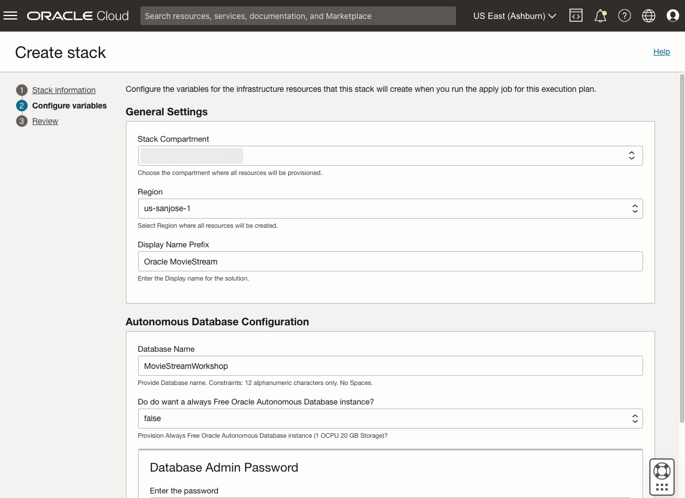
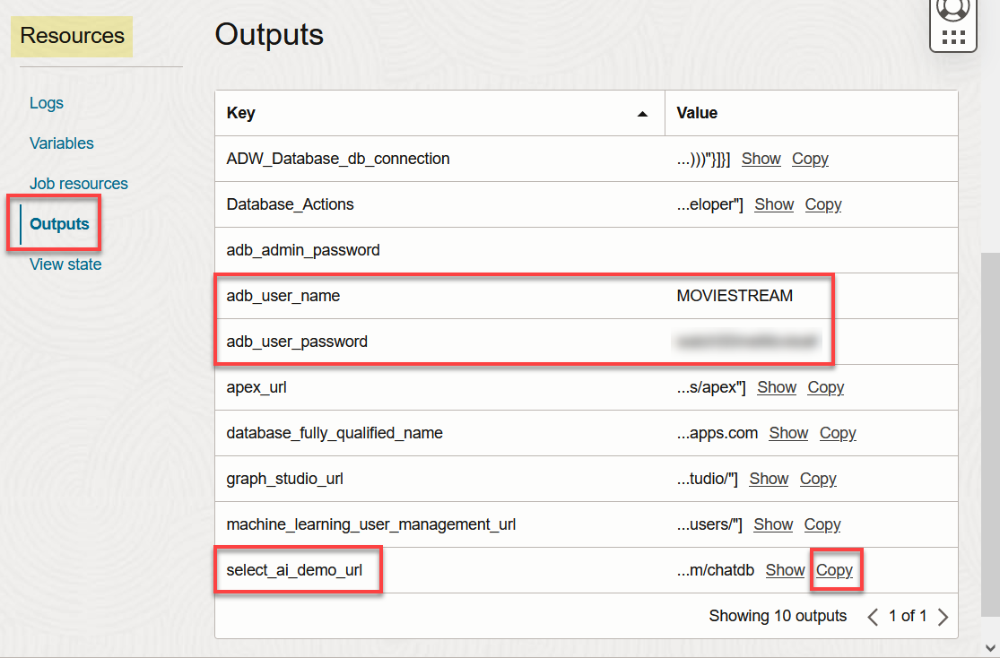

# Setup Environment
## Introduction

This workshop will focus on learning how to setup and use generative AI to query your data using natural language - both from a SQL prompt and an application. To fast track to using AI SQL, you will deploy an environment that is ready to go. The terraform script will:

* Provision your Autonomous Database
* Create a user
* Create tables and views
* Load data from object storage

The automation uses a predefined OCI Cloud Stack Template that contains all the resources you need. You'll use OCI Resource Manager to deploy this template and make your environment available in just a few minutes. You can use Resource Manager for your own projects - [check out the documentation](https://docs.oracle.com/en-us/iaas/Content/ResourceManager/Concepts/resourcemanager.htm) for more details.

Estimated Time: 5 minutes.

### Objectives

Learn how to
* Run the stack to perform all the prerequisites required to analyze data. 

## Task 1: Create OCI compartment

## Task 2: Provision ADB and load data using an OCI Cloud Stack

The following steps will set up everything required for the workshop:

1. [Create and install stack](https://cloud.oracle.com/resourcemanager/stacks/create?region=home&zipUrl=https://github.com/oracle-devrel/terraform-oci-oracle-cloud-foundation/releases/download/v1.0.0/Deploy-Autonomous-Database-and-the-MovieStream-data-sets-for-Oracle-LiveLabs-RM.zip&zipUrlVariables={&quot;tag&quot;:&quot;gen-ai&quot;,&quot;run\_post\_load_procedures&quot;:&quot;true&quot;,&quot;db\_name&quot;:&quot;myquickstart&quot;}) using the OCI Resource Manager.

2. You will be directed to the page below: 

  

    Check **I have reviewed and accept the Oracle Terms of Use** box and choose your **compartment**. Leave the default values for the rest of the fields. 
    
    Click **Next**.

3. Select the target **compartment** and **region** for your Autonomous Database. 

    

    Click **Next**. 

  **Note:** If clicking **Next** does not take you to the next page, check the **Region** field. It may have been reset.

4. It's time to create and apply your stack. Ensure **Run apply** is checked and then click **Create**.

    

5. You will be taken to a Job Details page with an initial status shown in orange. The icon will become green once the job has successfully completed. This will take 5 to 10 minutes.

    

6. Go to the Job Details **Resources -> Outputs** section. Make note of the user and password details. You will need this information later:
    * adb\_admin\_password
    * adb\_user\_name
    * adb\_user\_password

    

## Task 3: Sign up for access to a large language model (LLM)
Autonomous Database uses a large language model (LLM) to translate natural language to SQL. You can choose the LLM to use for your application, allowing you to leverage general models (e.g. Cohere Command, OpenAI GPT-3.5, etc.) as well as industry specific models or custom models that you may have deployed in your tenancy. 

Each LLM will have its own process for enabling access to its API. This workshop will use the OpenAI GPT-3.5 model and requires that you sign up for a paid developer account. The cost for using OpenAI for this workshop is minimal (less than $1).

To sign up for an OpenAI account:

1. [Create your OpenAI account](https://platform.openai.com/signup?launch)
    * Ensure that you create a paid account
    * API calls will fail when using a free account

2. [Create a new API secret](https://platform.openai.com/account/api-keys). This secret is used to sign requests to OpenAI's API. You will need it when creating a credential later.

    
  
3. Save the secret; you will be using it later when setting up your connection to the service. 

  **NOTE:** The secret is only displayed once. You will need to create a new secret if you lose this value.
  

## Acknowledgements
  * **Author** - Marty Gubar, Product Management
  * **Contributors** -  Marty Gubar, Product Management
* **Last Updated By/Date** - Marty Gubar, Product Management, August 2023