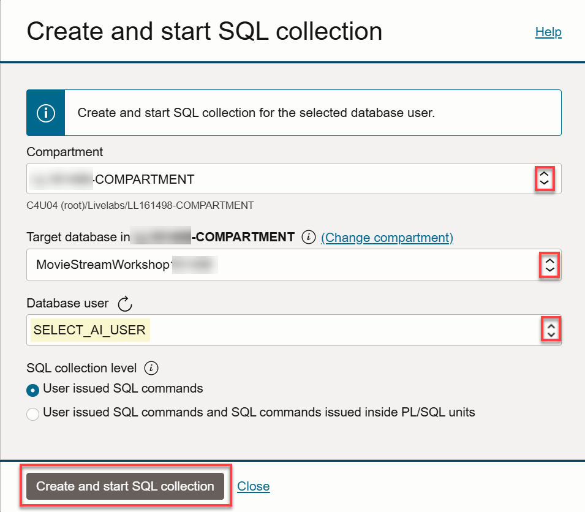
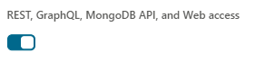
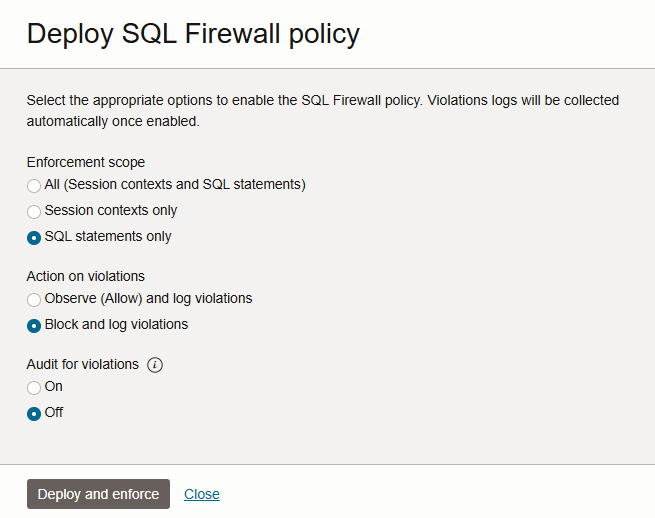
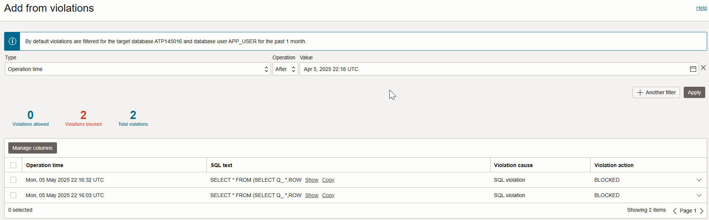
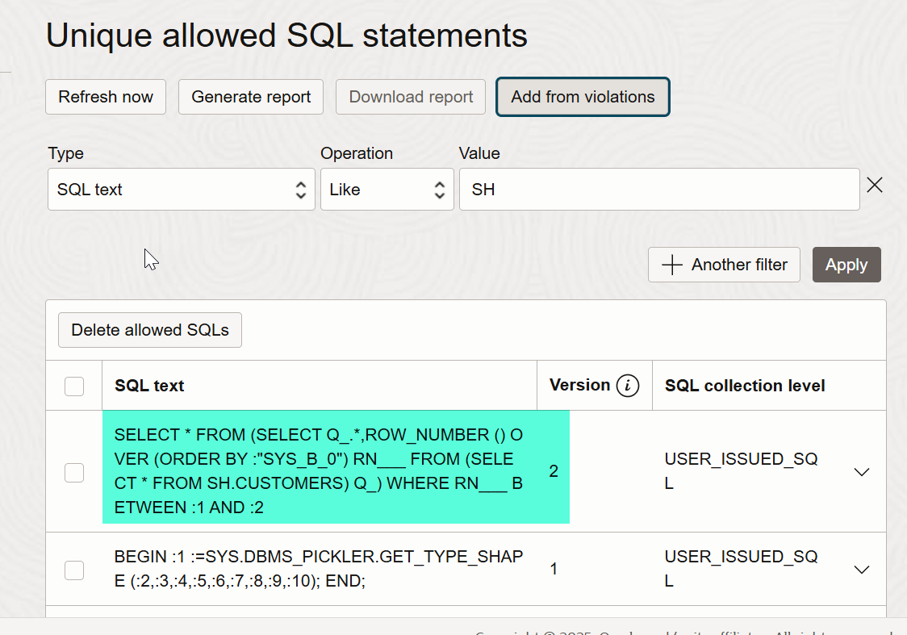

# Create and enforce a SQL Firewall policy in Data Safe

## Introduction

In this lab, you create and enforce a SQL Firewall policy for the `APP_USER` database user. **Oracle SQL Firewall** is a robust security feature built into the Oracle Database 23ai, designed to provide real-time protection against common database attacks by restricting access to only authorized SQL statements or connections.

You begin by using Data Safe and Database Actions to create a collection of allowed SQL statements for `APP_USER`. This collection is referred to as the *allow-list*. Next, you test that `APP_USER` cannot run any other statement on the target database.  Lastly, you add a SQL statement from the violation log to the allow-list.

Estimated Lab Time: 20 minutes

### Objectives

In this lab, you will:

- Enable SQL Firewall in Data Safe
- Create a SQL collection for APP_USER
- Deploy the SQL Firewall policy for APP_USER
- Test the SQL Firewall policy
- Add a SQL statement from the violation log to the allow-list


### Prerequisites

This lab assumes you have:

- Obtained an Oracle Cloud account and signed in to the Oracle Cloud Infrastructure Console at `https://cloud.oracle.com`
- Prepared your environment
- A target database that is Oracle Database 23ai

## Task 1: Enable SQL Firewall in Data Safe

1. Make sure you are on the **Data Safe | Oracle Cloud Infrastructure** browser tab.

2. Under **Security center** in Data Safe, click **SQL Firewall**.

3. Under **List Scope** on the left, select your compartment.

4. On the **Target summary** tab, click the name of your target database. The SQL Firewall status should currently show as **Disabled**.

5. Click **Refresh**. 

6. Click **Enable** and wait until the status changes to **ACTIVE**.


## Task 2: Create a SQL collection for APP_USER

1. Under **SQL collections**, click **Create and start SQL collection**.

    The **Create and start SQL collection** dialog box is displayed.

2. From the **Database user** drop-down list, select **APP_USER**.

    If `APP_USER` is not listed in the **Database user** drop-down list, click the **Refresh** icon, and then select the user.

3. Leave **User issued SQL commands** selected.

4. Click **Create and start SQL collection**.

   

5. Wait for the status to change to **COLLECTING**.

    SQL Firewall is now set to capture SQL statements issued by the `APP_USER` database user.

6. From the navigation menu, select **Oracle Database**, and then **Autonomous Database**.

7. Click the name of your database.

8. On the **Autonomous Database details** page, from the **Database actions** menu, select **Database Users**.

9. On the **APP_USER** tile, click the three dots, and select **Edit**.

10. In the **Password** and **Confirm Password** boxes, enter a database password for `APP_USER`.

    Note: The password must be 12 to 30 characters and contain at least one uppercase letter, one lowercase letter, and one number. It cannot contain the double quote (") character or the username "admin".

11. At the bottom, enable **Web Access**.

   

12. Click **Apply Changes**.

13. Click the three dots again, and select **Enable REST**.

14. To the right of the URL in the `APP_USER` tile, click the **Open in new tab** icon.

    The sign-in page for Database Actions is opened in a new tab.

15. Sign in as `APP_USER` and enter the password.

16. Click the **SQL** tab.

17. Close any tip dialog boxes.

18. On the worksheet, enter the following, and then click the **Run Statement** button:

    ```text
    <copy>SELECT FIRST_NAME, LAST_NAME, EMPLOYEE_ID FROM HCM1.EMPLOYEES;
    </copy>
    ```

19. On the worksheet, enter the following, and then click the **Run Statement** button:

    ```text
    <copy>SELECT LOCATION_ID, STREET_ADDRESS, CITY FROM HCM1.LOCATIONS ORDER BY LOCATION_ID;
    </copy>
    ```

20. On the worksheet, enter the following, and then click the **Run Statement** button:

    ```text
    <copy>SELECT LOCATION_ID, CITY FROM HCM1.LOCATIONS WHERE LOCATION_ID='1000';
    </copy>
    ```

21. Return to the **Autonomous Database | Oracle Cloud Infrastructure** tab.

22. From the navigation menu, select **Oracle Database**, and then **SQL Firewall** under **Data Safe - Database Security**.

23. Click the name of your target database.

24. Click the SQL collection for `APP_USER`. 

25. To stop the SQL workload capture of allowed SQL statements, click **Stop**, and wait for the status to change to **COMPLETED**.

    The SQL collection is created for `APP_USER`.


## Task 3: Deploy the SQL Firewall policy for APP_USER

1. On the **SQL collection details** page, click **Generate firewall policy**.

    A firewall policy is created, but not yet enabled (deployed). Notice the status of the policy is set to **Disabled**.
    
2. Scroll down and review the collection of SQL statements on the allow-list. 

    Note: Database Actions adds additional SQL statements to the allow-list automatically. The SQL statements that you just collected also have additional code inserted, which you can ignore.

3. To deploy the SQL Firewall policy for the `APP_USER` user, click **Deploy and enforce**.

    The **Deploy SQL Firewall policy** dialog box is displayed.

4. Select the following options:

    - Enforcement scope: **SQL statements only**
    - Action on violations: **Block and log violations**
    - Audit for violations: **Off**. Note: If you select **On**, the audit trail for your target database must be started.

    *Be sure to select these options carefully!*
    
5. Click **Deploy and enforce**.

   

6. Notice that the status of the SQL Firewall policy changes to **Enabled**. 

   

7. To filter the allow-list, under **Unique allowed SQL statements**, click **+ Add filter**, set **SQL text Like HCM1**, and click **Apply**.

    The SQL statements that you collected earlier are listed.

   

## Task 4: Test the SQL Firewall policy

When you run the SQL statements in this task, use the **Run Statement** button in Database Actions because that is how you previously ran the queries when you created the SQL collection. If you use the **Run Script** button instead, SQL Firewall will block the results.

1. Return to Database Actions as `APP_USER` and clear the worksheet.

2. Try running one of the SQL statements on the allow-list, for example:

    ```text
    <copy>SELECT FIRST_NAME, LAST_NAME, EMPLOYEE_ID FROM HCM1.EMPLOYEES;
    </copy>
    ```
 
    The query should return data.

3. Clear the worksheet and try running a SQL statement that isn't on the allow-list, for example:

    ```text
    <copy>SELECT * FROM HCM1.EMPLOYEES;
    </copy>
    ```

    You should recieve an error message: ORA-47605: SQL Firewall violation.

4. Clear the worksheet and try running a SQL statement on the allow-list with a modified `WHERE` clause, for example:

    ```text
    <copy>
    SELECT LOCATION_ID, CITY FROM HCM1.LOCATIONS WHERE LOCATION_ID='1300';
    </copy>
    ```
    The query should return data. 

5. Clear the worksheet and try running the SQL statement on the allow-list with its columns in a different order, for example:

    ```text
    <copy>SELECT LAST_NAME, FIRST_NAME, EMPLOYEE_ID FROM HCM1.EMPLOYEES;
    </copy>
    ```
    You should receive an error message: ORA-47605: SQL Firewall violation.


## Task 5: Add a SQL statement from the violation log to the allow-list
    
1. Return to the **SQL Firewall | Oracle Cloud Infrastructure** tab. You may need to wait a couple of minutes for the violations to show up.

2. Under **Unique allowed SQL statements**, click **Add from violations**.

    The **Add from violations** page is displayed showing you Autonomous Database SQL queries.

    

3. Expand the violations and review.

4. Select the check box for the second SQL violation: `SELECT * FROM HCM1.EMPLOYEES`.

5. Click **Add violations**. 

    You are returned to the **Firewall policy details** page.

6. Under **Unique allowed SQL statements**, notice that your selected SQL statement is now listed at the top.

    

7. Return to **Database Actions** as `APP_USER` and run the newly-allowed SQL statement to test that it will run successfully.

    ```text
    <copy>SELECT * FROM HCM1.EMPLOYEES;
    </copy>
    ```
    The query should retrieve data.

Congratulations! You finished the Get Started with Oracle Data Safe Fundamentals livelab.

## Acknowledgements

- **Author** - Jody Glover, Consulting User Assistance Developer, Database Development
- **Last Updated By/Date** - Jody Glover, August 1, 2025


