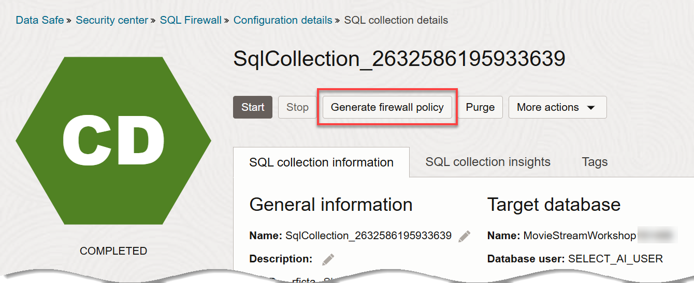
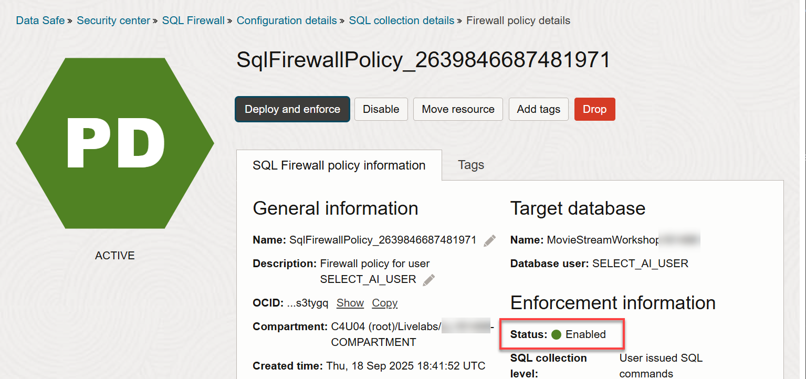
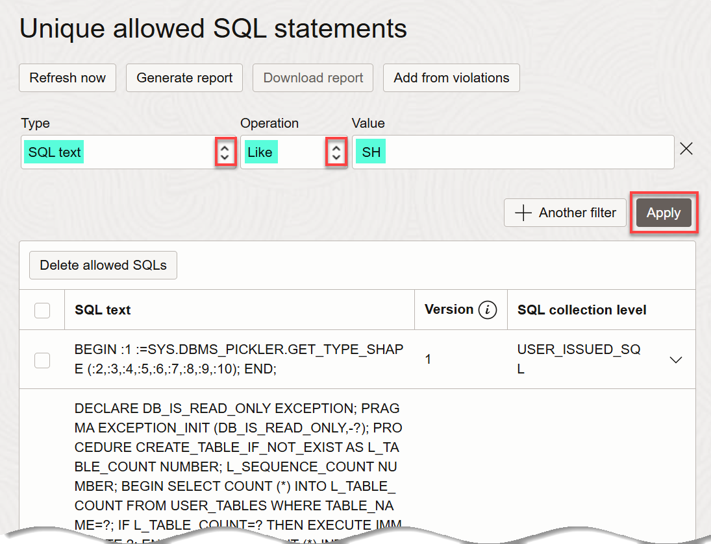

# Create and enforce a SQL Firewall policy in Data Safe

## Introduction

In this lab, you create and enforce a SQL Firewall policy for the `SELECT_AI_USER` database user. **Oracle SQL Firewall** is a robust security feature built into the Oracle Database 23ai, designed to provide real-time protection against common database attacks by restricting access to only authorized SQL statements or connections.

You begin by using Data Safe and Database Actions to create a collection of allowed SQL statements for `SELECT_AI_USER`. This collection is referred to as the *allow-list*. Next, you test that `SELECT_AI_USER` cannot run any other statement on the target database.  Lastly, you add a SQL statement from the violation log to the allow-list.

Estimated Lab Time: 20 minutes

### Objectives

In this lab, you will:

- Grant the SQL Firewall role on your target database
- Enable SQL Firewall in Data Safe
- Create a SQL collection for `SELECT_AI_USER`
- Deploy the SQL Firewall policy for `SELECT_AI_USER`
- Test the SQL Firewall policy
- Add a SQL statement from the violation log to the allow-list


### Prerequisites

This lab assumes you have:

- Obtained an Oracle Cloud account and signed in to the Oracle Cloud Infrastructure Console at `https://cloud.oracle.com`
- Prepared your environment
- A target database that is Oracle Database 23ai

## Task 1: Grant the SQL Firewall Role on your Target Database

1. Return to the SQL worksheet in Database Actions. If you are prompted to sign in to your target database, sign in as the `ADMIN` user. Clear the worksheet and the **Script Output** tab using the **Clear** icons.

2. On the SQL worksheet, enter the following command to grant the SQL Firewall role to the Oracle Data Safe service account on your target database. Next, click the **Run Script** icon in the toolbar to execute the command.

    ```
    <copy>
    EXECUTE DS_TARGET_UTIL.GRANT_ROLE('DS$SQL_FIREWALL_ROLE');
    </copy>
    ```

    

3. Verify that the script output shows the following message:

    `PL/SQL procedure successfully completed.`
    
    You are now able to use the SQL Firewall feature with your target database.

4. Clear the worksheet and script output sections. Click the **Clear** icons.  

5. Return to the **Data Safe | Oracle Cloud Infrastructure** browser tab.

## Task 2: Enable SQL Firewall in Data Safe

1. Make sure you are on the **Data Safe | Oracle Cloud Infrastructure** browser tab.

    

2. In the **Security center** section in Data Safe, click **SQL Firewall**.

3. In the **List Scope** section, select your assigned compartment.

    

4. On the **Target summary** tab, click the name of your target database. The SQL Firewall status should currently show as **Disabled**.

5. Click **Refresh**, and then click **Enable**.

    

6. Wait for the status to change to **ACTIVE**.

    

## Task 3: Create a SQL Collection for `SELECT_AI_USER`

1. In the **Resources** section, click **SQL collections** to display the **SQL collections** page. In the **SQL collections** section, click **Create and start SQL collection**. The **Create and start SQL collection** dialog box is displayed.

2. Select your compartment and target database from the **Compartment** and **Target database** drop-down lists. From the **Database user** drop-down list, select **`SELECT_AI_USER`**.

    If `SELECT_AI_USER` is not listed in the **Database user** drop-down list, click the **Refresh** icon, and then select the user.

3. Leave **User issued SQL commands** selected.

4. Click **Create and start SQL collection**.

   

5. Wait for the status to change from **CREATING** to **COLLECTING**.

    

    SQL Firewall is now set to capture SQL statements issued by the **`SELECT_AI_USER`** database user.

6. From the navigation menu, select **Oracle Database**, and then **Autonomous Database**.

7. Click the name of your database.

8. On the **Autonomous Database details** page, from the **Database actions** drop-down list, and then select **Database Users**.

9. On the **`SELECT_AI_USER`** tile, click the ellipsis icon (three dots), and then click **Edit**.

    

    The **Edit User** dialog box is displayed. 

10. In the **Password** and **Confirm Password** fields, enter the **`SELECT_AI_USER`** password which you can find on the **Reservation Information** panel.

11. Click the **Quota on tablespace DATA** drop-down list, select `UNLIMITED`.

12. Scroll down to the bottom of the dialog box. Make sure that the **REST, GraphQL, MongoDB, and Web access** slider is enabled.

   

13. Click **Apply Changes**. Ignore the error message.

14. To the right of the URL in the **`SELECT_AI_USER`** tile, click the **Open in new tab** icon.

    

    The sign-in page for Database Actions is displayed in a new browser tab.

15. Sign in as **`SELECT_AI_USER`** and enter the password.

16. On the **Launchpad** page, click the **Development** tab, and the click the **SQL** tab.

17. Close any informational boxes that might be appear.

18. Copy and paste the following query in the SQL Worksheet, and then click the **Run Statement** icon on the toolbar.

    ```sql
    <copy>
    SELECT cust_first_name, cust_last_name, cust_year_of_birth
    FROM sh.customers;
    </copy>
    ```

    

19. Copy and paste the following query in the SQL Worksheet, and then click the **Run Statement** icon on the toolbar.

    ```sql
    <copy>
    SELECT cust_id, prod_id, amount_sold
    FROM sh.sales 
    ORDER BY amount_sold;
    </copy>
    ```
    
    

20. Copy and paste the following query in the SQL Worksheet, and then click the **Run Statement** icon on the toolbar.

    ```sql
    <copy>
    SELECT * 
    FROM sh.sales 
    WHERE prod_id=120;
    </copy>
    ```

    

21. Return to the **Autonomous Database | Oracle Cloud Infrastructure** tab.

22. From the navigation menu, select **Oracle Database**, and then **SQL Firewall** under **Data Safe - Database Security**. The **SQL Firewall** page is displayed.

23. In the **Target summary** tab, click the name of your target database.

    

    The **Configuration details** page is displayed.

24. In the **SQL collections** section, click the SQL collection for the **`SELECT_AI_USER`** user. 

    

    The **SQL collection details** page is displayed.

    

25. To stop the SQL workload capture of allowed SQL statements, click **Stop**, and wait for the status to change to **COMPLETED**.

    

    The SQL collection is created for the **`SELECT_AI_USER`** user.

## Task 4: Deploy the SQL Firewall Policy for `SELECT_AI_USER`

1. On the **SQL collection details** page, click **Generate firewall policy**.

    

    A firewall policy is created, but not yet enabled (deployed). Notice the status of the policy is set to **Disabled**.

    
    
2. Scroll down and review the collection of SQL statements on the allow-list. 

    >**Note:** Database Actions adds additional SQL statements to the allow-list automatically. The SQL statements that you just collected also have additional code inserted, which you can ignore.

3. To deploy the SQL Firewall policy for the **`SELECT_AI_USER`** user, click **Deploy and enforce**.

    The **Deploy SQL Firewall policy** dialog box is displayed.

4. Select the following options:

    - **Enforcement scope:** `SQL statements only`
    - **Action on violations:** `Block and log violations`
    - **Audit for violations:** `Off`. **Note:** If you select `On`, the audit trail for your target database must be started.

    

    >**Note:** _Be sure to select these options carefully!_
    
5. Click **Deploy and enforce**.

6. Notice that the status of the SQL Firewall policy changes to **Enabled**. 

   

7. To filter the allow-list, under **Unique allowed SQL statements**, click **+ Add filter**. Specify the following: 
    
    - **Type:** `SQL text`.
    - **Operation:** `Like`.
    - **Value:** `SH`.

    The SQL statements that you collected earlier are listed.

   

## Task 5: Test the SQL Firewall Policy

When you run the SQL statements in this task, use the **Run Statement** button in Database Actions because that is how you previously ran the queries when you created the SQL collection. If you use the **Run Script** button instead, SQL Firewall will block the results.

1. Return to Database Actions as **`SELECT_AI_USER`** and clear the worksheet.

2. Try running one of the SQL statements on the allow-list such as the following query:

    ```sql
    <copy>
    SELECT cust_first_name, cust_last_name, cust_year_of_birth 
    FROM sh.customers;
    </copy>
    ```
 
    The query should return data.

3. Clear the worksheet and try running a SQL statement that isn't on the allow-list such as the following query: 

    ```sql
    <copy>
    SELECT * 
    FROM sh.customers;
    </copy>
    ```

    You should receive an error message: **`ORA-47605: SQL Firewall violation`**.

    

4. Clear the worksheet and try running the following SQL query:

    ```sql
    <copy>
    SELECT * 
    FROM sh.sales 
    WHERE prod_id=16;
    </copy>
    ```
    

## Task 6: Add a SQL statement from the Violation Log to the allow-list
    
1. Return to the **SQL Firewall | Oracle Cloud Infrastructure** tab. You may need to wait a couple of minutes for the violations to show up.

2. Under **Unique allowed SQL statements**, click **Add from violations**.

    The **Add from violations** page is displayed showing you Autonomous Database SQL queries.

    

3. Select the check box for the SQL violation: `SELECT * FROM sh.customers;`.

4. Click **Add violations**. 

    You are returned to the **Firewall policy details** page.

5. Under **Unique allowed SQL statements**, notice that your selected SQL statement is now listed at the top.

    

6. Return to **Database Actions** as **`SELECT_AI_USER`** and run the newly-allowed SQL statement to test that it will run successfully.

    ```sql
    <copy>
    SELECT * 
    FROM sh.customers;
    </copy>
    ```

    

Congratulations! You have finished this LiveLabs workshop!

## Acknowledgements

- **Author** - Jody Glover, Consulting User Assistance Developer, Database Development
- **Contributors:** 
    * Lauran K. Serhal, Consulting User Assistance Developer, Database Development
    * Michelle Malcher, Director, Product Management  
    * Marcos Arancibia, Senior Principal Product Manager, ADB-S
- **Last Updated By/Date:** - Lauran K. Serhal, September 2025


