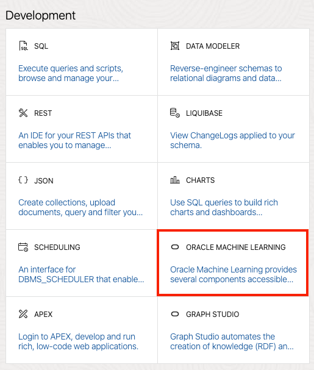
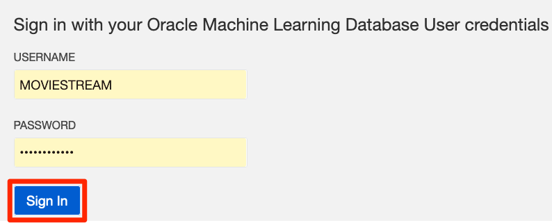
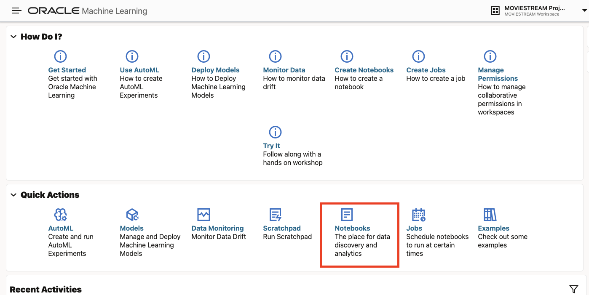
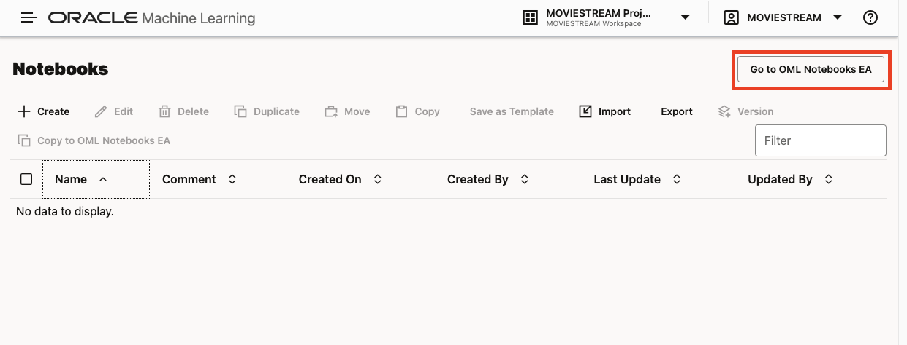
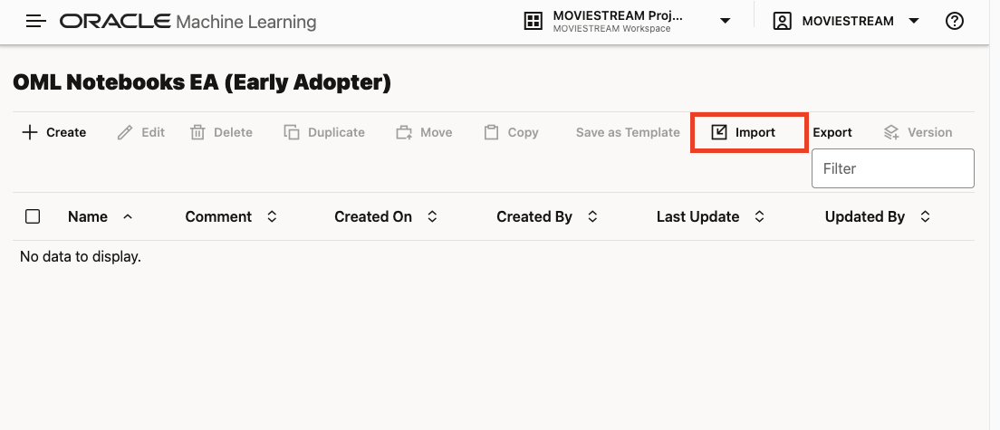
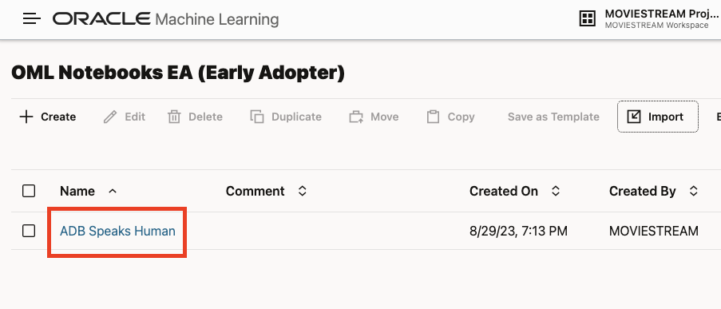
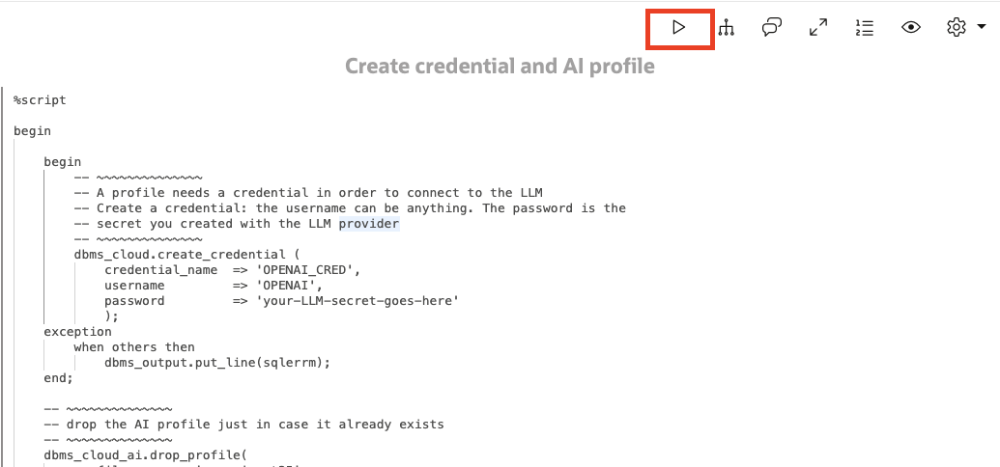

# Use AI SQL for natural langugage queries
## Introduction

Autonomous Database makes it simple to query your data using natural language. The person asking the question doesn't need to know where the data is stored, its structure or how to combine it with other data to get results. All of these tasks are handled by a large language model and Autonomous Database.

You will use an Oracle Machine Learning notebook to learn how to ask natural language queries with Autonomous Database. There are many SQL tools that you can use; we are using the notebook because it's a great way to illustrate the examples.

Estimated Time: 15 minutes.

### Objectives

Learn how to
* Create a credential that is used to sign LLM API requests
* Create a profile that describes your LLM provider and the metadata (schemas, tables, views, etc.) that can be used for natural language queries. 
* Ask natural language questions using an AI SQL extension
* Tweak the configuration to improve natural language results

### Prerequisites
- This lab requires completion of the first two labs in the Contents menu on the left.

## Task 1: Log into OML Notebooks
1. Go to the Database Actions Launchpad. If you are at the Autonomous Database in the OCI service console, then select **Database Actions -> View all database actions**:

    

    Logging into Database Actions from the OCI service console expects you to be the ADMIN user. Log in as ADMIN if you are not automatically logged into Database Actions.

2. In the Launchpad, click **Oracle Machine Learning**:

    

3. Log in in as MOVIESTREAM.

    

4. You are now in the OML landing page. This page takes you to tutorials, model creation, notebooks and more. Go to the Early Adopter Notebooks. Click **Notebooks**:

    

  And then select **Go to OML Notebooks EA**:
    
    

## Task 2: Import the ADB Speaks Human Notebook
1. A notebook called ADB Speaks Human contains all the steps for setting up the AI profile and then running natural language queries. Download the notebook and remember its doenload location:

  [Download ADB Speaks Human notebook](../notebook/ADB%20Speaks%20Human.dsnb)

2. Next, import the notebook by clicking the **Import** button and selecting the notebook file you just downloaded:
  
  

3. Open the **ADB Speaks Human** Notebook and then proceed to the next task.

  

## Task 3: Step thru the notebook paragraphs
A notebook is comprised of paragraphs that use different languages: SQL, PLSQL, Python, R, markdown and more. The **ADB Speaks Human** notebook is well-document. Read thru the notebook, examine and execute the code. Feel free to run different types of queries!

You'll see a series of buttons in the top right of each paragraph. The **play** button will execute the contents of that paragraph:

  

The results of the code execution is displayed under the paragraph code. For query result sets, you can view the data as a table or a variety of chart types.

## Acknowledgements
  * **Author** - Marty Gubar, Product Management
  * **Contributors** -  Marty Gubar, Product Management
* **Last Updated By/Date** - Marty Gubar, Product Management, August 2023