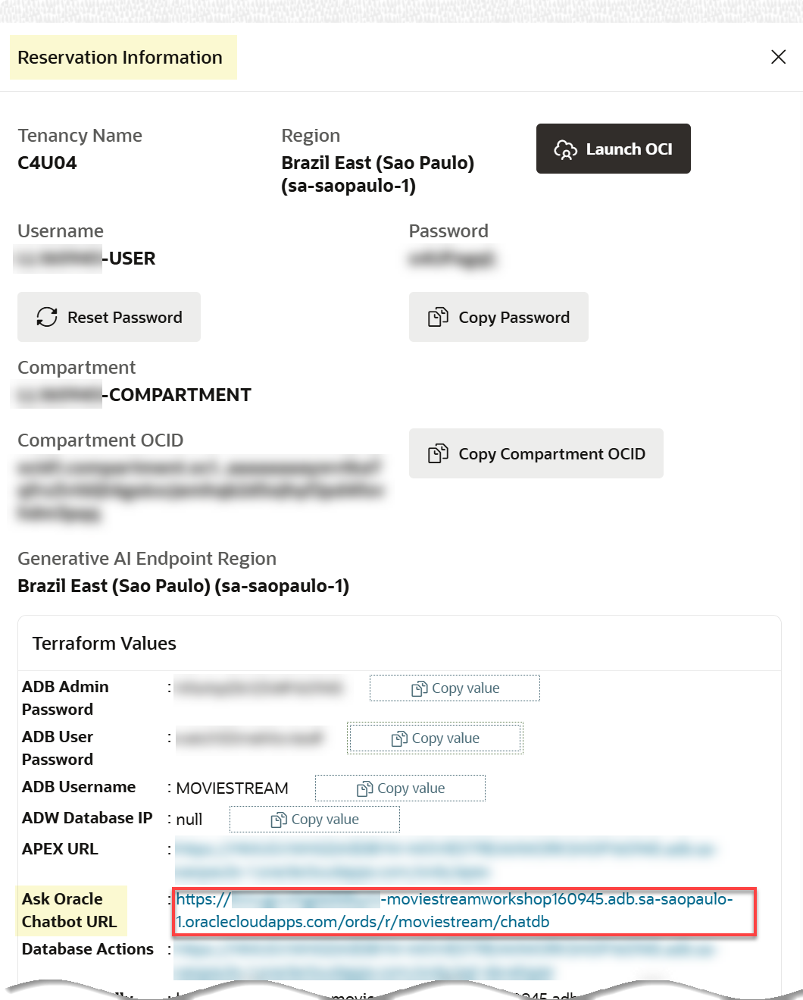

# Use the Select AI Demo Application

## Introduction

As you can see from the previous labs, **Select AI** makes it easy to build apps that take advantage of natural language queries. In this lab, you'll experiment with a few. When you ran the scripts to set up your environment, The Select AI APEX demo application was also installed. The app is probably the easiest way to get answers about your business and general internet content. Simply ask a question! You can then explore the result, get an understanding of the generated SQL (and even update it if you like) and manage conversations.

>**Note:** Refer to lab 3 to review what you learned about creating profiles to specify what LLM provider and database schema/tables to use when answering your questions in the app.

Estimated Time: 10 minutes.

Watch the video below for a detailed walk-through of using the Oracle APEX-based ChatDB demo application and the Select AI feature.

### Objectives

In this lab, you will:
* As the `moviestream` user, access the **Select AI demo** application using the **Select AI Demo URL** link that you can find in your **Reservation Information** panel.
* Ask natural questions with the **Select AI demo** application.

### Prerequisites
- This lab requires the completion of all the preceding labs in the **Contents** menu on the left.

## Task 1: Access the Select AI Demo Application

1. Navigate to your **Reservation Information** panel, and then click the **Ask Oracle Select AI Demo URL** link.

    

2. On the **ADB Chat** page, enter the username (`moviestream`) and the password (`ADB User Password`) that you can find in your **Reservation Information** panel, and then click **Sign In**.

    

2. The **AI Settings** window in the **ADB Chat** application is displayed. Select a profile that you want to use. Click the **Choose subject areas** drop-down list, and select the **`GENAI [1]`** profile. This profile was created in the **Create credential and AI profile** paragraph in the notebook that you imported in **Lab 3**. Next, click the **X** control.

    

    The ADB Chat application is re-displayed. You are now ready to ask questions at the **Ask a question** prompt!

    

## Task 2: Ask Natural Language and Database Questions Using the Application

You can use this application to ask the following types of questions:

- **Ask the Internet Using your LLM Provider:**
_Uncheck the **Ask Database** checkbox_ to ask general free form questions (internet-based) about anything such as _How do you make french toast?_. This question will go to the LLM Provider that you selected when you created the profile and returns the answer.

  

- **Ask your Database :**
_Select the **Ask Database** checkbox_ to ask questions about your business data based on the user and tables in the database that you specified when you created the profile.

  

  <!---
  Where do you specify what LLM provider and database schema/tables to use when answering your questions? When you create the profile using **`DBMS_CLOUD_AI.CREATE_PROFILE`** PL/SQL procedure, you specify the LLM provider, the credential, the schema, and the tables to use to answer your natural language questions on general data or your business data that is stored in your database.

  
--->

Let's experiment a bit with both general data from the `internet` and also from the `moviestream` tables in the database.

1. Let's find out how to make french toast. Enter your question using a free form format in the **Ask a Question** text box, and make sure that the **Ask Database** checkbox is not checked since this is a general internet question that will be handled by your LLM provider. Next, click the **Run** icon, or press **[ENTER]**.

    >**Note:** You can type your own natural language question. You don't have to use the exact question that we show in our examples.

    

    A French toast recipe is displayed.

   

2. Let's find out the top 10 streamed movies in the moviestream company. Click the **Clear** icon in the banner to clear the last question and answer. Enter your question using a free form format in the **Ask a Question** text box, and select the **Ask Database** checkbox since this is a question about the moviestream data. Next, press **[ENTER]**.

    

    The top 10 streamed movies are displayed in descending order.

    

3. Click the **Explain** button to view and explain the SQL query behind this natural language question.

  

  When you finish, click the **Close SQL** icon (left arrow) to return to the Home page. Click the **Explore** button.

  
  
  The **Explore** page is displayed.

  

4. Click the **Actions** drop-down list to perform several tasks on the generated data such as sorting, downloading, formatting, charting and much more. For details on using the actions tasks, see the embedded video in the Introduction section of this lab. Click the **Close SQL** icon (left arrow) to return to the Home page.

  

  >**Note:** _LLMs are remarkable at inferring intent from the human language and they are getting better all the time; however, they are not perfect! It is very important to verify the results._

You may now proceed to the next lab.

## Learn More
* [DBMS\_NETWORK\_ACL\_ADMIN PL/SQL Package](https://docs.oracle.com/en/database/oracle/oracle-database/19/arpls/DBMS_NETWORK_ACL_ADMIN.html#GUID-254AE700-B355-4EBC-84B2-8EE32011E692)
* [DBMS\_CLOUD\_AI Package](https://docs.oracle.com/en-us/iaas/autonomous-database-serverless/doc/dbms-cloud-ai-package.html)
* [Using Oracle Autonomous Database Serverless](https://docs.oracle.com/en/cloud/paas/autonomous-database/adbsa/index.html)

## Acknowledgements
  * **Authors:** 
    * Lauran K. Serhal, Consulting User Assistance Developer
    * Marty Gubar, Product Management
* **Last Updated By/Date:** Lauran K. Serhal, September 2025

Data about movies in this workshop were sourced from **Wikipedia**.

Copyright (c) 2025 Oracle Corporation.

Permission is granted to copy, distribute and/or modify this document
under the terms of the GNU Free Documentation License, Version 1.3
or any later version published by the Free Software Foundation;
with no Invariant Sections, no Front-Cover Texts, and no Back-Cover Texts.
A copy of the license is included in the section entitled [GNU Free Documentation License](files/gnu-free-documentation-license.txt)
