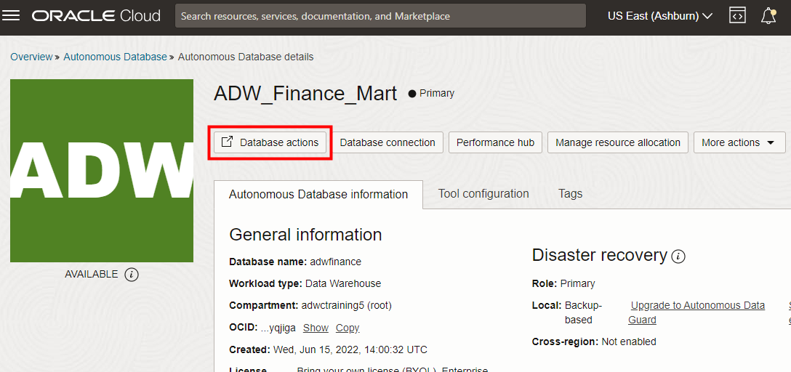

# Connect to Oracle Autonomous Database with SQL Worksheet and run your first query

## Introduction

In this lab, you will explore the provided sample data sets that come with your Oracle Autonomous Data Warehouse (ADW) or Autonomous Transaction Processing (ATP) instance using SQL Worksheet.

Estimated Time: 5 minutes

Watch the video below for a quick walk-through of the lab.
[Connect an ADB Instance SQL Worksheet](videohub:1_28r1706y)

### Before you begin

This lab uses SQL Worksheet, one of the features of the Database Actions web-based interface for Oracle Autonomous Database.

This lab will demo queries on sample data sets provided out of the box with ADW. ADW provides the Oracle Sales History sample schema and the Star Schema Benchmark (SSB) data set. These data sets are in the `SH` and `SSB` schemas, respectively.

You will run a basic query on the `SSB` data set which is a 1 terabyte data set with one fact table with around 6 billion rows, and several dimension tables.

*Note: While this lab uses ADW, the steps are the same for connecting to an ATP database.*

### Objectives

- Learn how to connect to your new Autonomous Database using SQL Worksheet
- Learn about the Star Schema Benchmark (SSB) and Sales History (SH) sample data sets
- Run a query on an ADW sample data set

### Prerequisites

- This lab requires completion of the Provision an Autonomous Database lab in the Contents menu on the left.

## Task 1: Connect with SQL Worksheet

Although you can connect to your Oracle Autonomous Database using local PC desktop tools like Oracle SQL Developer, you can conveniently access the browser-based SQL Worksheet directly from your ADW or ATP console.

1.  If you are not logged in to Oracle Cloud Console, log in and select **Autonomous Data Warehouse** from the navigation menu, make sure you are in the right compartment where your autonomous database is provisioned and navigate into your ADW Finance Mart instance.

    


    

2. In your ADW Finance Mart database's details page, click the **Database Actions** dropdown list. Select **View all database actions**.

    

3.  A sign-in page opens for Database Actions. For this lab, simply use your database instance's default administrator account, **Username - admin**, and click **Next**.

    

4. Enter the admin **Password** you specified when creating the database. Click **Sign in**.

    

5. The Database Actions page opens. In the **Development** box, click **SQL**.

    

6.  The first time you open SQL Worksheet, a series of pop-up informational boxes may appear, providing you a tour that introduces the main features. If not, click the Tour button (labeled with binoculars symbol) in the upper right corner. Click **Next** to take a tour through the informational boxes.

    

## Task 2: Run scripts in SQL Worksheet

Run a query on a sample Oracle Autonomous Database data set.

1.  Copy and paste the code snippet below to your SQL Worksheet. This query will run on the Star Schema Benchmark (ssb.customer), one of the two ADW sample data sets that you can access  from any ADW instance. Take a moment to examine the script. Make sure you click the **Run Statement** button to run it in SQL Worksheet so that all the rows display on the screen.

    ```
    <copy>
    select /* low */ c_city,c_region,count(*)
    from ssb.customer c_low
    group by c_region, c_city
    order by count(*);
    </copy>
    ```

    

2.  Take a look at the output response from your Autonomous Data Warehouse.

3.  When possible, ADW also *caches* the results of a query for you. If you run identical queries more than once, you will notice a much shorter response time when your results have been cached.

4.  You can find [more sample queries to run](https://docs.oracle.com/en/cloud/paas/autonomous-data-warehouse-cloud/user/sample-queries.html) in the ADW documentation.

You may now **proceed to the next lab**.

## Learn more

Go to [the documentation](https://docs.oracle.com/en/cloud/paas/autonomous-database/adbsa/sql-developer-web.html#GUID-102845D9-6855-4944-8937-5C688939610F) on connecting with the built-in Oracle Database Actions.

## **Acknowledgements**

- **Author** - Nilay Panchal, Oracle Autonomous Database Product Management
- **Adapted for Cloud by** - Richard Green, Principal Developer, Database User Assistance
- **Contributors** - Oracle LiveLabs QA Team (Arabella Yao, Product Manager Intern | Ayden Smith, QA Intern)
- **Last Updated By/Date** - Richard Green, August 2023
