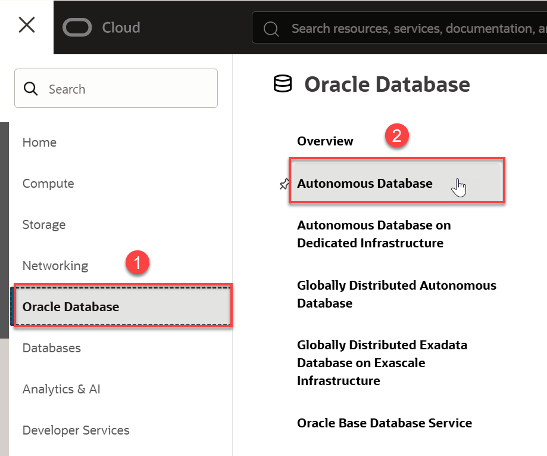
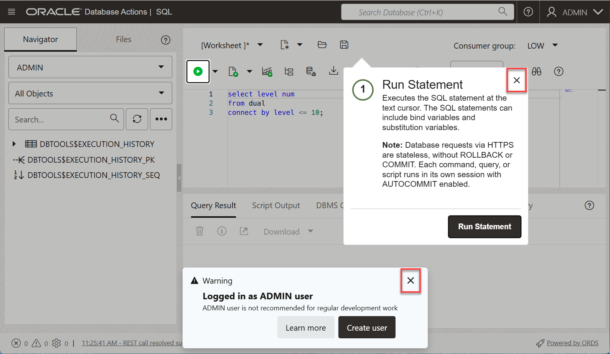
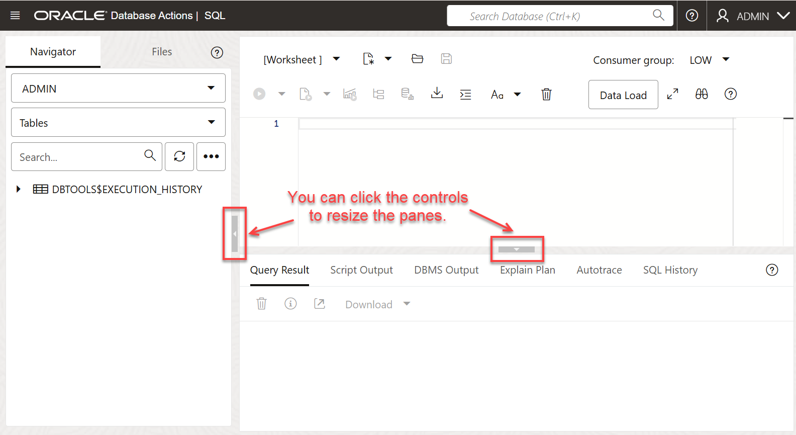

# Connect to Oracle Autonomous Database with SQL Worksheet and run your first query

## Introduction

In this lab, you will explore the provided sample data sets that come with your Oracle Autonomous Data Warehouse (ADW) or Autonomous Transaction Processing (ATP) instance using SQL Worksheet.

Estimated Time: 5 minutes

Watch the video below for a quick walk-through of the lab.
[Connect an ADB Instance SQL Worksheet](videohub:1_28r1706y)

### Before you begin

This lab uses SQL Worksheet, one of the features of the Database Actions web-based interface for Oracle Autonomous Database.

This lab will demo queries on sample data sets provided out of the box with ADW. ADW provides the Oracle Sales History sample schema and the Star Schema Benchmark (SSB) data set. These data sets are in the `SH` and `SSB` schemas, respectively.

You will run a basic query on the `SSB` data set which is a 1 terabyte data set with one fact table with around 6 billion rows, and several dimension tables.

*Note: While this lab uses ADW, the steps are the same for connecting to an ATP database.*

### Objectives

- Learn how to connect to your new Autonomous Database using SQL Worksheet
- Learn about the Star Schema Benchmark (SSB) and Sales History (SH) sample data sets
- Run a query on an ADW sample data set

### Prerequisites

- This lab requires completion of the Provision an Autonomous Database lab in the Contents menu on the left.

## Task 1: Connect with The SQL Worksheet

Although you can connect to your Oracle Autonomous Database using local PC desktop tools like Oracle SQL Developer, you can conveniently access the browser-based SQL Worksheet directly from your ADW or ATP console.

If you are still on the **Autonomous Databases** page from the previous lab, you can skip to step 3 below; Otherwise, start with step 1.

1. Click the **Navigation** menu.

    

2. Click **Oracle Database**. Under **Oracle Database**, click **Autonomous Data Warehouse**.

    

3. On the **Autonomous Databases** page, click your **`ADW_Finance_Mart`** instance. Make sure you are in the right compartment and region where your autonomous database is provisioned. In this example, we used our own compartment, **`training-adw-compartment`**.

    

4. On the **Autonomous Database details** page, click the **Database actions** drop-down list, and then click **SQL**.

    

5. The first time you open the SQL Worksheet, a warning and a message box may appear. Close those boxes.

    

    The SQL Worksheet is displayed.

    

## Task 2: Run scripts in SQL Worksheet

Run a query on a sample Oracle Autonomous Database data set.

1. Copy and paste the code to your SQL Worksheet. The first time you paste code into the SQL Worksheet, a message is displayed. Click **Allow**.

    

    This query will run on the Star Schema Benchmark (ssb.customer), one of the two ADW sample data sets that you can access from any ADW instance. Take a moment to examine the query. Click the **Run Statement** icon in the Worksheet toolbar.

    ```
    <copy>
    select /* low */ c_city,c_region,count(*)
    from ssb.customer c_low
    group by c_region, c_city
    order by count(*);
    </copy>
    ```

    

2. Review the output response from your Autonomous Data Warehouse.

3. When possible, ADW also *caches* the results of a query for you. If you run identical queries more than once, you will notice a much shorter response time when your results have been cached.

4. You can find more sample queries to run in the [Sample Star Schema Benchmark (SSB) Queries and Analytic Views](https://docs.oracle.com/en/cloud/paas/autonomous-data-warehouse-cloud/user/sample-queries.html) documentation.

You may now **proceed to the next lab**.

## Learn more

* [Using Oracle Autonomous Database Serverless](https://docs.oracle.com/en/cloud/paas/autonomous-database/serverless/adbsb/index.html)

## **Acknowledgements**

- **Authors:**
    * Lauran K. Serhal, Consulting User Assistance Developer
    * Nilay Panchal, Oracle Autonomous Database Product Management
- **Last Updated By/Date:** Lauran K. Serhal, May 2024
