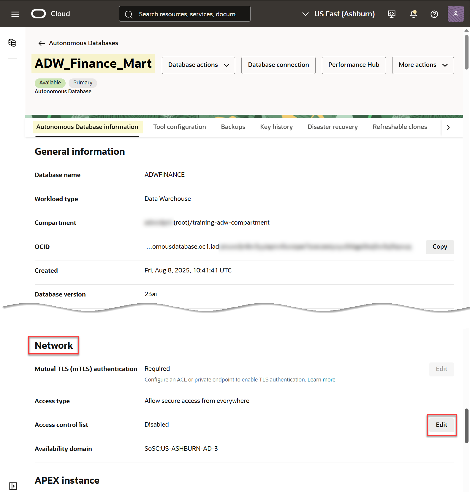
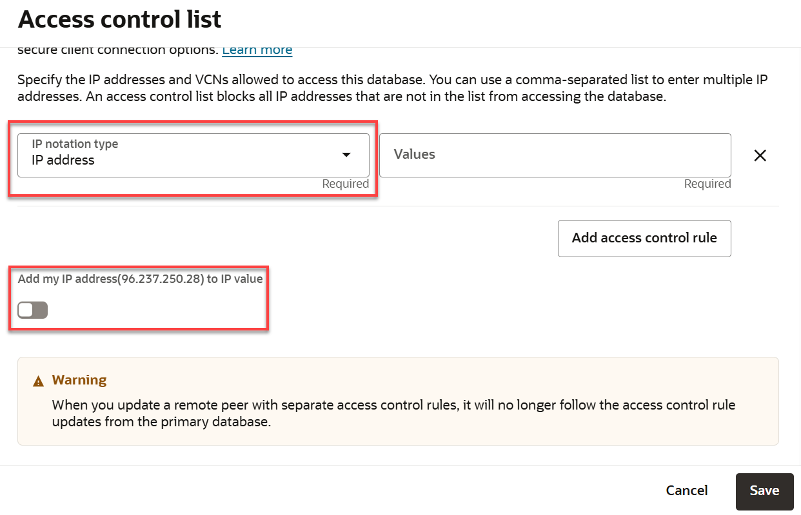
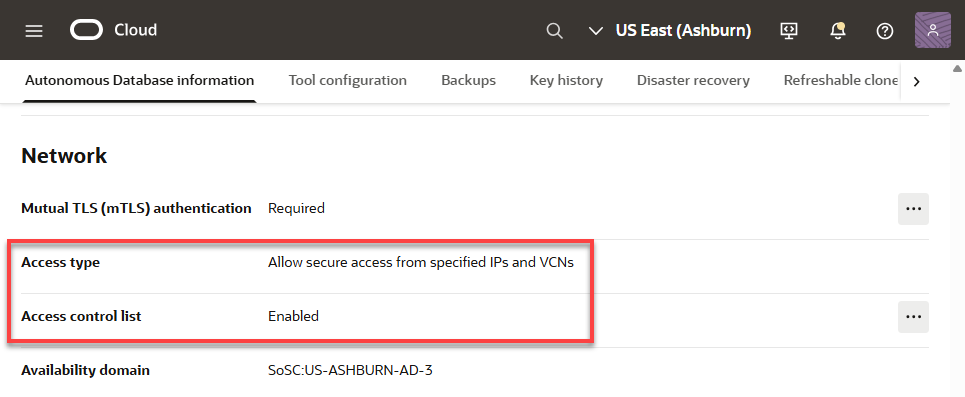
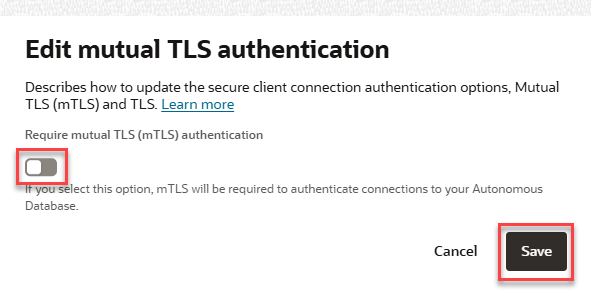
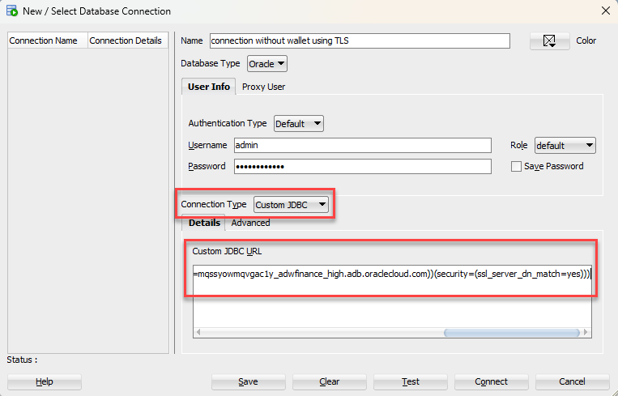
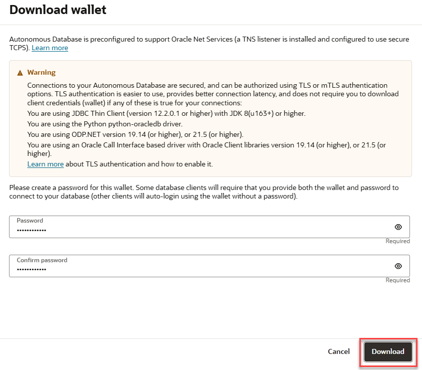

# Connect SQL Developer Securely With or Without a Connection Wallet

## Introduction

Oracle Autonomous Data Warehouse (ADW) and Autonomous Transaction Processing (ATP) accept only secure connections to Oracle Autonomous Databases. This lab walks you through the steps to connect Oracle SQL Developer desktop client securely to your autonomous database, both with and without a **connection wallet**. First, you will learn how to securely connect SQL Developer without a wallet using TLS connections. Then, you will  download and configure a connection wallet as another method to securely connect SQL Developer to your autonomous database.

Estimated Time: 20 minutes

(Previous labs in this workshop used **SQL Worksheet** from **Database Actions**, to access an autonomous database directly from the cloud console without a connection wallet. SQL Worksheet is a convenient browser-based tool, offering a subset of the features and functions in Oracle SQL Developer.)

*Note: While this lab uses ADW, the steps are identical for connecting to an autonomous database in ATP.*

Watch the video below for a quick walk-through of the lab.
[Connect SQL Developer Securely With or Without a Connection Wallet](videohub:1_jszjfjm1)

### Objectives

- Learn how to connect to your Autonomous Data Warehouse with Oracle SQL Developer, with and without using a connection wallet
- Learn how to connect SQL Developer without a wallet using TLS connections
- Learn how to download and configure a connection wallet
- Query your autonomous database with Oracle SQL Developer

### Prerequisites
This lab assumes you have:

- Performed the previous lab on provisioning an Oracle Autonomous Database

## Task 1: Download and Install Latest Version of SQL Developer

Use the latest version of Oracle SQL Developer (version 22.2.1 as of writing of this workshop). This task will walk you through downloading and installing Oracle SQL Developer in a Windows environment.

1. Download the latest version of Oracle SQL Developer from **[this link](https://www.oracle.com/tools/downloads/sqldev-downloads.html)** for your appropriate platform. In this example, we'll choose Windows 64-bit with JDK 8 included.

2. To install and start SQL Developer, simply download its ZIP file and unzip it into a desired parent directory or folder, and then double-click the executable file named **`sqldeveloper.exe`** to open.

3. When you launch SQL Developer the first time, it will ask you if you want to import a project. Select **No**.

## Task 2: Connect SQL Developer to Database Securely Without Wallet

The first of two methods we'll learn for establishing a secure SQL Developer connection to an autonomous database is to connect securely without a wallet, using TLS authentication.

When you provisioned your autonomous database instance with a network access type of "Secure access from everywhere", by default, mTLS authentication was required, and the only ways to enable TLS in addition to mTLS are either to define an access control list (ACL) or to use a private endpoint. For this lab, you will configure an **IP ACL** (access control list). Then you will be able to uncheck the "Require mutual TLS" checkbox, which in turn will enable TLS for connecting without a wallet.

>**Note**: See the documentation [Update your Autonomous Database Instance to Allow both TLS and mTLS Authentication] (https://docs.oracle.com/pls/topic/lookup?ctx=en/cloud/paas/autonomous-data-warehouse-cloud/cswgs&id=ADBSA-GUID-6A34B30A-3692-4D1F-8458-FD8F32736199) for detailed information on allowing TLS connections.

To create a new TLS connection to Autonomous Database:

1. First, define an **IP ACL** (access control list). In the **Autonomous Database Details** page, in the **Network** section, click the **Edit** button next to **Access control list**.

    

2. In the **Edit access control list** dialog, you might normally accept the default IP notation type of **IP Address** and click **Add My IP Address**, and your computer's IP address would be added as a value. However, for this lab that you might be running in any one of a variety of different environments, let's make a different selection.

    

    For this lab, open the **IP notation type** drop-down menu and select **CIDR Block**. In the **Values** field, enter this value: *0.0.0.0/0*

    

    Click **Save**. Wait a minute for the database status to change from UPDATING to AVAILABLE.

3. In the **Autonomous Database Details** page, in the **Network** section, note that the **Access type** has automatically changed from the default access type that you used when provisioning the database, **Allow secure access from everywhere**, to **Allow secure access from specified IPs and VCNs**. Click the **Edit** button next to **Mutual TLS (mTLS) authentication**.

    

4. In the **Edit Mutual TLS Authentication** dialog, deselect the checkbox that requires mutual TLS (mTLS) authentication and and click **Save**. Wait a minute for the database status to change from UPDATING to AVAILABLE.

    

    When the update finishes, note that the Mutual TLS (mTLS) Authentication field has changed from Required to Not Required.

Next, perform the following steps to obtain the **TLS connection string**.

5. In the **Autonomous Database Details** page, click the **Database connection** button.

    The **Database connection** dialog pops up. In the **Connection Strings** section, change the **TLS Authentication** selection from Mutual TLS to **TLS**. This will enable SQL Developer and other applications to connect to your autonomous database securely without a wallet.

    Choose one of the connection strings, such as *adwfinance_high*, and optionally click **Show** to see the contents of the connection string. Then click **Copy** to copy that connection string. Paste the connection string to a notepad for use in a next step. Then click **Close** to close the Database Connection dialog.

    

    See the documentation [View TNS Names and Connection Strings for an Autonomous Database Instance] (https://docs.oracle.com/en/cloud/paas/autonomous-data-warehouse-cloud/cswgs/autonomous-connection-strings-view.html#GUID-BE884A1B-034D-4CD6-9B71-83A4CCFDE9FB) for more information on viewing and copying connection strings.

6. Start Oracle SQL Developer and in the connections panel, click the **New Connection....** button.

    

7. Enter the following information:
  - **Name**: Enter a name for this connection, such as **connection without wallet using TLS**.
  - **Username**: Enter the database username. You can either use the default administrator database account ADMIN provided as part of the service or create a new schema, and use it.
  - **Password**: Enter the password you created for the database user.
  - **Connection Type**: Select **Custom JDBC**.
  - **Custom JDBC URL**: Enter the following:

    **jdbc:oracle:thin:@ followed by the connection string you copied in Step 5.**

    

    For example, the value for the **Custom JDBC URL** field might look something like this (where we masked some values with XXXXXXXXXXXXXX):

    ```
    jdbc:oracle:thin:@(description= (retry_count=20)(retry_delay=3)(address=(protocol=tcps)
    (port=1521)(host=XXXXXXXXXXXXXX.us-phoenix-1.oraclecloud.com))(connect_data=(service_name=XXXXXXXXXXXXXX_databasename_high.adb.oraclecloud.com))
    (security=(ssl_server_cert_dn="CN=adwc-XXXXXXXXXXXXXX.region.oraclecloud.com, OU=Oracle BMCS US, O=Oracle Corporation, L=Redwood City, ST=California, C=US")))
    ```

When you copy the connection string, the values for **region** and **databasename** are for your Oracle Autonomous Database instance.

8. Click **Connect** to connect to the database.

## Task 3: Download the Connection Wallet

In addition to connecting SQL Developer securely without a wallet using TLS, we'll now learn how to connect securely using a connection wallet containing your credentials.
You can download the wallet either from the instance's details page or from the ADW or ATP service console.

1.  If you are not logged in to Oracle Cloud Console, login and select Autonomous Data Warehouse from the hamburger menu and navigate into your ADW Finance Mart instance.

    

    

2.  In your database's instance Details page, click **Database connection**.

    

3.  Use the Database Connection dialog to download client credentials.
    - Wallet Type - For this lab, select **Instance Wallet**. This wallet type is for a single database only. This provides a database-specific wallet.
    - Click **Download wallet**.

    

    *Note: Oracle recommends that you provide a database-specific wallet, using Instance Wallet, to end users and for application use whenever possible. Regional wallets should only be used for administrative purposes that require potential access to all Autonomous Databases within a region.*

4.  Specify a password of your choice for the wallet. You will need this password when connecting to the database via SQL Developer later. The password is also used as the JKS Keystore password for JDBC applications that use JKS for security. Click **Download** to download the wallet file to your client machine.

    *Note: If you are prevented from downloading your Connection Wallet, it may be due to your browser's pop-up blocker. Please disable it or create an exception for Oracle Cloud domains.*

    

5.  Once the wallet is downloaded, click **Close** to close the Database Connection dialog.

## Task 4: Connect SQL Developer to Database Securely with Wallet

Start SQL Developer and create a connection for your database using the default administrator account "ADMIN" by following these steps.

1.  Click the **New Connection** icon in the Connections toolbox on the top left of the SQL Developer homepage.

    

2.  In **New / Select Database Connection** dialog, Fill in the connection details as below:

    -   **Name:** admin_high
    -   **Username:** ADMIN
    -   **Password:** The password you specified during provisioning your instance
    -   **Connection Type:** Cloud Wallet
    -   **Configuration File:** Enter the full path for the wallet file you downloaded before, or click **Browse...** to point to the location of the file.
    -   **Service:** There are 3 pre-configured database services for each database. Pick **<*databasename*>\_high** for this lab. For example, if the database you created was named adwfinance, select **adwfinance_high** as the service.

    

3.  Test your connection by clicking the **Test** button. If it succeeds, you will see *Status: Success*, you can save your connection information by clicking **Save**, then connect to your database by clicking the **Connect** button. An entry for the new connection will appear under Connections.

4.  If you are behind a VPN or Firewall and this Test fails, make sure you have [SQL Developer 18.3](https://www.oracle.com/technetwork/developer-tools/sql-developer/downloads/index.html) or higher. This version and above will allow you to select the "Use HTTP Proxy Host" option for a Cloud Wallet type connection. While creating your new ADW connection here, provide your proxy's Host and Port. If you are unsure where to find this, you may look at your computer's connection settings or contact your Network Administrator.

## Task 5: Query Your Autonomous Database with SQL Developer

The SH schema provides a small data set that you can use to run the sample queries in the [Database Data Warehousing Guide](https://docs.oracle.com/en/database/oracle/oracle-database/19/dwhsg/sql-analysis-reporting-data-warehouses.html#GUID-1D8E3429-735B-409C-BD16-54004964D89B). For example, the following query shows you how the SQL function RANK() works:

1.  In a SQL Developer worksheet, perform the following `SH` query.

    ```
    <copy>
    SELECT channel_desc, TO_CHAR(SUM(amount_sold),'9,999,999,999') SALES$,
    RANK() OVER (ORDER BY SUM(amount_sold)) AS default_rank,
    RANK() OVER (ORDER BY SUM(amount_sold) DESC NULLS LAST) AS custom_rank
    FROM sh.sales, sh.products, sh.customers, sh.times, sh.channels, sh.countries
    WHERE sales.prod_id=products.prod_id AND sales.cust_id=customers.cust_id
    AND customers.country_id = countries.country_id AND sales.time_id=times.time_id
    AND sales.channel_id=channels.channel_id
    AND times.calendar_month_desc IN ('2000-09', '2000-10')
    AND country_iso_code='US'
    GROUP BY channel_desc;
    </copy>
    ```

    

You may now **proceed to the next lab**.

## Want to Learn More?

View the documentation for [connectivity options](https://docs.oracle.com/en/cloud/paas/autonomous-data-warehouse-cloud/user/connect-data-warehouse.html#GUID-94719269-9218-4FAF-870E-6F0783E209FD) in Autonomous Database Serverless.

View the documentation for [network configuration options](https://docs.oracle.com/en/cloud/paas/autonomous-database/adbsa/autonomous-network-access.html#GUID-D2D468C3-CA2D-411E-92BC-E122F795A413) in Autonomous Database Serverless.

View the blog post ["Connecting to Your Autonomous Database Has Never Been Easier"](https://blogs.oracle.com/datawarehousing/post/connecting-your-autonomous-database-has-never-been-easier) to learn how to use one-way Transport Layer Security (TLS) authentication for connecting your client tools securely to an autonomous database without a wallet.

## **Acknowledgements**

- **Author** - Richard Green, Principal Developer, Database User Assistance
- **Adapted for Cloud by** - Richard Green
- **Last Updated By/Date** - Richard Green, June 2023
