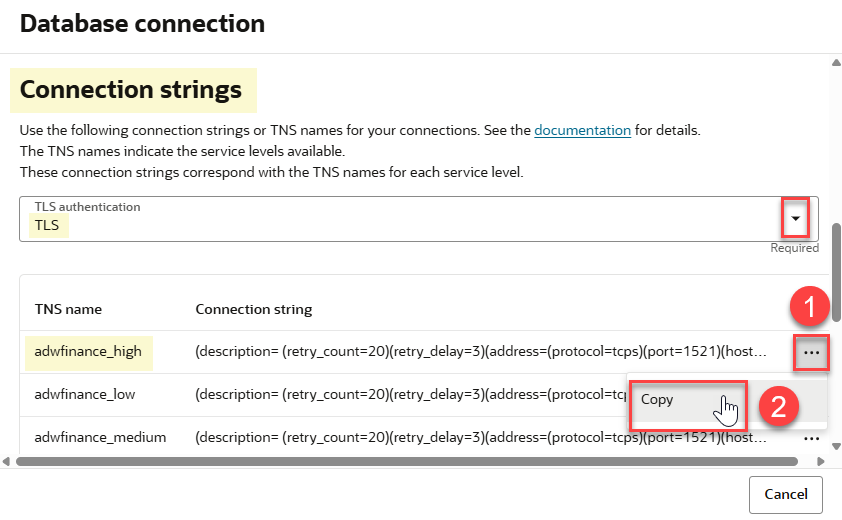
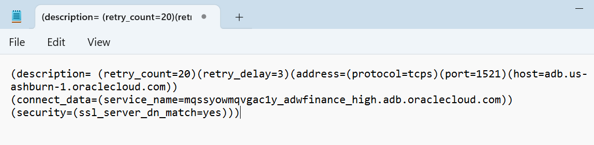
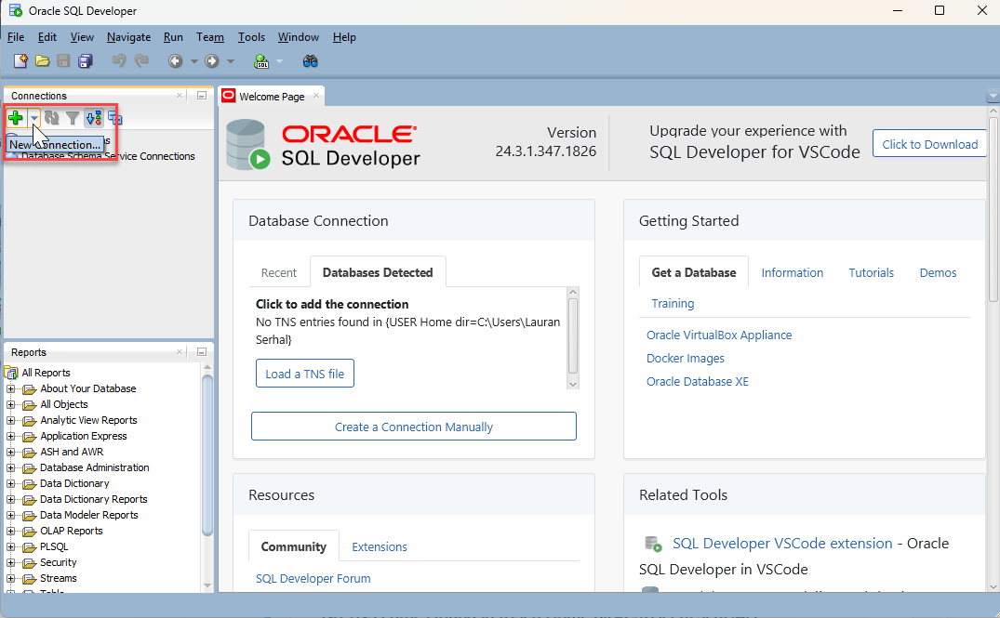
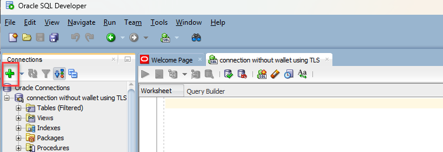
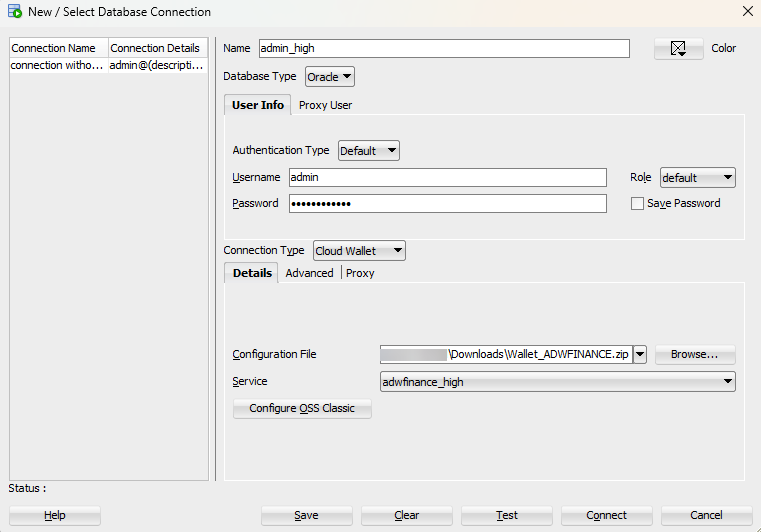
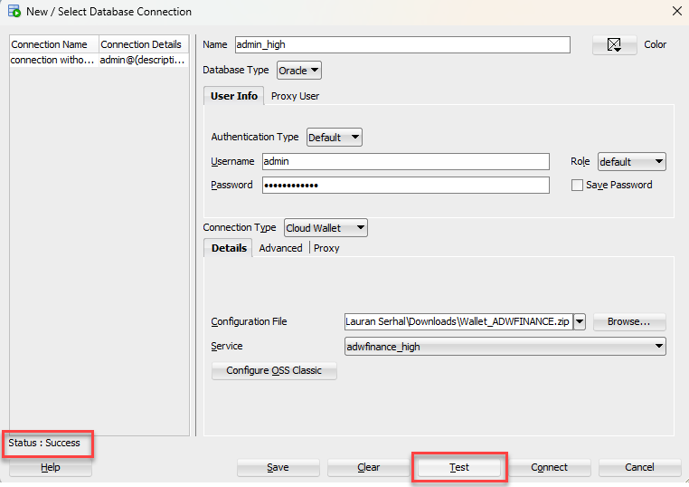
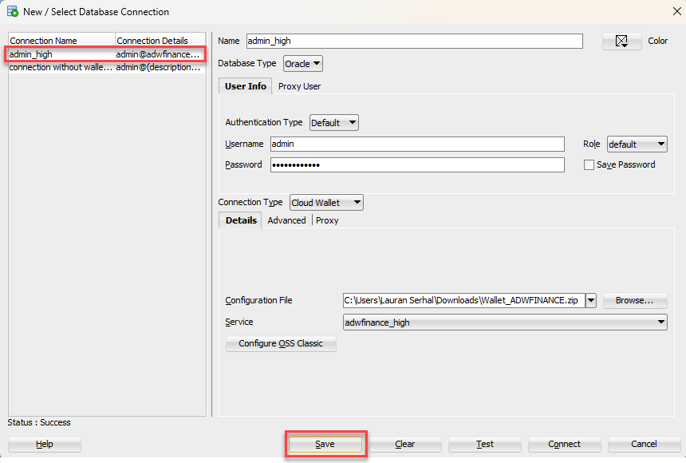
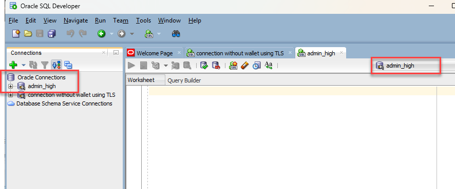
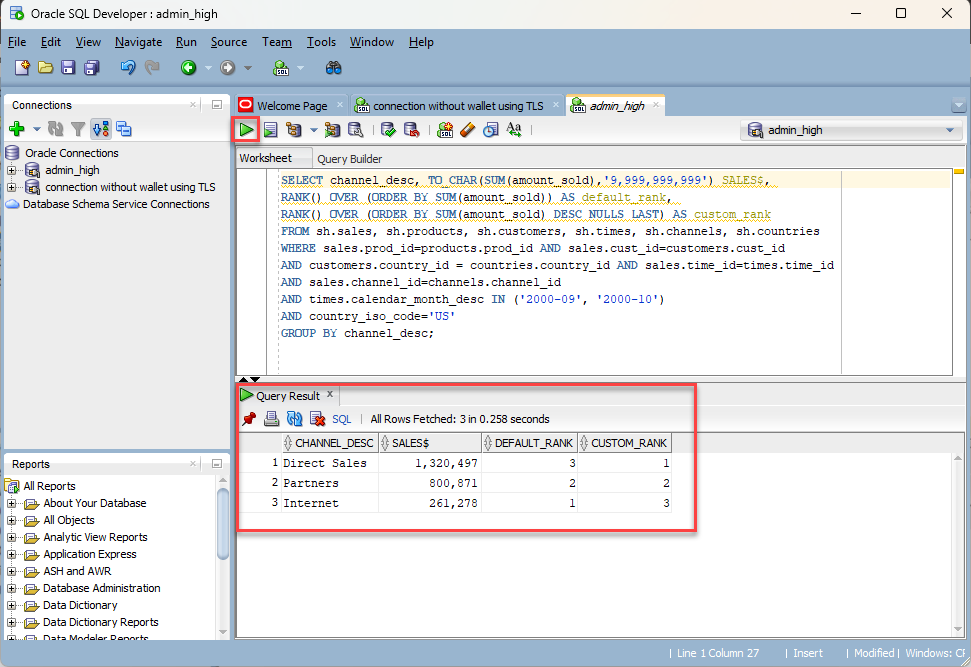

# Connect Securely to Autonomous Data Warehouse with SQL Developer with or without a Connection Wallet

## Introduction

Oracle Autonomous Data Warehouse (ADW) and Autonomous Transaction Processing (ATP) accept only secure connections to Oracle Autonomous Databases. This lab walks you through the steps to connect Oracle SQL Developer desktop client securely to your autonomous database, both with and without a **connection wallet**. First, you will learn how to securely connect SQL Developer without a wallet using TLS connections. Then, you will  download and configure a connection wallet as another method to securely connect SQL Developer to your autonomous database.

Estimated Time: 20 minutes

(Previous labs in this workshop used **SQL Worksheet** from **Database Actions**, to access an autonomous database directly from the cloud console without a connection wallet. SQL Worksheet is a convenient browser-based tool, offering a subset of the features and functions in Oracle SQL Developer.)

> **Note:** While this lab uses ADW, the steps are identical for connecting to an autonomous database in ATP.

Watch the video below for a quick walk-through of the lab.
[Connect SQL Developer Securely With or Without a Connection Wallet](videohub:1_jszjfjm1)

### Objectives

- Learn how to connect to your Autonomous Data Warehouse with Oracle SQL Developer, with and without using a connection wallet
- Learn how to connect SQL Developer without a wallet using TLS connections
- Learn how to download and configure a connection wallet
- Query your autonomous database with Oracle SQL Developer

### Prerequisites
This lab assumes you have:

- Performed the previous lab on provisioning an Oracle Autonomous Database

## Task 1: Download and Install Latest Version of SQL Developer

Use the latest version of Oracle SQL Developer, version 24.3.1 as of the August 2025 update of this workshop. This task will walk you through downloading and installing Oracle SQL Developer in a Windows environment.

1. Download the latest version of Oracle SQL Developer from [SQL Developer download page](https://www.oracle.com/database/sqldeveloper/technologies/download/) for your appropriate platform. In this example, we will click the **Download** link associated with **Windows 64-bit with JDK 17 included**. 

    

    >**Note:** If an **Oracle License Agreement** message box is displayed, you must check the **I reviewed and accept the Oracle License Agreement** check box before you can proceed. Next, click the **Download** button. You will be prompted to login to your single-sign-on account. Follow the prompts.

    The SQL Developer **.zip** file is downloaded to our **Downloads** folder in our example.

    

2. Right-mouse click the downloaded file name, and then select **Extract All** from the context menu. 

    

    Select the extract folder location, and then click **Extract**. In our example, we chose the **Documents** folder.

     

3. Navigate to the extracted **sqlseveloper** folder location, Documents in our example, and then expand the folder. To start SQL Developer, double-click the **`sqldeveloper.exe`** file.

    

4. When you launch SQL Developer the first time, it will ask you if you want to import a project. Select **No**.

    

    SQL Developer is started. In the **Oracle Usage Tracking** dialog box, click **OK**.

    

## Task 2: Connect to the Database Using SQL Developer Securely Without a Wallet

The first of two methods we'll learn for establishing a secure SQL Developer connection to an autonomous database is to connect securely without a wallet, using TLS authentication.

When you provisioned your autonomous database instance with a network access type of "Secure access from everywhere", by default, mTLS authentication was required, and the only ways to enable TLS in addition to mTLS are either to define an access control list (ACL) or to use a private endpoint. For this lab, you will configure an **IP ACL** (access control list). Then you will be able to uncheck the "Require mutual TLS" checkbox, which in turn will enable TLS for connecting without a wallet.

For detailed information on allowing TLS connections, see the [Update your Autonomous Database Instance to Allow both TLS and mTLS Authentication] (https://docs.oracle.com/pls/topic/lookup?ctx=en/cloud/paas/autonomous-data-warehouse-cloud/cswgs&id=ADBSA-GUID-6A34B30A-3692-4D1F-8458-FD8F32736199) documentation.

<if type="livelabs">
>**Note:** If you are using a Sandbox reservation environment (green button), then your database name will be a little different than what is shown in this lab. 
</if>

To create a new TLS connection to Autonomous AI Database:

1. Define an **IP ACL** (access control list). Navigate to your **`ADW_Finance_Mart`** Autonomous AI Database instance details page. On the **Autonomous AI Database Information** tab, scroll-down to the **Network** section, and then click **Edit** next to **Access control list** field.

    

2. In the **Access control list** dialog box, you might normally accept the default IP notation type of **IP Address**, and then enable the **Add My IP Address** slider to add your IP address. Your computer's IP address would be added as a value; However, for this lab that you might be running in any one of a variety of different environments, let's make a different selection.

    

3. For this lab, click the **IP notation type** drop-down list and select **CIDR block**. In the **Values** field, enter **`0.0.0.0/0`**.

    

4. Click **Save**. Wait a minute for the database status to change from **UPDATING** to **AVAILABLE**.

5. On the **Autonomous Database details** page, in the **Network** section, note that the **Access type** has automatically changed from the default access type that you used when provisioning the database, **Allow secure access from everywhere**, to **Allow secure access from specified IPs and VCNs**. Click the **Edit** button next to **Mutual TLS (mTLS) authentication**.

    

6. In the **Edit mutual TLS authentication** dialog box, disable the slider that requires mutual TLS (mTLS) authentication, and then click **Save**. Wait a minute for the database status to change from **UPDATING** to **AVAILABLE**.

    

    When the update finishes, note that the Mutual TLS (mTLS) Authentication field has changed from **Required** to **Not required**.

    

Next, perform the following steps to obtain the **TLS connection string**.

7. On the **Autonomous Database details** page, click **Database connection**.

    

8. In the **Database connection** panel, scroll-down to the **Connection strings** section. Click the **TLS authentication** drop-down list, and then select **TLS**. This will enable SQL Developer and other applications to connect to your Autonomous Database securely without a wallet. The available connection strings are displayed.

9. Choose one of the displayed connection strings, such as **`adwfinance_high`**. Next, click the **Actions** icon (ellipsis) and then click **Copy** to copy that connection string. Paste the connection string to a text editor of your choice such as notepad in MS-Windows as you will need this information later.

    

    

10. Click **Cancel** to close the **Database connection** dialog box.

11. Start Oracle SQL Developer if you have not done that yet. In the **Connections** panel, click the **New Connection....** button (big green plus sign).

    

12. In **New / Select Database Connection** dialog box, specify the following information:
    * **Name:** Enter a name for this connection, such as **`connection without wallet using TLS`**.
    * **Username:** Enter the database username. You can either use the default administrator database account **`ADMIN`** provided as part of the service or create a new schema, and use it.
    * **Password:** Enter the password you created for the database user such as **`Training4ADW`**.
    * **Connection Type:** Select **`Custom JDBC`**.
    * **Custom JDBC URL:** Enter the following:    
    **`jdbc:oracle:thin:@`** followed by the connection string you copied in **Step 5**.

        

        For example, the value for the **Custom JDBC URL** field might look something like this (where we masked some values with XXXXXXXXXXXXXX):

        ```
        jdbc:oracle:thin:@(description= (retry_count=20)(retry_delay=3)(address=(protocol=tcps)
        (port=1521)(host=XXXXXXXXXXXXXX.us-phoenix-1.oraclecloud.com))(connect_data=(service_name=XXXXXXXXXXXXXX_databasename_high.adb.oraclecloud.com))
        (security=(ssl_server_cert_dn="CN=adwc-XXXXXXXXXXXXXX.region.oraclecloud.com, OU=Oracle BMCS US, O=Oracle Corporation, L=Redwood City, ST=California, C=US")))
        ```

    >**Note:** When you copy the connection string, the values for **region** and **databasename** are for your Oracle Autonomous Database instance.

13. Click **Test** to test your connection. If the **Status: Success** message is displayed in the bottom left hand side of the dialog box, click **Save** to save your connection. Next, click **Connect** to connect to the database.

    

14. A **Connection Information** dialog box is displayed. Enter the password associated with the **`admin`** user, and then click **OK**.

    

    You are now connected to your **`ADW_Finance_Mart`** database instance using your new database connection that you created and saved. You can drill down on the new connection in the **Connections** panel to display the objects in the **`ADW_Finance_Mart`** database instance.

## Task 3: Download the Connection Wallet

In addition to connecting SQL Developer securely without a wallet using TLS, you'll now learn how to connect securely using a connection wallet containing your credentials.
You can download the wallet either from the instance's **Autonomous Database details** page or from the ADW or ATP service console.

1. On your **`ADW_Finance_Mart`** database instance details page, click **Database connection**.

    

2. In the **Database connection** panel, in the **Download client credentials (Wallet)** section, accept the default **Wallet type** selection, **`Instance wallet`**. This wallet type is for a single database only. This provides a database-specific wallet. Next, click **Download wallet**.

    

    >**Note:** Oracle recommends that you provide a database-specific wallet, using Instance Wallet, to end users and for application use whenever possible. Regional wallets should only be used for administrative purposes that require potential access to all Autonomous Databases within a region.

3. In the **Down wallet** panel, specify a password of your choice for the wallet such as **`Training4ADB`**. Save this password as you will need it when you connect to the database via SQL Developer later. The password is also used as the JKS Keystore password for JDBC applications that use JKS for security. Click **Download** to download the wallet file to your client machine.

    >**Note:** If you are prevented from downloading your Connection Wallet, it may be due to your browser's pop-up blocker. Please disable it or create an exception for Oracle Cloud domains.

    

4. Once the wallet is downloaded, click **Cancel** to close the **Database connection** panel.

    <if type="freetier">
    
    </if>

    <if type="livelabs">
    
    </if>

## Task 4: Connect to the Database Using SQL Developer with a Wallet

Create a new database connection in SQL Developer using the default administrator account **`admin`**.

1. Start Oracle SQL Developer if you have not done that yet. In the **Connections** panel, click the **New Connection....** button (big green plus sign).

    

2.  In **New / Select Database Connection** dialog box, specify the following information:
    * **Name:** Enter a name for this connection, such as **`admin_high`**.
    * **Username:** Enter the database username. You can either use the default administrator database account **`ADMIN`** provided as part of the service or create a new schema, and use it.
    * **Password:** Enter the password you created for the database user such as **`Training4ADW`**. Click the **Save Password** checkbox so that you won't be prompted to enter the password.
    * **Connection Type:** Select **`Cloud Wallet`**.
    * **Configuration File:** Click **Browse** and navigate to your downloaded wallet file.
    * **Service:** There are 3 pre-configured database services for each database. Pick **<*databasename*>\_high** for this lab. For example, if the database you created was named **`adwfinance`**, select **`adwfinance_high`** as the service.

        

3. Test your connection. Click the **Test** button. If test is successful, the **Status: Success** message is displayed.

    

4. Save your connection information. Click **Save**.

    

5. Connect to your database, Click **Connect**. Enter your password in the **Connection Information** dialog box, and then click **OK**. An entry for the new connection will appear under Connections. 

    

6. If you are behind a VPN or Firewall and this Test fails, make sure you have [SQL Developer 18.3](https://www.oracle.com/technetwork/developer-tools/sql-developer/downloads/index.html) or higher. This version and above will allow you to select the **`Use HTTP Proxy Host`** option for a Cloud Wallet type connection. While creating your new ADW connection here, provide your proxy's Host and Port. If you are unsure where to find this, you may look at your computer's connection settings or contact your Network Administrator.

## Task 5: Query Your Autonomous Database with SQL Developer

The **`SH`** schema provides a small data set that you can use to run the sample queries in the [Database Data Warehousing Guide](https://docs.oracle.com/en/database/oracle/oracle-database/19/dwhsg/sql-analysis-reporting-data-warehouses.html#GUID-1D8E3429-735B-409C-BD16-54004964D89B). For example, the following query shows you how the SQL function RANK() works:

1.  Copy and paste the following **`SH`** query into your **`admin_high`** SQL Worksheet, and then click the **Run Statement** icon in the Worksheet toolbar.

    ```
    <copy>
    SELECT channel_desc, TO_CHAR(SUM(amount_sold),'9,999,999,999') SALES$,
    RANK() OVER (ORDER BY SUM(amount_sold)) AS default_rank,
    RANK() OVER (ORDER BY SUM(amount_sold) DESC NULLS LAST) AS custom_rank
    FROM sh.sales, sh.products, sh.customers, sh.times, sh.channels, sh.countries
    WHERE sales.prod_id=products.prod_id AND sales.cust_id=customers.cust_id
    AND customers.country_id = countries.country_id AND sales.time_id=times.time_id
    AND sales.channel_id=channels.channel_id
    AND times.calendar_month_desc IN ('2000-09', '2000-10')
    AND country_iso_code='US'
    GROUP BY channel_desc;
    </copy>
    ```

    The results are displayed in the **Script Output** tab.

    

You may now **proceed to the next lab**.

## Want to Learn More?

* [Network configuration options](https://docs.oracle.com/en/cloud/paas/autonomous-database/adbsa/autonomous-network-access.html#GUID-D2D468C3-CA2D-411E-92BC-E122F795A413)
* [Connecting to Your Autonomous Database Has Never Been Easier](https://blogs.oracle.com/datawarehousing/post/connecting-your-autonomous-database-has-never-been-easier)

## Acknowledgements

* **Author:** Lauran K. Serhal, Consulting User Assistance Developer
* **Last Updated By/Date** - Lauran K. Serhal, October 2025
