# Analyze Data with Autonomous AI Database (ADB) Excel Add-in

## Introduction

Oracle Autonomous AI Database for Excel integrates Microsoft Excel spreadsheets with the Autonomous AI Database to retrieve and analyze data from Analytic Views in the database. You can also directly run SQL queries to view their results in the worksheet.

Estimated Time: 10 minutes

### Objectives

In this lab, you will:

* Install the Excel Add-in from the Microsoft AppSource
* Install the Excel Add-in from Database Actions
* Import a connection to manage and connect to multiple Autonomous AI Databases with a single add-in
* Run Direct SQL Queries in an Excel Worksheet
* Uninstall the add-in

### Prerequisites

This lab requires completion of [Lab 1: Set Up the Workshop Environment](https://oracle-livelabs.github.io/adb/shared/adw-data-lake/build-data-lake/workshops/freetier/index.html?lab=setup-workshop-environment) from the **Contents** menu on the left.

## Task 1: Install the Excel Add-in from the Microsoft AppSource

In this task, you'll learn how to install Oracle Autonomous AI Database for Excel add-in from the Microsoft AppSource and also from ADB's Database Actions. In task 2, you will learn a second method of installing the Add-in.

**Prerequisite**

* You must have an active Microsoft account (https://appsource.microsoft.com/) or an account with access to Microsoft 365, https://www.microsoft365.com/
* You can access the web version of Excel or the (Licensed version) from desktop.
* You must verify within your organization whether external apps from AppSource are permitted to be installed in your Microsoft 365 accounts. If not, you can Install the add-in from the ADB Database Actions.

You can install the Oracle Autonomous AI Database for Excel from the Microsoft AppSource.

1. Start Excel and open a new or existing workbook.

    

    >**Note:** You can access the web version of Microsoft Excel with your Microsoft AppSource account using your Microsoft 365 Copilot (earlier known as MS Office) app.

2. From the **Home** menu, click **Add-ins** in the ribbon.

    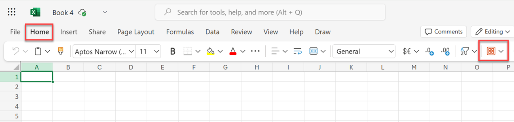

3. In the Search text box, search for **Oracle Autonomous**. The **Oracle Autonomous AI Database Add-in for Excel** is displayed. Click **Add**.

    

    > **Note:** You also add the Excel Add-in as follows: Click **More Add-ins** > **STORE** tab > Search for **oracle autonomous** > **Add** > **Continue**.

    The **Oracle Autonomous AI Database** menu is added. Click the menu to display the available options.

    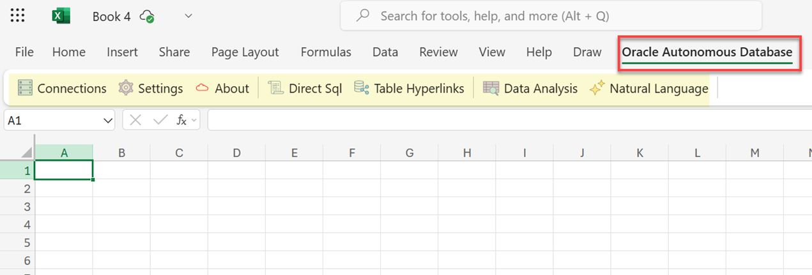

You can now connect to your Oracle Autonomous AI Database instance to analyze and query the data. You will learn how to [connect to your ADB instance](#task7importaconnection) and [run Direct SQL queries in an Excel worksheet](#task8rundirectsqlqueriesinanexcelworksheet) later in this task.

**(Optional) How to Uninstall the add-in**

If you have installed Oracle Autonomous AI Database for Excel for Windows using the Microsoft AppSource, you can uninstall it as follows:

1. Click the **Add-ins** icon from the **Home** menu.

    

2. In the **My Add-ins** dialog box, click **+ More Add-ins**.

    

3. In the **Office Add-ins** dialog box, click the **MY ADD-INS** tab, right-click **Oracle Autonomous AI Database Add-in for Excel**, and then click **Remove** from the context menu.

    

4. A confirmation box is displayed. Click **Remove**. The Add-in is removed. Click the **X** control to exit the dialog box

    

    The **Oracle Autonomous AI Database Add-in for Excel** is removed from the menu bar.

    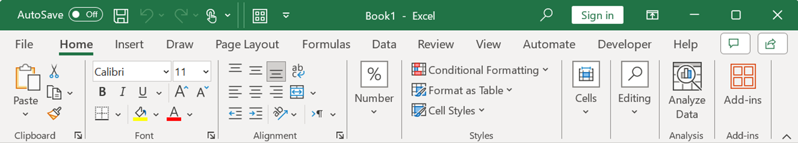

## Task 2: Install the Excel Add-in from Database Actions

You can also install the add-in from the Oracle Autonomous AI Database **Database Actions**. This is accessed by users with an Oracle Account.

>**Note:** If you already installed the add-in using the Microsoft AppSource as explained in Task 1, you don't have to perform this task.

**Prerequisites**

* You must log in to your Autonomous AI Database instance as the **`admin`** user.
* You can install the add-in only from the licensed desktop version of Microsoft Excel.

In this task, you will learn how to install the add-in on a MS-Windows machine. If you are using a Mac, see the documentation for information on how to install the add-in on a Mac.

> **Note:** The Oracle Autonomous AI Database for Excel is supported on Windows 10 and Windows 11 operating systems running Microsoft Excel 365.

To install the Oracle Autonomous AI Database for Excel, download the **`oracleplugin.zip`** file and extract it to get the `install.cmd` script file from your Database Actions instance.

**Download the add-in**

1. Navigate to the **Database Actions Launchpad**.

2. Click the **Downloads** tab, and then click the **Download Microsoft Excel/Google Sheets add-in** tab.

    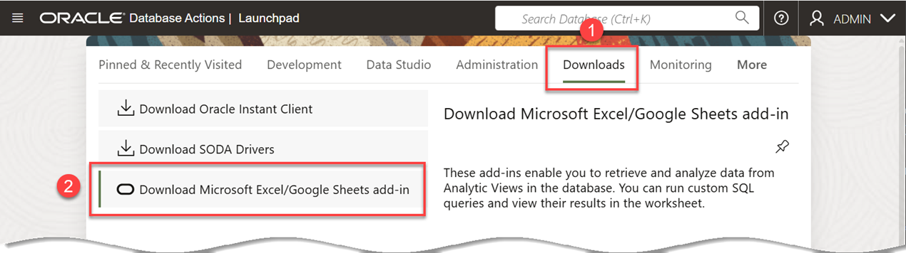

3. The **Microsoft Excel** tab is selected by default. Click **Download Add-in**.

    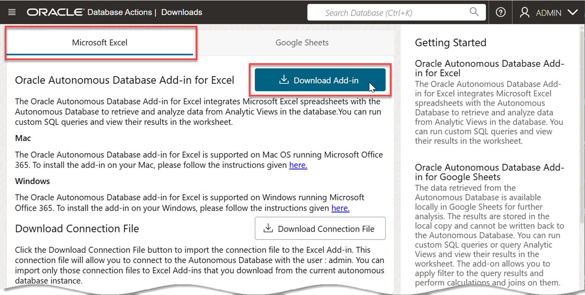

    The **`oracleplugin.zip`** file is downloaded to your browser's **Downloads** folder.

4. Extract the **`oracleplugin.zip`** file to a new folder. In your browser's **Downloads** folder, click the **`oracleplugin.zip`** file, and then click **Extract all**.

    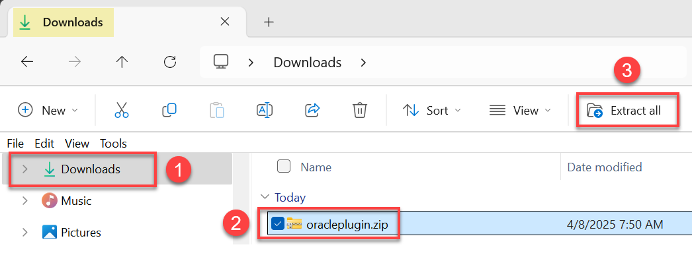

5. The **Select a Destination and Extract Files** dialog box is displayed. Accept the default extract folder location and then click **Extract**.

    

    The extracted folder contains an installer file, `install.cmd`, a `manifest.xml` file, and a `readme.txt` file which contains useful information.

    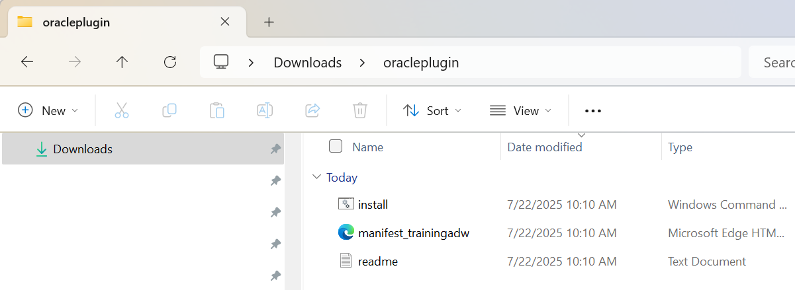

**Install the add-in**

1. Quit Excel before you run the installer.

2. Right-click the `install.cmd` file, and select **Run as administrator** from the context menu.

    

    > **Note:** You must have Administrator privileges to install the Excel add-in for Oracle Autonomous AI Database successfully.

3. The script runs in a command prompt window. If it detects a previous installation of the add-in, you can either cancel out of the installation or replace the previous installation. In our example, we will replace the previous installation. Enter **[R]** at the command prompt.

    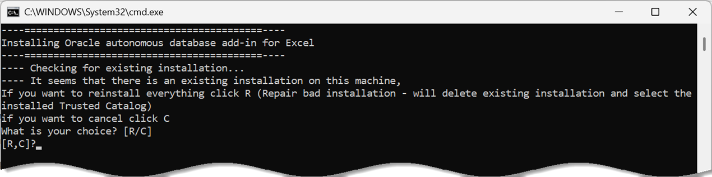

4. When the scripts completes, press any key to exit.

    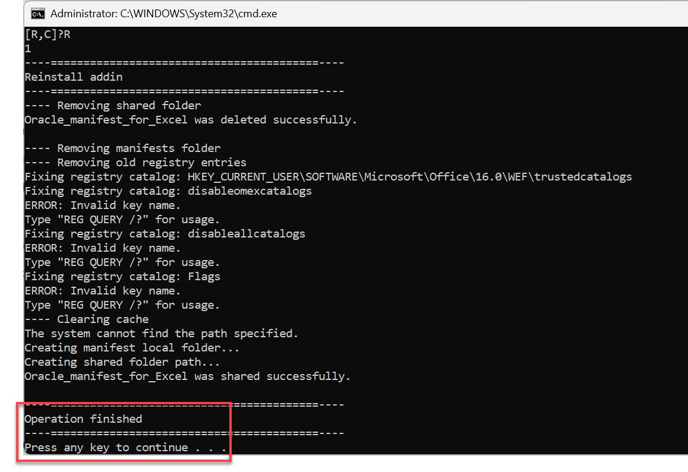

5. Start Excel and open a new or an existing workbook.

6. From the **Home** menu in the Excel ribbon, click **Add-ins**.

    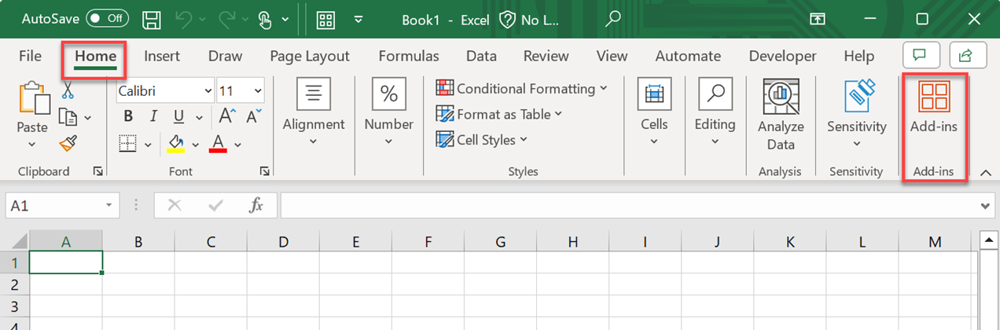

    >**Note:** You can add the **Add-ins** tool to your ribbon, if needed, by using the **Customize Quick Access Toolbar** > **More Commands** from the drop-down menu in the Excel title bar.

    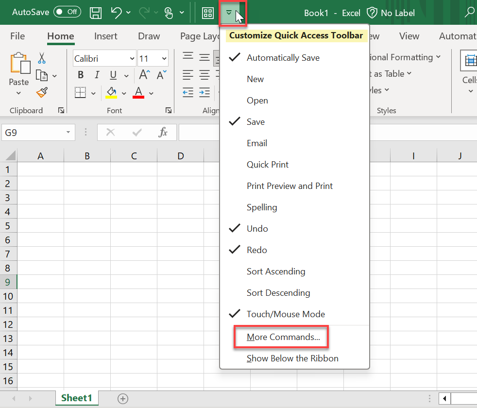

7. Click **Get Add-ins**.

    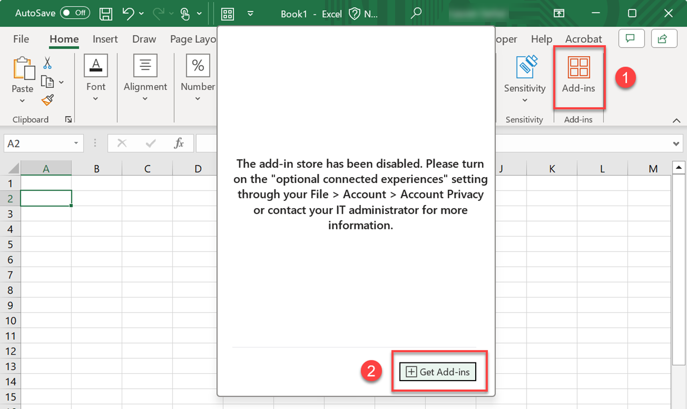

8. On the **Office Add-ins** pop-up window, click **SHARED FOLDER**. Next, click the **Oracle Autonomous AI Database** tile, and then click **Add**.

    

9. The new **Oracle Autonomous AIDatabase** ribbon tab is displayed in MS Excel. Click the tab to display the available options.

    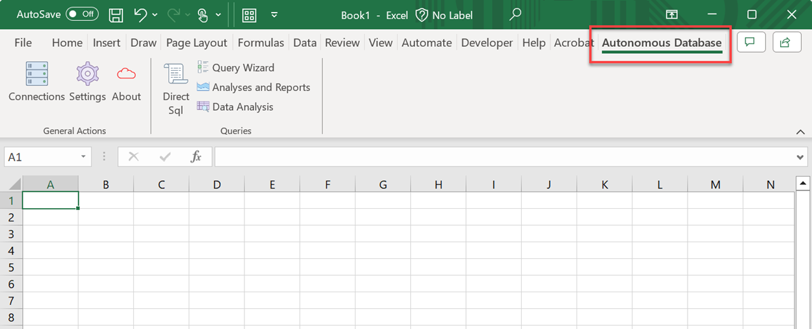

**(Optional) Uninstall the add-in**

If you have installed the **Oracle Autonomous AI Database for Excel** add-in for Windows using Database Actions, you can uninstall it as follows:

1. Delete the **`manifest.xml`** file from the **`C:\Users\USERNAME\AppData\Local\Oracle\Autonomous Database\manifest`** folder where `USERNAME` is your own username.

    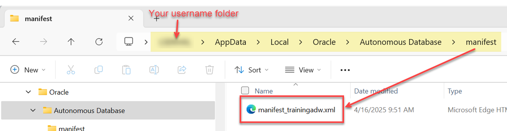

    >**Note:** On a MS Windows 11 system, you can quickly navigate to this folder as follows: Press the Windows **[key + R]**. Next, enter **`%localappdata%`** as the path, and then and press **[Enter]**. This will directly open the `Local` folder within the AppData folder.

    

2. In Excel, click the **Home** menu, and then click the **Add-ins** icon.

3. In the **Add-ins** window, click **+ Get Add-ins**.

4. In the **Office Add-ins** window, click the **SHARED FOLDER** link, and then click **Refresh**.

    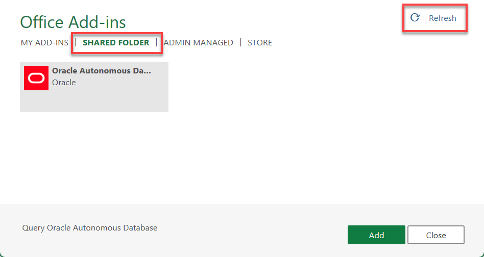

    The add-in is removed. Click the **X** control to exit the window.

    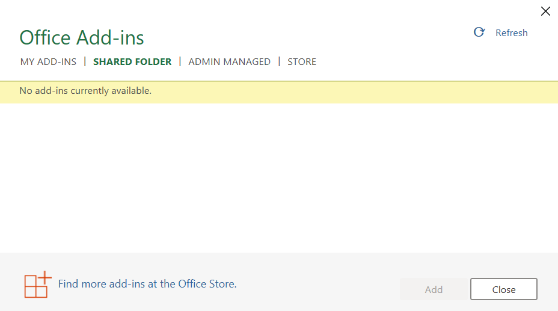

5. The **Oracle Autonomous AI Database Add-in for Excel** add-in is removed from the menu bar.

    

## Task 3: Import a Connection

When you start the Excel add-in, you can create a connection that you can use going forward. The connections feature lets you manage and connect to multiple Autonomous Databases with a single add-in. You can create multiple connections; however, only one connection can remain active at a time. The **Connection** panel lets you connect to the Oracle Autonomous AI Database through a connection where you provide the login credentials and access the Oracle Autonomous AI Database instance. For additional information, 
see [Connection Management
](https://docs.oracle.com/en/database/oracle/sql-developer-web/sdwad/connection-management.html).

In this task, you will learn how to import a `.JSON` connection file that you can download from the **Database Actions Launchpad**.

1. Navigate to the **Database Actions Launchpad**.

2. Click the **Downloads** tab, and then click the **Download Microsoft Excel/Google Sheets add-in** tab.

    

3. The **Microsoft Excel** tab is selected by default. Click **Download Connection File**.

    

    A connection file named similar to **`General_connection_..._aaaaaaaah...ca.json`** is downloaded to your browser's **Downloads** folder.

4. Return to your Excel Sheet. Click the **Oracle Autonomous AI Database** tab, and then click **Connections** from the **General Actions** section.

    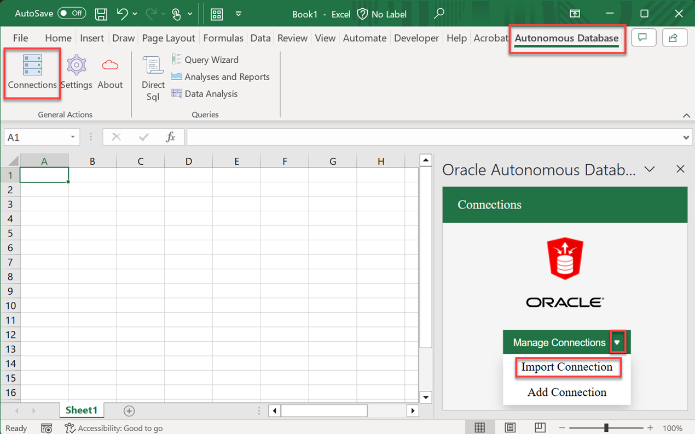

    The **Oracle Autonomous AI Database** task pane is displayed.

5. Click the **Manage Connections** drop-down list and select **Import Connection**.

6. In the **Import** section, click the text box to select the downloaded connection file. Navigate to your downloaded file location, and then select it.

7. The new connection is added. Click the checkbox next to the connection name, and then click **Import**.

    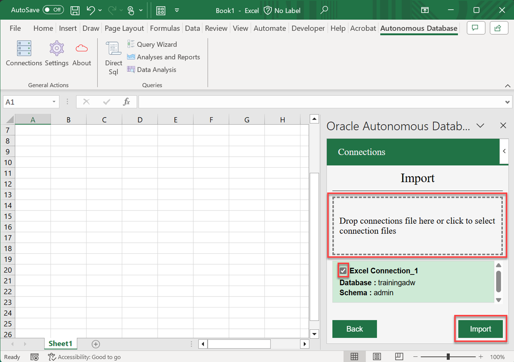

    An **Imported connections successfully** message is displayed.

    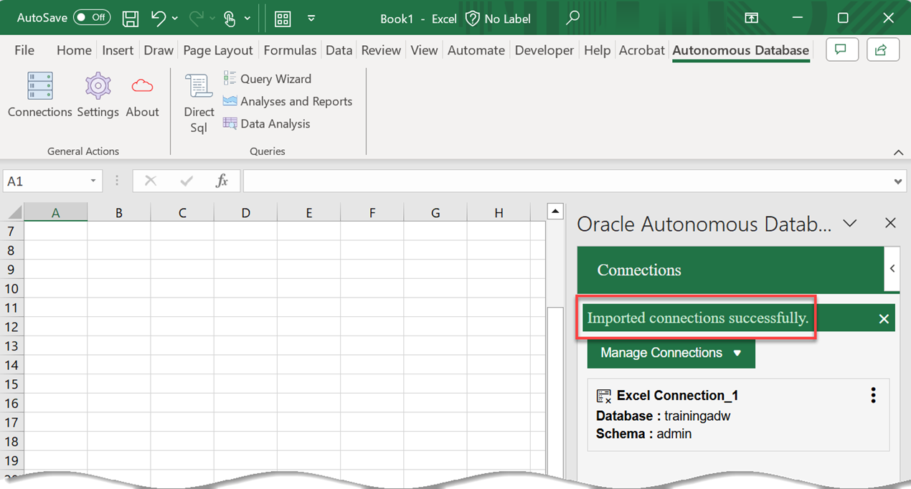

    >**Important:** If the displayed schema name is not **`admin`** as shown in the following screen capture example, you'll need to edit the name; otherwise, connecting to your ADB instance will fail. **This is a reported issue**. To correct this issue, click the **Actions** icon (three vertical dots), and then click **Edit**.

    

    Replace the string of characters in the **Schema Name** field with **`admin`**, and then click **Save**.

    

    The correct schema name is displayed.

    

8. Click the **Actions** icon (three vertical dots) in the connection file section, then click **Connect**.

    

9. On the **Sign-in** page, enter your username and password (`admin` user) that you used when you provisioned your ADB instance. Next, click **Sign in**.

    

10. On the **Oracle REST Data Services** dialog box, click **Approve** to allow the connection to ADB.

    

11. If the connection is successful, a green checkmark is displayed next to the connection file name.

    

## Task 4: Run Direct SQL Queries in an Excel Worksheet

Now that you have a connection to your ADB instance, you will run a simple query from the Excel worksheet. The Oracle Autonomous AI Database for Excel lets you run Direct SQL queries to work with your data in an Excel worksheet. With the add-in, you can create a table and insert, update and delete rows from the existing tables or views. You can view the results in the current worksheet or different worksheets. To run a query using the add-in, run Excel, and create a blank workbook using the standard Excel workbook file format. For additional information, see the [Query an Analytic View in an Excel worksheet](https://docs.oracle.com/en/database/oracle/sql-developer-web/sdwad/query-av.html).

1. Make sure you are still connected to your ADB instance in Excel, if not, you'll need to re-connect. In the Excel ribbon, Click the **Autonomous AI Database** tab. In the **Queries** section on the ribbon, click **Direct Sql**.

    

    The **Direct SQL query** region is displayed in the **Oracle Autonomous AI Database** task pane. By default, the tables in your schema are displayed. You can click **Views** to display the views in your schema.

    

2. Let's query the **`custsales`** table. Right-click the **`custsales`** table and click **Select** from the context menu.

    > **Note:** You can also query individual columns in the chosen table.

    

3. The table query is displayed in the **Write a Query** section. Click the **Run** icon to run the SQL query in the query editor.

    

    In the **Select worksheet** section, you can click the **+** button (Create new worksheet) to add a new worksheet. If you'd like to display the results of a new query in the new worksheet, select it from the drop-down menu.

4. The **Get entire results set** dialog box is displayed. Click **No**.

    

5. The **Query Info** section of the worksheet displayed the ADB instance URL, the user, and the table columns. The **Result Data** section displays the query result.

    

## Learn more

* [Using Oracle Autonomous AI Database Serverless](https://docs.oracle.com/en/cloud/paas/autonomous-database/adbsa/index.html)
* [Oracle Autonomous AI Database for Excel](https://docs.oracle.com/en/database/oracle/sql-developer-web/sdwad/add-in.html)
* [Oracle Cloud Infrastructure Documentation](https://docs.cloud.oracle.com/en-us/iaas/Content/GSG/Concepts/baremetalintro.htm)

## Acknowledgements

* **Author:** Lauran K. Serhal, Consulting User Assistance Developer
* **Contributors:**
    * Ekrem Soylemez, Vice President
    * Manisha Mati, Principal User Assistance Developer
    * Yossi Cohen, Principal Software Engineer
* **Last Updated By/Date:** Lauran K. Serhal, November 2025

Data about movies in this workshop were sourced from Wikipedia.

Copyright (C) 2025 Oracle Corporation.

Permission is granted to copy, distribute and/or modify this document
under the terms of the GNU Free Documentation License, Version 1.3
or any later version published by the Free Software Foundation;
with no Invariant Sections, no Front-Cover Texts, and no Back-Cover Texts.
A copy of the license is included in the section entitled [GNU Free Documentation License](https://oracle-livelabs.github.io/adb/shared/adb-15-minutes/introduction/files/gnu-free-documentation-license.txt)
