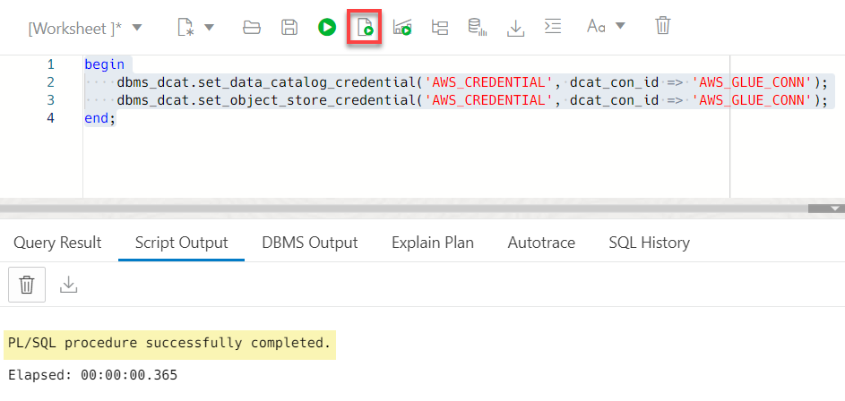
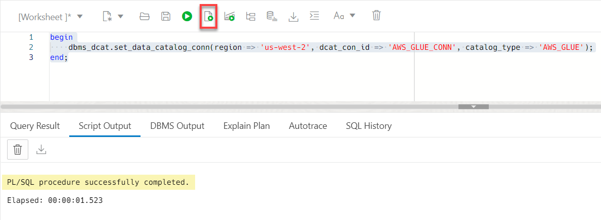
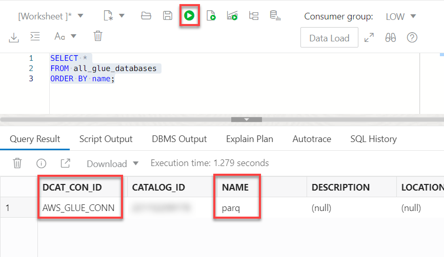
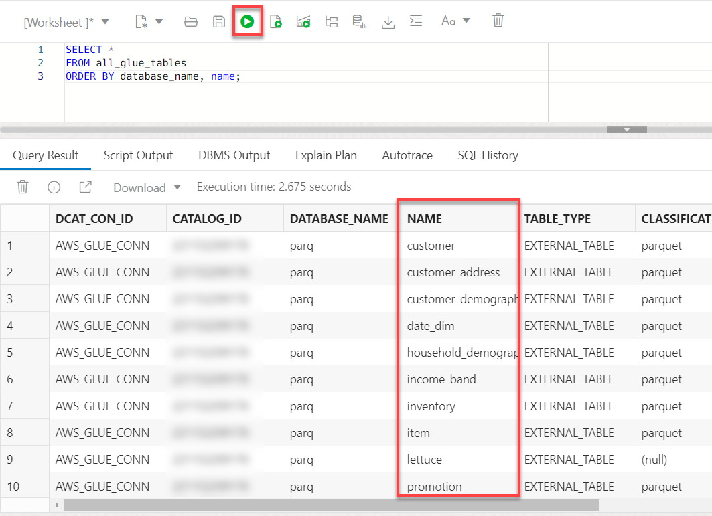
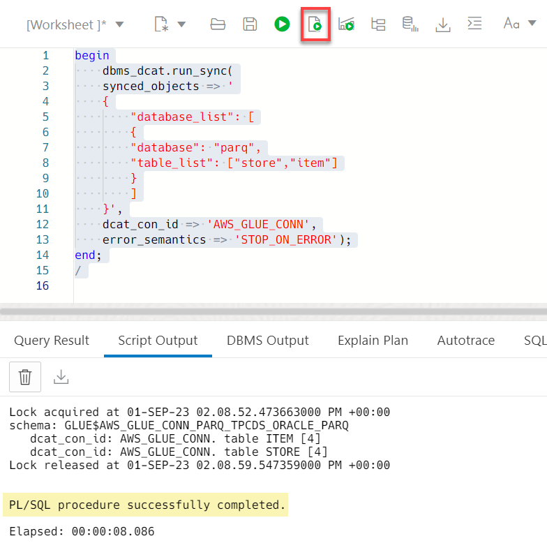
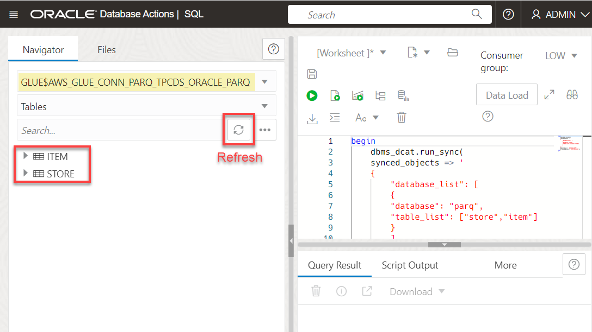
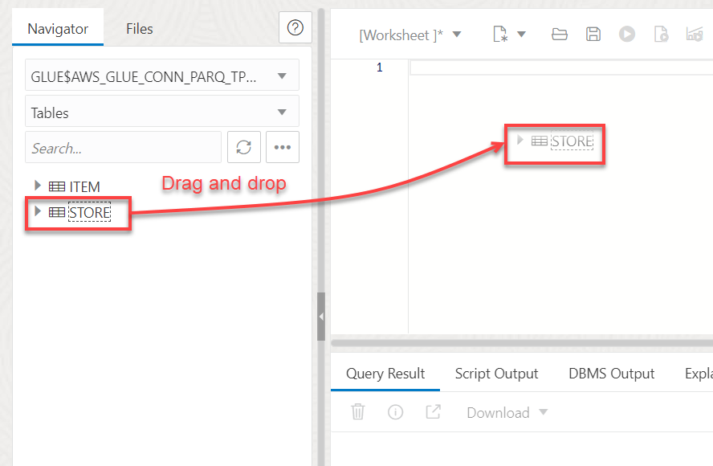
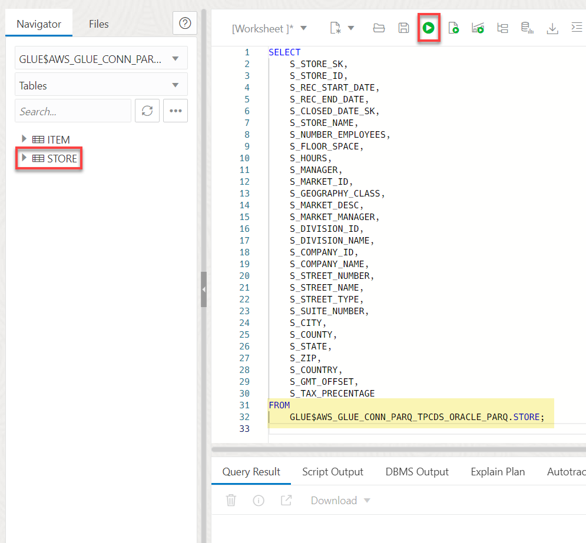
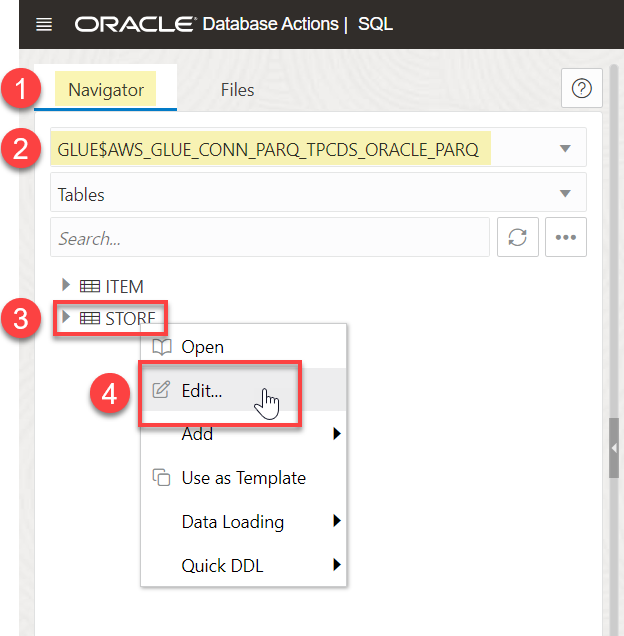
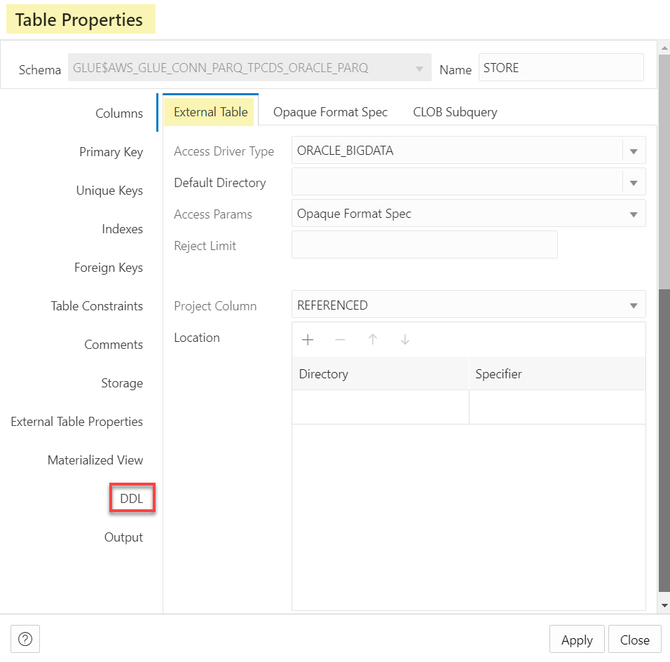

# Integrate ADW with AWS Glue Data Catalogs

## Introduction

Amazon AWS Glue Data Catalog is a centralized metadata management service that helps data professionals discover data and supports data governance in AWS cloud.

Autonomous Database allows you to synchronize with Amazon Web Service (AWS) Glue Data Catalog metadata. A database external table is automatically created by Autonomous Database for every table harvested by AWS Glue about data stored in Amazon Simple Storage Service (S3). Users can query data stored in Amazon S3 from Autonomous Database without having to manually derive the schema for the external data sources and create external tables.

Synchronizing with AWS Glue Data Catalog has the same properties as synchronizing with OCI Data Catalog. Synchronization is dynamic, keeping the database up-do-date with respect to changes to the underlying data, reducing administration cost as it automatically maintains hundreds to thousands of tables.

Estimated Time: 10 minutes

### Objectives

In this lab, you will:

* Navigate to your AWS Glue Data Catalog (if you have one) and review the available databases and tables.
* Create the required AWS credentials for the AWS Glue Data Catalog and Object Store.
* Set up a connection to the AWS Glue instance.
* Synchronize the metadata in Glue with Autonomous Database so that you can create external tables on
top of the metadata.

### Prerequisites

This lab requires the completion of the following labs/tasks from the **Contents** menu on the left:

* **Lab 1**: Set up the Workshop Environment > **Task 3**: Create an Autonomous Data Warehouse Instance.

> _**Note:** This is not a hands-on lab unless you have an AWS account and can access an AWS Glue instance that contains at least one database and one table._

## Task 1: Navigate to the AWS Glue OCI Data Catalog Page

In this task, you will navigate to an AWS Glue Data Catalog instance and explore a database and its tables. In the next task, you will connect to this Glue Data Catalog instance from within ADW and link to some tables to create external tables over those tables.

1. Navigate to the **AWS Management Console** page. Copy and paste the following script into your Web browser's address bar, and then click the **ENTER** key on your keyboard.

    ```
    <copy>
    https://aws.amazon.com/console/
    </copy>
    ```

    

2. On the **Sign in as IAM user** page, enter your Account ID, IAM user name, Password, and then click **Sign in**.

    

    The **Console Home** page is displayed.

3. Open the **Services** menu and click **Analytics**. Under **Analytics**, click **AWS Glue**.

    

    The **AWS Glue** page is displayed.

4. On the **AWS Glue** page, drill-down on the **Data Catalog** node in the left navigation pane, if not already expanded, to see the available databases and tables in the Data Catalog. An AWS Glue database represents a collection of relational table definitions, organized in a logical group. Each AWS Glue data catalog instance manages multiple databases.

    

5. Click **Databases** to display the available databases in the Data Catalog.

    

    In this example, we have only one database in our Data Catalog. We will work with the **parq** database in this lab.

    >**Note:** You can click the **Tables** node to display the tables in all databases (if you have more than one database).

6. Click the **parq** database to display its tables. There are **23** tables in this database. An AWS Glue table represents a relational table over data stored in the AWS cloud.

    

## Task 2: Navigate to the SQL Worksheet

1. Log in to the **Oracle Cloud Console**, if you are not already logged in.

2. Open the **Navigation** menu and click **Oracle Database**. Under **Oracle Database**, click **Autonomous Database**.

3. On the **Autonomous Databases** page, click your **ADW-Data-Lake** ADB instance.
    

4. On the **Autonomous Database details** page, click the **Database actions** drop-down list, and then click **SQL**.

    

    The SQL Worksheet is displayed.

    

## Task 3: Associate AWS Glue with Autonomous Database

In this task, you will create the required credentials in Autonomous Database that enables you to access the AWS Data Catalog and the datasets in the Amazon S3 Object Store.

1. Create an AWS Credential that enables Autonomous Database to access the data in Amazon S3. If you have your own AWS access ID and secret key, replace the **`aws-access-id`** and **`aws-secret-id`** place holders in the following script with those values. Copy and paste the following script into your SQL Worksheet, and then click the **Run Script** icon in the Worksheet toolbar.

    ```
    <copy>
    begin
        dbms_cloud.create_credential('AWS_CREDENTIAL','enter-aws-access-id-here','enter-aws-secret-id-here');
    end;
    </copy>
    ```

    

2. Associate the new credential with the target AWS Glue Data Catalog instance and the Amazon S3 object storage bucket that contains the dataset that you will use. The `dcat_con_id` argument value is a user-defined string. It is a unique Data Catalog connection identifier. The default is `Null`. Copy and paste the following script into your SQL Worksheet, and then click the **Run Script** icon in the Worksheet toolbar.

    ```
    <copy>
    begin
        dbms_dcat.set_data_catalog_credential('AWS_CREDENTIAL', dcat_con_id => 'AWS_GLUE_CONN');
        dbms_dcat.set_object_store_credential('AWS_CREDENTIAL', dcat_con_id => 'AWS_GLUE_CONN');
    end;
    </copy>
    ```

    

3. Set up a connection to the AWS Glue Data Catalog. You specify the region where your AWS Catalog is located, the data catalog identifier, and the catalog type as **AWS_Glue**. Copy and paste the following script into your SQL Worksheet, and then click the **Run Script** icon in the Worksheet toolbar.

    ```
    <copy>
    begin
        dbms_dcat.set_data_catalog_conn(region => 'us-west-2', dcat_con_id => 'AWS_GLUE_CONN', catalog_type => 'AWS_GLUE');
    end;
    </copy>
    ```

    

    >**Note:** You are only allowed to create one connection to either your OCI or AWS Data Catalog instances.

4. Query the available Data Catalog connections. Remember, at this point you have two Data Catalog connections: An OCI Data Catalog connection and an AWS Glue Data Catalog connection. Copy and paste the following query into your SQL Worksheet, and then click the **Run Statement** icon in the Worksheet toolbar.

    ```
    <copy>
    SELECT *
    FROM all_dcat_connections;
    </copy>
    ```

    

5. Once the association between AWS Glue and Autonomous Database is complete, you can use the **`all_glue_databases`** view to query the available databases in the AWS Glue Data Catalog. Copy and paste the following script into your SQL Worksheet, and then click the **Run Statement** icon in the Worksheet toolbar.

    ```
    <copy>
    SELECT *
    FROM all_glue_databases
    ORDER BY name;
    </copy>
    ```

    

6. Use the **`all_glue_tables`** view to get a list of tables available for synchronization. Copy and paste the following script into your SQL Worksheet, and then click the **Run Statement** icon in the Worksheet toolbar.

    ```
    <copy>
    SELECT *
    FROM all_glue_tables
    ORDER BY database_name, name;
    </copy>
    ```

    

## Task 4: Synchronize Autonomous Database with AWS Glue

1. Synchronize Autonomous Database with the **`store`** and **`item`** tables in the **`parq`** database in the AWS Glue Data Catalog. Copy and paste the following script into your SQL Worksheet, and then click the **Run Script** icon in the Worksheet toolbar.

    ```
    <copy>
    begin
        dbms_dcat.run_sync(
        synced_objects => '
        {
            "database_list": [
            {
            "database": "parq",
            "table_list": ["store","item"]
            }
            ]
        }',
        dcat_con_id => 'AWS_GLUE_CONN',
        error_semantics => 'STOP_ON_ERROR');
    end;
    /
    </copy>
    ```

    

2. Inspect the new protected schema in Autonomous Database that was created by the sync operation and the two external tables in that schema that were created on top of the two tables in the AWS S3 bucket. In the **Navigator** tab on the left, search for the schema with a name that starts with **`GLUE`**, **`$`**, the AWS Glue connection name, **`AWS_GLUE_CONN`**, the AWS Glue database name, **`PARQ`**, followed by other strings. The generated schema name in this example is **`GLUE$AWS_GLUE_CONN_PARQ_TPCDS_ORACLE_PARQ`**. This schema contains the **`ITEM`** and **`STORE`** external tables.

    >**Note:** You might have to click the **Refresh** icon in the **Navigator** tab before you can see the newly created protected schema. If the Refresh doesn't work, select **Sign Out** from the **`ADMIN`** drop-down list, and then click **Leave**. Next, on the **Sign-in** page, sign in as the **admin** user. On the **Launchpad**, in the **Development** section, click the **SQL** card.

    

3. Query the **store** external table. Drag and drop the **`store`** external table onto the worksheet canvas.

    

4. A **Choose the type of insertion** dialog box is displayed. Choose the **Select** option, and then click **Apply**. The automatically generated **store** query is displayed.

    

5. Run the query. Click the **Run Statement** icon on the toolbar.

    

6. Let's examine the Data Definition Language (DDL) code for the **`Store`** external table. In the **Navigator** tab, make sure that the newly created schema is selected. Next, right-click **`STORE`**, and then select **Edit** from the context menu.

    

7. In the **Table Properties** panel, in the **External Table** tab, click the **DDL** category.

    

8. Click the **Create** tab, and then scroll-down to the bottom of the **`CREATE TABLE`** command. The **`Location`** parameter indicates that the source data for the **`store`** external table is in AWS S3.

    

You may now proceed to the next lab.

## Learn more

* [Query External Data with AWS Glue Data Catalog](https://docs.oracle.com/en/cloud/paas/autonomous-database/serverless/adbsb/qxd-query-external-data-aws-glue-data-catalog.html#GUID-DF341F92-9793-42EB-B6AB-915C8A4F9842)
* [Using Oracle Autonomous Database Serverless](https://docs.oracle.com/en/cloud/paas/autonomous-database/adbsa/index.html)

You may now proceed to the next lab.

## Acknowledgements

* **Author:**
    * Lauran Serhal, Consulting User Assistance Developer
* **Contributor:**
    + Alexey Filanovskiy, Senior Principal Product Manager
* **Last Updated By/Date:** Lauran Serhal, September 2023

Data about movies in this workshop were sourced from Wikipedia.

Copyright (C) Oracle Corporation.

Permission is granted to copy, distribute and/or modify this document
under the terms of the GNU Free Documentation License, Version 1.3
or any later version published by the Free Software Foundation;
with no Invariant Sections, no Front-Cover Texts, and no Back-Cover Texts.
A copy of the license is included in the section entitled [GNU Free Documentation License](files/gnu-free-documentation-license.txt)