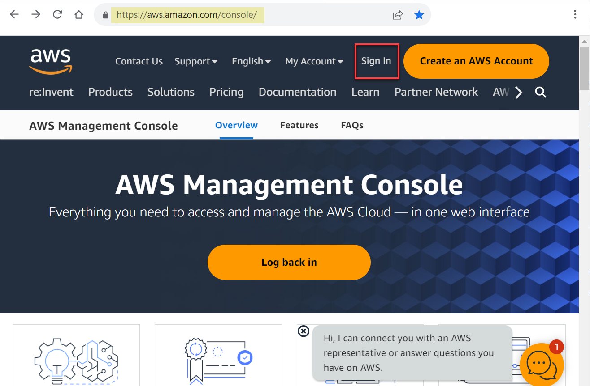

# Integrate ADW with AWS Glue Data Catalogs

## Introduction

Amazon AWS Glue Data Catalog is a centralized metadata management service that helps data professionals discover data and supports data governance in AWS cloud.

Oracle Autonomous AI Database allows you to synchronize with Amazon Web Service (AWS) Glue Data Catalog metadata. A database external table is automatically created by Oracle Autonomous AI Database for every table harvested by AWS Glue about data stored in Amazon Simple Storage Service (S3). Users can query data stored in Amazon S3 from Oracle Autonomous AI Database without having to manually derive the schema for the external data sources and create external tables.

Synchronizing with AWS Glue Data Catalog is dynamic, keeping the database up-do-date with respect to changes to the underlying data, reducing administration cost as it automatically maintains hundreds to thousands of tables.

Estimated Time: 10 minutes

### Objectives

In this lab, you will:

* Navigate to your AWS Glue Data Catalog (if you have one) and review the available databases and tables.
* Register an Amazon S3 Glue Data Catalog with Oracle Autonomous AI Database.
* Link to the available tables in the Glue Data Catalog and create external tables based on those tables.
* Query the newly created external tables using the SQL Worksheet.

### Prerequisites

This lab requires the completion of the following labs/tasks from the **Contents** menu on the left:

* **Lab 1: Set up the Workshop Environment > Task 2:  Provision the Autonomous AI Database Instance**.

> _**Note:** This is not a hands-on lab unless you have an AWS account and can access an AWS Glue instance that contains at least one database and one table._

## Task 1: Navigate to the AWS Glue OCI Data Catalog Page

In this task, you will navigate to an AWS Glue Data Catalog instance and explore a database and its tables. In the next task, you will connect to this Glue Data Catalog instance from within ADW and link to some tables to create external tables over those tables.

1. Navigate to the **AWS Management Console** page. Copy and paste the following script into your Web browser's address bar, and then click the **ENTER** key on your keyboard.

    ```
    <copy>
    https://aws.amazon.com/console/
    </copy>
    ```

    

2. On the **Sign in as IAM user** page, enter your Account ID, IAM user name, Password, and then click **Sign in**.

    

    The **Console Home** page is displayed.

3. Open the **Services** menu and click **Analytics**. Under **Analytics**, click **AWS Glue**.

    

    The **AWS Glue** page is displayed.

4. On the **AWS Glue** page, drill-down on the **Data Catalog** node in the left navigation pane, if not already expanded, to see the available databases and tables in the Data Catalog. An AWS Glue database represents a collection of relational table definitions, organized in a logical group. Each AWS Glue data catalog instance manages multiple databases.

    

5. Click **Databases** to display the available databases in the Data Catalog.

    

    In this example, we have only one database in our Data Catalog. We will work with the **moviestream** database in this lab.

    >**Note:** You can click the **Tables** node to display the tables in all databases (if you have more than one database).

6. Click the **moviestream** database to display its tables. There are **4** tables in this database. An AWS Glue table represents a relational table over data stored in the AWS cloud.

    

## Task 2: Register AWS Glue Data Catalog with Oracle Autonomous AI Database

_**Note:** This is not a hands-on task; instead, it is a demo of how to define an Amazon S3 location._

In this task, we register the AWS Glue **`moviestream`** database with Oracle Autonomous AI Database. We will the (4) files in this database to identify customers' information.

1. Navigate to the **Data Load Dashboard**. Click **Database Actions | SQL** in the banner (from the last lab) to display the **Launchpad** page. Click the **Data Studio** tab, and then click the **Data Load** tab.

2. Click the **CONNECTIONS** tile.

    

3. On the **Connections** page, click the **Create** drop-down list, and then select **Register Data Catalog**.

    

4.  On the **Catalog Settings** page of the **Register Data Catalog** wizard, specify the following:
    + **Catalog Name:** Enter **`AWS_GLUE`**.
    + **Description:** Enter an optional description.
    + **Catalog Type:** Select **`AWS Glue`** from this drop-down list.    
    + **Credential for Data Catalog Connection:** Select the **`AWS_S3_CREDENTIAL`** that you created in Lab 8 from the drop-down list.
    + **Region:** Select **`us-east-1`** from the drop-down list.

        

5. Click **Next**.

6. On the **Register Assets** page of the wizard, the available **`moviestream`** database in the specified AWS bucket is displayed. Drill-down on **`moviestream`** to see the tables in this database.

    

7. Click **Create**. The **AWS_GLUE** Data Catalog link is displayed on the **Connections** page.

    

8. Click on the **Data Load** link in the breadcrumbs to return to the **Data Load** page.

    

## Task 3: Link to Data from AWS Glue and Create an External Table

In this task, we will link to the data from the AWS S3 Glue Data Catalog. A link is preferred so that if the data changes, we don't have to re-load the data. We are always looking at up-to-date data.

1. On the **Data Load** page, click the **LINK DATA** tile.

2. The **Link Data** page is displayed. Click the **Data Catalog** tab. Select **`AWS_GLUE`** from the **Select Cloud Store Location or enter public URL** drop-down list.

    

3. Select the four files from the Amazon Glue **`moviestream`** database, and then drag and drop them onto the data linking job.

    

    The four files are added to the Data Linking job.

    

4. Let's change the default name for the **customer** external table that will be created. Click the **Settings** icon (pencil) for the **customer** link task. The **Link Data from Cloud Store Location customer** settings panel is displayed. Change the external table name to **`CUSTOMER_GLUE`**, and then click **Close**.

    

5. Repeat the above step to rename the (3) other external tables to **`CUSTOMER_SEGMENT_GLUE`**, **`MOVIES_GLUE`**, and **`SALES_GLUE`**.

    

6. Click **Start** and then click **Run**.

    

    If the link jobs complete successfully, each data link card will have the link icon next to it. You can click the **Report** button for a link job to view a report of the total rows that were processed successfully and failed rows for the selected table.

    

## Task 4: Query the External Tables in SQL Worksheet

1. Navigate to the **SQL Worksheet**. Click **Database Actions | Data Load** in the banner to display the **Launchpad** page. Click the **Development** tab, and then click the **SQL** tab.

2. The four external tables are displayed in the **Navigator** tab.

    

3. Query the **CUSTOMER_GLUE** table. Drag and drop the table onto the Editor.

    

4. In the **Choose the type of insertion** dialog box, click **Select** and then click **Apply**.

    

    The Query is displayed.

5. Click the **Run Statement** icon in the toolbar.

    

    The data that is stored in Amazon Cloud is now available for query in Oracle Autonomous AI Database.

## Learn more

* [Query External Data with AWS Glue Data Catalog](https://docs.oracle.com/en/cloud/paas/autonomous-database/serverless/adbsb/query-external-data-aws-glue-data-catalog.html#GUID-14F80C56-B182-440C-99F6-F890C42887CD)
* [Using Oracle Autonomous AI Database Serverless](https://docs.oracle.com/en/cloud/paas/autonomous-database/adbsa/index.html)

You may now proceed to the next lab.

## Acknowledgements

* **Author:** Lauran K. Serhal, Consulting User Assistance Developer
* **Contributor:** Alexey Filanovskiy, Senior Principal Product Manager
* **Last Updated By/Date:** Lauran K. Serhal, October 2025

Data about movies in this workshop were sourced from Wikipedia.

Copyright (C) 2025 Oracle Corporation.

Permission is granted to copy, distribute and/or modify this document
under the terms of the GNU Free Documentation License, Version 1.3
or any later version published by the Free Software Foundation;
with no Invariant Sections, no Front-Cover Texts, and no Back-Cover Texts.
A copy of the license is included in the section entitled [GNU Free Documentation License](https://oracle-livelabs.github.io/adb/shared/adb-15-minutes/introduction/files/gnu-free-documentation-license.txt)


