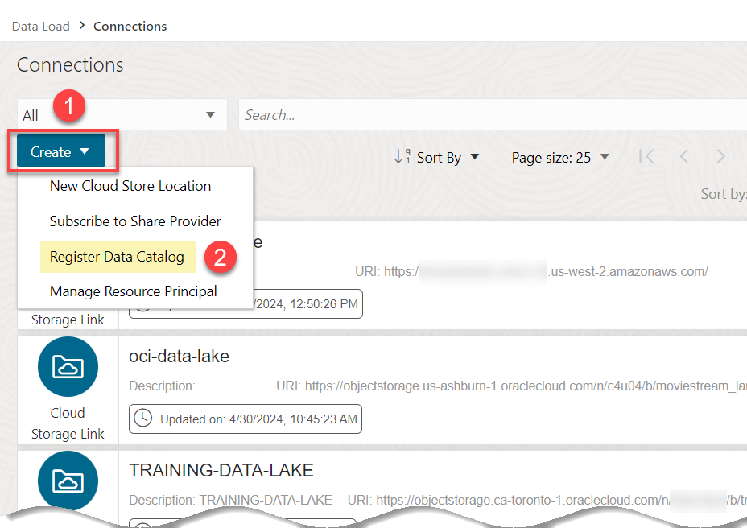
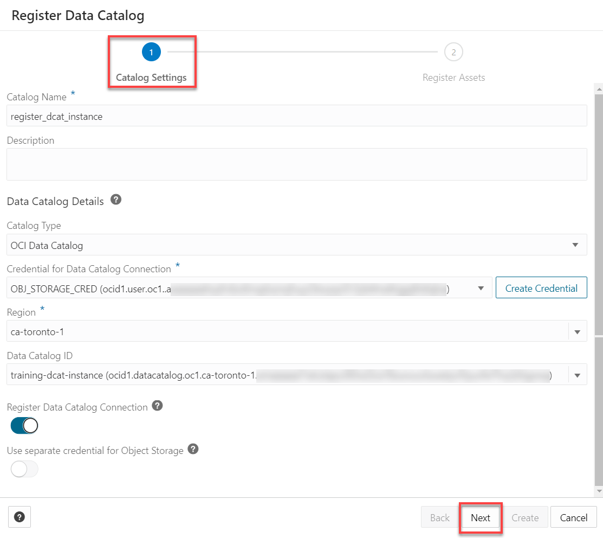

# Integrate ADW with OCI Data Catalogs

## Introduction

In this lab, you will learn how to connect an OCI Data Catalog instance to ADW and then load some tables from your Data Catalog into your ADW.

Estimated Time: 10 minutes

### Objectives

In this lab, you will:

* Navigate to your OCI Data Catalog and review data assets and logical entities.
* Register your Data Catalog instance in ADW.
* Link to data assets in the registered Data Catalog and create external tables.

### Prerequisites

>_**Note:**
This is not a hands-on lab; instead, it is a demo of how to integrate ADW with an OCI Data Catalog instance that contains a harvested data asset. To learn about how to create a Data Asset in an OCI Data Catalog instance and how to harvest data from Object Storage buckets, see the [Get started with Oracle Cloud Infrastructure Data Catalog](https://livelabs.oracle.com/pls/apex/dbpm/r/livelabs/view-workshop?wid=919) and [Access the Data Lake using Autonomous Database and Data Catalog](https://livelabs.oracle.com/pls/apex/r/dbpm/livelabs/view-workshop?wid=877) LiveLabs workshops._

This lab requires the completion of the following labs/tasks from the **Contents** menu on the left:

* **Lab 1**: Set up the Workshop Environment > **Task 3**: Create an Autonomous Data Warehouse Instance and **Task 4**: (Optional) Create a Data Catalog Instance. If you don't have a Data Catalog instance installed, you can simply follow the instructions in this lab.
* **Lab 4**: Link to Data in Public Object Storage Buckets > **Task 2**: Link to Data in Public Object Storage Buckets and Create Tables.

## Task 1: Navigate to the OCI Data Catalog Page

This is not a hands-on task. In this task, you will navigate to an OCI Data Catalog instance and explore a data asset named Data Lake. This data asset contains entities that were harvested from three Oracle Object Storage buckets. In the next task, you will connect to this Data Catalog instance from within ADW and link to some data assets to create external tables.
>**Note:** If you are using a LiveLabs reservation, an OCI Data Catalog instance is provided for you; however, this instance doesn't contain any harvested data assets.

1. Log in to the **Oracle Cloud Console**. On the **Sign In** page, select your tenancy, enter your username and password, and then click **Sign In**. The **Oracle Cloud Console** Home page is displayed.

2. Open the **Navigation** menu and click **Analytics & AI**. Under **Data Lake**, click **Data Catalog**.

3. On the **Data Catalog Overview** page, click **Go to Data Catalogs**.

    

4. On the **Data Catalogs** page, click the **`training-dcat-instance`** Data Catalog instance. In our example, this instance contains a data asset.

    

    **Note:** In our example, the Data Catalog instance is in a different compartment than where our ADW instance is located; therefore, make sure you are in the correct compartment when you access your Data Catalog and ADW instances; otherwise, you won't see the resources that you created in this workshop.

5. On the Data Catalog instance **Home** tab, click **Data assets** link.

    

6. In the **Data assets** tab, click your desired data asset, **Data Lake** in our example.

    

7. In the **Data assets** list, click the **Data Lake** data asset. The **Oracle Object Storage: Data Lake** page is displayed. Three buckets were harvested in this data asset.

    

8. Click the **Sandbox** bucket link. The **Bucket: Sandbox** page is displayed. Let's view the data entities in this bucket. Click the **Data entities** tab. The bucket contains three data entities.

    

    In the this workshop, you will learn how to access those data entities from within ADW.

## Task 2: Register your Data Catalog Instance in ADW

In this task, you will learn how to register an OCI Data Catalog instance in ADW in order to connect to that instance and link to the data asset's entities to create external tables in ADW.

If you already accessed the SQL Worksheet in the previous lab, click **Database Actions | SQL** in the banner to display the **Launchpad** page. Click the **Data Studio** tab, and then click the **Data Load** tab to display the **Data Load Dashboard**. You can now skip over to **Step 5**.

If you closed the Web browser tab where the SQL Worksheet was displayed, navigate to the **Data Load** page as follows:

1. Log in to the **Oracle Cloud Console**, if you are not already logged as the Cloud Administrator.

2. Open the **Navigation** menu and click **Oracle Database**. Under **Oracle Database**, click **Autonomous Database**.

<if type="livelabs">
3. On the **Autonomous Databases** page, click your **DB-DCAT** ADB instance.
</if>

<if type="freetier">
3. On the **Autonomous Databases** page, click your **ADW-Data-Lake** ADB instance.
</if>

    **Note:** If your Data Catalog and ADW instances are in different compartments like in our example, you must select the correct compartment for your ADW instance; otherwise, you won't see the resources that you created in this workshop such as the credential and cloud store locations.

4. On the **Autonomous Database details** page, click the **Database actions** drop-down list, and then select **Data Load**.

5. Click the **CONNECTIONS** tile.

    

6. On the **Connections** page, click the **Create** drop-down list and then select **Register Data Catalog**.

    

7. In the **Register Data Catalog** panel, in **Step 1** of the wizard, **Catalog Settings**, specify the following:

    * **Catalog Name:** Enter a meaningful name. **Note:** The name must conform to the Oracle object naming conventions, which do not allow spaces or **hyphens**.
    * **Description:** Enter an optional description.
    ** **Catalog Type:** Accept the default **OCI Data Catalog** from the drop-down list.
    * **Credential for Data Catalog Connection:** Select your **`OBJ_STORAGE_CRED`** credential that you created in **Lab 5 > Task 6** from the drop-down list. This could take a minute.
    * **Region:** Your region should be already selected after you chose your credential.
    * **Data Catalog ID:** If you have several Data Catalog instances, select the Data Catalog instance that you want to register from the drop-down list. In this workshop, you only have one credential.
    * **Register Data Catalog Connection:** Click this field to enable it.

        

8. Click **Next**. **Step 2** of the wizard, **Register Assets** is displayed. By default, all the buckets in your selected Data Catalog instance are selected, along with data assets they contain. Drill-down (expand) the **moviestream_sandbox** bucket. This bucket contains three data assets. Those are the same data entities that you saw earlier in the Data Catalog instance in **Task 1**.

    

9. Keep the **moviestream\_sandbox** bucket checked; however, uncheck the **moviestream\_landing** and **moviestream\_gold** buckets, and then click **Create** to register the Data Catalog instance.

    

    The **Connections** page is re-displayed. The newly registered Data Catalog instance is displayed.

    

## Task 3: Link to Data Assets in the Registered Data Catalog and Create External Tables

In this task, you will link to data assets from the registered Data Catalog and create two external tables in your Autonomous Database instance based on those data assets.

1. Click the **Data Load** link in the breadcrumbs to display the Data Load page.

2. Click the **LINK DATA** tile.

    

3. The **Link Data** page is displayed. You will use this page to drag and drop tables from the registered Data Catalog instance to the data linking job area. Click the **Data Catalog** tab. Next, select the **`REGISTER_DCAT_INSTANCE`** connection that you created from the **Select Cloud Store Location or enter public URL** drop-down list.

    

4. Drag the **`customer_promotions`** and **`moviestream_churn`** data assets from the **moviestream\_sandbox** bucket in our Data Catalog instance, and drop them onto the data linking job section.

     

5. Let's change the default name for the **`customer_promotions`** external table that will be created. Click the **Settings** icon (pencil) for the **`customer_promotions`** link task. The **Link Data from Cloud Store Location customer\_promotions** settings panel is displayed. Change the external table name to **`CUSTOMER_PROMOTIONS_DCAT`**, and then click **Close**.

    

6. Let's change the default name for the **`moviestream_churn`** external table that will be created. Click the **Settings** icon (pencil) for the **`moviestream_churn`** link task. The **Link Data from Cloud Store Location moviestream\_churn** settings panel is displayed. Change the name of the external table to **`MOVIESTREAM_CHURN_DCAT`**, and then click **Close**.

    

7. Click **Start** to run the data link job. In the **Run Data Load Job** dialog box, click **Run**.

    

8. After the load job is completed, make sure that the two data link cards have the link icon next to them. This indicates that your data link tasks have completed successfully.

    

9. Click **Database Actions | Data Load** in the banner to display the **Launchpad** page. Click the  **Development** tab, and then click the **SQL** tab to display your SQL Worksheet.

10. From the **Navigator** pane, drag and drop the newly created **`CUSTOMERS_PROMOTIONS_DCAT`** external table onto the Worksheet. In the **Choose Type of insertion**, click **Select**, and then click **Apply**.

    

11. The auto generated query is displayed in the worksheet. Click the **Run Statement** icon to run the query. The results are displayed. You just accessed the data in the registered Data Catalog instance!

    

    You can also query the **`MOVIESTREAM_CHURN_DCAT`** external table.

 You may now proceed to the next lab.

## Learn more

* [What Is a Data Catalog and Why Do You Need One?](https://www.oracle.com/big-data/what-is-a-data-catalog/)
* [Get Started with Data Catalog](https://docs.oracle.com/en-us/iaas/data-catalog/using/index.htm)
* [Data Catalog Overview](https://docs.oracle.com/en-us/iaas/data-catalog/using/overview.htm)
* [Using Oracle Autonomous Database Serverless](https://docs.oracle.com/en/cloud/paas/autonomous-database/adbsa/index.html)
* [Oracle Cloud Infrastructure Documentation](https://docs.cloud.oracle.com/en-us/iaas/Content/GSG/Concepts/baremetalintro.htm)

You may now proceed to the next lab.

## Acknowledgements

* **Author:** Lauran K. Serhal, Consulting User Assistance Developer
* **Contributor:** Alexey Filanovskiy, Senior Principal Product Manager
* **Last Updated By/Date:** Lauran K. Serhal, November 2024

Data about movies in this workshop were sourced from Wikipedia.

Copyright (C) 2025 Oracle Corporation.

Permission is granted to copy, distribute and/or modify this document
under the terms of the GNU Free Documentation License, Version 1.3
or any later version published by the Free Software Foundation;
with no Invariant Sections, no Front-Cover Texts, and no Back-Cover Texts.
A copy of the license is included in the section entitled [GNU Free Documentation License](https://oracle-livelabs.github.io/adb/shared/adb-15-minutes/introduction/files/gnu-free-documentation-license.txt)