# Accelerating Queries with Data Lake Accelerator

## Introduction

In this lab, you will learn how to enhance the performance of queries on external data stored in Oracle Cloud Infrastructure (OCI) Object Storage by utilizing the Data Lake Accelerator (DLA) feature of Oracle Autonomous AI Database. Data Lake Accelerator enhances the performance and scalability of external data processing on Autonomous AI Database. It automatically allocates additional CPU resources to speed up external data scans from Object Stores based on query needs. This integration enables efficient resource utilization, faster query responses, and easy scaling for large data volumes. 

**Estimated Time:** 15 minutes

### Objectives

In this lab, you will:

- Enable Data Lake Accelerator on your Autonomous AI Database instance.
- Create an external table over Parquet files stored in OCI Object Storage.
- Estimate the size of the dataset by listing and summing object sizes.
- Execute queries on the external table and observe performance improvements with DLA.
- Monitor session statistics to verify the utilization of DLA during query execution.

### Prerequisites

This lab assumes you have:

- An Oracle Cloud account with access to Autonomous AI Database.
- An existing Autonomous AI Database instance.
- Access to OCI Object Storage with Parquet files available for querying.
- Necessary permissions to enable and configure DLA on your database instance.

## Task 1: Enable Data Lake Accelerator

In this task, you will view the status of DLA on your Autonomous AI Database instance. You can configure Data Lake Accelerator for your Autonomous AI Database instance during provisioning, cloning, or when you update your instance.

1. Navigate to your Autonomous AI Database instance. Sign in to the [Oracle Cloud Console](https://cloud.oracle.com/), if you are not already signed in. In the navigation menu, select **Autonomous AI Database**, and then click **Autonomous AI Database**. The **Autonomous AI Databases** page is displayed. Click your Autonomous AI Database instance display name link. 

  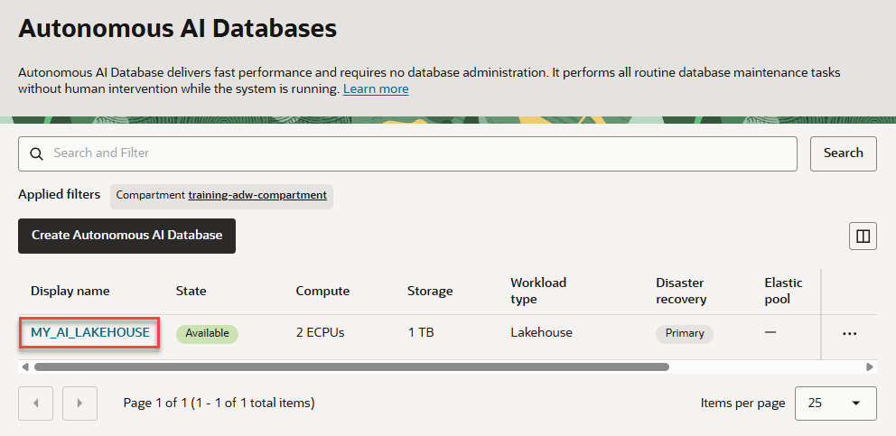

  The database details page is displayed.

  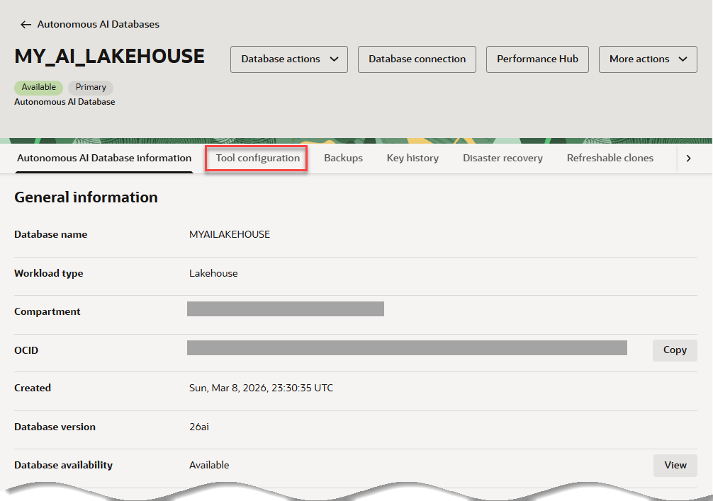

2. Let's check the status of Data Lake Accelerator (DLA) on our provisioned **`MY_AI_LAKEHOUSE`** instance. On the instance details page, click the **Tool Configuration** tab, and then scroll down to the **Data Lake Accelerator** section. The current DLA configuration is displayed. In our case, DLA is already enabled.

  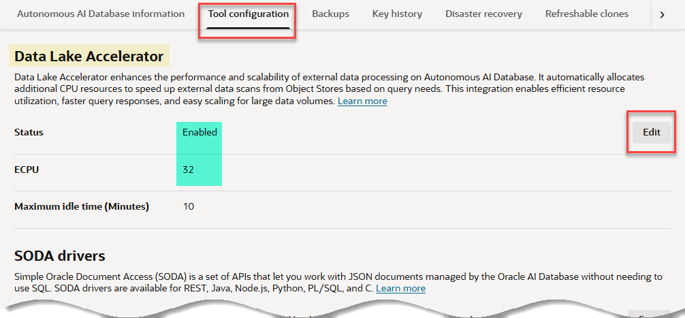

    >**Note:** To view and edit the DLA options for an Autonomous AI Database instance during the process of provisioning or cloning: On the **Create Autonomous AI Database Serverless** page, expand **Tools**, scroll down to the **Data Lake Accelerator** section, and then click **Edit**.
    
3. The DLA status is enabled by default. You can click **Edit** to modify the settings such as toggling the **Status** to **Disabled**. You can also set the desired number of **ECPU count** (Elastic CPUs) based on your workload requirements. The default is 32 ECPUs; however, you can adjust this in multiples of 32 up to 1024. When done editing, click **Apply** to save the changes.
   
    > **Note:** Enabling DLA allows the database to dynamically allocate additional compute resources during query execution, enhancing performance for large-scale data processing tasks. ([See Data Lake Accelerator documentation](https://docs.oracle.com/en/cloud/paas/autonomous-database/adbsa/data-lake-accelerator.html?utm_source=openai))

## Task 2: Create an External Table Over Parquet Files

In this task, you will create an external table in your Autonomous AI Database that references Parquet files stored in OCI Object Storage.

1. Navigate to the SQL Worksheet. Copy and paste the following PL/SQL script into your SQL Worksheet to create the `CUSTSALES_BIG_EXT` external table. Next, click the Run Script (F5) icon in the Worksheet toolbar.
 
   
     ```sql
     <copy>
     BEGIN
       DBMS_CLOUD.CREATE_EXTERNAL_TABLE(
         credential_name => NULL,
         table_name      => 'CUSTSALES_BIG_EXT',
         file_uri_list   => 'https://objectstorage.us-ashburn-1.oraclecloud.com/n/c4u04/b/moviestream_gold/o/custsales_detailed/*/*.parquet',
         format          => '{
           "type":"parquet",
           "schema":"first"
         }'
       );
     END;
     /
     </copy>
     ```

     > **Note:** Setting `credential_name` to `NULL` is appropriate for public buckets. The `format` parameter specifies that the files are in Parquet format and instructs the database to infer the schema from the first file. 

    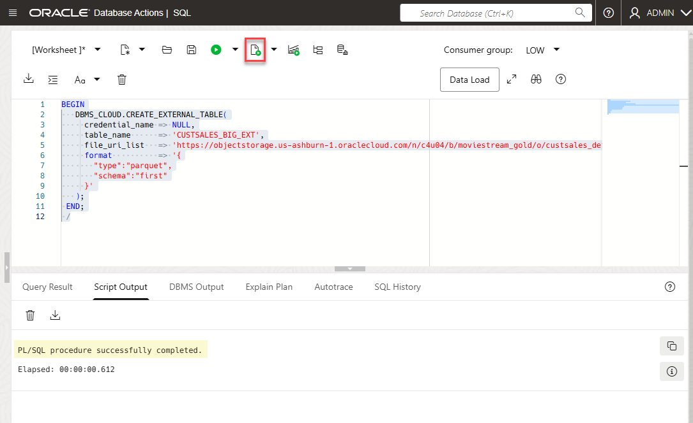

2. Verify the `CUSTSALES_BIG_EXT` external table creation. Copy and paste the following SQL query into your SQL Worksheet, and then click the Run Statement icon in the Worksheet toolbar. 

     ```sql
     <copy>
     SELECT table_name
     FROM user_external_tables
     WHERE table_name = 'CUSTSALES_BIG_EXT';
     </copy>
     ```

    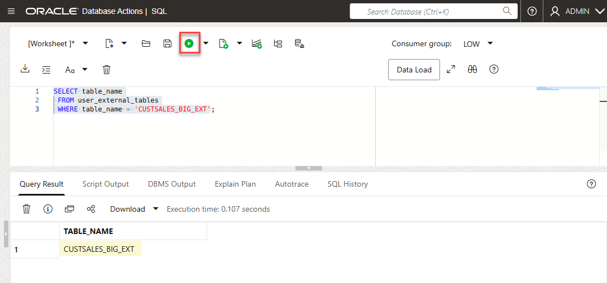

## Task 3: Estimate Dataset Size

In this task, you will estimate the size of the dataset by listing the objects in the specified Object Storage location and summing their sizes.

1. List the Parquet files and calculate their total size. Copy and paste the following SQL query into your SQL Worksheet, and then click the Run Statement icon in the Worksheet toolbar.  

     ```sql
     <copy>
     SELECT
       COUNT(*) AS file_count,
       SUM(bytes) AS total_bytes,
       ROUND(SUM(bytes)/1024/1024, 2) AS total_mb,
       ROUND(SUM(bytes)/1024/1024/1024, 2) AS total_gb
     FROM TABLE(
       DBMS_CLOUD.LIST_OBJECTS(
         credential_name => NULL,
         location_uri    => 'https://objectstorage.us-ashburn-1.oraclecloud.com/n/c4u04/b/moviestream_gold/o/custsales_detailed/'
       )
     )
     WHERE REGEXP_LIKE(object_name, '\.parquet$', 'i');
     </copy>
     ```

    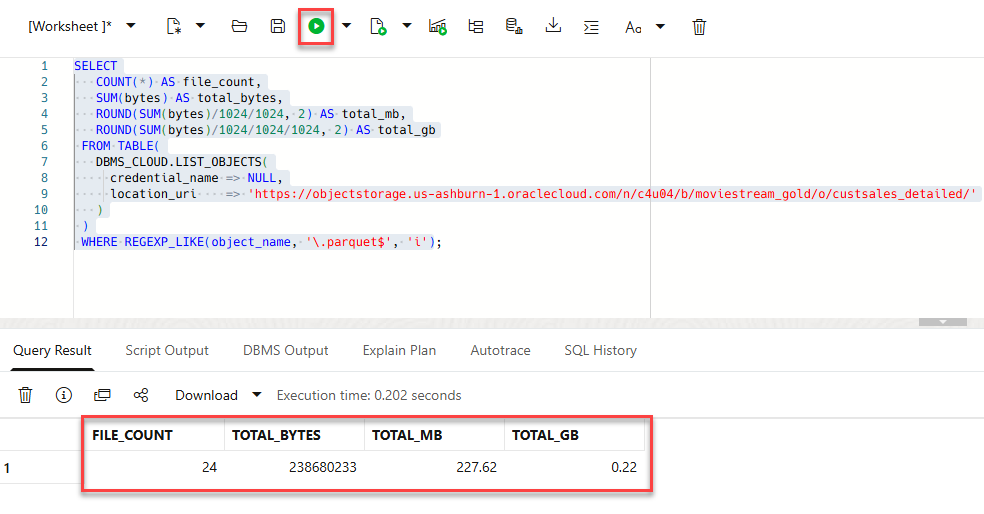

    This query counts the number of Parquet files and calculates their total size in bytes, megabytes, and gigabytes. This provides an estimate of the dataset's volume.

## Task 4: Run Queries on the External Table

In this task, you will run a query on the external table and observe the performance improvements enabled by DLA.

1. Run the following SQL query to count the number of records with a specific `MOVIE_ID`.

     ```sql
     <copy>
     SELECT COUNT(1)
     FROM CUSTSALES_BIG_EXT
     WHERE MOVIE_ID = 2915;
     </copy>
     ```

    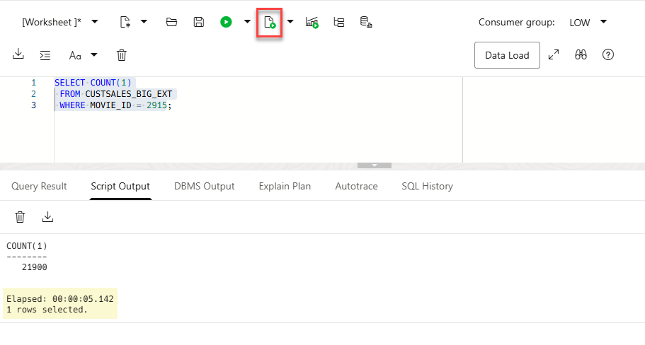

   **Note the execution time of the query.**

2. Disable Data Lake Accelerator. Navigate to the `MY_AI_LAKEHOUSE` instance details page. Click the **Tool configuration** tab, and then scroll down to the **Data Lake Accelerator** section. Click **Edit**, toggle the **Status** to **Disabled**, and then click **Apply**.

    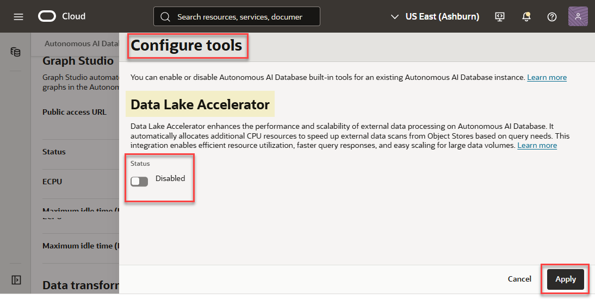

    It could take a minute or so for the status to show disabled.

    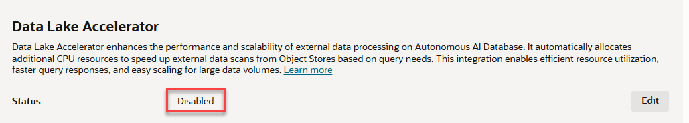

3. Re-run the same SQL query without DLA. 

     ```sql
     <copy>
     SELECT COUNT(1)
     FROM CUSTSALES_BIG_EXT
     WHERE MOVIE_ID = 2915;
     </copy>
     ```

    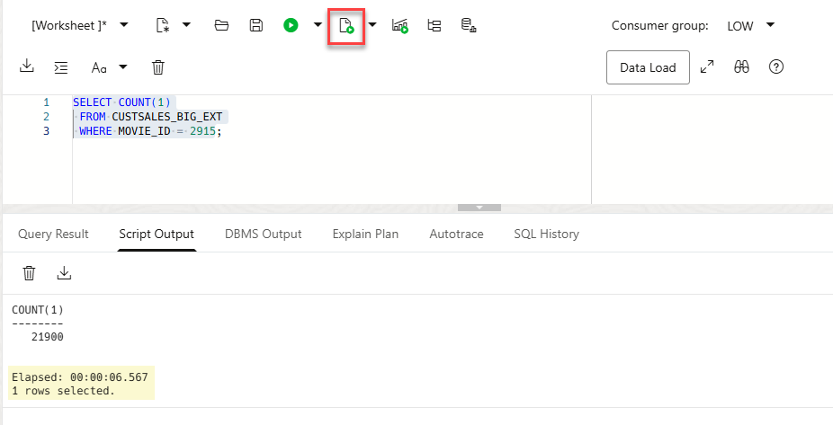

    Compare the execution time with and without DLA enabled. **5.142 seconds** with DLA enabled versus **6.567 seconds** with DLA disabled.

    > **Note:** DLA is particularly beneficial for queries that scan large amounts of external data. Disabling DLA may result in longer query execution times for such workloads.

## Task 5: Monitor Session Statistics

In this task, you will monitor session statistics to verify the utilization of DLA during query execution.

1. While DLA is still disabled, run the following query immediately after executing a query on the external table.

    ```sql
    <copy>
    SELECT
      n.name,
      m.value
    FROM v$mystat m
    JOIN v$statname n
      ON n.statistic# = m.statistic#
    WHERE n.name LIKE 'cell%XT%'
    ORDER BY n.name;
    </copy>
    ```

    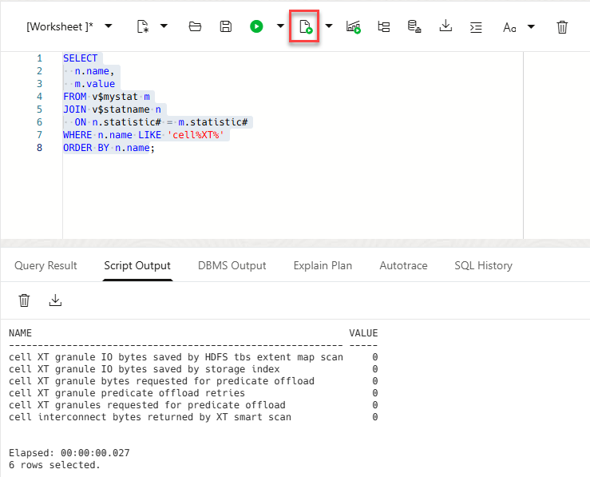

  This query retrieves session statistics related to external table smart scan and offload activities.

2. Re-enable DLA. Next, run the following query immediately after executing a query on the external table.

    ```sql
    <copy>
    SELECT
      n.name,
      m.value
    FROM v$mystat m
    JOIN v$statname n
      ON n.statistic# = m.statistic#
    WHERE n.name LIKE 'cell%XT%'
    ORDER BY n.name;
    </copy>
    ```

    

  This query retrieves session statistics related to external table smart scan and offload activities.

  **_Question for Alexey. I enabled DLA before running the external table. Both with DLA enabled and disabled, I get the same results._**

2. If the values for the statistics are greater than zero, it indicates that the external-table scan/offload path was utilized during query execution, confirming that DLA was active and contributing to performance improvements.

    > **Note:** Monitoring these statistics provides insight into how DLA enhances query performance by offloading processing to additional compute resources. ([blogs.oracle.com](https://blogs.oracle.com/datawarehousing/introducing-data-lake-accelerator?utm_source=openai))

## Learn More

- [Data Lake Accelerator](https://docs.oracle.com/en-us/iaas/autonomous-database-serverless/doc/data-lake-accelerator.html)
- [Introducing Data Lake Accelerator: Boosting External Data Performance with Oracle Autonomous AI Database](https://blogs.oracle.com/datawarehousing/introducing-data-lake-accelerator)

## Acknowledgements

* **Author:** Lauran K. Serhal, Consulting User Assistance Developer, Oracle Autonomous AI Database and Multicloud
* **Contributor:** Alexey Filanovskiy, Senior Principal Product Manager
* **Last Updated By/Date:** Lauran K. Serhal, March 2026

You may now **proceed to the next lab**.