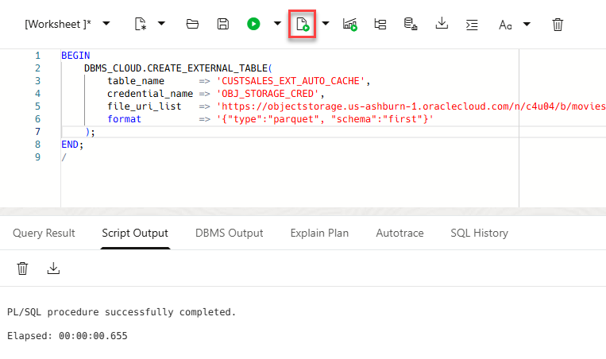
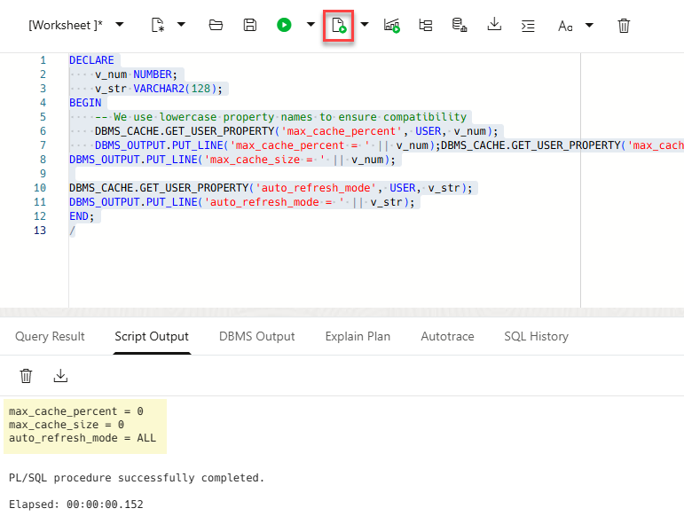
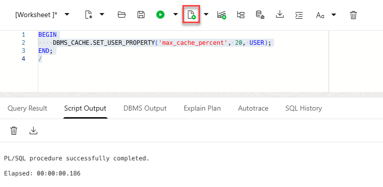
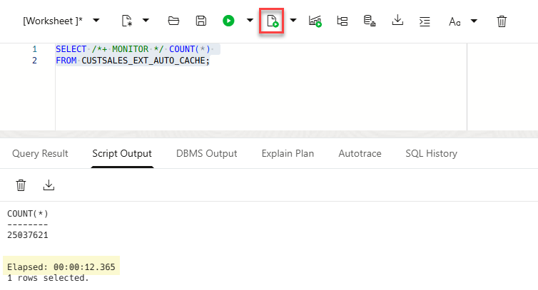
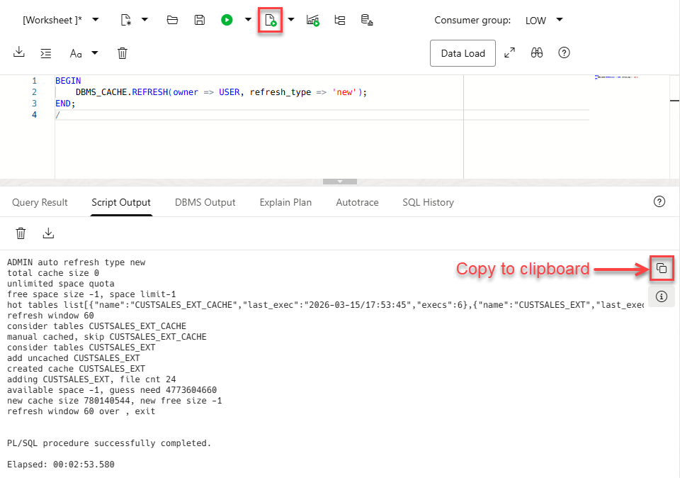
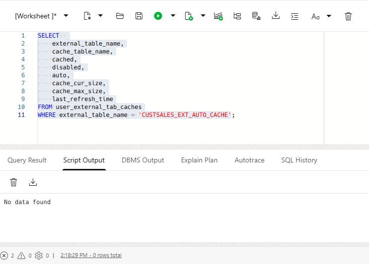
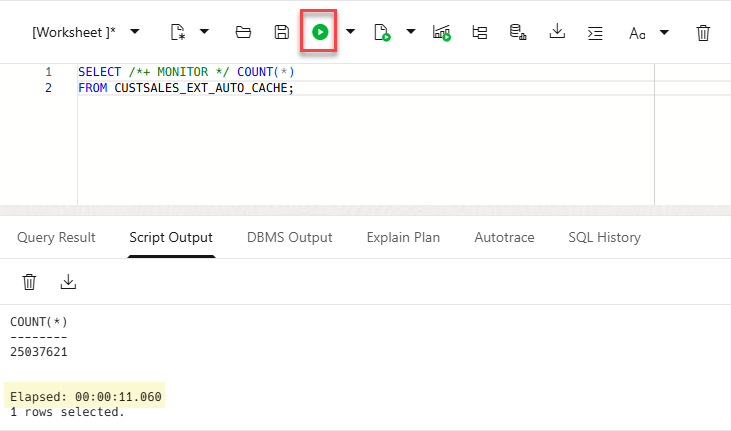
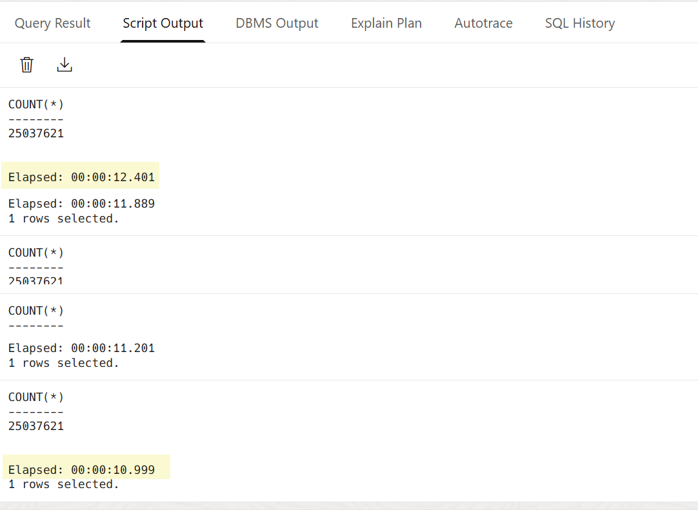

# Lab 10: External Table Caching (Automatic)

## Introduction

In this lab, you will explore the automatic caching capabilities of Oracle Autonomous Database for external tables. Unlike manual caching, where you explicitly create and manage the cache for specific tables, **Automatic Caching (AUTO)** allows the database to monitor query patterns and automatically cache frequently accessed external data based on a defined budget.

Estimated Time: 15 minutes

### Objectives

In this lab, you will:
*   Configure the automatic caching budget for your user.
*   Create an external table and trigger the automatic caching mechanism.
*   Monitor and verify the status of automatically managed caches.

### Prerequisites

This lab assumes you have:
*   Completed all previous labs in the workshop.
*   Access to an Oracle Autonomous AI Database instance (version 26ai or later).

## Task 1: Create the External Table

Before enabling automatic caching, we need an external table pointing to data in Object Storage.

> **Note:** There is a known issue and a workaround. When using public buckets with `CREATE_EXTERNAL_TABLE`, you may be required to use a valid OCI credential. You will reuse `OBJ_STORAGE_CRED` credential from a previous lab.

1.  Navigate to the **SQL Worksheet**.

2.  Run the following script. Replace `<OCI_CRED_NAME>` with the name of the credential you created in an earlier lab (e.g., `OBJ_STORAGE_CRED`).

    ```sql
    <copy>
    BEGIN
        DBMS_CLOUD.CREATE_EXTERNAL_TABLE(
            table_name      => 'CUSTSALES_EXT_AUTO_CACHE',
            credential_name => 'OBJ_STORAGE_CRED',
            file_uri_list   => 'https://objectstorage.us-ashburn-1.oraclecloud.com/n/c4u04/b/moviestream_gold/o/custsales/*.parquet',
            format          => '{"type":"parquet", "schema":"first"}'
        );
    END;
    /
    </copy>
    ```
    

## Task 2: Check and Enable Automatic Caching Budget

By default, automatic caching is often disabled (set to 0). You must define a "budget" or percentage of the available cache space that the `AUTO` mechanism is allowed to use.

1.  Check your current user-level settings for automatic caching:

    ```sql
    <copy>
    DECLARE
        v_num NUMBER;
        v_str VARCHAR2(128);
    BEGIN
        -- Use lowercase property names to ensure compatibility
        DBMS_CACHE.GET_USER_PROPERTY('max_cache_percent', USER, v_num);
        DBMS_OUTPUT.PUT_LINE('max_cache_percent = ' || v_num);

        DBMS_CACHE.GET_USER_PROPERTY('max_cache_size', USER, v_num);
        DBMS_OUTPUT.PUT_LINE('max_cache_size = ' || v_num);

        DBMS_CACHE.GET_USER_PROPERTY('auto_refresh_mode', USER, v_str);
        DBMS_OUTPUT.PUT_LINE('auto_refresh_mode = ' || v_str);
    END;
    /
    </copy>
    ```
    

    *If `max_cache_percent` and `max_cache_size` are 0, the database will not automatically cache any tables for your user which means there is no allocated budget and AUTO caching is effectively off.*

    >**Note:** If you get the `ORA-16538 "Unrecognized property"` error , make sure your property names are in lowercase letters.

2.  Enable automatic caching by setting a budget of **20%**.

    ```sql
    <copy>
    BEGIN
        DBMS_CACHE.SET_USER_PROPERTY('max_cache_percent', 20, USER);
    END;
    /
    </copy>
    ```
    

## Task 3: Trigger the Automatic Cache

Automatic caching usually triggers based on background statistics and query frequency; However, you can force the system to evaluate and create new caches immediately using `DBMS_CACHE.REFRESH`.

1.  Run an initial query to give the system a reason to track this table. Use the `MONITOR` hint so that you can track this in the SQL Monitor later.

    ```sql
    <copy>
    SELECT /*+ MONITOR */ COUNT(*) 
    FROM CUSTSALES_EXT_AUTO_CACHE;
    </copy>
    ```
    

2.  Manually trigger the creation of "New" automatic caches:

    ```sql
    <copy>
    BEGIN
        DBMS_CACHE.REFRESH(owner => USER, refresh_type => 'new');
    END;
    /
    </copy>
    ```
    

    The script could take a few minutes to complete. Once the output is displayed, you can click the **Copy to clipboard** icon and paste the output in a text editor file of your choice.

## Task 4: Validate the Automatic Cache

Now, let's verify that the database has successfully created an automatic cache for your table.

1.  Query the `USER_EXTERNAL_TAB_CACHES` view.

    ```
    <copy>
    SELECT  
        external_table_name,
        cache_table_name,
        cached,
        disabled,
        auto,
        cache_cur_size,
        cache_max_size,
        last_refresh_time
    FROM user_external_tab_caches
    WHERE external_table_name = 'CUSTSALES_EXT_AUTO_CACHE';
    </copy>
    ```

    

    **Expected Results:**
    *   **CACHED:** Should be `YES`.
    *   **AUTO:** Should be `YES` (indicating this is managed by the system, not manually).
    *   **`CACHE_CUR_SIZE`:** Should be greater than 0.

2.  Run the query again. It should now benefit from the local cache:

    ```sql
    <copy>
    SELECT /*+ MONITOR */ COUNT(*) 
    FROM CUSTSALES_EXT_AUTO_CACHE;
    </copy>
    ```
    

    

    Expected outcome: The participant observes automatic caching and learns how to validate it.

    Confirm auto-caching is enabled (or that it is enabled by default in the environment).
    Run repeated queries against an external table.
    Observe that performance improves as the database starts caching.
    Verify with USER_EXTERNAL_TAB_CACHES or DBA_EXTERNAL_TAB_CACHES.

## Learn More

* [External Table Cache overview + automatic caching section](https://docs.oracle.com/en-us/iaas/autonomous-database-serverless/doc/improve-application-performance-with-external-table-cache.html)
* [DBMS_CACHE package reference](https://docs.oracle.com/en-us/iaas/autonomous-database-serverless/doc/dbms-cache-package.html)
* [ALL_EXTERNAL_TAB_CACHES view reference](https://docs.oracle.com/en/database/oracle/oracle-database/26/refrn/ALL_EXTERNAL_TAB_CACHES.html)
* [Autonomous Database Release Notes: Automatic Caching for External Tables](https://docs.oracle.com/iaas/releasenotes/autonomous-database-serverless/2025-10-automatic-caching-for-external-tables.htm)

## Acknowledgements

*   **Author:** Lauran K. Serhal, Consulting User Assistance Developer, Oracle Autonomous AI Database and Multicloud
*   **Contributor:** Alexey Filanovskiy, Senior Principal Product Manager
*   **Last Updated By/Date:** Lauran K. Serhal, March 2026
