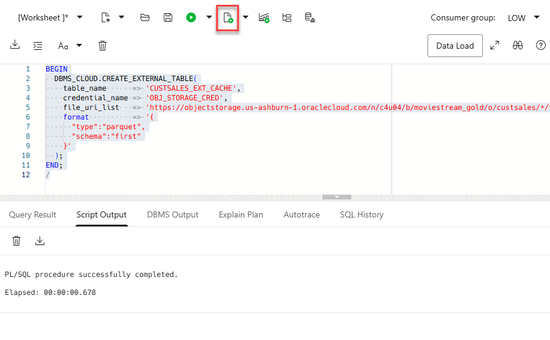
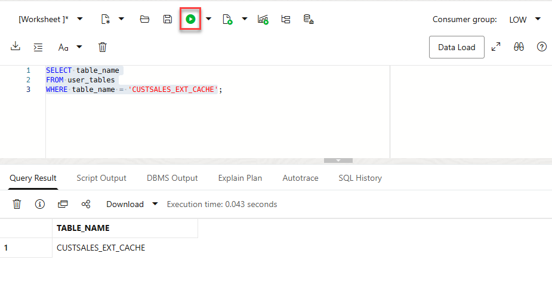
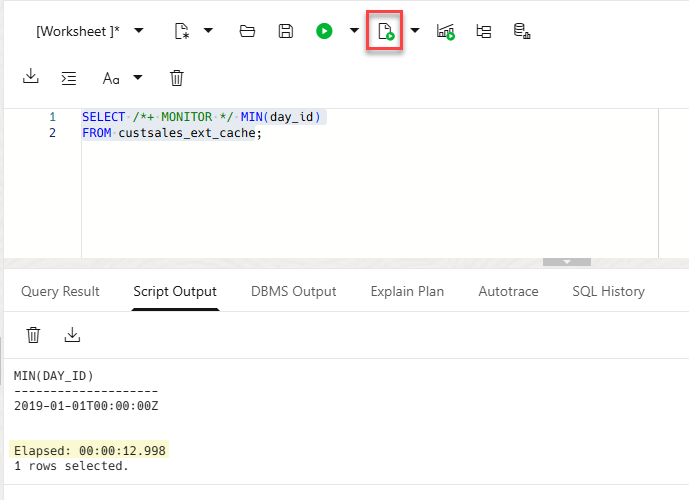
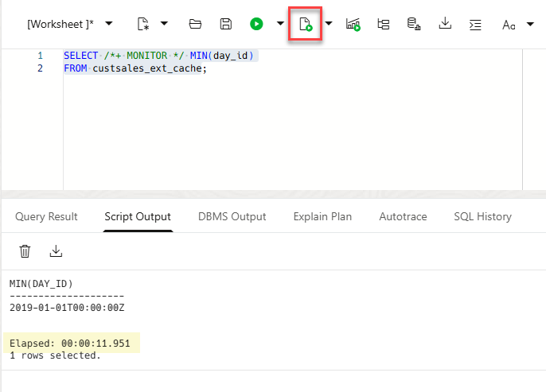
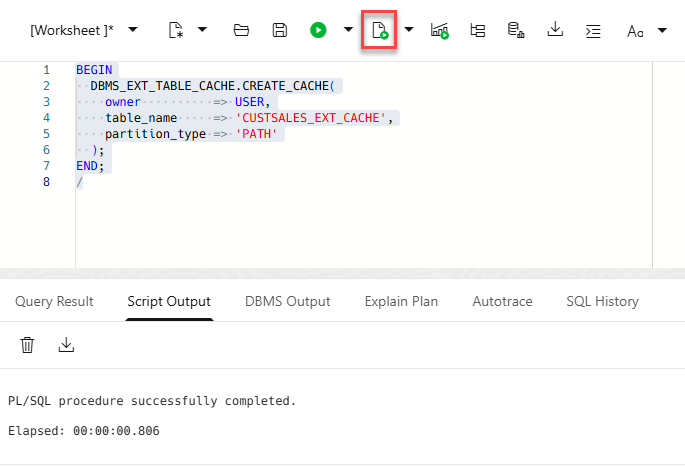
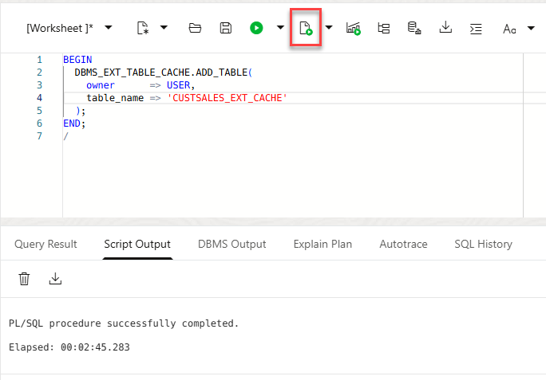
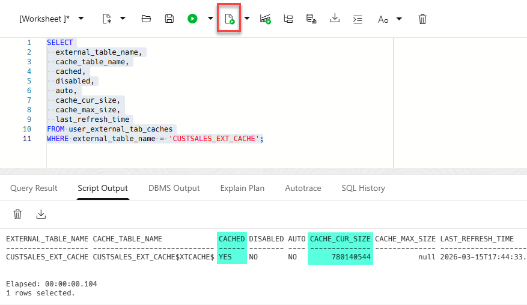
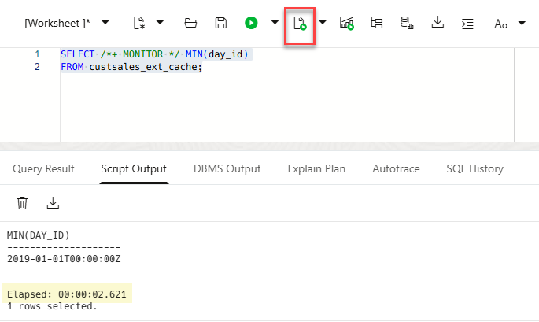

# External Table Caching (Policy-Based / Manual Population)

## Introduction
In this lab, you will create and manage an External Table Cache to improve performance for repeated queries against external data. External Table Cache enables Oracle Database to store external table data in a local cache so subsequent queries can avoid repeatedly reading from object storage.

You will create an external table over Parquet data in Object Storage, establish a cache definition for that external table, manually populate the cache, and then re-run the same query to observe improved performance on the second run.

**Estimated Time:** 20 minutes

### Objectives
In this lab, you will:
* Create an external table on Parquet data in Object Storage
* Baseline query performance before caching is enabled
* Create and populate an External Table Cache (manual/policy-based)
* Verify cache status using `USER_EXTERNAL_TAB_CACHES` and re-run the query to observe improved performance

### Prerequisites
This lab assumes you have:
* Completed all previous labs in the workshop
* Access to an Oracle Autonomous Database environment that supports External Table Cache (Oracle AI Database 26ai or later)
* A valid OCI credential name available from a previous lab (you will reuse it in this lab)

> **Note:** External Table Cache is supported starting with Oracle AI Database 26ai.

## Task 1: Create the External Table
In this task, you will create an external table over Parquet files in Object Storage.

1. In this task, you will use the `OBJ_STORAGE_CRED` that your created in an earlier lab.

   > **Note:** There is a known issue and a workaround. Even if the bucket is public, `DBMS_CLOUD.CREATE_EXTERNAL_TABLE` may still require a valid OCI credential (`credential_name` cannot be `NULL`). You will reuse the `OBJ_STORAGE_CRED` credential from an previous lab. 

2. Create the external table. Copy and paste the following PL/SQL script into your SQL Worksheet to create the external table. Next, click the Run Script (F5) icon in the Worksheet toolbar.
 

    ```sql
    <copy>
    BEGIN
      DBMS_CLOUD.CREATE_EXTERNAL_TABLE(
        table_name      => 'CUSTSALES_EXT_CACHE',
        credential_name => 'OBJ_STORAGE_CRED',
        file_uri_list   => 'https://objectstorage.us-ashburn-1.oraclecloud.com/n/c4u04/b/moviestream_gold/o/custsales/*/*.parquet',
        format          => '{
          "type":"parquet",
          "schema":"first"
        }'
      );
    END;
    /
    </copy>
    ```

    

3. Confirm the creation of the external table. Copy and paste the following SQL query into your SQL Worksheet, and then click the Run Statement icon in the Worksheet toolbar.

    ```sql
    <copy>
    SELECT table_name
    FROM user_tables
    WHERE table_name = 'CUSTSALES_EXT_CACHE';
    </copy>
    ```

    
    
## Task 2: Baseline Query Performance Before Caching

In this task, you will run the same query twice before creating the cache definition. This gives you a baseline for comparison. You will use the `/*+ MONITOR */` SQL hint which makes it easy to inspect the plan in SQL Monitor. This SQL hint forces the database to perform Real-Time SQL Monitoring for a specific statement.

1. Run the query the first time (baseline). Copy and paste the following PL/SQL script into your SQL Worksheet to create the external table. Next, click the Run Script (F5) icon in the Worksheet toolbar.

    ```sql
    <copy>
    SELECT /*+ MONITOR */ MIN(day_id)
    FROM custsales_ext_cache;
    </copy>
    ```

    

2. Run the same query a second time (still baseline, cache not created yet). 

    ```sql
    <copy>
    SELECT /*+ MONITOR */ MIN(day_id)
    FROM custsales_ext_cache;
    </copy>
    ```

    

    > **Note:** The `/*+ MONITOR */` hint can help you inspect execution details in SQL Monitor (depending on your environment and privileges).

## Task 3: Create the Cache Definition for the External Table

In this task, you will create the External Table Cache definition for the external table.

1. Create the cache definition using `DBMS_EXT_TABLE_CACHE.CREATE_CACHE`.

    ```sql
    <copy>
    BEGIN
      DBMS_EXT_TABLE_CACHE.CREATE_CACHE(
        owner          => USER,
        table_name     => 'CUSTSALES_EXT_CACHE',
        partition_type => 'PATH'
      );
    END;
    /
    </copy>
    ```

    

## Task 4: Populate the Cache (manual population)

In this task, you will manually load external data into the cache so subsequent queries can read from the local cached copy.

1. Populate the cache for the external table.

    ```sql
    <copy>
    BEGIN
      DBMS_EXT_TABLE_CACHE.ADD_TABLE(
        owner      => USER,
        table_name => 'CUSTSALES_EXT_CACHE'
      );
    END;
    /
    </copy>
    ```

    

    > **Note:** This is the step that actually fills the cache so later queries can benefit. It could take a few minutes to complete.

## Task 5: Verify Cache State and Re-run the Query

In this task, you will verify that caching is enabled and then re-run the query to observe improved performance.

1. Query `USER_EXTERNAL_TAB_CACHES` to verify cache status.

    ```sql
    <copy>
    SELECT
      external_table_name,
      cache_table_name,
      cached,
      disabled,
      auto,
      cache_cur_size,
      cache_max_size,
      last_refresh_time
    FROM user_external_tab_caches
    WHERE external_table_name = 'CUSTSALES_EXT_CACHE';
    </copy>
    ```

    

    > **Note:** Key indicators are `"CACHED = YES"` and `"CACHE_CUR_SIZE > 0"`.

2. Run the same query again (this time it should benefit from the cache).

    ```sql
    <copy>
    SELECT /*+ MONITOR */ MIN(day_id)
    FROM custsales_ext_cache;
    </copy>
    ```

    

    The elapsed time is **`02:621`** seconds using cache as opposed to **`12:998`** and **`11:951`** seconds running the same query without cache.

## Learn More
* [Improve application performance with External Table Cache](https://docs.oracle.com/en-us/iaas/autonomous-database-serverless/doc/improve-application-performance-with-external-table-cache.html)
* [DBMS\_EXT\_TABLE\_CACHE package reference](https://docs.oracle.com/en-us/iaas/autonomous-database-serverless/doc/dbms-ext-table-cache-package.html)
* [External Table Cache views](https://docs.oracle.com/en-us/iaas/autonomous-database-serverless/doc/dbms-ext-table-cache-views.html)

## Acknowledgements
* **Author:** Lauran K. Serhal, Consulting User Assistance Developer, Oracle Autonomous AI Database and Multicloud
* **Contributor:** Alexey Filanovskiy, Senior Principal Product Manager
* **Last Updated By/Date:** Lauran K. Serhal, March 2026