# Enable Federated Data Access using the Autonomous AI Lakehouse Catalog

## Introduction

The Autonomous AI Lakehouse includes a "catalog of catalogs" that allows you to connect to existing catalogs, databases, shares and data lakes. Once a catalog is added over one of these systems, users can immediately search for and discover relevant data from it, and can query the data as if it were local to the AI Lakehouse, without moving it.

In this lab, you will learn how the AI Lakehouse adds catalog connections and how you can search for and use data across multiple catalogs.

Estimated Time: 10 minutes

### Objectives

In this lab, you will:

* Use the AI Lakehouse's Catalog tool to search for and use data across catalogs
* Learn how to add external Iceberg catalogs such as Databricks Unity
* Understand how to query catalogs and their data with SQL

### Prerequisites

This lab requires the completion of the following labs/tasks from the **Contents** menu on the left:

* **Lab 1: Set up the Workshop Environment > Task 2:  Provision the Autonomous AI Database Instance**.
* **Lab 5: Consume a shared dataset using the Delta Sharing protocol**.

## Task 1: Use the Catalog to Search for Data

In Lab 5, you subscribed to an example Delta Share. In doing so, you added a catalog, so that users can search for and discover data from the share, in addition to data already in the AI Lakehouse.

> **Note:** In Lab 5, you created an external table named **`BOSTONHOUSING`** from the newly subscribed share. However, you can also directly query the other tables in the share. 

1. You should be already on the Database Actions page from the previous lab. Click the **Catalog** link in the left Navigation bar.

    

2. By default, the catalog shows tables and views for your user in your AI Lakehouse - the `LOCAL` catalog. You can add any available catalogs to expand your data search. Click **Catalogs** in the top left. 

    

3. On the **Catalogs** page, click the checkbox next to the **`DELTA_SHARING`** catalog to include it, and then click **Apply**.

    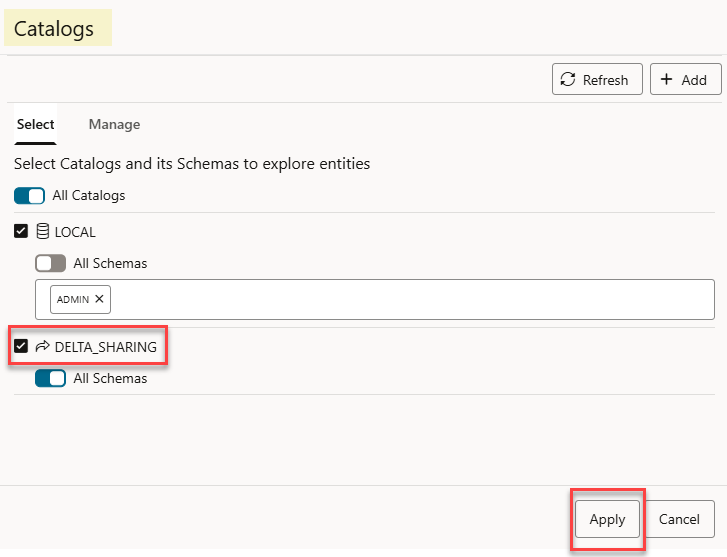

4. The table list is now refreshed to include tables in the **`DELTA_SHARING`** catalog:

    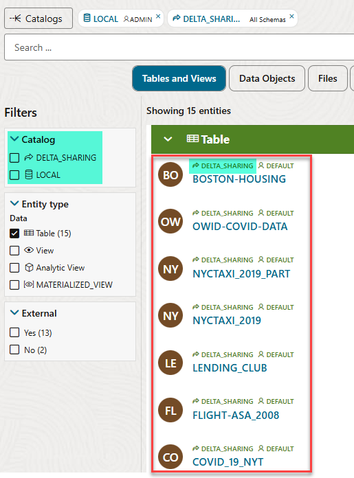

5. In the **`LOCAL`** catalog, only the **`ADMIN`** schema is selected. You can add more schemas if required. Click the **`LOCAL`** link at the top of the page.

    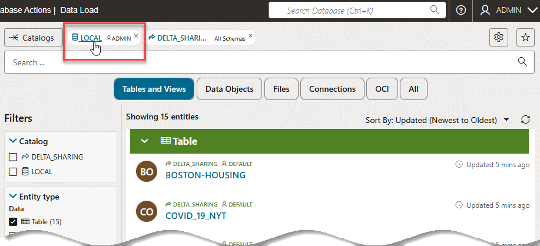

6. On the **Schemas** panel, in the text box below **`All Schemas`**, click the field and select **`SH`** (or type **`SH`** in the field), and then click **Apply**. 

   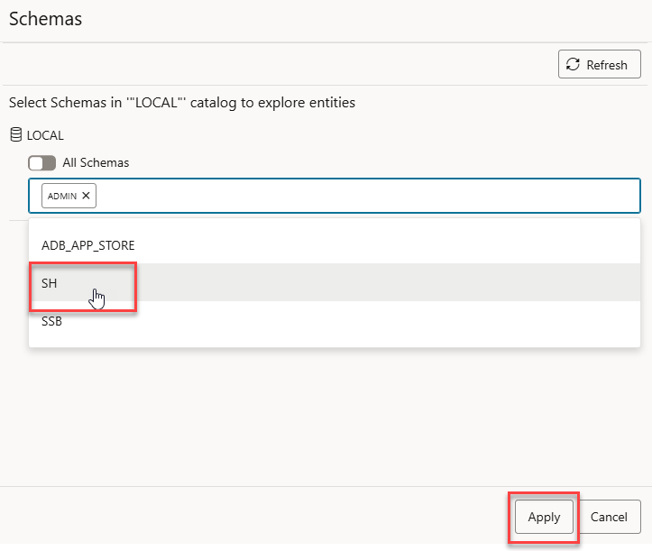 

7. Scroll down the list of tables. The tables from the **`SH`** schema are now displayed in the list.

    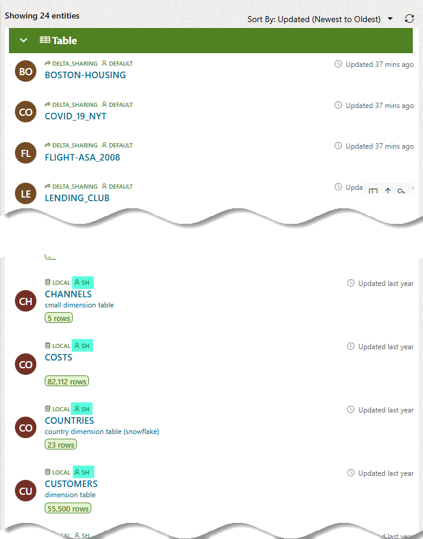

    >**Note:** Some of the tables in the **`SH`** schema contain descriptions. These are comments in the data dictionary that help you understand the table contents. These descriptions are displayed in the catalog, and can also be updated from here.

8. You now have two catalogs and multiple schemas selected. To find a particular table, you can use the search bar at the top. Type in **`cost`**, and then press the [Enter] key to search.

    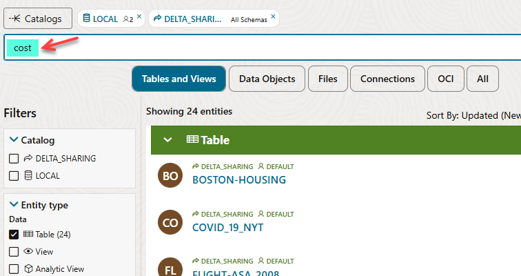

    The `COSTS` table in the **`SH`** schema is displayed. 
    
     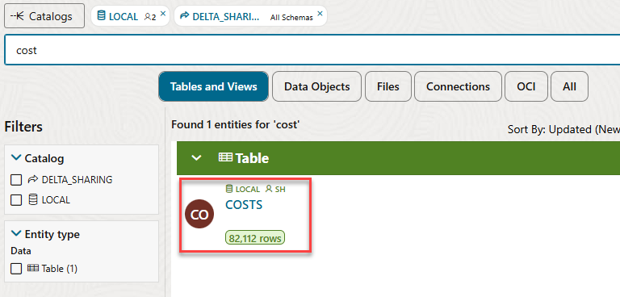

9. This table does not have a description. Hover over the table's name link until the **Add description** link appears, and then click it.

    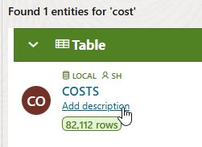

    If you have an AI profile set up, you can use it to auto-generate a table description from the table metadata (such as the names of the columns). If not, you can type (or copy and paste) a description such as the following:

    ```
    <copy>
    Aggregates unit costs and prices across channels, products, promotions and time
    </copy>
    ```
10. So far, you have used the UI to discover tables in the catalogs available to the AI Lakehouse. You can also do this from SQL. First, navigate to SQL Worksheet from the **Development** section of the Database Actions page.

    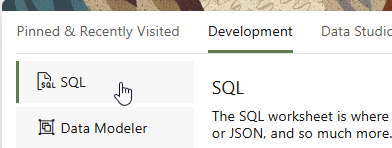

11. On the left hand side, the UI shows the tables in the `ADMIN` schema of the local catalog. However, we know that other catalogs are available. Copy, paste and run the following query to list the additional catalogs.

    ```sql
    <copy>
    SELECT
        CATALOG_NAME,
        CATALOG_TYPE,
        IS_ENABLED
    FROM USER_MOUNTED_CATALOGS;
    </copy>
    ```

    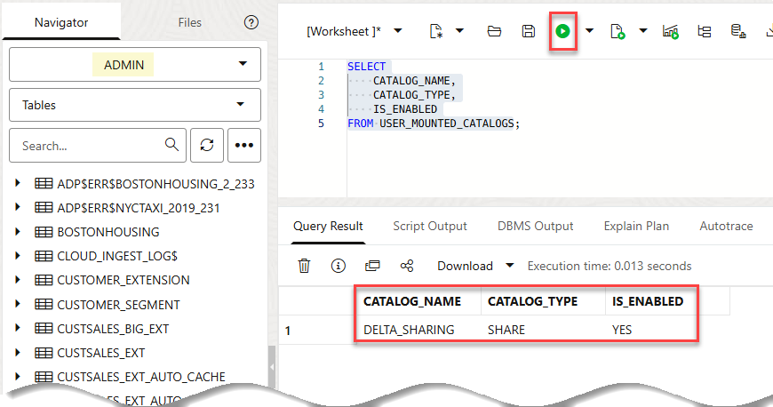
    
    The **`DELTA_SHARING`** catalog is displayed.

9. Copy, paste, and run the following query to list the tables in the **`DELTA_SHARING`** catalog.

    ```sql
    <copy>
    SELECT OWNER, TABLE_NAME
    FROM ALL_TABLES@DELTA_SHARING;
    </copy>
    ```

    This lists all the tables in the share catalog we subscribed to in Lab 5.

    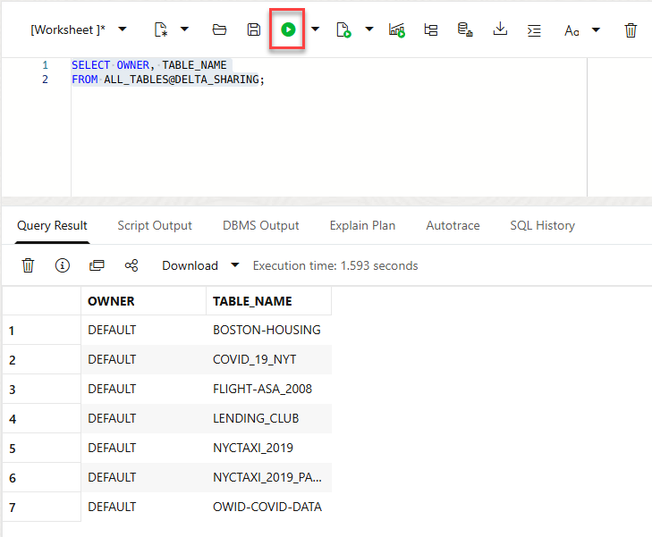

10. Now that you know the catalog name, **`DELTA_SHARING`**, the owner or schema name, **`DEFAULT`** and the set of tables in this schema, you have enough information to query the data, as tables in external catalogs can be queried directly using the following syntax.

    ```sql
    SELECT * 
    FROM OWNER.TABLENAME@CATALOGNAME
    ```
    
    Copy, paste, and run the following example query of the **`NYCTAXI_2019`** table. This returns the average number of passengers who took taxi journeys of over 10 miles in 2019:

    >**Note:** The **DEFAULT** clause should be enclosed in double quotes.

    ```sql
    <copy>
    SELECT AVG (PASSENGER_COUNT)
    FROM "DEFAULT".NYCTAXI_2019@DELTA_SHARING
    WHERE TRIP_DISTANCE >10;
    </copy>
    ```

    This should return a result of just over 1.60 passengers.

    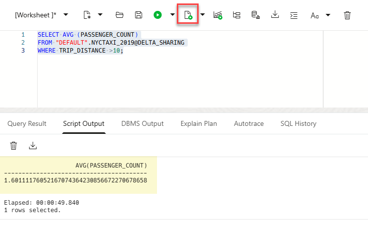

    This example query shows that you can dynamically query external data using the catalog to provide federated access.

## Task 2: Add an Iceberg catalog

We can extend the 'catalog of catalogs' with as many catalogs as we like, and search for and query data in the same way as in Task 1. Catalogs can be added over any of the following:

* Other Autonomous AI Databases
* Other Databases that can be connected using DB Links, such as Oracle, Azure SQL, or MySQL databases
* Existing Data Catalogs, such as AWS Glue or OCI Data Catalog
* Live and Delta Shares
* Iceberg Catalogs, such as Snowflake Open Catalog, Databricks Unity Iceberg Catalogs, or Apache Polaris catalogs

In this task, we will show an example of adding an Iceberg catalog from Databricks Unity.

**_Note: This is not a hands-on task, unless you have a Databricks Unity Iceberg catalog to connect to. This task shows how to add and use such a catalog. If you do have an Iceberg catalog in Databricks Unity, you will need the Iceberg catalog URL and a bearer token to connect to it, as well as credentials to enable access to the cloud storage bucket for the Iceberg data._**

1. Enable the Autonomous AI Lakehouse to access the relevant external resources. As user `ADMIN`, copy and run the following example SQL to enable access. Note that this example is typical for an Azure Databricks Unity catalog with Azure Data Lake storage:

    ```sql
    <copy>
    BEGIN
    dbms_network_acl_admin.append_host_ace(
        host => '*.azuredatabricks.net',
        lower_port => 443,
        upper_port => 443,
        ace => xs$ace_type(
        privilege_list => xs$name_list('http', 'http_proxy'),
        principal_name => 'ADMIN',
        principal_type => xs_acl.ptype_db));

    dbms_network_acl_admin.append_host_ace(
        host => '*.blob.core.windows.net',
        ace => xs$ace_type(
        privilege_list => xs$name_list('http', 'http_proxy'),
        principal_name =>  'ADMIN',
        principal_type => xs_acl.ptype_db));
    END;
    /
    </copy>
    ```

    >**Note:** This SQL allows access for the `ADMIN` user. To enable access for another user, change the principal name in each of the statements to the relevant DB User, noting the SQL itself should be run by the `ADMIN` user.

2. Now we are ready to add the catalog. Navigate back to the **Catalog** from the **Data Studio** section of the Database Actions page.

3. Click the **Catalogs** button in the top left.

4. Click the **Add** button in the top right to add a new catalog.

5. Select **Iceberg catalog** from the list of the types of catalog that can be added, and click **Next**.

6. The **Catalog name** (the first field) is the name of the catalog in the Autonomous AI Lakehouse. Type in **UNITY**.

7. Paste in your Iceberg catalog endpoint from Databricks Unity. This is likely to be in the following format:

https://DATABRICKSADDRESS.azuredatabricks.net/api/2.1/unity-catalog/iceberg-rest/v1/catalogs/CATALOGNAME

>**Note:** It is important to include the catalog name in the URL.

8. Under **Iceberg catalog credential**, click the **Create Credential** button.

9. Under **Credential type**, change the selection to **Bearer token**.

10. Paste in your bearer token from Databricks, then give your credential a name (such as 'UNITY_CRED').

    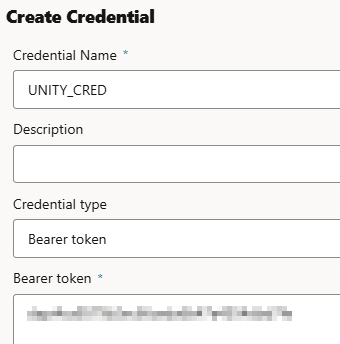

Then click **Create Credential** at the bottom of the screen.

11. Under **Bucket credentials**, click on the **Create Credential** button.

12. Change the Credential type to the type of the cloud storage bucket used for the Iceberg catalog, for example **Microsoft Azure**.

13. Paste in your cloud object storage credentials, for example your Azure storage account name and access key, and give your credential a name, such as **`UNITY_DATA_CRED`**.

    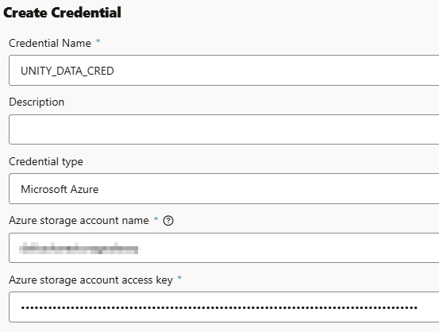

Then click **Create Credential** at the bottom of the screen.

14. In the **Add Catalog** screen, make sure you have your newly created catalog and cloud storage credentials are selected. Next, click **Next**.

>**Important** The final step of the wizard shows the namespaces that exist in the Unity Data Catalog. This is useful to check you have the catalog details correct. However, the AI Lakehouse catalog considers these as 'schemas' and uses APIs at the catalog level. You should therefore leave the namespace blank rather than selecting a namespace. Click the **Add** button to add the catalog. Next, click **Close** to return to the main catalog screen.

## Task 3: Explore the Iceberg catalog

We have now connected the Autonomous AI Lakehouse to a Databricks Unity Iceberg catalog, making all of the Iceberg data available to search, discover and query in the AI Lakehouse!

To explore the catalog, try out any of the following actions:

1. Click the **UNITY** catalog in the Catalog UI and select any of the schemas that you want to use.

2. Click on any of the tables in the catalog and click **Preview** to see the data.

3. Choose to load or link data from any Unity Iceberg table using the **Load to table** or **Link to table** options for the table in the Catalog UI.

4. Query the table using the following query syntax.

    ```sql
    <copy>
    SELECT * 
    FROM NAMESPACE.TABLENAME@UNITY;
    </copy>
    ```
## Learn more

* [Manage catalogs using the DBMS\_CATALOG package](https://docs.oracle.com/en/cloud/paas/autonomous-database/serverless/adbsb/dbms-catalog.html)
* [The Catalog tool in Autonomous AI Lakehouse](https://docs.oracle.com/en/cloud/paas/autonomous-database/serverless/adbsb/catalog-entities.html)

You may now proceed to the next lab.

## Acknowledgements

* **Author:** Mike Matthews, Product Management, Oracle Autonomous AI Lakehouse
* **Contributor:** Lauran K. Serhal, Consulting User Assistance Developer
* **Last Updated By/Date:** Lauran K. Serhal, March 2026

Data about movies in this workshop were sourced from Wikipedia.

Copyright (C) 2026 Oracle Corporation.

Permission is granted to copy, distribute and/or modify this document
under the terms of the GNU Free Documentation License, Version 1.3
or any later version published by the Free Software Foundation;
with no Invariant Sections, no Front-Cover Texts, and no Back-Cover Texts.
A copy of the license is included in the section entitled [GNU Free Documentation License](https://oracle-livelabs.github.io/adb/shared/adb-15-minutes/introduction/files/gnu-free-documentation-license.txt)

