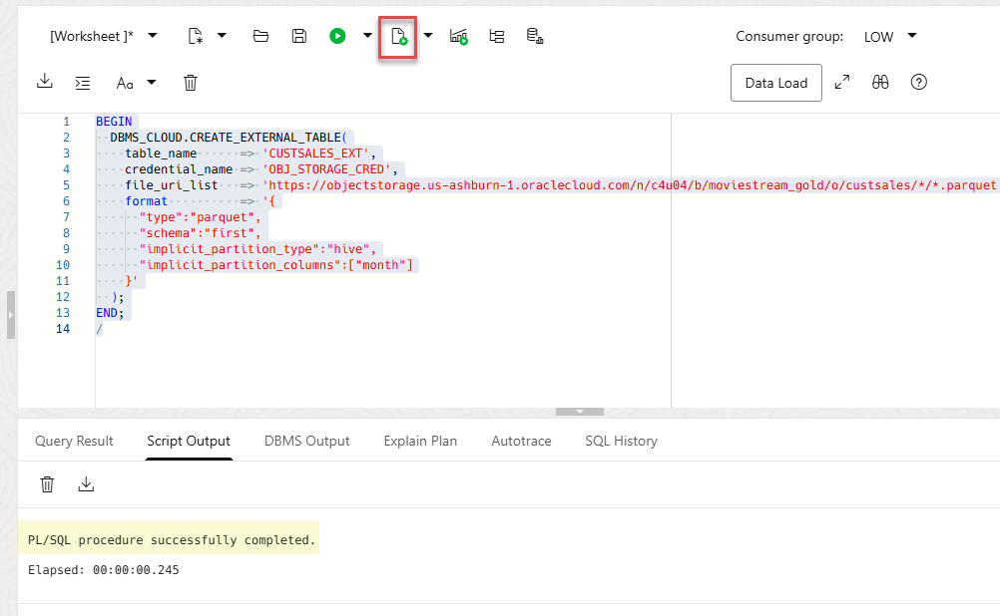
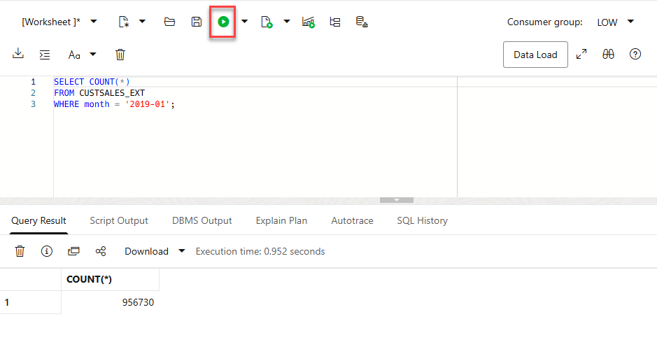
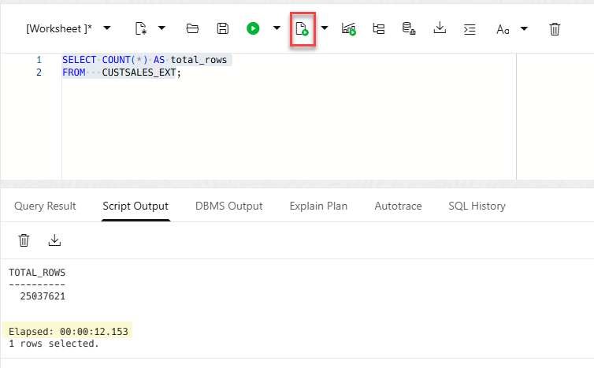
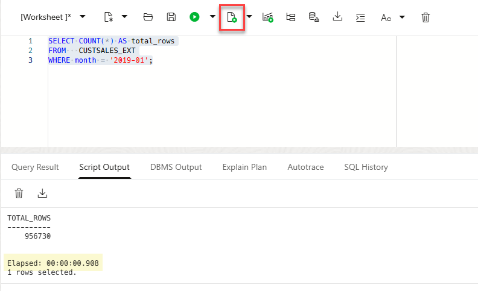

# Implicit Partition Pruning with Hive-Style Folders (External Tables)

## Introduction

When Parquet files in Object Storage are organized into Hive-style folders such as `year=2025/month=12/part-*.parquet`, Autonomous AI Database can infer those folder keys and expose them as virtual columns on an external table. When you filter on those virtual columns (for example, `WHERE year = '2025' AND month = '12'`), Oracle can prune folders automatically and scan fewer files and runs faster.

In this lab, you will create an external table pointing at the top-level dataset folder (for example, `.../sales/`), run a baseline query without partition filters, then run the same query with partition filters and compare elapsed time.

**Estimated Time:** 10 minutes

### Objectives

In this lab, you will:
* Create an external table over a Hive-style folder layout
* Enable implicit partition parsing for `year` and `month`
* Run a baseline query without partition-key filters
* Run a partition-pruned query using folder-based partition keys and compare performance

### Prerequisites

This lab assumes you have:
* Completed all previous labs
* An Autonomous AI Database instance
* A dataset in Object Storage organized like:
  * `bucket/sales/year=2024/month=01/part-*.parquet`
  * `bucket/sales/year=2024/month=02/part-*.parquet`
  * `bucket/sales/year=2025/month=12/part-*.parquet`
* An OCI credential you can use with `DBMS_CLOUD.CREATE_EXTERNAL_TABLE`

## Task 1: Create an external table that enables Hive implicit partitioning

In this task, you will create one external table that points to the dataset’s top folder (for example, `.../sales/`) and enables Hive implicit partition parsing so `year` and `month` appear as virtual columns.

1. Navigate to the SQL Worksheet. 

2. Create the external table and enable Hive implicit partitioning. The schema=first derives the table columns from the first file’s schema. The `implicit_partition_type=hive` parse partition keys/values from Hive-style folders (key=value). The `implicit_partition_columns` exposes these partition keys as virtual columns; month in this example.

    ```sql
    <copy>
    BEGIN
      DBMS_CLOUD.CREATE_EXTERNAL_TABLE(
        table_name      => 'CUSTSALES_EXT',
        credential_name => 'OBJ_STORAGE_CRED',
        file_uri_list   => 'https://objectstorage.us-ashburn-1.oraclecloud.com/n/c4u04/b/moviestream_gold/o/custsales/*/*.parquet',
        format          => '{
          "type":"parquet",
          "schema":"first",
          "implicit_partition_type":"hive",
          "implicit_partition_columns":["month"]
        }'
      );
    END;
    /
    </copy>
    ```

    

3. Validate that the virtual partition columns are available. The query uses the virtual partition column "month". With a predicate on    month, Oracle can prune files/folders and scan less data.

    ```sql
    <copy>
    SELECT COUNT(*)
    FROM CUSTSALES_EXT
    WHERE month = '2019-01';
    </copy>
    ```

    

## Task 2: Run a baseline query without partition-key filters

In this task, you will run a broad query that does not filter on the partition keys. This typically causes Oracle to read more files.

1. Run a baseline aggregation that scans broadly.

    ```sql
    <copy>
    SELECT COUNT(*) AS total_rows
    FROM   CUSTSALES_EXT;
    </copy>
    ```

    

2. Record the elapsed time. In our example, it was **`12.153`** seconds.

    >**Note:** In SQL Worksheet, note the **Elapsed** time is shown after the statement completes.

## Task 3: Run the same query with partition filters (pruning)

In this task, you will run the same logical query but restrict it using the virtual partition columns. Oracle can prune folders and scan less data which translates to faster run time.

1. Run the query with partition-key predicates.

    Use a partition that exists in your dataset (example below uses `year=2025/month=12`).

    ```sql
    <copy>
    SELECT COUNT(*) AS total_rows
    FROM   CUSTSALES_EXT
    WHERE WHERE month = '2019-01';
    </copy>
    ```
    
    

2. Record the elapsed time. In our example, it was **`00.908`** seconds which is a lower **Elapsed** time than the **`12.153`** seconds with the baseline query.

You may now **proceed to the next lab**.

## Learn More

* [Query external tables with implicit partitioning](https://docs.oracle.com/en/cloud/paas/autonomous-database/serverless/adbsb/query-external-partition-implicit.html)
* [DBMS_CLOUD Package Format Options](https://docs.oracle.com/en/cloud/paas/autonomous-database/serverless/adbsb/format-options.html)

## Acknowledgements

* **Author:** Lauran K. Serhal, Consulting User Assistance Developer, Oracle Autonomous AI Database and Multicloud
* **Contributor:** Alexey Filanovskiy, Senior Principal Product Manager
* **Last Updated By/Date:** Lauran K. Serhal, March 2026