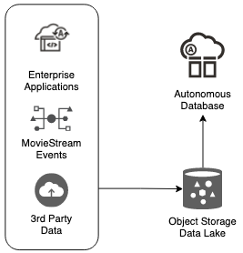

# Introduction

## About this Workshop

The labs in this workshop walk you through all the steps to build a Data Lake using Autonomous Warehouse (ADW), Oracle Object Storage, and optionally Oracle Cloud Infrastructure (OCI) Data Catalog. You will learn how to load (and link) data into your ADW instance using different from a variety of locations and in different formats, using Autonomous Database tools and APIs. You will analyze the linked and loaded data with SQL and also query Oracle Object Storage buckets from within ADW.

**Oracle MovieStream** is a fictitious movie streaming service - similar to those that to which you currently subscribe. They face challenges that are typical to many organizations across industries. MovieStream must:

* Gain a better understanding of their customers to ensure that they love the service
* Offer the right products to the right customers at the right price
* Grow the business to become a dominant player in the streaming business

Oracle Cloud provides an amazing platform to productively deliver secure, insightful, scalable and performant solutions. MovieStream designed their solution leveraging the world class Oracle Autonomous Database and Oracle Cloud Infrastructure (OCI) Data Lake services. Their data architecture is following the Oracle Reference Architecture [Enterprise Data Warehousing - an Integrated Data Lake](https://docs.oracle.com/en/solutions/oci-curated-analysis/index.html#GUID-7FF7A024-5EB0-414B-A1A5-4718929DC7F2) - which is used by Oracle customers around the world. It's worthwhile to review the architecture so you can understand the value of integrating the **data lake** and **data warehouse** - as it enables you to answer more complex questions using all your data.

In this workshop, we'll start with two key components of MovieStream's architecture. MovieStream is storing (and linking to) their data across Oracle Object Storage and Autonomous Database. Data is captured from various sources into a **landing** zone in object storage. This data is then processed (cleansed, transformed and optimized) and stored in a **gold** zone on object storage. Once the data is curated, it is loaded into an Autonomous Database where it is analyzed by many (and varied) members of the user community.

Estimated Time: 1.5 hours

### What is a Data Lake?
A data lake enables an enterprise to store all of its data in a cost effective, elastic environment while providing the necessary processing, persistence, and analytic services to discover new business insights. A data lake stores and curates structured and unstructured data and provides methods for organizing large volumes of highly diverse data from multiple sources. In this workshop, a Data Lake refers to the Oracle Object Storage buckets that you will harvest in Data Catalog and query in ADB.

### What is a Data Warehouse?
With a data warehouse, you perform data transformation and cleansing before you commit the data to the warehouse. With a data lake, you ingest data quickly and prepare it on the fly as people access it. A data lake supports operational reporting and business monitoring that require immediate access to data and flexible analysis to understand what is happening in the business while it happening. See [Cloud data lake house - process enterprise and streaming data for analysis and machine learning](https://docs.oracle.com/en/solutions/oci-curated-analysis/index.html#GUID-7FF7A024-5EB0-414B-A1A5-4718929DC7F2).

### What is a Lakehouse?
The Lakehouse combines the abilities of a data lake and a data warehouse to process a broad range of enterprise and streaming data for business analysis and machine learning. It offers an architecture that eliminates data silos – allowing you to analyze data across your data estate.

For additional information, see [What is the difference between a Data Lake, Database, and a Data Warehouse](https://www.oracle.com/a/ocom/docs/database/difference-between-data-lake-data-warehouse.pdf) and the [Oracle Cloud Data Lakehouse LiveLabs Workshop](https://apexapps.oracle.com/pls/apex/f?p=133:100:100470405399556::::SEARCH:lakehouse).

### Objectives

In this workshop, you will:

* Set up the workshop environment.
* Load local data files into your ADB instance.
* Load JSON data into your ADB instance and then and analyze that data.
* Link to data in public and private Object Storage buckets.
* Query both the Data Warehouse and the Data Lake (Oracle Object Storage buckets) from within ADW.
* Load and analyze the news from REST endpoints.
* Query data from Multi-Cloud Data Lakes (OCI and AWS S3).

### Prerequisites

* An Oracle Cloud Account - Please view this workshop's LiveLabs landing page to see which environments are supported. You may use your own cloud account or you can get a Free Trial account as described in the **Get Started** lab in the **Contents** menu.

  *Note: If you have a **Free Trial** account, when your Free Trial expires your account will be converted to an **Always Free** account. You will not be able to conduct Free Tier workshops unless the Always Free environment is available. **[Click here for the Free Tier FAQ page.](https://www.oracle.com/cloud/free/faq.html)***

* At least one Data Catalog user in your tenancy. This user must be created in Oracle Cloud Infrastructure Identity and Access Management (IAM).

You may now proceed to the next lab.

## Learn More

* [Get Started with Data Catalog](https://docs.oracle.com/en-us/iaas/data-catalog/using/index.htm)
* [Data Catalog Overview](https://docs.oracle.com/en-us/iaas/data-catalog/using/overview.htm)
* [Using Oracle Autonomous Database on Shared Exadata Infrastructure](https://docs.oracle.com/en/cloud/paas/autonomous-database/adbsa/index.html)
* [Oracle Cloud Infrastructure Documentation](https://docs.cloud.oracle.com/en-us/iaas/Content/GSG/Concepts/baremetalintro.htm)
* [What Is a Data Catalog and Why Do You Need One?](https://www.oracle.com/big-data/what-is-a-data-catalog/)

## Acknowledgements
* **Author:** Lauran Serhal, Consulting User Assistance Developer, Oracle Autonomous Database and Big Data
* **Contributors:**
    * Nilay Panchal, ADB Product Management
    * Richard Green, Database User Assistance
    * Marty Gubar, ADB Product Management
    * Alexey Filanovskiy, Senior Product Manager
* **Last Updated By/Date:** Lauran Serhal, April 2023

Data about movies in this workshop were sourced from Wikipedia.

Copyright (C) Oracle Corporation.

Permission is granted to copy, distribute and/or modify this document under the terms of the GNU Free Documentation License, Version 1.3 or any later version published by the Free Software Foundation; with no Invariant Sections, no Front-Cover Texts, and no Back-Cover Texts. A copy of the license is included in the section entitled [GNU Free Documentation License](https://oracle.github.io/learning-library/data-management-library/autonomous-database/shared/adb-15-minutes/introduction/files/gnu-free-documentation-license.txt)
