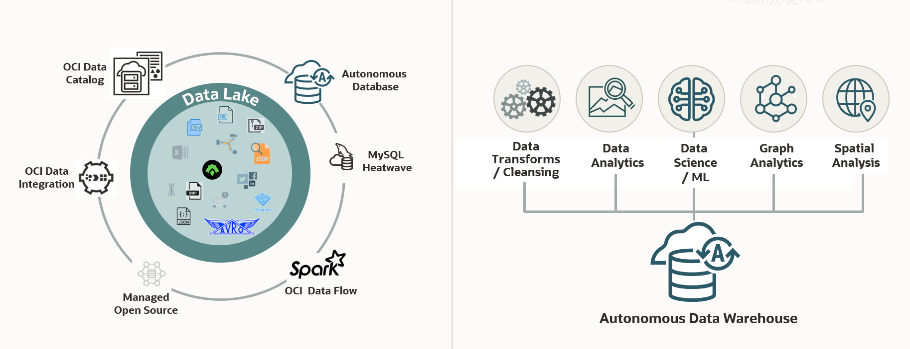

# Introduction

## About this Workshop

The labs in this workshop walk you through all the steps to build a Data Lake using Oracle Autonomous AI Lakehouse (LH), Oracle Object Storage, and Amazon Simple Storage Service (S3).

In the data-driven era, building efficient and scalable data lakes is pivotal for organizations aiming to harness the full potential of their data. Oracle Autonomous AI Lakehouse has made significant strides in this field, offering a unified platform rich with capabilities such as graph analysis, machine learning, spatial processing, JSON support, and in-memory data caching.

Traditionally, there were two main paths for creating data lake architectures: The database-centric and the object store-centric approach. Each offers unique strengths. The database-centric model excels in performance, concurrency, governance, and security. The object store-centric approach provides instant data access, multiple-engine compatibility, and multi-cloud support.

There are scenarios where an object store-centric approach shines. Oracle Autonomous AI Lakehouse supports a wide range of file formats and is compatible across multiple cloud platforms. It even facilitates seamless collaboration and data sharing with the Delta Sharing Protocol.

The focus of this workshop is on the process of building an object store-centric data lake with Oracle Autonomous AI Lakehouse. Whether you're an organization seeking superior performance, secure governance, or versatile support for diverse data formats and cloud platforms, this workshop is designed to equip you with the practical skills to leverage the full potential of your data with Oracle Oracle Autonomous AI Lakehouse. Oracle Autonomous AI Lakehouse provides an efficient, cost-effective, and robust data management solutions.

  

Estimated Time: 2.5 hours

### What is a Data Lake?
A data lake enables an enterprise to store all of its data in a cost effective, elastic environment while providing the necessary processing, persistence, and analytic services to discover new business insights. A data lake stores and curates structured and unstructured data and provides methods for organizing large volumes of highly diverse data from multiple sources. In this workshop, a Data Lake refers to the Oracle Object Storage buckets that you will query in Oracle Autonomous AI Database.

### What is a Data Warehouse?
With a data warehouse, you perform data transformation and cleansing before you commit the data to the warehouse. With a data lake, you ingest data quickly and prepare it on the fly as people access it. A data lake supports operational reporting and business monitoring that require immediate access to data and flexible analysis to understand what is happening in the business while it happening.

For additional information, see [What is the difference between a Data Lake, Database, and a Data Warehouse](https://www.oracle.com/a/ocom/docs/database/difference-between-data-lake-data-warehouse.pdf).

### Objectives

In this workshop, you will:

* Set up the workshop environment.
* Load local data files into your Oracle Autonomous AI Database instance.
* Load JSON data into your Oracle Autonomous AI Database instance and then and analyze that data.
* Link to data in public and private Object Storage buckets.
* Load and analyze the news from REST endpoints.
* Create external tables using the Delta Sharing protocol
* Query data from Oracle Autonomous AI Lakehouse and multi-cloud data lakes such OCI Object Storage buckets and Amazon S3 (Simple Storage Service).
* Use Oracle as a data provider.
* Improve query performance by creating a materialized view over an external table.
* Create and manage partitioned external tables to improve performance.

You can create a table on top of Parquet files, using **Database Actions** in Oracle Autonomous AI Database and then run SQL and REST queries. You can also create a table on top of JSON files using a PL/SQL API and then run SQL, JSON API, and MongoDB API queries. You can create a table on top of CSV files using a PL/SQL API and then run SQL queries. Finally, you can create external tables on top of public REST endpoints and Delta Sharing.

 

### Prerequisites

* An Oracle Cloud Account - Please view this workshop's LiveLabs landing page to see which environments are supported. You may use your own cloud account or you can get a Free Trial account as described in the **Get Started** lab in the **Contents** menu.

  *Note: If you have a **Free Trial** account, when your Free Trial expires your account will be converted to an **Always Free** account. You will not be able to conduct Free Tier workshops unless the Always Free environment is available. **[Click here for the Free Tier FAQ page.](https://www.oracle.com/cloud/free/faq.html)***

* This lab requires the completion of **Lab 1: Set up the Workshop Environment > Task 2: Provision the Autonomous AI Database Instance**, from the **Contents** menu on the left.

You may now proceed to the next lab.

## Learn More

* [Using Oracle Autonomous AI Database Serverless](https://docs.oracle.com/en/cloud/paas/autonomous-database/adbsa/index.html)
* [Oracle Cloud Infrastructure Documentation](https://docs.cloud.oracle.com/en-us/iaas/Content/GSG/Concepts/baremetalintro.htm)
* [What is the difference between a Data Lake, Database, and a Data Warehouse](https://www.oracle.com/a/ocom/docs/database/difference-between-data-lake-data-warehouse.pdf) and the [Oracle Cloud Data Lakehouse LiveLabs Workshop](https://livelabs.oracle.com/pls/apex/f?p=133:100:100470405399556::::SEARCH:lakehouse).

## Acknowledgements

* **Author:** Lauran K. Serhal, Consulting User Assistance Developer
* **Contributor:** Alexey Filanovskiy, Senior Product Manager
* **Last Updated By/Date:** Lauran K. Serhal, October 2025

Data about movies in this workshop were sourced from Wikipedia.

Copyright (C) 2025, Oracle Corporation.

Permission is granted to copy, distribute and/or modify this document under the terms of the GNU Free Documentation License, Version 1.3 or any later version published by the Free Software Foundation; with no Invariant Sections, no Front-Cover Texts, and no Back-Cover Texts. A copy of the license is included in the section entitled [GNU Free Documentation License](https://oracle-livelabs.github.io/adb/shared/adb-15-minutes/introduction/files/gnu-free-documentation-license.txt)
