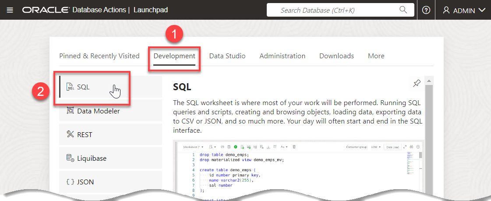
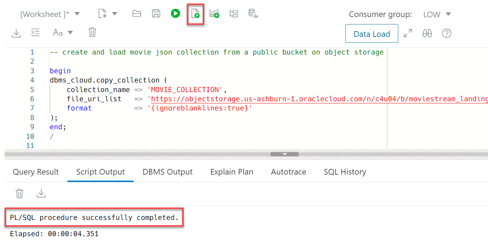
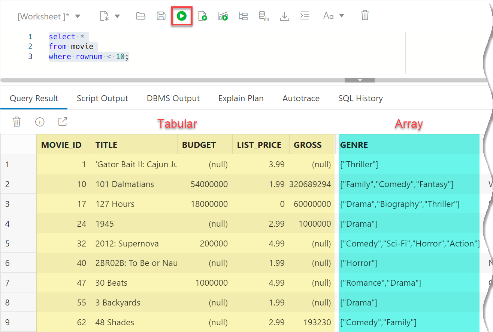
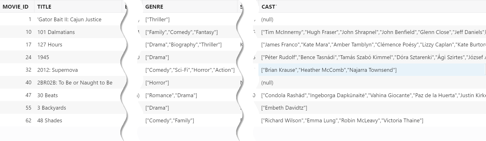
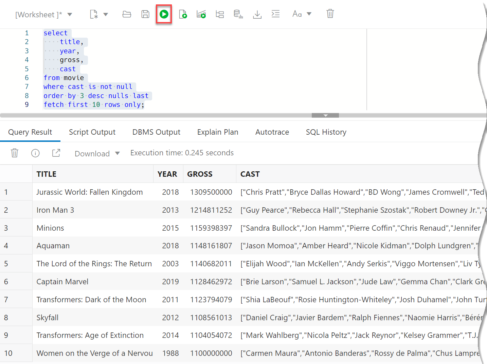

# Load and Analyze JSON Data

## Introduction

In this lab, you will load movie data that is stored in `JSON` format into an Oracle Autonomous AI Database collection. After loading the collection using the API, you will then analyze movie data using Oracle JSON functions.

Estimated Time: 10 minutes

Watch the video below for a quick walk-through of the lab.
[](youtube:5zgf-_sBIEk)

### Objectives

In this lab, you will:

* Load JSON data from Oracle Object Storage using the `DBMS_CLOUD.COPY_COLLECTION` procedure
* Use SQL to analyze both simple and complex JSON attributes

### Prerequisites

- This lab requires completion of the This lab requires the completion of **Lab 1: Set up the Workshop Environment > Task 2: Provision the Autonomous AI Database Instance**, from the **Contents** menu on the left.

## Task 1: Create and Load JSON Movie Collection
<!---
{
    "name":"Create and load JSON Collection from object storage",
    "description":"<ul><li>Loads data using DBMS_CLOUD.COPY_COLLECTION</li><li>Introduces JSON_SERIALIZE, JSON_VALUE and JSON_QUERY (minimal)</li><li>Creates a view over JSON data</li><li>Performs basic JSON queries</li></ul>"
}
--->
### What is JSON?
JSON provides a language independent, flexible, and powerful data model. It was derived from JavaScript, but many modern programming languages include code to generate and parse JSON-format data. For more information see [https://en.wikipedia.org/wiki/JSON](https://en.wikipedia.org/wiki/JSON). No wonder that it is such a popular storage format for developers.

Oracle SQL allows you to analyze JSON data - including complex data types like arrays - in combination with structured tabular data.

### Movie JSON Data
Our movie data set has a series of columns that contain different types of details about movies. Each movie has a **crew** associated with it and that crew is comprised of **jobs**, such as **producer**, **director**,**writer**, along with the names of the individuals. Each movie also has a list of award nominations and wins. An example of how this information is organized is shown below:


JSON data is organized very differently than typical warehouse data. There is a single entry for **producer** but the corresponding key **names** actually has multiple values. This is referred to as an **array** - specifically a JSON array.

1. You should be already on the **Data Load Dashboard** page from the previous lab. Click **Database Actions | Data Load** in the banner.

    

2. On the **Database Actions | Launchpad** page, click the **Development** tab, and then click the **SQL** tab.

    

    The SQL Worksheet is displayed.
6. Use the Oracle Autonomous AI Database ``DBMS_CLOUD.COPY_COLLECTION`` procedure to create and load the movie collection from object storage. Copy and paste the following script into your SQL Worksheet, and then click the **Run Script (F5)** icon in the Worksheet toolbar.
    ```
    <copy>
    -- create and load movie json collection from a public bucket on object storage

    begin
    dbms_cloud.copy_collection (
        collection_name => 'MOVIE_COLLECTION',
        file_uri_list   => 'https://objectstorage.us-ashburn-1.oraclecloud.com/n/c4u04/b/moviestream_landing/o/movie/*.json',
        format          => '{ignoreblanklines:true}'
    );
    end;
    /
    </copy>
    ```

    

    This single step creates a table called **`MOVIE_COLLECTION`** and populates it with JSON documents. You can access this table thru SQL, Oracle Database API for MongoDB, SODA REST, and more.

    > **Note:** There is extra metadata captured for SODA collections that is not removed by dropping the table directly using SQL ``drop table``. To properly drop a collection, use PL/SQL function [`DMBS_SODA.DROP_COLLECTION`](https://docs.oracle.com/en/database/oracle/oracle-database/18/adsdp/using-soda-pl-sql.html#GUID-D29C4FFF-D093-4C1B-889A-5C29B63756C6).

7. Let's take a look at the documents. The documents are stored in a highly optimized binary format. Use the `JSON_SERIALIZE` function to view the JSON text. Copy and paste the following SQL code into the worksheet, and then click the **Run Statement** icon in the Worksheet toolbar.

    >_**Note:** If you are using Autonomous AI Database 19c when importing a JSON collection, the default column name for JSON is **`JSON_DOCUMENT`**. The default column name has changed to **DATA** in Autonomous AI Database 26ai._
    
    ```
    <copy>
    select json_serialize(data) as json
    from movie_collection
    where rownum < 10;
    </copy>
    ```

    Your result will look similar to the following:

    

## Task 2: Analyze Simple JSON Fields to Find Meryl Streep's Movies
<!--
    {
        "name":"Query simple JSON attributes",
        "description":"Use dot notation and JSON_VALUE to query JSON documents. Creates a view to simplify subsequent access."
    }
-->
Oracle Database offers a wide range of SQL functions that help you analyze JSON data ([see Query JSON Data](https://docs.oracle.com/en/database/oracle/oracle-database/19/adjsn/query-json-data.html#GUID-119E5069-77F2-45DC-B6F0-A1B312945590) for details). The SQL capabilities include simple extraction of JSON attributes using dot notation, array and object manipulation, JSON aggregations and more.

1. Use the simple dot (.) notation to extract fields in a tabular format.

    The movie collection includes **`title`** and **`year`** attributes. Your SQL statements can use the dot notation to navigate through the JSON path. For example, **`m.json_document.title`** refers to table **`m` (`movie_collection`)**, the **`json_document`** column, and the **`title`** JSON attribute. Copy and paste the following SQL statement into the worksheet, and then click the **Run Statement** icon in the Worksheet toolbar to view **Meryl Streep's** movies:

    >_**Note:** If you are using Autonomous AI Database 19c when importing a JSON collection, the default column name for JSON is **`JSON_DOCUMENT`**. The default column name has changed to **DATA** in Autonomous AI Database 26ai._
    

    ```
    <copy>
    select
        m.data.title,
        m.data.year
    from movie_collection m
    where m.data.cast like '%Meryl Streep%';
    </copy>
    ```

    Meryl Streep movies and the years that they were released are displayed.

    

2. You can simplify subsequent queries against the movie collection by using a view. The view will allow tools and applications to access JSON data as if it were tabular data. The view definition extracts from the JSON documents both simple fields (using the `JSON_VALUE` function) and complex arrays (using the `JSON_QUERY` function). Copy and paste the following SQL code into the worksheet, and then click the **Run Statement** icon in the Worksheet toolbar.

```
<copy>
-- Create a view over the collection to make queries easy
create or replace view movie as
select
    json_value(data, '$.movie_id' returning number) as movie_id,
    json_value(data, '$.title') as title,
    json_value(data, '$.budget' returning number) as budget,
    json_value(data, '$.list_price' returning number) as list_price,
    json_value(data, '$.gross' returning number) as gross,
    json_query(data, '$.genre' returning varchar2(400)) as genre,
    json_value(data, '$.sku' returning varchar2(30)) as sku,
    json_value(data, '$.year' returning number) as year,
    json_value(data, '$.opening_date' returning date) as opening_date,
    json_value(data, '$.views' returning number) as views,
    json_query(data, '$.cast' returning varchar2(4000)) as cast,
    json_query(data, '$.crew' returning varchar2(4000)) as crew,
    json_query(data, '$.studio' returning varchar2(4000)) as studio,
    json_value(data, '$.main_subject' returning varchar2(400)) as main_subject,
    json_query(data, '$.awards' returning varchar2(4000)) as awards,
    json_query(data, '$.nominations' returning varchar2(4000)) as nominations,
    json_value(data, '$.runtime' returning number) as runtime,
    json_value(data, '$.summary' returning varchar2(10000)) as summary
from movie_collection;
</copy>
```
    
Each JSON attribute is now exposed as a column - similar to any table column.


3. Query the newly created by view. Copy and paste the following SQL code into the worksheet, and then click the **Run Statement** icon in the Worksheet toolbar.

    ```
    <copy>
    select *
    from movie
    where rownum < 10;
    </copy>
    ```

    

    Most of the data is in tabular format. However, several of the fields are arrays. For example, there are multiple genres and cast members associated with each movie.

    

## Task 3: Analyze Complex JSON Arrays to Find Top Actors
<!--
    {
        "name":"Query JSON arrays",
        "description":"Use JSON_TABLE to convert arrays into rows."
    }
-->
### Query JSON Arrays
An array of cast members is stored for each movie. Here, you can see that Tom Hanks, Elizabeth Perkins, Robert Loggia were all a part of the cast for the movie **Big**.


In order to find the top grossing actors across movies, the arrays for each movie need to be expanded into rows: _One row for each **movie**-**cast** members combination_. The `JSON_TABLE` function is designed for this purpose. The following will illustrate how to use the function. See [SQL/JSON Function JSON_TABLE](https://docs.oracle.com/en/database/oracle/oracle-database/19/adjsn/function-JSON_TABLE.html#GUID-0172660F-CE29-4765-BF2C-C405BDE8369A).

1. Find the top grossing movies. Copy and paste the following SQL statement into the worksheet, and then click the **Run Statement** icon in the Worksheet.

    ```
    <copy>
    select
        title,
        year,
        gross,
        cast
    from movie
    where cast is not null
    order by 3 desc nulls last
    fetch first 10 rows only;
    </copy>
    ```

    The top 10 grossing movies in descending order and the list of actors for each movie are displayed.

    

2. Finding the top movies is easy. It's not quite as simple to find the top grossing actors because actors are stored in the cast array. Let's break this down into a couple of steps. First, use `JSON_TABLE` to perform a lateral join; a row will be created for each **cast member-movie combination**. Copy and paste the following SQL statement into the worksheet, and then click the **Run Statement** icon in the Worksheet.

    ```
    <copy>
    select
        title,
        year,
        gross,
        jt.actor
    from movie m,
        json_table(m.cast,'$[*]' columns (actor path '$')) jt
    order by gross desc nulls last;
    </copy>
    ```
    The result will look similar to the image below:

    

    Step one is complete! A JSON table is created with a row for each actor and movie combination.

3. The next step will find the top 10 actors based on box office receipts across all their movies. Copy and paste the following SQL statement into the worksheet, and then click the **Run Statement** icon in the Worksheet.

    ```
    <copy>
    select
        actor,
        sum(gross)
    from movie m,
        json_table(m.cast,'$[*]' columns (actor path '$')) jt
    where actor != 'novalue'    -- filter out bad values
    group by actor
    order by 2 desc nulls last
    fetch first 10 rows only;
    </copy>
    ```

    Stan Lee and Hugo Weaving are leading the pack!

    

    You may now proceed to the next lab.

## Learn more

* [DBMS_CLOUD Package](https://docs.oracle.com/en/cloud/paas/autonomous-database/adbsa/dbms-cloud-package.html#GUID-CE359BEA-51EA-4DE2-88DB-F21A9FC10721)
* [JSON File Format](https://en.wikipedia.org/wiki/JSON).
* [COPY_COLLECTION Procedure](https://docs.oracle.com/en/cloud/paas/autonomous-database/adbsa/dbms-cloud-subprograms.html#GUID-0985BB63-A86D-41C0-8B5B-B9E965809F5A)
* [Dropping a Document Collection with SODA for PL/SQL](https://docs.oracle.com/en/database/oracle/oracle-database/18/adsdp/using-soda-pl-sql.html#GUID-D29C4FFF-D093-4C1B-889A-5C29B63756C6)
* [ Query JSON Data](https://docs.oracle.com/en/database/oracle/oracle-database/19/adjsn/query-json-data.html#GUID-119E5069-77F2-45DC-B6F0-A1B312945590)
* [SQL/JSON Function JSON_VALUE](https://docs.oracle.com/en/database/oracle/oracle-database/19/adjsn/function-JSON_VALUE.html#GUID-0565F0EE-5F13-44DD-8321-2AC142959215)
* [SQL/JSON Function JSON_TABLE](https://docs.oracle.com/en/database/oracle/oracle-database/19/adjsn/function-JSON_TABLE.html#GUID-0172660F-CE29-4765-BF2C-C405BDE8369A)

You may now proceed to the next lab.

## Acknowledgements

* **Author: (Retired)** Marty Gubar, Autonomous AI Database Product Management
* **Contributor:** Lauran K. Serhal, Consulting User Assistance Developer
* **Last Updated By/Date:** Lauran K. Serhal, October 2025

Data about movies in this workshop were sourced from Wikipedia.

Copyright (C) 2025, Oracle Corporation.

Permission is granted to copy, distribute and/or modify this document
under the terms of the GNU Free Documentation License, Version 1.3
or any later version published by the Free Software Foundation;
with no Invariant Sections, no Front-Cover Texts, and no Back-Cover Texts.
A copy of the license is included in the section entitled [GNU Free Documentation License](https://oracle-livelabs.github.io/adb/shared/adb-15-minutes/introduction/files/gnu-free-documentation-license.txt)