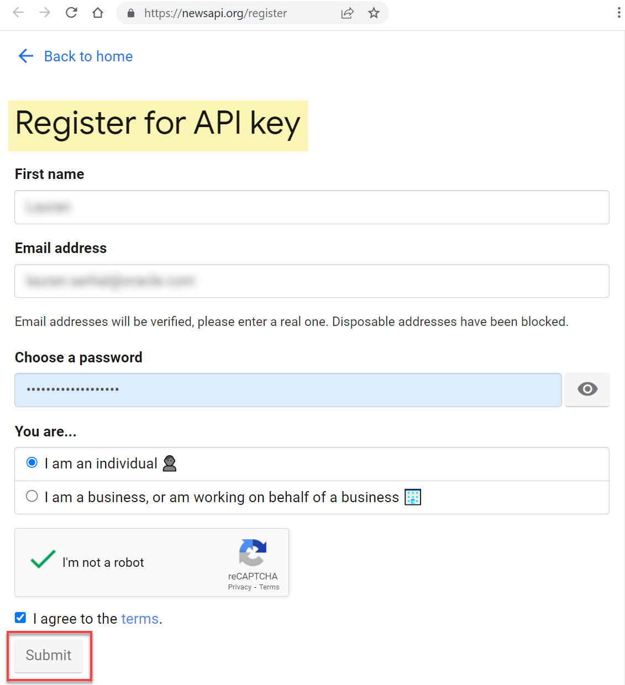
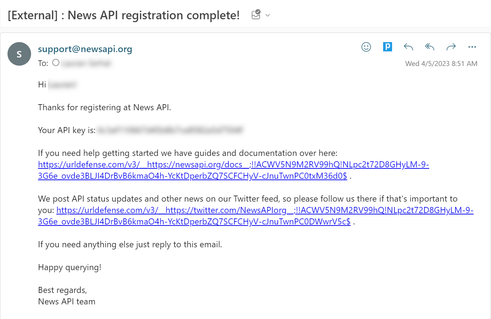
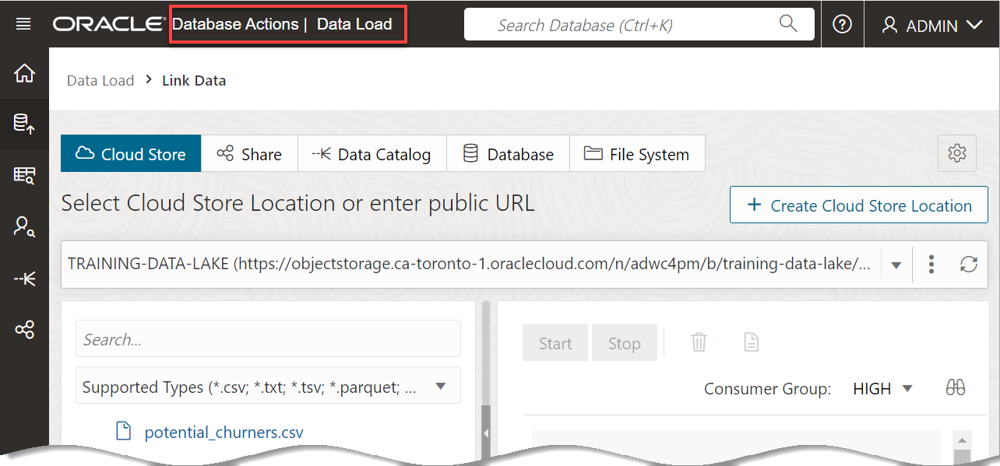
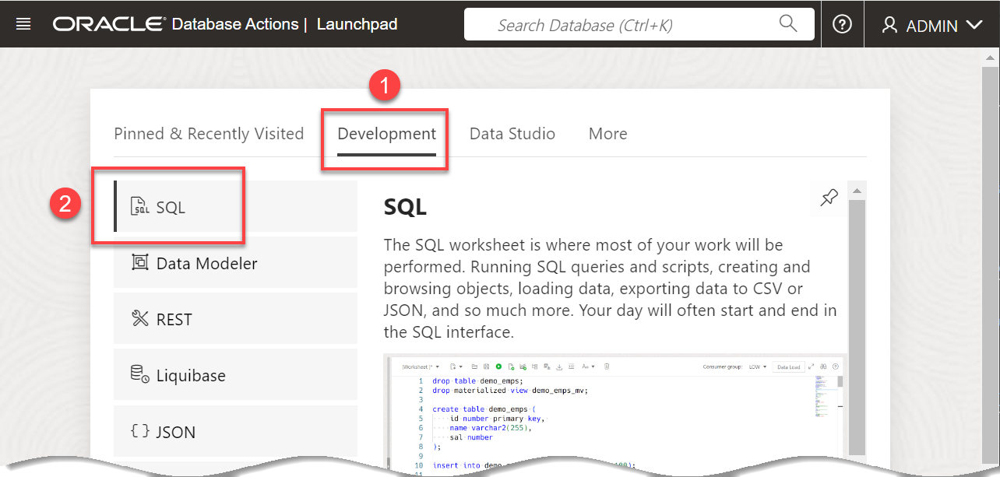
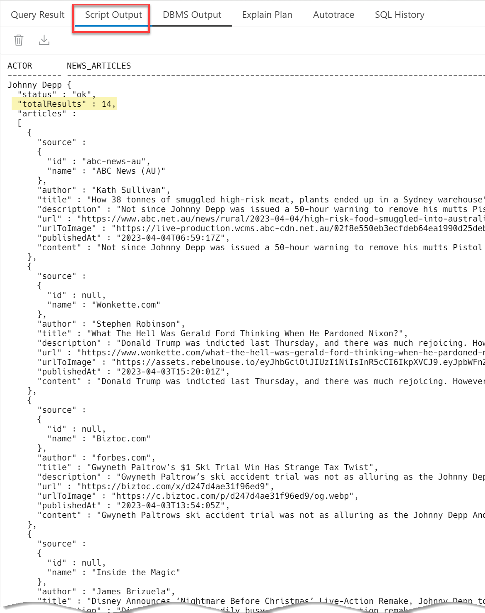

<!---
{
    "name":"Load and Analyze Data from REST Services",
    "description":"Analyze data sourced from REST services. Using the News API as an example.<ul><li>Create an Account on https://newsapi.org</li><li>Create a PL/SQL function that retrieves news for actors</li><li>Perform a sentiment analysis on the article descriptions</li><li>Find which actors are generating buzz - both good and bad</li></ul>"
}
--->
# Load and Analyze the News from REST Endpoints

## Introduction

There are so many interesting and potentially useful data sets available today via REST: social, financial, science, health, weather and so on. Oracle Autonomous AI Database makes it really easy to integrate these sources using SQL queries. This eliminates the need for intermediate processing and storage and making that data available to any SQL client.

**News API** is a simple HTTP REST API for searching and retrieving live articles from all over the web. It can help you answer questions such as:

* What top stories is TechCrunch running right now?
* What new articles were published about the next iPhone today?
* Has my company or product been mentioned or reviewed by any blogs recently?

You can search for articles with any combination of the following criteria:

* **Keyword or phrase:** For example, find all articles containing the word `Microsoft`.
* **Date published:**. For example, find all articles published yesterday.
* **Source domain name:** For example, find all articles published on https://thenextweb.com.
* **Language:** For example,  find all articles written in English.

You can sort the results in the following order:
* **Date published**
* **Relevancy to search keyword**
* **Popularity of source**

In this lab, you will find the latest news about actors and then perform a sentiment analysis of that news. This information can help decide which movies to promote on the MovieStream site - allowing MovieStream to take advantage of "buzz" to drive revenue.

Estimated Time: 10 minutes

Watch the video below for a quick walk-through of the lab.
[Load and Analyze the News from REST Endpoints](videohub:1_sznobm6z)

### Objectives

In this lab, you will:
* Create an account on News API (https://newsapi.org/) and retrieve an API key.
* Create a PL/SQL function that retrieves the latest news for actors.
* Perform a sentiment analysis on the article descriptions.
* Identify which actors are generating buzz - both good and bad.

### Prerequisites

* An ADB instance.
* movies loaded from Oracle object storage.

## Task 1: Create a News API Account and Key

You need an API key to use the **News API**. This is a unique key that identifies your requests. They're free while you're in development.

Create a **News API** account as follows:

1. Register for an API key from the [News API](https://newsapi.org/register).

2. Complete the fields on the registration page, including your first name, email, and password. Agree to the terms, and then click **Submit**.

    

    A **Registration Complete** dialog box is displayed that shows your API key. Save your API key for later use.

    

3. You will receive an email from News API that includes your API key. You will need this API key to make REST calls against the service.

    

4. You will use the [`Everything` News API endpoint (`https://newsapi.org/v2/everything`)](https://newsapi.org/docs/endpoints/everything). The key parameters for the REST endpoint are:

    | Parameter | Description |
    | --------- | ----------- |
    | **`q`**         | The search term. This will be an actor in our example|
    | **`searchin`**  | You will search news items' titles and descriptions (the full article requires more work) |
    | **`from`**      | The oldest article. You will default to one week ago |
    | **`to`**      | The newest article. You will default to today |
    | **`sortby`**    | You will sort by the published date |
    {: title="News API parameters"}

## Task 2: Create a PL/SQL Function to Retrieve News for an Actor

Now that you have the API key, create a PL/SQL function that queries the REST endpoint using the parameters above.

1. Navigate to the SQL Worksheet. Click the **Database Actions | Data Load** in the banner.

    

2. On the **Launchpad** page, click the **Development** tab, and then click the **SQL** tab.

    

    The SQL Worksheet is displayed.

    
    
6. Ensure that the public REST endpoint is accessible by our PL/SQL function. Copy and paste the following API call code into your SQL Worksheet to update the access control list, and then click the **Run Script (F5)** icon in the Worksheet toolbar. This will allow the **ADMIN** user to call out to any public host.

    ```
    <copy>
    begin

    dbms_network_acl_admin.append_host_ace(
         host => '*',
         ace => xs$ace_type(privilege_list => xs$name_list('http'),
                             principal_name => 'ADMIN',
                             principal_type => xs_acl.ptype_db)
        );
    end;
    /
    </copy>
    ```

    The output is displayed in the **Script Output** tab.

    

7. Create the function that queries the **News API REST endpoint**. Copy and paste the code in the next step into your SQL Worksheet. _Replace the **`enter-your-api-key`** place holder in the variables declaration section (labeled -- REST management) with your own **API key** that you received from News API when you created your account_.

     

8. Click the **Run Script (F5)** icon in the Worksheet toolbar.

    ```
    <copy>

    -- turn off prompting for parameter values

    set define off;

    create or replace function get_news (
        news_search in varchar2 default '+"Tom Hanks"',
        from_date in varchar2 default to_char(sysdate-7, 'YYYY-MM-DD'),
        end_date in varchar2 default to_char(sysdate, 'YYYY-MM-DD')
        )
    return clob is

    result_row      clob;

    -- REST management
    req             varchar2(1000);
    resp            dbms_cloud_types.resp;
    params          varchar2(1000);
    apikey          varchar2(100) := 'enter-your-api-key';
    endpoint        varchar2(100) := 'https://newsapi.org/v2/everything';

    begin
        -- Create the URL based on the parameters, API Key and rest endpoint
        params      :=  '?q=' || news_search
                        || '&apikey=' ||apikey
                        || '&from=' || from_date
                        || '&to=' || end_date
                        || '&sortBy=publishedAt&language=en&searchIn=title,description';


        req := utl_url.escape(endpoint || params);

    -- send the request and process the result
    resp := dbms_cloud.send_request(
        credential_name => null,
        -- headers         => reqheader,
        uri             => req,
        method          => DBMS_CLOUD.METHOD_GET,
        cache           => true
    );

    -- Get the response. This is in JSON format
    result_row := dbms_cloud.get_response_text(resp);

    -- Return the result
    return result_row;
    end;
    /
    </copy>
    ```

    The **`DBMS_CLOUD.SEND_REQUEST`** is the key function; it queries the endpoint and returns a response object. This response object is then passed to **`BMS_CLOUD.GET_RESPONSE_TEXT`** to retrieve the news articles in JSON format.

    

9. Query the News API for the top 20 actors. The result of the query is saved into a table. Copy and paste the following code into your SQL Worksheet, and then click the **Run Script (F5)** icon in the Worksheet toolbar.

    ```
    <copy>
    create table news as
    with top_actors as (
        select
            jt.actor,
            sum(gross)
        from movie m,
            json_table(m.cast,'$[*]' columns (actor path '$')) jt
        where actor != 'novalue'
        group by jt.actor
        order by 2 desc nulls last
        fetch first 20 rows only
    )
    select
        actor,
        get_news(actor) as json_document
    from top_actors
    ;
    </copy>
    ```

    This query is broken into two parts:
    - A subquery - select the top 20 actors based on box office revenue.
    - For each of those top actors, get the latest news by calling the `get_news` function.

    

10. Let's see the news for **Johnny Depp**. Copy and paste the following code into your SQL Worksheet, and then click the **Run Script (F5)** icon in the Worksheet toolbar.

    >**Note:** Since you are querying a live news feed, your results will definitely be different our results.

    ```
    <copy>
    select
        actor,
        json_query(json_document, '$' returning clob pretty) as news_articles
    from news
    where actor = 'Johnny Depp';
    </copy>
    ```

    There are **14** articles across publications about Johnny Depp. Unfortunately, not all the news is good.

    

11. Finally, let's clean up the JSON and make it more structured and easier to analyze. Use the **`JSON_TABLE`** function to turn the nested arrays into rows. Again, we'll create a table with a row for each article. Copy and paste the following code into your SQL Worksheet, and then click the **Run Script (F5)** icon in the Worksheet toolbar.

    ```
    <copy>
    create table news_buzz as
    select
        actor,
        json_value(json_document, '$.totalResults' returning number) as buzz,
        author,
        source,
        title,
        description
    from news n,
        json_table(n.json_document, '$.articles[*]'
            columns (
                source      varchar2(100)    path '$.source.name',
                author      varchar2(100)    path '$.author',
                title       varchar2(200)    path '$.title',
                description varchar2(1000)   path '$.description'
            )
        ) jt;
    </copy>
    ```

    

12. Let's review the results. Copy and paste the following code into your SQL Worksheet, and then click the **Run Statement** icon in the Worksheet toolbar.

    ```
    <copy>
    select *
    from news_buzz;
    </copy>
    ```

    It's now easy to see each article that refers to an actor, including its title and description.

    

## Task 3: Analyze the Sentiment of Each Article's Description

Now that you have the latest news for each actor, you will derive the sentiment of those articles. Oracle Database has powerful text functions for tokenizing the text and then analyzing it. In this example, you will use the defaults; however, you can perform much more sophisticated models using training methods.

1. Specify the type of lexer to use. We will use the **`automatic`** version, which will be sufficient for this example. Copy and paste the following code into the SQL Worksheet, and then click **Run Script (F5)** in the Worksheet toolbar.

    ```
    <copy>
    exec ctx_ddl.create_preference('newsautolexer','AUTO_LEXER');
    </copy>
    ```

    

2. Create the sentiment index. The index creation analyzes each article, derives the sentiment, and stores it in the index. Copy and paste the following code into the SQL Worksheet, and then click **Run Script (F5)** in the Worksheet toolbar.

    ```
    <copy>
    create index news_sentiment_idx
    on news_buzz(description)
    indextype is ctxsys.context
    parameters ('lexer newsautolexer stoplist ctxsys.default_stoplist');
    </copy>
    ```

    

3. Let's look at the sentiment of some of Johnny Depp's news. Copy and paste the following code into the SQL Worksheet, and then click **Run Statement** in the Worksheet toolbar.

    ```
    <copy>
    select
        actor,
        ctx_doc.sentiment_aggregate('news_sentiment_idx', rowid) as sentiment,
        description
    from news_buzz
    where actor = 'Johnny Depp'
    order by sentiment
    ;
    </copy>
    ```

    

    The Total Results is 54 in our example; however, your results might be different. Scroll to the right to view the complete results. The description field is fairly small. A richer text field would likely produce even better results.

4. MovieStream needs to decide which movies to promote on their site. Actors that are generating more buzz and the type of news will likely have some influence on their recommendations. Query the ranking for the actors. Copy and paste the following code into the SQL Worksheet, and then click **Run Statement** in the Worksheet toolbar.

    ```
    <copy>
    select
        actor,
        round(avg(ctx_doc.sentiment_aggregate('news_sentiment_idx', rowid)), 1) as avg_sentiment,
        max(buzz)
    from news_buzz
    group by actor
    order by 3 desc;
    </copy>
    ```

    

This completes this lab. You now know how to integrate and analyze data coming from REST endpoints in Oracle Autonomous AI Database.

You may now proceed to the next lab.

## Learn more

* [SQL Language Reference](https://docs.oracle.com/en/database/oracle/oracle-database/19/sqlrf/index.html)
* [DBMS_CLOUD Subprograms and REST APIs](https://docs.oracle.com/en/cloud/paas/autonomous-database/adbsa/dbms-cloud-subprograms.html#GUID-3D0A5361-672C-467D-AA90-656B1B4D4E37)
* [Oracle Text](https://docs.oracle.com/en/database/oracle/oracle-database/19/ccref/index.html)
* [Oracle Cloud Infrastructure Documentation](https://docs.cloud.oracle.com/en-us/iaas/Content/GSG/Concepts/baremetalintro.htm)
* [Using Oracle Autonomous AI Database Serverless](https://docs.oracle.com/en/cloud/paas/autonomous-database/adbsa/index.html)

## Acknowledgements

* **Authors:**
    * Marty Gubar (Retired), Autonomous AI Database Product Management
    * Lauran K. Serhal, Consulting User Assistance Developer
* **Last Updated By/Date:** Lauran K. Serhal, October 2025

Data about movies in this workshop were sourced from Wikipedia.

Copyright (C) 2025, Oracle Corporation.

Permission is granted to copy, distribute and/or modify this document
under the terms of the GNU Free Documentation License, Version 1.3
or any later version published by the Free Software Foundation;
with no Invariant Sections, no Front-Cover Texts, and no Back-Cover Texts.
A copy of the license is included in the section entitled [GNU Free Documentation License](https://oracle-livelabs.github.io/adb/shared/adb-15-minutes/introduction/files/gnu-free-documentation-license.txt)