# Load Data from Local Files

## Introduction

In this lab, you will practice multiple methods for loading and linking to data into an Oracle Autonomous Database (either Oracle Autonomous Data Warehouse or Oracle Autonomous Transaction Processing) using the ADB built-in Database Action tools, or using other Oracle and third party data integration tools.

You can also leave data in place in cloud object storage, and link to it from your Autonomous Database.

> **Note:** While this lab uses Oracle Autonomous Data Warehouse, the steps are identical for loading data into an Oracle Autonomous Transaction Processing database.

Estimated Time: 30 minutes

Watch the video below for a quick walk-through of the lab.
[Load Data from Local Files](videohub:1_q7r7bcp0)

### Objectives

In this lab, you will:
* Download two **.csv** data files to your local computer from the MovieStream data lake (Oracle Object Storage buckets).
* Navigate to the Data Load utility of Oracle Autonomous Database Data Tools.
* Load data from the .csv files to your autonomous database instance.

### Prerequisites

This lab requires the completion of **Lab 1: Set up the Workshop Environment > Task 3: Create an Autonomous Data Warehouse Instance**, from the **Contents** menu on the left.

## Task 1: Download .csv Files from the MovieStream Data Lake to your Local Computer

1. Right-click on each of the links below, and then click **Save link as...** from the context menu to download the files to a folder on your local computer.

    * [Download customer\_segment.csv](https://objectstorage.us-ashburn-1.oraclecloud.com/n/c4u04/b/moviestream_landing/o/customer_segment/customer_segment.csv)
    * [Download customer-extension.csv](https://objectstorage.us-ashburn-1.oraclecloud.com/n/c4u04/b/moviestream_landing/o/customer_extension/customer-extension.csv)

    >**Note:** Make a note of your folder location as you will use the two downloaded files in a later task in this lab.

## Task 2: Navigate to the Data Load Page

1. Log in to the **Oracle Cloud Console**, if you are not already logged as the Cloud Administrator. You will complete all the labs in this workshop using this Cloud Administrator. On the **Sign In** page, select your tenancy, enter your username and password, and then click **Sign In**. The **Oracle Cloud Console** Home page is displayed.

2. Open the **Navigation** menu and click **Oracle Database**. Under **Oracle Database**, click **Autonomous Database**.

3. On the **Autonomous Databases** page, click your **ADW-Data-Lake** ADB instance.
    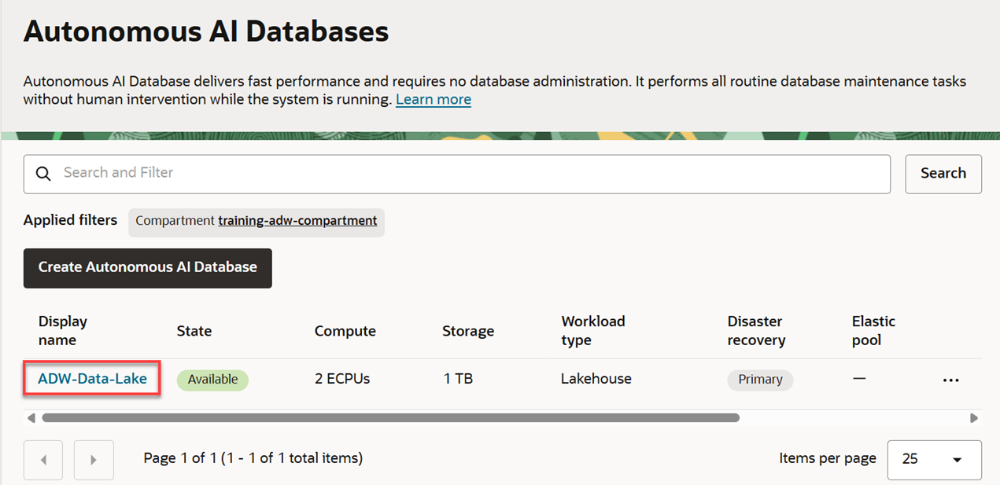

4. On the **Autonomous Database details** page, click **Database actions**.

    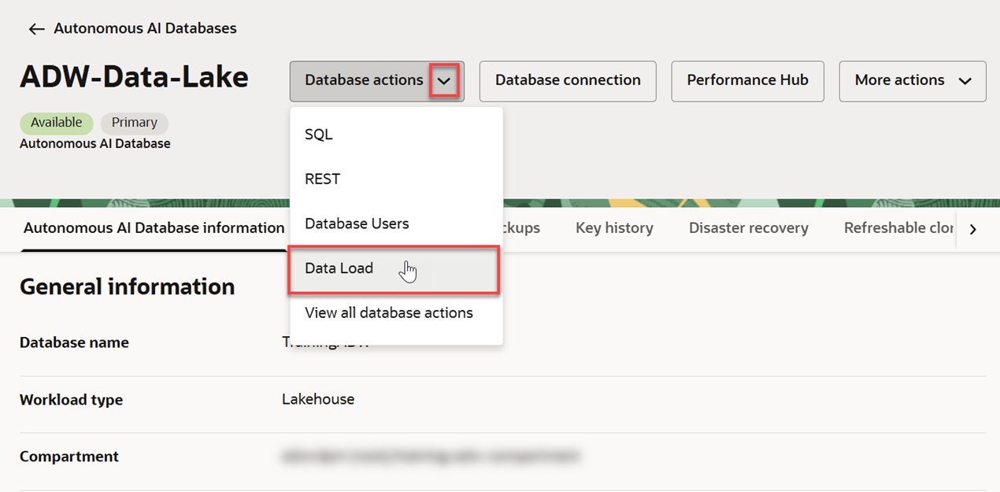

5. A **Launch DB actions** message box with the message **Please wait. Initializing DB Actions** is displayed. Next, the **Database Actions | Launchpad** Home page is displayed in a new tab in your browser. In the **Data Studio** section, click the **Data Load** card.

    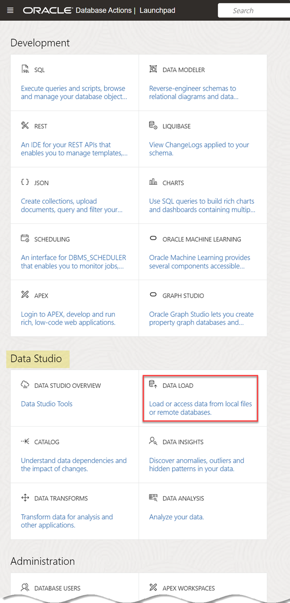

## Task 3: Load Data from the CSV Files Using the LOAD DATA Tool

In this task you will load the two .csv files that you downloaded earlier into two different tables in your Autonomous Database instance.

1. In the **What do you want to do with your data?** section, accept the default selection, **LOAD DATA**.

2. In the **Where is your data?** section, accept the default selection, **LOCAL FILE**, and then click **Next**.

    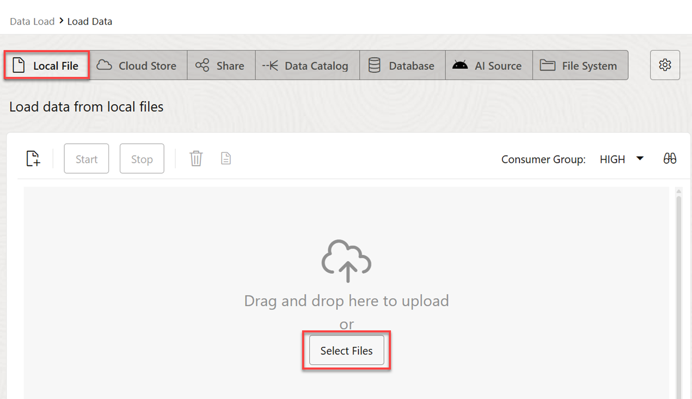

3. You can use the **Local Files** page to either drag and drop files to upload, or click **Select Files** to select the files to upload. Click **Select Files**.

    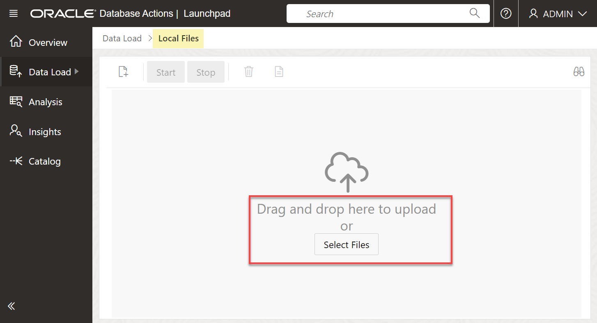

4. In the **Open** dialog box, navigate to the directory that contains the two **.csv** files that you downloaded earlier. Select the *customer\_segment.csv* and *customer\_extension.csv* files.

    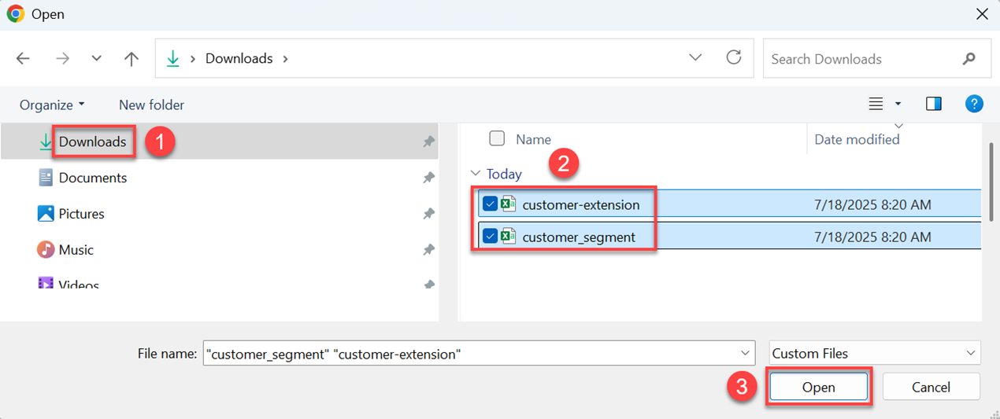

5. When the upload is complete, you can click the **Start** button and then click **Run** to run the data load job; however, we will make a small change to the default table name that will be created for the *customer-extension.csv* file. Click the 3-dot ellipsis icon to the right of *customer-extension.csv* and then click **Settings** from the context menu.

    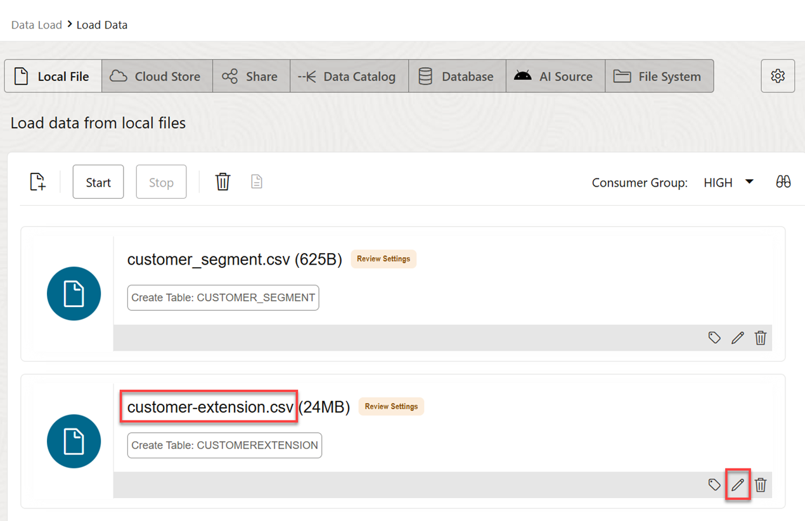

6. The **Load Data from Local File customer-extension.csv** page is displayed. Take a moment to examine the preview information and loading options. The tool makes intelligent choices for target table name and its properties. Since this is an initial load, accept the default option of **Create Table** to create the target table in your Autonomous Database. In the mappings section, you can change the target column names, data types, and length/precision.

    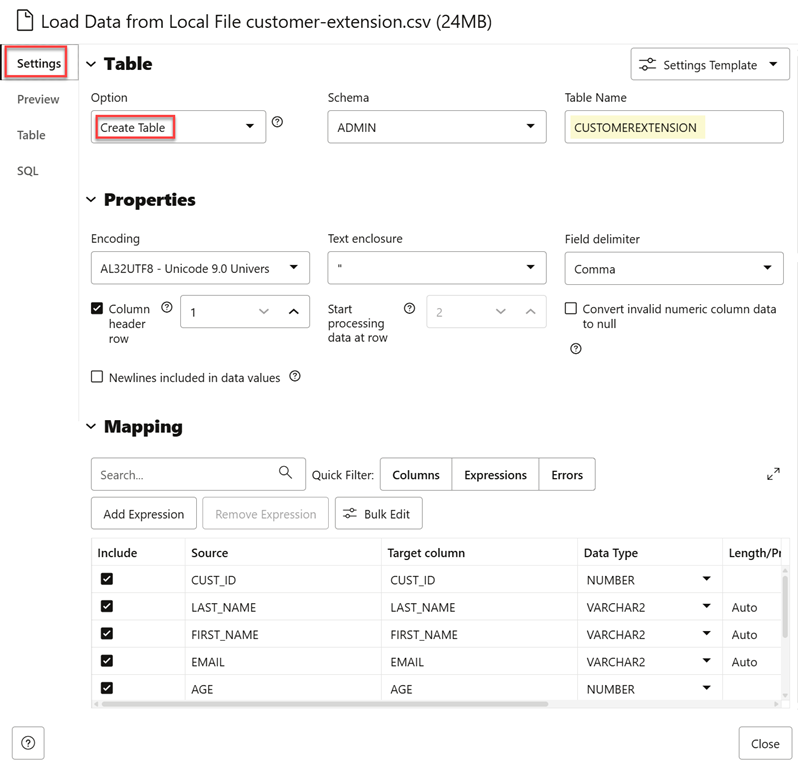

7. Change the table name that will be created from **CUSTOMEREXTENSION** to **CUSTOMER\_EXTENSION**. Click **Close** in the lower right corner of the page.

    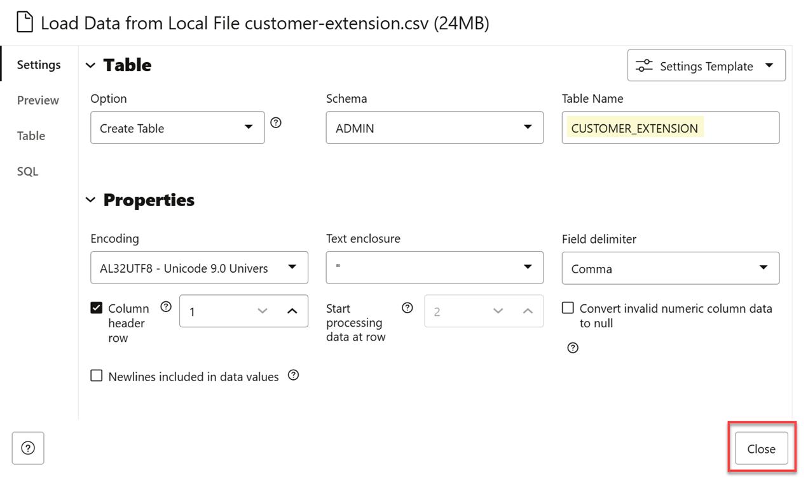

8. Click **Start**. A **Run Data Load Job** confirmation dialog box is displayed. Click **Run**.

    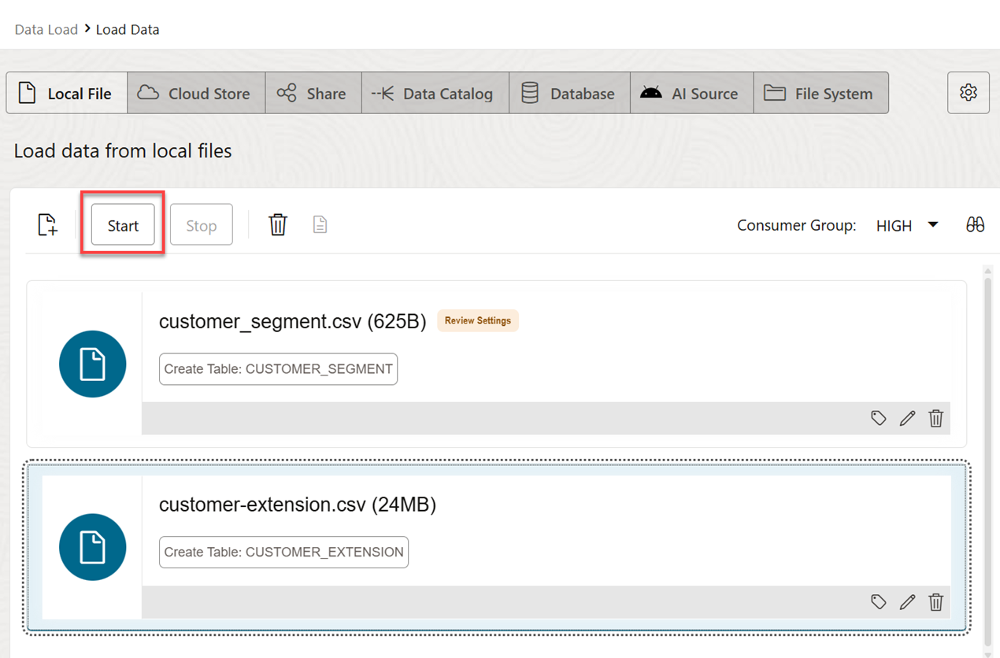

9. When the load job is complete, a green check mark appears next to each table. Click **Catalog** in the menu on the left.

    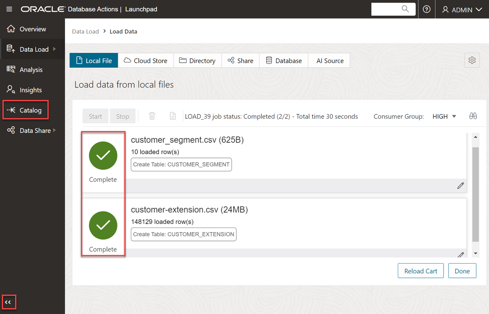

    > **Note:** If the menu on the left is collapsed, click the double arrows icon to expand it so that the label for each icon is displayed.

    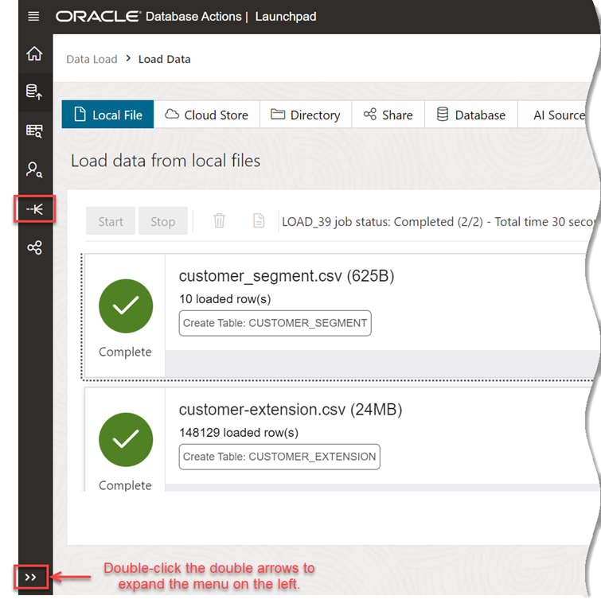

10. The Catalog displays the two newly created tables: *CUSTOMER\_SEGMENT* and *CUSTOMER\_EXTENSION*.

    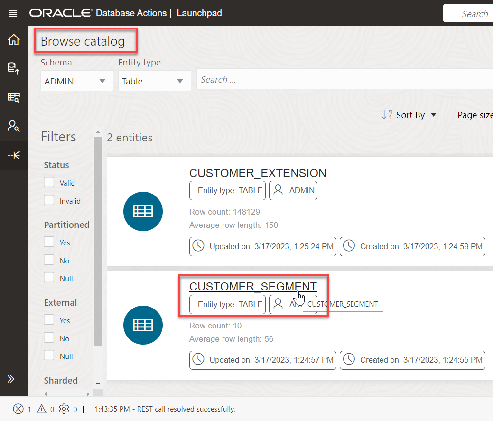

    You can click a table name to display its data. Click the *CUSTOMER\_SEGMENT* table to view the data. When done, click **Close**.

    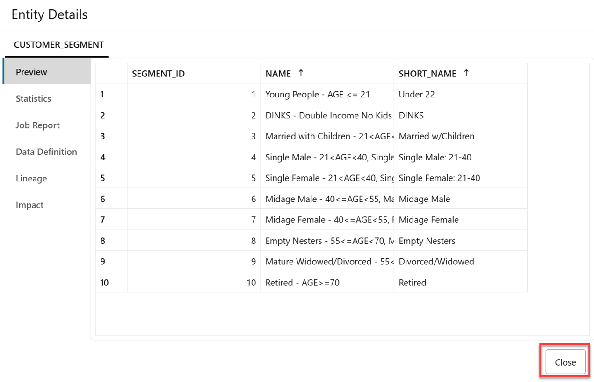

This completes the lab on loading .csv files from your local computer to new tables in your ADB instance.

You may now proceed to the next lab.

## Learn More

* [Oracle Cloud Infrastructure Documentation](https://docs.cloud.oracle.com/en-us/iaas/Content/GSG/Concepts/baremetalintro.htm)
* [Using Oracle Autonomous Database on Shared Exadata Infrastructure](https://docs.oracle.com/en/cloud/paas/autonomous-database/adbsa/index.html)

## Acknowledgements
* **Author:** Lauran Serhal, Consulting User Assistance Developer, Oracle Database and Big Data
* **Contributors:**
    * Mike Matthews, Autonomous Database Product Management
    * Marty Gubar, Autonomous Database Product Management
* **Last Updated By/Date:** Lauran Serhal, May 2023

Data about movies in this workshop were sourced from Wikipedia.

Copyright (C) Oracle Corporation.

Permission is granted to copy, distribute and/or modify this document
under the terms of the GNU Free Documentation License, Version 1.3
or any later version published by the Free Software Foundation;
with no Invariant Sections, no Front-Cover Texts, and no Back-Cover Texts.
A copy of the license is included in the section entitled [GNU Free Documentation License](files/gnu-free-documentation-license.txt)
