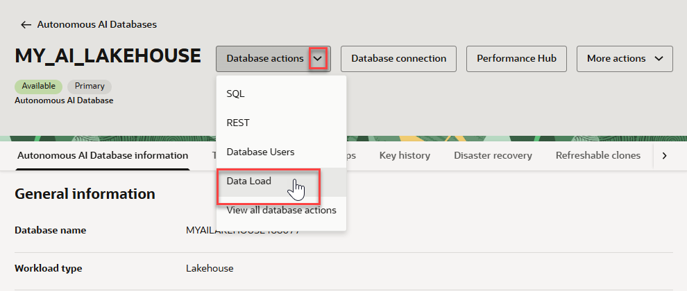

# Load Data from Local Files

## Introduction

In this lab, you will practice multiple methods for loading and linking to data into an Oracle Autonomous AI Database (either Oracle Autonomous AI Lakehouse or Oracle Autonomous AI Transaction Processing) using the Oracle Autonomous AI Database built-in Database Action tools, or using other Oracle and third party data integration tools.

You can also leave data in place in cloud object storage, and link to it from your Autonomous AI Database.

> **Note:** While this lab uses Oracle Autonomous AI Lakehouse, the steps are identical for loading data into an Oracle Autonomous AI Transaction Processing database.

Estimated Time: 10 minutes

Watch the video below for a quick walk-through of the lab.

### Objectives

In this lab, you will:
* Download two **.csv** data files to your local computer from the MovieStream data lake (Oracle Object Storage buckets).
* Navigate to the Data Load utility of Oracle Autonomous AI Database Data Tools.
* Load data from the .csv files to your Oracle Autonomous AI Database instance.

### Prerequisites

This lab requires the completion of the previous labs from the **Contents** menu on the left.

<!-- Begin liveLabs section of task -->

<if type="livelabs">

_You should already have launched the workshop and logged in to the Console using the instructions in the **Get Started with LiveLabs** lab_

</if>

<!-- Begin freetier section of the task -->
<if type="freetier">

## Task 1: Log in to the Oracle Cloud Console

1. Log in to the **Oracle Cloud Console**, if you are not already logged as the Cloud Administrator. You will complete all the labs in this workshop using this Cloud Administrator. On the **Sign In** page, select your tenancy, enter your username and password, and then click **Sign In**. The **Oracle Cloud Console** Home page is displayed.

</if>

## Task 1: Download .csv Files from the MovieStream Data Lake to your Local Computer

Oracle MovieStream is a fictitious movie streaming service - similar to those that to which you currently subscribe. MovieStream is storing (and linking to) their data across Oracle Object Storage and Oracle Autonomous AI Database. Data is captured from various sources into a landing zone in object storage. This data is then processed (cleansed, transformed and optimized) and stored in a gold zone on object storage. Once the data is curated, it is loaded into an Oracle Autonomous AI Database where it is analyzed by many (and varied) members of the user community.

1. Right-click on each of the links below, and then click **Save link as...** from the context menu to download the files to a folder on your local computer.

    * [Download customer\_segment.csv](https://objectstorage.us-ashburn-1.oraclecloud.com/n/c4u04/b/moviestream_landing/o/customer_segment/customer_segment.csv)
    * [Download customer-extension.csv](https://objectstorage.us-ashburn-1.oraclecloud.com/n/c4u04/b/moviestream_landing/o/customer_extension/customer-extension.csv)

2. Close the Excel files and make a note of your folder location as you will use the two downloaded files in a later task in this lab.

## Task 2: Navigate to the Data Load Page

<if type="livelabs">
Your green button reservation includes an ADB instance. You can find the required credentials in the **Reservation Information** dialog box for your reservation.
</if>

1. Log in to the **Oracle Cloud Console**, if you are not already logged in; otherwise, skip to step 4.

2. Open the **Navigation** menu and click **Oracle AI Database**. Under **Oracle AI Database**, click **Autonomous AI Database**.

<if type="livelabs">
        
    >**Note:** The **Couldn't load data** error on the page is due to being in the wrong compartment. You will learn how to navigate to your assigned compartment next. 

    

    OCI resources are organized into compartments. To navigate to your assigned sandbox reservation compartment, click the **Compartment** field. Next, enter your assigned compartment name (or partial name) from the **Reservation Information** page in the **Compartment** text box. Once your assigned compartment is displayed in the drop-down list under the **`Livelabs`** node, click it.
    
    

    >**Note:** For more details on finding your assigned resources in your reservation such as the username, password, compartment and so on, review the **Get Started with LiveLabs** lab in the Navigation menu on the left. To view the ADB instance details, click the **View Login Info** link to display the **Reservation Information** dialog box. The database admin password, database name, and database name are displayed.
</if>

3. On the **Autonomous AI Databases** page, click your **`MY_AI_LAKEHOUSE`** ADB instance.

    <if type="freetier">
    
    </if>

    <if type="livelabs">
    
    </if>

4. On the **`MY_AI_LAKEHOUSE`** page, click the **Database actions** drop-down list, and then click **Data Load**.

    

5. The **Data Load** Home page is displayed in a _**new tab in your browser**_.

    

    >**Note:** You can close the **No Credential and AI Profile Found** section.

</if>

## Task 3: Load Data from the CSV Files Using the LOAD DATA Tool

In this task you will load the two .csv files that you downloaded earlier into two different tables in your Autonomous AI Database instance.

1. On the **Data Load** page, click the **Load Data** card.

2. On the **Load Data** page, the **Local File** button is selected by default. In the **Load data from local files** section, you can either drag and drop files to upload, or click **Select Files** to select the files to upload. Click **Select Files**.

    

3. In the **Open** dialog box, navigate to the directory that contains the two **.csv** files that you downloaded earlier. Select the **`customer_segment.csv`** and **`customer_extension.csv`** files, and then click **Open**.

    

    >**Note:** If you have an issue uploading both files simultaneously, you can select one file at a time. Select the first downloaded file using step 3. When the file is uploaded, click the **Select Files** icon on the **Load Data** page, and then select the second file.

4. When the upload is complete, you will make a small change to the default table name that will be created for the **`customer-extension.csv`** file. Click the **Settings** (pencil) icon to the right of **`customer-extension.csv`**.

    

5. The **Load Data from Local File customer-extension.csv** page is displayed. Take a moment to examine the settings. The tool makes intelligent choices for target table name and its properties. Since this is an initial load, accept the default option of **Create Table** to create the target table in your Autonomous AI Database. In the mappings section, you can change the target column names, data types, and length/precision.

    

6. In the **Name** field, change the table name that will be created from **`CUSTOMEREXTENSION`** to **`CUSTOMER_EXTENSION`**. Click **Close** in the lower right corner of the page.

    

7. Click **Start**. A **Start Load from Local Files** confirmation dialog box is displayed. Click **Run**.

    

    

8. After the load job is completed, make sure that the data load card has the copy icon next to it. You can click the **Report** button for the load job to view a report of total rows processed successfully and failed for the selected table.

    

9. You can click a table name to display its data. In this example, click the **ellipsis** icon for the **`CUSTOMER_SEGMENT`** load task to view its settings among other things. Next, click **Table > View Details** from the context menu.

    

10. The **Preview** tab is selected by default. This shows the **`CUSTOMER_SEGMENT`** data.

    

10. When finished, click **Close** to return to the Data Load Dashboard.

    

This completes the lab on loading .csv files from your local computer to new tables in your ADB instance.

You may now proceed to the next lab.

## Learn More

* [Oracle Cloud Infrastructure Documentation](https://docs.cloud.oracle.com/en-us/iaas/Content/GSG/Concepts/baremetalintro.htm)
* [Using Oracle Autonomous AI Database Serverless](https://docs.oracle.com/en/cloud/paas/autonomous-database/adbsa/index.html)

## Acknowledgements

* **Author:** Lauran K. Serhal, Consulting User Assistance Developer, Oracle Autonomous AI Database and Multicloud
* **Contributor:** Mike Matthews, Autonomous AI Database Product Management
* **Last Updated By/Date:** Lauran K. Serhal, March 2026

Data about movies in this workshop were sourced from Wikipedia.

Copyright (C) 2026 Oracle Corporation.

Permission is granted to copy, distribute and/or modify this document
under the terms of the GNU Free Documentation License, Version 1.3
or any later version published by the Free Software Foundation;
with no Invariant Sections, no Front-Cover Texts, and no Back-Cover Texts.
A copy of the license is included in the section entitled [GNU Free Documentation License](https://oracle-livelabs.github.io/adb/shared/adb-15-minutes/introduction/files/gnu-free-documentation-license.txt)
