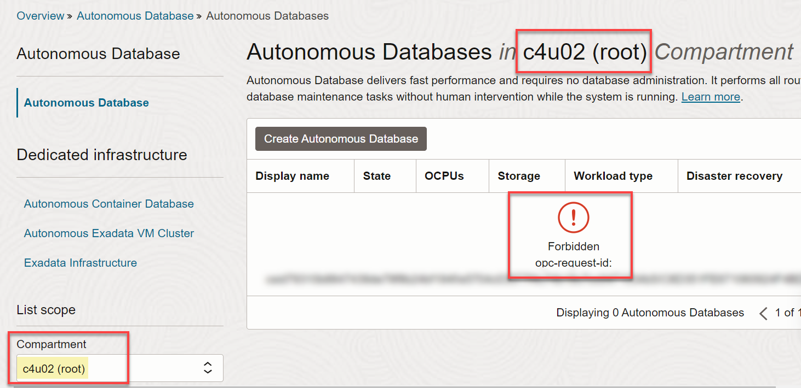
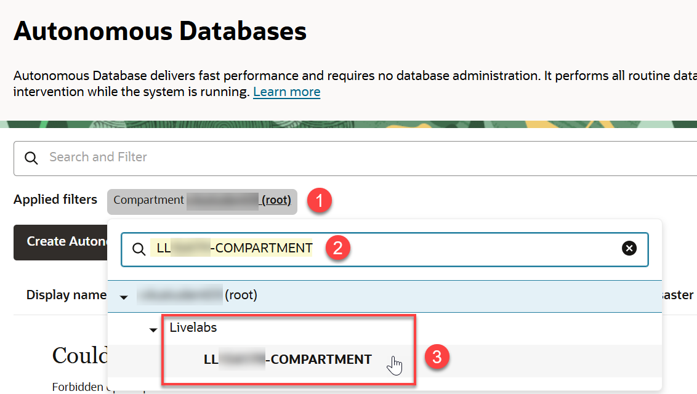
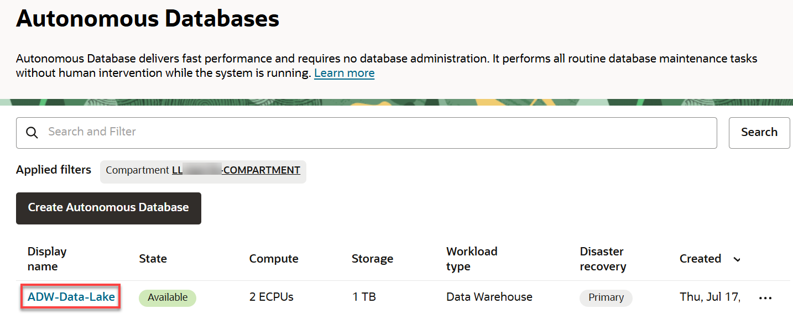
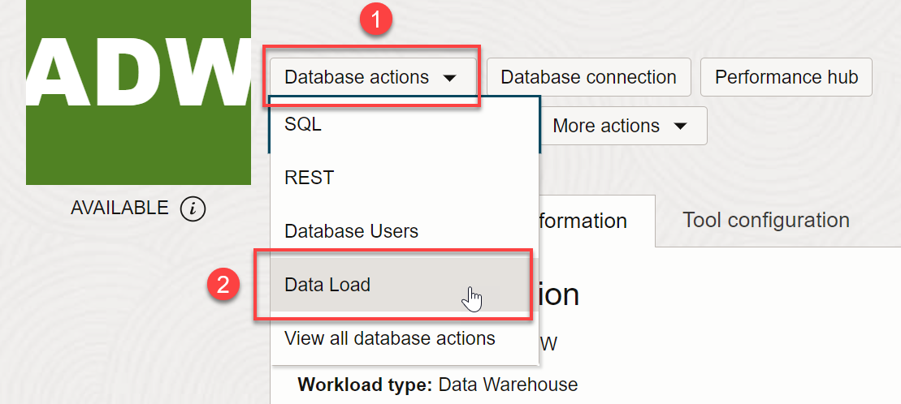
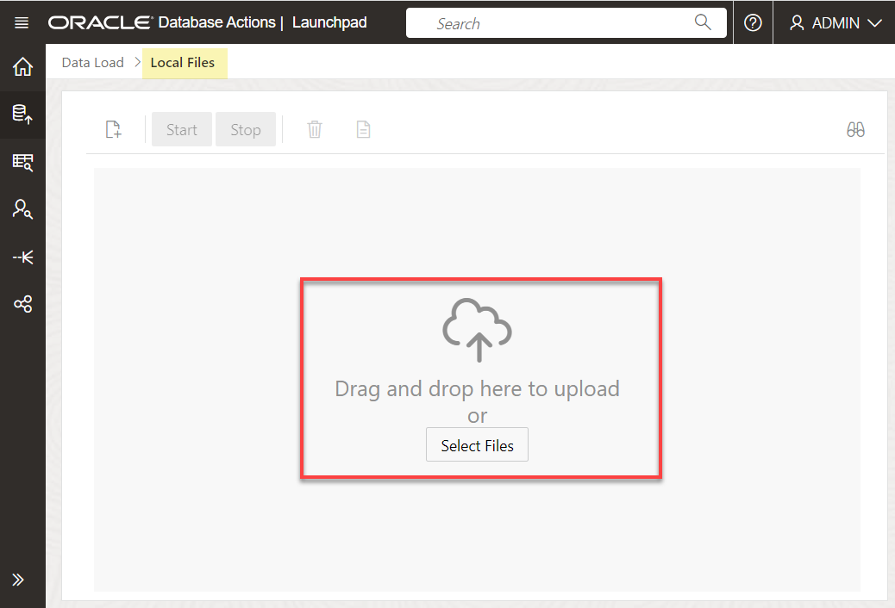
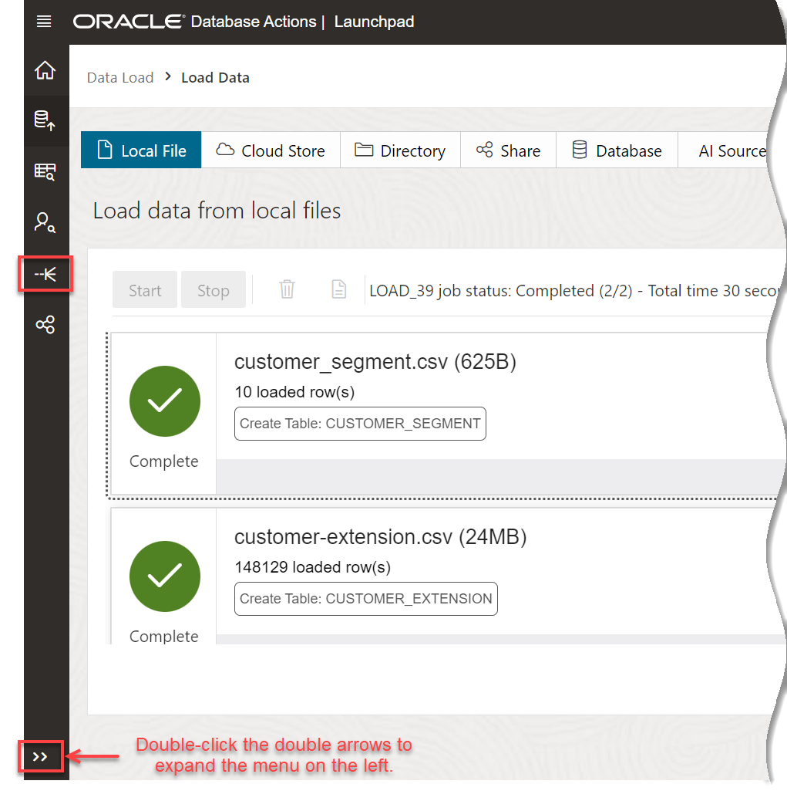
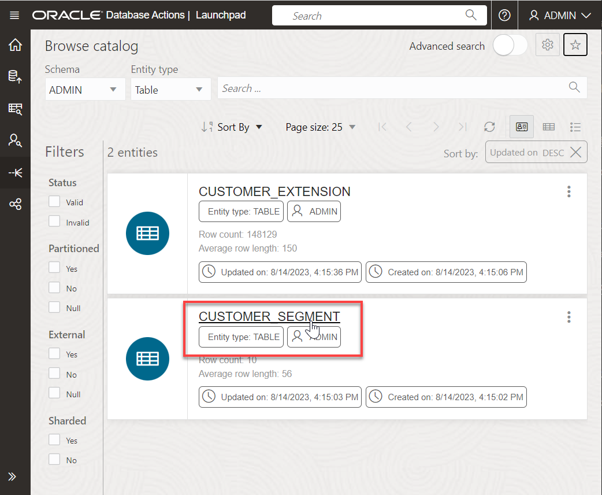
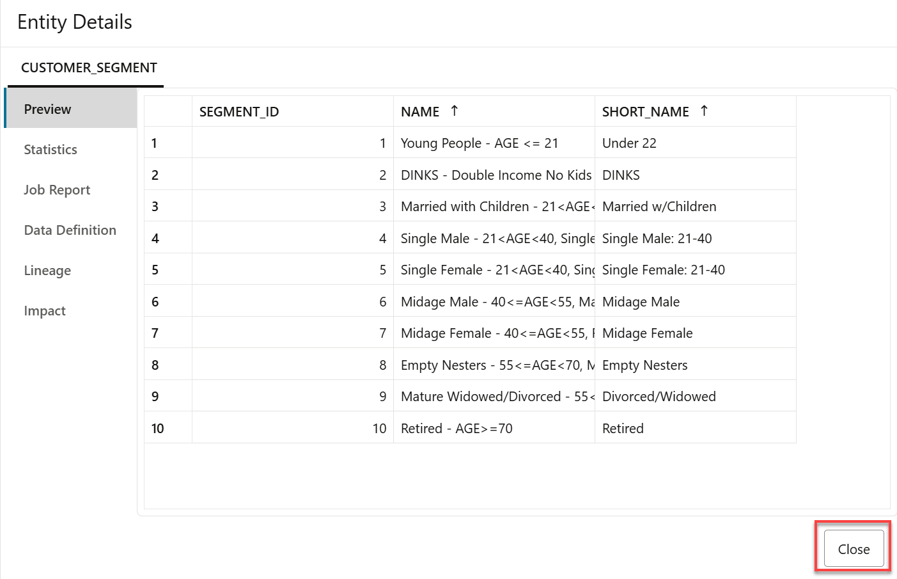

# Load Data from Local Files

## Introduction

In this lab, you will practice multiple methods for loading and linking to data into an Oracle Autonomous Database (either Oracle Autonomous Data Warehouse or Oracle Autonomous Transaction Processing) using the ADB built-in Database Action tools, or using other Oracle and third party data integration tools.

You can also leave data in place in cloud object storage, and link to it from your Autonomous Database.

> **Note:** While this lab uses Oracle Autonomous Data Warehouse, the steps are identical for loading data into an Oracle Autonomous Transaction Processing database.

Estimated Time: 10 minutes

Watch the video below for a quick walk-through of the lab.
[Load Data from Local Files](videohub:1_q7r7bcp0)

### Objectives

In this lab, you will:
* Download two **.csv** data files to your local computer from the MovieStream data lake (Oracle Object Storage buckets).
* Navigate to the Data Load utility of Oracle Autonomous Database Data Tools.
* Load data from the .csv files to your autonomous database instance.

### Prerequisites

This lab requires the completion of **Lab 1: Set up the Workshop Environment > Task 3: Create an Autonomous Data Warehouse Instance**, from the **Contents** menu on the left.

<!-- Begin liveLabs section of task -->

<if type="livelabs">

## Task 1: Launch the Workshop and Log in to the Oracle Cloud Console

_If you already launched the workshop and logged in to the Console using the instructions in the **Get Started with LiveLabs** lab, you can skip this task and proceed to **Task 2**; otherwise, start with **step 1** below._

1. On the LiveLabs Home page, click the **My Reservations** tab to display your reserved workshop on the **My Reservations** page. To start the workshop, click the **Launch Workshop** link.

    

    The workshop is displayed in a new tab named **Run Workshop - Build a Data Lake with Autonomous Database**. Click the **View Login Info** link in the banner.

    

     The **Reservation Information** panel is displayed. This displays important information that you will need throughout this workshop.

    

2. Click **Copy Password** to copy your initial password, and then click **Launch OCI**.

3. On the Sign In page, in the **Oracle Cloud Infrastructure Direct Sign-In** section, your assigned username is already displayed in the **User Name** field. Paste your password in the **Password** field, and then click **Sign In**.

    

4. The **Change Password** dialog box is displayed. Paste your assigned password that you copied in the **Current Password**. Enter a new password in the **New Password** and **Confirm New Password** fields, and then click **Save New Password**. Make a note of your new password as you will need it in this workshop.

    

    The **Oracle Cloud Console** Home page is displayed. Make sure that the displayed region is the same that was assigned to you in the **Reservation Information** panel of the **Run Workshop *workshop-name*** page, **Canada Southeast (Toronto)** in this example.

    

    >**Note:** Bookmark the workshop page for quicker access.
</if>

<!-- Begin freetier section of the task -->
<if type="freetier">

## Task 1: Log in to the Oracle Cloud Console

1. Log in to the **Oracle Cloud Console**, if you are not already logged as the Cloud Administrator. You will complete all the labs in this workshop using this Cloud Administrator. On the **Sign In** page, select your tenancy, enter your username and password, and then click **Sign In**. The **Oracle Cloud Console** Home page is displayed.

</if>

## Task 2: Download .csv Files from the MovieStream Data Lake to your Local Computer

Oracle MovieStream is a fictitious movie streaming service - similar to those that to which you currently subscribe. MovieStream is storing (and linking to) their data across Oracle Object Storage and Autonomous Database. Data is captured from various sources into a landing zone in object storage. This data is then processed (cleansed, transformed and optimized) and stored in a gold zone on object storage. Once the data is curated, it is loaded into an Autonomous Database where it is analyzed by many (and varied) members of the user community.

1. Right-click on each of the links below, and then click **Save link as...** from the context menu to download the files to a folder on your local computer.

    * [Download customer\_segment.csv](https://objectstorage.us-ashburn-1.oraclecloud.com/n/c4u04/b/moviestream_landing/o/customer_segment/customer_segment.csv)
    * [Download customer-extension.csv](https://objectstorage.us-ashburn-1.oraclecloud.com/n/c4u04/b/moviestream_landing/o/customer_extension/customer-extension.csv)

2. Close the Excel files and make a note of your folder location as you will use the two downloaded files in a later task in this lab.

## Task 3: Navigate to the Data Load Page

<if type="livelabs">
1. You should be already logged in to the Console using the instructions in the **Task 1** in this lab.

2. Open the **Navigation** menu and click **Oracle Database**. Under **Oracle Database**, click **Autonomous Database**. The **Autonomous Databases** page should be displayed; however, your assigned resources for this workshop are all in your assigned LiveLabs compartment (that is displayed in the  **Reservation Information** panel) and not in the **root** tenancy. The following expected warning message is displayed.

    

3. To select your assigned LiveLabs compartment, click the **Compartment** drop-down list in the **List Scope** section on the left. Enter your LiveLabs assigned compartment name in the **Compartment** text field to search for it which should look something like **LL#####-COMPARTMENT** where the **#####** is a unique five-digit number. Alternatively, you can drill-down on the **Livelabs** node and select your assigned compartment. When your assigned compartment is displayed in the list of compartments, select it. In addition, make sure that your LiveLabs assigned region from the **Run Workshop *workshop-name*** page is selected in Console's banner.

    

    >**Note:** Refer to the **Reservation Information** panel that you can access from the **Run Workshop *workshop-name*** tab for information about your assigned resources.

    

4. On the **Autonomous Databases** page, click your **DB-DCAT** ADB instance.
    

5. On the **Autonomous Database details** page, click the **Database actions** drop-down list, and then click **Data Load**.

    

6. The **Data Load** Home page is displayed in a _**new tab in your browser**_.

    
</if>

<if type="freetier">

1. Log in to the **Oracle Cloud Console**, if you are not already logged as the Cloud Administrator.

2. Open the **Navigation** menu and click **Oracle Database**. Under **Oracle Database**, click **Autonomous Database**.

3. On the **Autonomous Databases** page, click your **ADW-Data-Lake** ADB instance.
    

4. On the **Autonomous Database details** page, click the **Database actions** drop-down list, and then click **Data Load**.

    

5. The **Data Load** Home page is displayed in a _**new tab in your browser**_.

    
</if>

## Task 4: Load Data from the CSV Files Using the LOAD DATA Tool

In this task you will load the two .csv files that you downloaded earlier into two different tables in your Autonomous Database instance.

1. In the **What do you want to do with your data?** section, accept the default selection, **LOAD DATA**.

2. In the **Where is your data?** section, accept the default selection, **LOCAL FILE**, and then click **Next**.

    

3. You can use the **Local Files** page to either drag and drop files to upload, or click **Select Files** to select the files to upload. Click **Select Files**.

    

4. In the **Open** dialog box, navigate to the directory that contains the two **.csv** files that you downloaded earlier. Select the *customer\_segment.csv* and *customer\_extension.csv* files.

    

5. When the upload is complete, you can click the **Start** button and then click **Run** to run the data load job; however, we will make a small change to the default table name that will be created for the *customer-extension.csv* file. Click the 3-dot ellipsis icon to the right of *customer-extension.csv* and then click **Settings** from the context menu.

    

6. The **Load Data from Local File customer-extension.csv** page is displayed. Take a moment to examine the preview information and loading options. The tool makes intelligent choices for target table name and its properties. Since this is an initial load, accept the default option of **Create Table** to create the target table in your Autonomous Database. In the mappings section, you can change the target column names, data types, and length/precision.

    

7. Change the table name that will be created from **CUSTOMEREXTENSION** to **CUSTOMER\_EXTENSION**. Click **Close** in the lower right corner of the page.

    

8. Click **Start**. A **Run Data Load Job** confirmation dialog box is displayed. Click **Run**.

    

9. When the load job is complete, a green check mark appears next to each table. Click **Catalog** in the menu on the left.

    

    > **Note:** If the menu on the left is collapsed, click the double arrows icon to expand it so that the label for each icon is displayed.

    

10. The Catalog displays the two newly created tables: *CUSTOMER\_SEGMENT* and *CUSTOMER\_EXTENSION*.

    

    You can click a table name to display its data. Click the *CUSTOMER\_SEGMENT* table to view the data. When done, click **Close**.

    

This completes the lab on loading .csv files from your local computer to new tables in your ADB instance.

You may now proceed to the next lab.

## Learn More

* [Oracle Cloud Infrastructure Documentation](https://docs.cloud.oracle.com/en-us/iaas/Content/GSG/Concepts/baremetalintro.htm)
* [Using Oracle Autonomous Database Serverless](https://docs.oracle.com/en/cloud/paas/autonomous-database/adbsa/index.html)

## Acknowledgements
* **Author:** Lauran Serhal, Consulting User Assistance Developer, Oracle Database and Big Data
* **Contributors:**
    * Mike Matthews, Autonomous Database Product Management
    * Marty Gubar, Autonomous Database Product Management
* **Last Updated By/Date:** Lauran Serhal, August 2023

Data about movies in this workshop were sourced from Wikipedia.

Copyright (C) Oracle Corporation.

Permission is granted to copy, distribute and/or modify this document
under the terms of the GNU Free Documentation License, Version 1.3
or any later version published by the Free Software Foundation;
with no Invariant Sections, no Front-Cover Texts, and no Back-Cover Texts.
A copy of the license is included in the section entitled [GNU Free Documentation License](files/gnu-free-documentation-license.txt)
