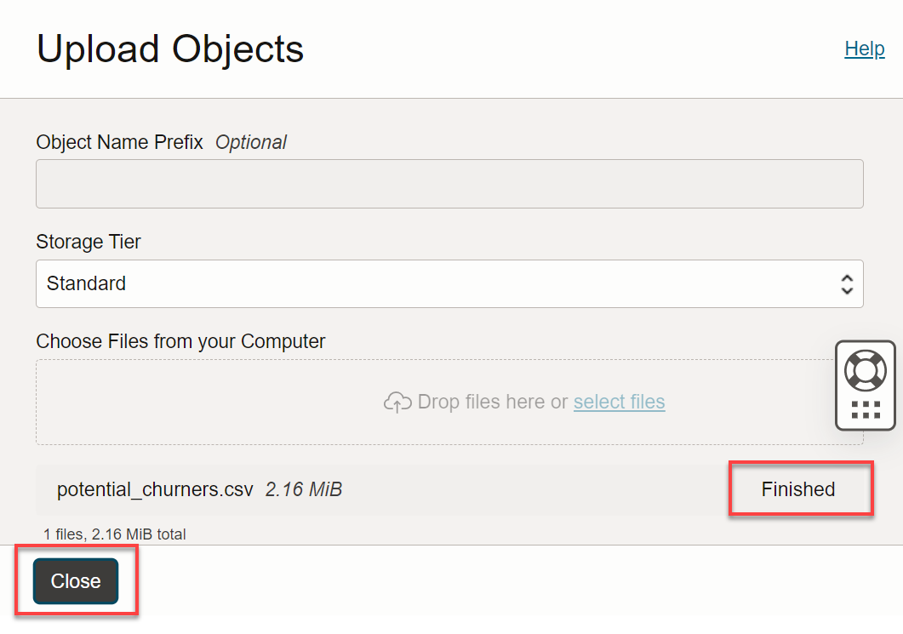
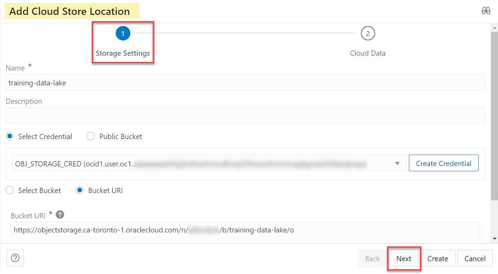
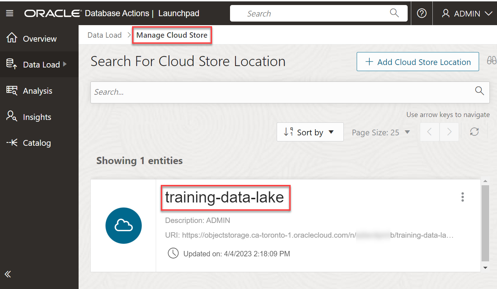

# Load Data from Private Object Storage Buckets

## Introduction
In this lab, you will load more data from the MovieStream data lake on [Oracle Cloud Infrastructure Object Storage](https://www.oracle.com/cloud/storage/object-storage.html) into your Oracle Autonomous Database instance, in preparation for exploration and analysis.

You will practice loading data from a **private** Object Storage bucket. You learn how to set up and use an authentication token and object store credentials to access sensitive data in the private object store. Instead of using the wizard-driven data loading tools of Database Actions, you practice loading data using the **DBMS_CLOUD** PL/SQL package, the preferred method for load automation.

> **Note:** While this lab uses Oracle Autonomous Data Warehouse, the steps are identical for loading data into an Oracle Autonomous Transaction Processing database.

Estimated Time: 20 minutes

### Objectives

In this lab, you will:
- Download to your local computer a comma-separated value (.csv) file containing a simulation of sensitive customer data
- Create a private OCI Object Storage bucket
- Upload the .csv file to the OCI private bucket
- Create an object store auth token
- Define object store credentials for your autonomous database to communicate with the bucket
- Load data from the object store using the DBMS_CLOUD PL/SQL package
- Troubleshoot the data load

### Prerequisites

- This lab requires completion of the lab, **Provision an Autonomous Database**, in the Contents menu on the left.

## Task 1: Download Customer Data for Staging to Object Storage

Download a **.csv** file that contains a simulation of sensitive customer retention data. Later, you will stage the file on a private **OCI Object Storage** bucket, to populate a table in later tasks.

1. Copy and paste the following URL into a new tab in your web browser, and then press **[ENTER]**:

    ```
    <copy>
    https://objectstorage.us-ashburn-1.oraclecloud.com/n/c4u04/b/moviestream_sandbox/o/potential_churners/potential_churners.csv
    </copy>
    ```

2. The browser page downloads (**Downloads** directory by default in MS-Windows) and displays the **`potential_churners.csv`** file. This file contains customers who will stop or might stop being repeat customers.

  

## Task 2: Create a Private Oracle Object Storage Bucket

Create a private Object Storage bucket to store your data. For more information about Oracle Object Storage, see [Explore more about Object Storage in Oracle Cloud.](https://docs.oracle.com/en-us/iaas/Content/Object/home.htm)

1. Open the **Navigation** menu in the Oracle Cloud console and click **Storage**. Under **Object Storage & Archive Storage**, click **Buckets**.

2. On the **Buckets** page, select the compartment where you want to create the bucket from the **Compartment** drop-down list in the **List Scope** section. Make sure you are in the region where you want to create your bucket.

3. Click **Create Bucket**.

4. In the **Create Bucket** panel, specify the following:
    - **Bucket Name:** Enter a meaningful name for the bucket.
    - **Default Storage Tier:** Accept the default **Standard** storage tier. Use this tier for storing frequently accessed data that requires fast and immediate access. For infrequent access, choose the **Archive** storage tier.
    - **Encryption:** Accept the default **Encrypt using Oracle managed keys**.

    >**Note:** Bucket names must be unique per tenancy and region.

5. Click **Create** to create the bucket.

  

6. The new bucket is displayed on the **Buckets** page. The default bucket type (visibility) is **Private**.

  

## Task 3: Upload your *.csv File to your Private Object Storage Bucket

Upload the **`potential_churners.csv`** file that you downloaded earlier in this lab to your newly created private Object Storage bucket.

1. If you are already on the **Buckets** page, skip to step 3; otherwise, open the **Navigation** menu in the Oracle Cloud console and click **Storage**. Under **Object Storage & Archive Storage**, click **Buckets**.

2. On the **Buckets** page, select the compartment that contains your bucket from the **Compartment** drop-down list in the **List Scope** section. Make sure you are in the region where your bucket was created.

3. On the **Buckets** page, click the bucket's name link to which you want to upload the *.csv file. The **Bucket Details** page is displayed.

  

4. Scroll down the page to the **Objects** section, and then click **Upload**.

5. In the **Upload Objects** panel, you can drag and drop a single or multiple files into the **Choose Files from your Computer** field or click **select files** to choose the file(s) that you want to upload from your computer. In this example, we used the drag-and-drop method to select the **`potential_churners.csv`** file from our **Downloads** folder.

  

6. Click **Upload** to upload the selected file to the bucket.

7. When the file is uploaded successfully, a **Finished** status is displayed next to the file's name. Click **Close** to close the **Upload Objects** panel.

    

    The **Bucket Details** page is re-displayed. The newly uploaded file is displayed in the **Objects** section.

    

8. To return to the **Buckets** page, click the **Object Storage** link in the breadcrumbs.

## Task 4: Locate the Base URL for the Object Storage File

Find the base URL of the object you just uploaded to your private Object Storage bucket.

1. On the **Buckets** page, click the bucket's name link that contains the object.

2. The **Bucket Details** page is displayed. Scroll down to the **Objects** section. In the row for the **`potential_churners.csv`** file, click the 3-dot ellipsis icon, and then select **View Object Details** from the context menu.

    

3.  In the **Object Details** panel, copy the **URL Path (URI)** that points to the location of the file in your private Object Storage bucket up to the **`/o`** part. **_Do not include the trailing slash_**. Save the base URL in a text editor of your choice such as Notepad in MS-Windows. You will use this URL in the upcoming tasks. Next, click **Cancel** to close the **Object Details** page.

    

3. Let's review the URL in our example. The **region name** is `ca-toronto-1`, the **Namespace** is blurred for security, and the **bucket name** is `training-data-lake`.

    

    `https://objectstorage.<`**region name**`>.oraclecloud.com/n/<`**namespace name**`>/b/<`**bucket name**`>/o`

## Task 5: Create an Object Storage Auth Token

To load data from the Oracle Cloud Infrastructure (OCI) Object Storage, you will need an OCI user with the appropriate privileges to read data (or upload) data to the Object Store. The communication between the database and the object store relies on the native URI, and the OCI user Auth Token.

1. In the Console banner, click the **person icon**. From the drop-down menu, click your **OCI user's name**. This username might have a prefix followed by an email address such as: `oracleidentitycloudservice/xxxxxxx.xxxxx@xxxxxx.com`.

    

2. The **User Details** page is displayed. Make a note of this username as you will need it in a later task. Scroll down the page to the **Resources** section and then click **Auth Tokens**. The **Auth Tokens** section is displayed. Click **Generate Token**.

    

3. In the **Generate Token** dialog box, enter a meaningful description, and then click **Generate Token**.

    

4. In the **Generated Token** section of the **Generate Token** dialog box, click **Copy** to copy the Auth Token to a text editor of your choice such as Notepad in MS-Windows. You will use it in the next tasks.

    > **Note:** You can't retrieve the Auth Token again after closing the dialog box.

    

5. Click **Close** to close the **Generate Token** dialog box.

## Task 6: Define a Cloud Location and Create Credential

You will load data from the `potential_churners.csv` file you uploaded to your private Oracle Object Store in an earlier task using the `DBMS_CLOUD` PL/SQL package. There are two parts to this process:

+ Set up a connection to Oracle Object Storage by defining a cloud location with credential. You do this step only once.
+ Load the file using the `DBMS_CLOUD` PL/SQL package.

In this task, you define a **Cloud Location** to connect to Oracle Object Storage. To begin this process, you need to navigate back to the **DATA LOAD** page of **Database Actions**.

1. On the **Oracle Cloud Console** Home page, open the **Navigation** menu and click **Oracle Database**. Under **Oracle Database**, click **Autonomous Database**.

2. On the **Autonomous Databases** page, click your **ADW-Data-Lake** ADB instance.

    

3. On the **Autonomous Database details** page, click **Database actions**.

    

4. A **Launch DB actions** message box with the message **Please wait. Initializing DB Actions** is displayed. Next, the **Database Actions | Launchpad** Home page is displayed in a new tab in your browser. In the **Data Studio** section, click the **Data Load** card.

    

5. In the **Administration** section, click **CLOUD LOCATIONS**, and then click **Next**.

    

6. On the **Manage Cloud Store** page, click **Add Cloud Storage**.

    

7. Specify the following in the **Add Cloud Store Location** panel.
    + **Name:** Enter **`training-data-lake`**.
    + **Description:** Enter an optional description.
    + Click **Create Credential**. To access data in the Object Store, you need to enable your database user to authenticate itself with the Object Store using your OCI object store account and Auth Token. You do this by creating a private CREDENTIAL object for your user that stores this information encrypted in your Autonomous Data Warehouse. This information is only usable for your user schema.
    + **Cloud Store:** Select **Oracle** from the drop-down list since you will be loading from your private Oracle Object Storage bucket.
    + **Credential Name:** Enter **OBJ\_STORE\_CRED**.
      **Note:** The credential name must conform to Oracle object naming conventions, which do not allow spaces or hyphens.
    + Specify your Oracle Cloud Infrastructure user name that you identified in **Task 5**.
    + **Auth Token:** Enter Copy the **Auth Token** that you generated in **Task 5** and saved in a text file.
    + Select the **Bucket URI** option.
    + **Bucket URI:** Enter the Bucket URI that you identified and saved in **Task 4**. Remember to use this general structure, swapping in your own values:

      `https://objectstorage.region name.oraclecloud.com/n/namespace name/b/bucket name/o`

        

8. Click **Next** to see the available objects in the bucket that you specified. There is only one file that you uploaded to your private Object Storage bucket, `potential_churners.csv`.

    

9. Click **Create**. The **training-data-lake** cloud location is displayed in the **Manage Cloud Store** page.

    

## Task 7: Load data from the object store using the PL/SQL package, DBMS_CLOUD

As an alternative to the wizard-guided data load that you used in the previous labs, you can use the PL/SQL package `DBMS_CLOUD` directly. This is the preferred choice for any load automation.

The `DBMS_CLOUD` package supports loading data files from the following Cloud sources: Oracle Cloud Infrastructure Object Storage, Oracle Cloud Infrastructure Object Storage Classic, Amazon AWS S3, Microsoft Azure Cloud Storage, and Google Cloud Storage.

This task shows how to load data from Oracle Cloud Infrastructure Object Storage using two of the procedures in the `DBMS_CLOUD` package:

+ **create_credential**: Stores the object store credentials in your Autonomous Data Warehouse schema.
    + You will use this procedure to create object store credentials in your ADW admin schema.
+ **copy_data**: Loads the specified source file to a table. The table must already exist in ADW.
    + You will use this procedure to load tables to your admin schema with data from data files staged in the Oracle Cloud Infrastructure Object Storage cloud service.

1. Now that you've created the Cloud Location to connect to the Oracle Object Store, you're ready to load the `potential_churners.csv` file from your bucket. Navigate back to the main Database Actions Launchpad using the breadcrumb link in the upper left corner.

    

    If you are prompted for username and password, enter the username `admin` and the password you created for `admin` when you created your autonomous database.

2. Under **Development**, click the **SQL** tile to open SQL Worksheet.

  

3. Unlike the earlier tasks where the Database Actions DATA LOAD tool gave you the option to automatically create the target Oracle Autonomous Database tables during the data load process, the following steps for loading with the `DBMS_CLOUD` package require you to first create the target tables.

    Connected as your ADMIN user in SQL Worksheet, copy and paste this code snippet to the worksheet, to create the required `potential_churners` table. Take a moment to examine the script. You will first drop any table with the same name before creating the table. Then click the **Run Script** button to run it.

    ```
    <copy>
    DROP TABLE potential_churners;
    CREATE TABLE potential_churners (
    cust_id                 NUMBER NOT NULL,
    will_churn              VARCHAR2(200),
    prob_churn              VARCHAR2(200)
    );
    </copy>
    ```

    > **Note:** Expect to receive *ORA-00942 table or view does not exist* errors during the `DROP TABLE` command for the first execution of the script, but you should not see any other errors.

    

    > **Note:** You do not need to specify anything other than the list of columns when creating tables in the SQL scripts. You can use primary keys and foreign keys if you want, but they are not required.*

4. Download <a href="./files/load_data_without_base_url_v3.txt" target="\_blank">**this code snippet**</a> to a text editor, for copying the data in the `potential_churners.csv` file you uploaded to the object store bucket, to the target `potential_churners` table you just created in your autonomous database.

5. In the code snippet, after `define file_uri_base =`, replace the example URL with the real object store base URL you copied in Task 4. The top of the file should look similar to the example below:

    ```
    /* In this code snippet, after define file_uri_base =, replace the example URL below with the URL you copied from your file in OCI Object Storage at runtime.
    */
    set define on
    define file_uri_base = 'https://objectstorage.me-dubai-1.oraclecloud.com/n/c4u04/b/LL6570-ADWLab/o'

    begin
     dbms_cloud.copy_data(
        table_name =>'POTENTIAL_CHURNERS',
        credential_name =>'OBJ_STORE_CRED',
        file_uri_list =>'&file_uri_base/potential_churners.csv',
        format =>'{"type" : "csv", "skipheaders" : 1}'
     );
    end;
    /
    ```

6. Copy and paste your edited file to a SQL Worksheet. This script uses the **copy\_data** procedure of the **DBMS\_CLOUD** package to copy the data from the source file to the target table you created before.

7. Run the script.

    

8. You have successfully loaded the `POTENTIAL_CHURNERS` table. While in the SQL Worksheet, you can do a simple query against the table you just loaded. For example, to see the customers who have a greater than 0.8 likelihood of no longer remaining as MovieStream customers, run this query:

    ```
    <copy>
    SELECT * from POTENTIAL_CHURNERS WHERE PROB_CHURN >= 0.8 and WILL_CHURN = 1;
    </copy>
    ```

    

## Task 8: Troubleshoot DBMS_CLOUD data loads

1. Connected as your user in SQL Worksheet, run the following query to look at past and current data loads.
    ```
    $ <copy>select * from user_load_operations;</copy>
    ```
    *Notice how this table lists the past and current load operations in your schema. Any data copy and data validation operation will have backed-up records in your Cloud.*

2. For an example of how to troubleshoot a data load, we will create and try to load a version of the GENRE table, GENRE_DEBUG, that we know will fail because the loading script uses the wrong delimiter. Copy and paste this snippet into your SQL Worksheet and run the snippet:

    ```
    <copy>
    create table genre_debug
       (
         genre_id  number,
         name      varchar2(50)
       );

     begin
         dbms_cloud.copy_data(
             table_name => 'genre_debug',
             file_uri_list => 'https://objectstorage.us-ashburn-1.oraclecloud.com/n/c4u04/b/moviestream_gold/o/genre/genre.csv',
             format => '{
             			"delimiter":"|",
             			"dateformat":"YYYY-MM-DD",
             			"skipheaders":"1",
             			"ignoreblanklines":"true",
             			"removequotes":"true",
             			"blankasnull":"true",
             			"trimspaces":"lrtrim",
             			"truncatecol":"true",
             			"ignoremissingcolumns":"true"
             			}'
             );
     end;
     /
    </copy>
    ```

    

3. If you run select * from genre_debug; the result will show that no rows were loaded. What happened? Run the following query to see the load that errored out.
    ```
    <copy>select * from user_load_operations where status='FAILED';</copy>
    ```

    

    A load or external table validation that errors out is indicated by *status=FAILED* in this table. Get the names of the log and bad files for the failing load operation from the column **logfile\_table** and **badfile\_table**. The `logfile_table` column shows the name of the table you can query to look at the *log* of a load operation. The column `badfile_table` shows the name of the table you can query to look at the *rows that got errors* during loading.

4. Query the log and bad tables to see detailed information about an individual load. In this example, the names are `copy$33_log` and `copy$33_bad` respectively.

        

5. The fields delimiter were specified as "|".

    format => '{

    "delimiter":"|",

    But you can see that the fields are actually terminated by ",". As a result, the load step tried to load the entire line into the genre_id field.
    Let's update the PLSQL call - change the delimiter to a comma:

    format => '{

    "delimiter":",",

6. In the SQL Worksheet, run this corrected version of the load, which uses the comma delimiter:

    ```
    <copy>
    begin   
    dbms_cloud.copy_data(
        table_name => 'genre_debug',
        file_uri_list => 'https://objectstorage.us-ashburn-1.oraclecloud.com/n/c4u04/b/moviestream_gold/o/genre/genre.csv',
        format => '{
        			"delimiter":",",
        			"dateformat":"YYYY-MM-DD",
        			"skipheaders":"1",
        			"ignoreblanklines":"true",
        			"removequotes":"true",
        			"blankasnull":"true",
        			"trimspaces":"lrtrim",
        			"truncatecol":"true",
        			"ignoremissingcolumns":"true"
        			}',
        );
    end;
    /
    </copy>
    ```

7. The PL/SQL procedure will successfully complete.

    

8. View the results by running this query:

    `select * from genre_debug;`

    The GENRE_ID table will now have the loaded data:

    

9. To learn more about how to specify file formats, delimiters, reject limits, and more, review the <a href="https://docs.oracle.com/en/cloud/paas/autonomous-data-warehouse-cloud/user/dbmscloud-reference.html" target="\_blank"> Autonomous Database Supplied Package Reference </a> and <a href="https://docs.oracle.com/en/cloud/paas/autonomous-data-warehouse-cloud/user/format-options.html#GUID-08C44CDA-7C81-481A-BA0A-F7346473B703" target="\_blank"> DBMS_CLOUD Package Format Options </a>

Please *proceed to the next lab*.

## Learn more

For more information about loading data, see the documentation [Load Data from Files in the Cloud](https://www.oracle.com/pls/topic/lookup?ctx=en/cloud/paas/autonomous-data-warehouse-cloud&id=CSWHU-GUID-07900054-CB65-490A-AF3C-39EF45505802).

See the documentation [Loading Data with Autonomous Database](https://docs.oracle.com/en/cloud/paas/autonomous-data-warehouse-cloud/user/load-data.html#GUID-1351807C-E3F7-4C6D-AF83-2AEEADE2F83E) for more methods for loading data with Autonomous Data Warehouse.

You may now proceed to the next lab.

## Acknowledgements

* **Authors:** 
    * Rick Green, Principal Developer, Database User Assistance
    * Lauran Serhal, Consulting User Assistance Developer, Oracle Database and Big Data
* **Contributors:**

* **Last Updated By/Date:** Lauran Serhal, March 2023

Data about movies in this workshop were sourced from Wikipedia.

Copyright (C) Oracle Corporation.

Permission is granted to copy, distribute and/or modify this document
under the terms of the GNU Free Documentation License, Version 1.3
or any later version published by the Free Software Foundation;
with no Invariant Sections, no Front-Cover Texts, and no Back-Cover Texts.
A copy of the license is included in the section entitled [GNU Free Documentation License](files/gnu-free-documentation-license.txt)
