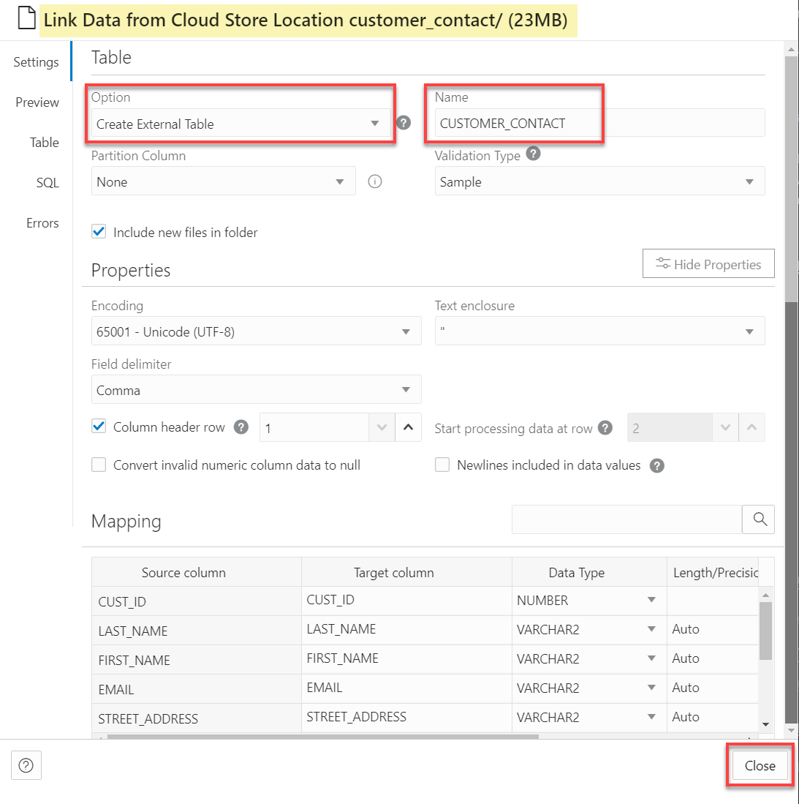

# Load Data from Object Storage Public Buckets

## Introduction

In this lab, you will load and link data from the MovieStream data lake on [Oracle Cloud Infrastructure Object Storage](https://www.oracle.com/cloud/storage/object-storage.html) into an Oracle Autonomous Database instance in preparation for exploration and analysis.

You can load data into your Autonomous Database (either Oracle Autonomous Data Warehouse or Oracle Autonomous Transaction Processing) using the built-in tools as in this lab, or you can use other Oracle and third party data integration tools. With the built-in tools, you can load data:

+ from files in your local device
+ from tables in remote databases
+ from files stored in cloud-based object storage (Oracle Cloud Infrastructure Object Storage, Amazon S3, Microsoft Azure Blob Storage, Google Cloud Storage)

You can also leave data in place in cloud object storage, and link to it from your Autonomous Database.

> **Note:** While this lab uses Oracle Autonomous Data Warehouse, the steps are identical for loading data into an Oracle Autonomous Transaction Processing database.

This workshop explores several methods for loading data into an Oracle Autonomous Database. In this first data loading lab, we practice loading data from public object storage buckets.

Estimated Time: 10 minutes

Watch the video below for a quick walk-through of the lab.
[Load Data from Object Storage Public Buckets](videohub:1_skl03gxs)

### Objectives

In this lab, you will:
* Navigate to the Data Load utility of Oracle Autonomous Database Data Tools
* Learn how to create tables and load data from public object storage buckets using Data Tools built-in to Oracle Autonomous Database

### Prerequisites

- This lab requires completion of the lab **Provision an Autonomous Database**, in the Contents menu on the left.

## Task 1: Navigate to Database Actions and Open the Data Load Utility

1. Log in to the **Oracle Cloud Console**, if you are not already logged as the Cloud Administrator. You will complete all the labs in this workshop using this Cloud Administrator. On the **Sign In** page, select your tenancy, enter your username and password, and then click **Sign In**. The **Oracle Cloud Console** Home page is displayed.

2. Open the **Navigation** menu and click **Oracle Database**. Under **Oracle Database**, click **Autonomous Database**.

3. On the **Autonomous Databases** page, click your **ADW-Data-Lake** ADB instance.
    

4. On the **Autonomous Database details** page, click **Database actions**.

    

5. A **Launch DB actions** message box with the message **Please wait. Initializing DB Actions** is displayed. Next, the **Database Actions | Launchpad** Home page is displayed in a new tab in your browser. In the **Data Studio** section, click the **Data Load** card.

    

## Task 2: Create tables and load data from files in public Object Storage buckets using Database Actions tools

In this task, you will create and load the following tables into your Autonomous Database instance: **genre**, **customer_contact**, **custsales** and **pizza\_locations**.

1. In the **What do you want to do with your data?** section, accept the default selection, **LOAD DATA**.

2. In the **Where is your data?** section, select **CLOUD STORE**, and then click **Next**.

    

3. The **Load Cloud Object** page is displayed. Use this page to drag and drop tables from the public object storage bucket to the data loading job. Copy the following object storage URL to the **Select Cloud Store Location or enter public URL** field:

    ```
    <copy>
    https://objectstorage.us-ashburn-1.oraclecloud.com/n/c4u04/b/moviestream_landing/o
    </copy>
    ```

    Click **[ENTER]** on your keyboard. A list of the folders in the selected Object Storage bucket is displayed on left side section of the page. You can drag and drop the desired folders from this section to the data loading job section.

    

4. Drag the **customer\_contact** folder and drop it onto the data loading job section.

    

5. A dialog box is displayed to prompt you whether or not if you want to load all objects in this folder matching **.csv** to a single target table. This folder contains a single file, `customer-contact.csv`. In general, data lake folders contain many files of the same type, as you will see with sales data. Click **Yes**.

    

    The **customer\_contact** target table to be created for the selected .csv file is displayed in the data loading job section.

    

6. Drag and drop the **genre**, **sales\_sample**, and **pizza\_location** folders onto the data loading job section. Click **Yes** when prompted for each target table.

    

7. Click the **Actions** icon (3-dot vertical ellipsis) for the **customer\_contact** load task, and then select **Settings** from the context menu to view the settings for this task.

    

    The **Load Data from Cloud Store Location customer_contact/ (23MB)** settings viewer panel is displayed.

8. The **Database Actions** load job will create a **CUSTOMER_CONTACT** table with the listed columns and data types that are based on the selected *.csv file. Review the information and the loading options. In the **Mapping** section, notice that you can change the target column names, data types, and length/precision. Click **Close** to close the settings viewer panel.

    

    >**Note:** The available options for creating the target table are: **Create Table**, **Insert into Table**, **Replace Data**, **Drop Table and Create New Table**, and **Merge into Table**.

9. Click the **Actions** icon (3-dot vertical ellipsis) for the **sales\_sample** load task, and then select **Settings** from the context menu to view its settings.

    

10. The Load tool makes intelligent choices for the target table name and properties. Since this is an initial load, accept the default option of **Create Table**, which conveniently creates the target table in the Autonomous Database instance, without the need to predefine the table in SQL. Change the name of the target table to be created from **SALES_SAMPLE** to **CUSTSALES**. Next, click **Close**.

    

11. Click **Start** to run the data load job. In the **Run Data Load Job** dialog box, click **Run**.

    

    > **Note:** The load job can take about 2 minutes to complete.

12. After the load job is completed, make sure that all of the data load cards have green check marks next to them. This indicates that your data load tasks have completed successfully. Click the **Actions** icon (3-dot vertical ellipsis) for the **genre** load task, and then select **Settings** from the context menu to view its settings.

    

13. Let's do a quick review of the loaded data. Click the **Table** tab to view the **genre** data.

    

    The data looks good! Click **Close** to exit the **genre** task preview, and then click **Done** to exit the Data Load tool and return to the **Database Actions Launchpad**.

You may now proceed to the next lab.

## Acknowledgements

* **Author:** Lauran Serhal, Consulting User Assistance Developer, Oracle Database and Big Data
* **Contributors:**
    * Mike Matthews, Autonomous Database Product Management
    * Marty Gubar, Autonomous Database Product Management
* **Last Updated By/Date:** Lauran Serhal, March 2023

Data about movies in this workshop were sourced from Wikipedia.

Copyright (C) Oracle Corporation.

Permission is granted to copy, distribute and/or modify this document
under the terms of the GNU Free Documentation License, Version 1.3
or any later version published by the Free Software Foundation;
with no Invariant Sections, no Front-Cover Texts, and no Back-Cover Texts.
A copy of the license is included in the section entitled [GNU Free Documentation License](files/gnu-free-documentation-license.txt)
