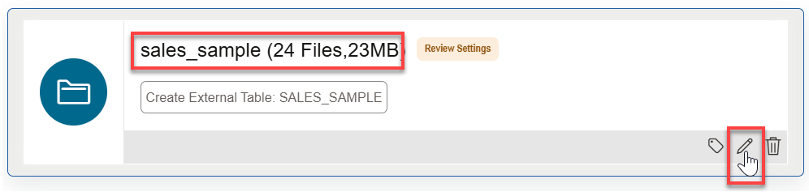
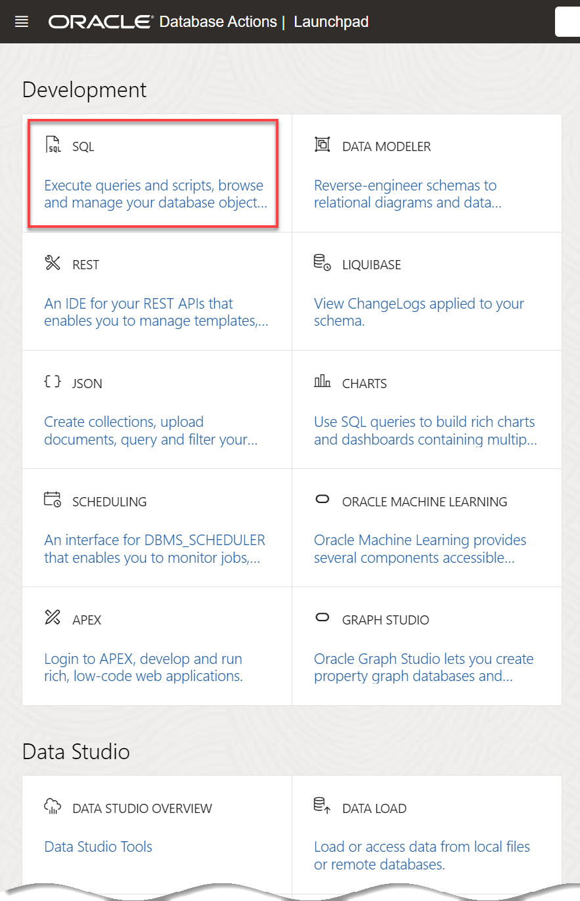

# Link to Data in Public Object Storage Buckets

## Introduction

In this lab, you will link from your ADB instance to data from the MovieStream data lake on [Oracle Cloud Infrastructure Object Storage](https://www.oracle.com/cloud/storage/object-storage.html) in preparation for exploration and analysis.

You can load data into your Autonomous Database (either Oracle Autonomous Data Warehouse or Oracle Autonomous Transaction Processing) using the ADB built-in tools. Alternatively, you can use other Oracle and third party data integration tools. With the built-in tools, you can link to and load data from:

+ Files on your local machine.
+ Tables in remote databases.
+ Files stored in cloud-based object storage (Oracle Cloud Infrastructure Object Storage, Amazon S3, Microsoft Azure Blob Storage, and Google Cloud Storage).

You can also leave data in place in cloud object storage, and link to it from your Autonomous Database.

> **Note:** While this lab uses Oracle Autonomous Data Warehouse, the steps are identical for loading data into an Oracle Autonomous Transaction Processing database.

This workshop explores several methods for loading and linking data to an Oracle Autonomous Database. In this first data loading lab, we practice loading data from public object storage buckets.

Estimated Time: 10 minutes

Watch the video below for a quick walk-through of the lab.
[Load Data from Object Storage Public Buckets](videohub:1_skl03gxs)

### Objectives

In this lab, you will:

* Navigate to the Data Load page.
* Create tables and load data from public object storage buckets using Data Tools built-in to Oracle Autonomous Database

### Prerequisites

This lab requires completion of **Lab 1: Set up the Workshop Environment > Task 3: Create an Autonomous Data Warehouse Instance**, from the **Contents** menu on the left.

## Task 1: Navigate to the Data Load Page

If you already have the **Oracle Database Actions** browser tab open from the previous lab, click the **Database Actions | SQL** banner to display the **Database Actions | Launchpad** Home page. In the **Data Studio** section, click the **DATA LOAD** card. Next, skip to **Task 2**; otherwise, start with **step 1** below.


1. Log in to the **Oracle Cloud Console**, if you are not already logged as the Cloud Administrator. You will complete all the labs in this workshop using this Cloud Administrator, `ADMIN`. On the **Sign In** page, select your tenancy, enter your username and password, and then click **Sign In**. The **Oracle Cloud Console** Home page is displayed.

2. Open the **Navigation** menu and click **Oracle Database**. Under **Oracle Database**, click **Autonomous Database**.

<if type="livelabs">
3. On the **Autonomous Databases** page, click your **DB-DCAT** ADB instance.
</if>

<if type="freetier">
3. On the **Autonomous Databases** page, click your **ADW-Data-Lake** ADB instance.
</if>

4. The **Database Actions | Launchpad** Home page is displayed in a _**new tab**_ in your browser. In the **Data Studio** section, click the **DATA LOAD** card.

    

## Task 2: Link to Data in Public Object Storage Buckets and Create External Tables

In this task, you will link to data and create the following external tables in your Autonomous Database instance: **customer\_contact**, **genre**, **pizza\_locations**, and **sales\_sample**.

1. In the **What do you want to do with your data?** section, click **LINK DATA**.

2. In the **Where is your data?** section, select **CLOUD STORE**, and then click **Next**.

    

3. The **Link Cloud Object** page is displayed. Use this page to drag and drop tables from the public object storage bucket to the data linking job. The **moviestream\_landing** Oracle Object Storage bucket that contains the data is located in a different tenancy than yours, **c4u04**; therefore, you will use the following public URL.

    Copy the following object storage URL and paste it in the **Select Cloud Store Location or enter public URL** field:

    ```
    <copy>
    https://objectstorage.us-ashburn-1.oraclecloud.com/n/c4u04/b/moviestream_landing/o
    </copy>
    ```

    Click **[ENTER]** on your keyboard. A list of the folders in the selected Object Storage bucket is displayed on left side section of the page. You can drag and drop the desired folders from this section to the data loading job section.

    

4. Drag the **customer\_contact** folder and drop it onto the data linking job section.

    

5. A dialog box is displayed to prompt you whether or not if you want to link all objects in this folder matching **.csv** to a single target table. This folder contains a single file, `customer-contact.csv`. In general, data lake folders contain many files of the same type, as you will see with sales data. Click **Yes**.

    

    The **customer\_contact** target table to be created for the selected `.csv` file is displayed in the data linking job section.

    

6. Drag and drop the **genre**, **sales\_sample**, and **pizza\_location** folders onto the data loading job section. Click **Yes** when prompted for each target table.

    

7. Click the **Actions** icon (3-dot vertical ellipsis) for the **customer\_contact** link task, and then select **Settings** from the context menu to view the settings for this task.

    

    The **Link Data from Cloud Store Location customer_contact** settings panel is displayed.

8. The **Database Actions** link job will create a **CUSTOMER_CONTACT** table with the listed columns and data types that are based on the selected *.csv file. Review the information and the loading options. In the **Mapping** section, notice that you can change the target column names, data types, and length/precision. Click **Close** to close the settings viewer panel.

    

9. Click the **Actions** icon (3-dot vertical ellipsis) for the **sales\_sample** load task, and then select **Settings** from the context menu to view its settings.

    

10. The Load tool makes intelligent choices for the target table name and properties. Since this is an initial load, accept the default option of **Create Table**, which conveniently creates the target table in the Autonomous Database instance, without the need to predefine the table in SQL. Change the name of the target table to be created from **SALES_SAMPLE** to **CUSTSALES**. Next, click **Close**.

    

11. Click **Start** to run the data link job. In the **Run Data Load Job** dialog box, click **Run**.

    

    > **Note:** The load job can take about 2 minutes to complete.

12. After the load job is completed, make sure that all of the data link cards have green check marks next to them. This indicates that your data link tasks have completed successfully.

    

13. Click the **Actions** icon (3-dot vertical ellipsis) for the **genre** load task, and then select **Settings** from the context menu to view its settings.

14. Review some of the linked data. Click the **Table** tab to view the **genre** data.

    

15. Click **Close** to exit the **genre** task preview, and then click **Done** to exit the Data Load tool and return to the **Database Actions Launchpad**.

     

## Task 3: Create and Populate an External Table Using the DBMS_CLOUD Package

As an alternative to using the Database Actions data load utility that you used in the previous labs, you can use the PL/SQL package `DBMS_CLOUD` directly. This is the preferred method for any load automation. You can also use this package to create and populate external tables.

The `DBMS_CLOUD` package supports loading data files from the following Cloud sources:
* Oracle Cloud Infrastructure Object Storage
* Oracle Cloud Infrastructure Object Storage Classic
* Amazon AWS S3
* Microsoft Azure Cloud Storage
* Google Cloud Storage.

Use the `DBMS_CLOUD` package to create an external table and to also load it with the public Object Storage Parquet file data.

1. Click the **Database Actions | Launchpad** banner to display the Home page.

    

2. In the **Development** section, click the **SQL** card.

    

3. Create an external table and load it with data from a Parquet file in a _public_ OCI Object Storage bucket. Use the **`EXTERNAL_TABLE`** procedure in the **`DBMS_CLOUD`** package to create and populate the external table. You can access the Object Storage Parquet file using the OCI Object Storage Native URI format as follows:

    ```
    https://objectstorage.region.oraclecloud.com/n/namespace-string/b/bucket/o/filename
    ```
    > **Note:** The **moviestream\_landing** Object Storage bucket that contains the Parquet data file is located in a public tenancy named **c4u04**.

    The **`credential_name =>'OBJ_STORE_CRED'`** argument in the following code is not used since we are using a Parquet file in a public Object Storage bucket; otherwise, you must use the argument.

    Copy and paste the following script into your SQL Worksheet, and then click the Run Script (F5) icon in the Worksheet toolbar.

    ```
    <copy>
    BEGIN
    DBMS_CLOUD.CREATE_EXTERNAL_TABLE(
        table_name =>'custsales_2020_10',
        file_uri_list =>'https://objectstorage.us-ashburn-1.oraclecloud.com/n/c4u04/b/moviestream_landing/o/sales_sample/month=2020-10/custsales-2020-10.parquet',
        format =>  '{"type":"parquet", "schema": "first"}');
    END;
    /
    </copy>
    ```

    The external **custsales\_2020\_10** table is created.

    

4. To view the data in the new external table, run the following query.

    ```
    <copy>
    SELECT *
    from custsales_2020_10;
    </copy>
    ```

    

    You can also use the **Navigator** tab to view the table. You might need to click the **Refresh** icon before you can see the newly created table.

You may now proceed to the next lab.

## Learn more

* [Load Data from Files in the Cloud](https://www.oracle.com/pls/topic/lookup?ctx=en/cloud/paas/autonomous-data-warehouse-cloud&id=CSWHU-GUID-07900054-CB65-490A-AF3C-39EF45505802).
* [Load Data with Autonomous Database](https://docs.oracle.com/en/cloud/paas/autonomous-data-warehouse-cloud/user/load-data.html#GUID-1351807C-E3F7-4C6D-AF83-2AEEADE2F83E)
* [DBMS_CLOUD Package](https://docs.oracle.com/en/cloud/paas/autonomous-database/adbsa/dbms-cloud-package.html#GUID-CE359BEA-51EA-4DE2-88DB-F21A9FC10721)

You may now proceed to the next lab.

## Acknowledgements

* **Author:** Lauran Serhal, Consulting User Assistance Developer, Oracle Database and Big Data
* **Contributors:**
    * Alexey Filanovskiy, Senior Principal Product Manager
    * Mike Matthews, Autonomous Database Product Management
    * Marty Gubar, Autonomous Database Product Management
    * Rick Green, Principal Developer, Database User Assistance
* **Last Updated By/Date:** Lauran Serhal, August 2023

Data about movies in this workshop were sourced from Wikipedia.

Copyright (C) Oracle Corporation.

Permission is granted to copy, distribute and/or modify this document
under the terms of the GNU Free Documentation License, Version 1.3
or any later version published by the Free Software Foundation;
with no Invariant Sections, no Front-Cover Texts, and no Back-Cover Texts.
A copy of the license is included in the section entitled [GNU Free Documentation License](files/gnu-free-documentation-license.txt)
