# Link to Data in Public Object Storage Buckets

## Introduction

In this lab, you will link from your ADB instance to data from the MovieStream data lake on [Oracle Cloud Infrastructure Object Storage](https://www.oracle.com/cloud/storage/object-storage.html) in preparation for exploration and analysis.

You can load data into your Oracle Autonomous AI Database (either Oracle Autonomous AI Lakehouse or Oracle Autonomous AI Transaction Processing) using the ADB built-in tools. Alternatively, you can use other Oracle and third party data integration tools. With the built-in tools, you can link to and load data from:

+ Files on your local machine.
+ Tables in remote databases.
+ Files stored in cloud-based object storage (Oracle Cloud Infrastructure Object Storage, Amazon S3, Microsoft Azure Blob Storage, and Google Cloud Storage).

You can also leave data in place in cloud object storage, and link to it from your Oracle Autonomous AI Database.

> **Note:** While this lab uses Oracle Autonomous AI Lakehouse, the steps are identical for loading data into an Oracle Autonomous AI Transaction Processing database.

This workshop explores several methods for loading and linking data to an Oracle Autonomous AI Database. In this first data loading lab, we practice loading data from public object storage buckets.

Estimated Time: 10 minutes

Watch the video below for a quick walk-through of the lab.
[](youtube:WOzVqRIl9xw)

### Objectives

In this lab, you will:

* Navigate to the Data Load page.
* Create tables and load data from public object storage buckets using Data Tools built-in to Oracle Autonomous AI Database

### Prerequisites

This lab requires completion of **Lab 1: Setup the Workshop Environment > Task 2: Provision the Autonomous AI Database Instance**, from the **Contents** menu on the left.

## Task 1: Navigate to the Data Load Page

1. Click **Database Actions | SQL** in the banner to display the **Database Actions | Launchpad** page.

    

2. Click the **Data Studio** tab, and then click the **Data Load** tab.

    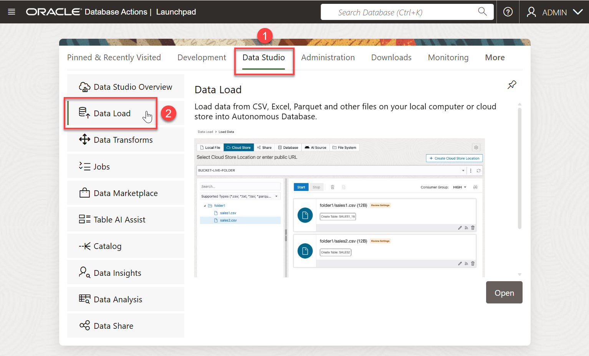

    The **Data Load Dashboard** page is displayed.

    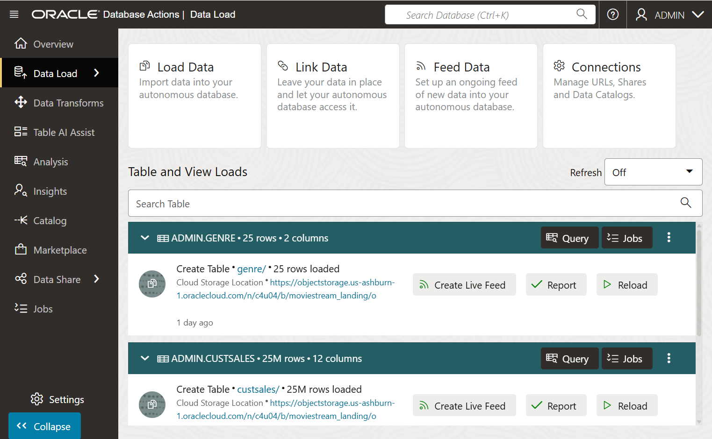

## Task 2: Link to Data in Public Object Storage Buckets and Create External Tables

In this task, you will link to data and create the following external tables in your Oracle Autonomous AI Database instance: **`customer_contact`**, **`pizza_locations`**, and **`sales_sample`**.

1. On the **Data Load Dashboard**, click the **Link Data** tile.

    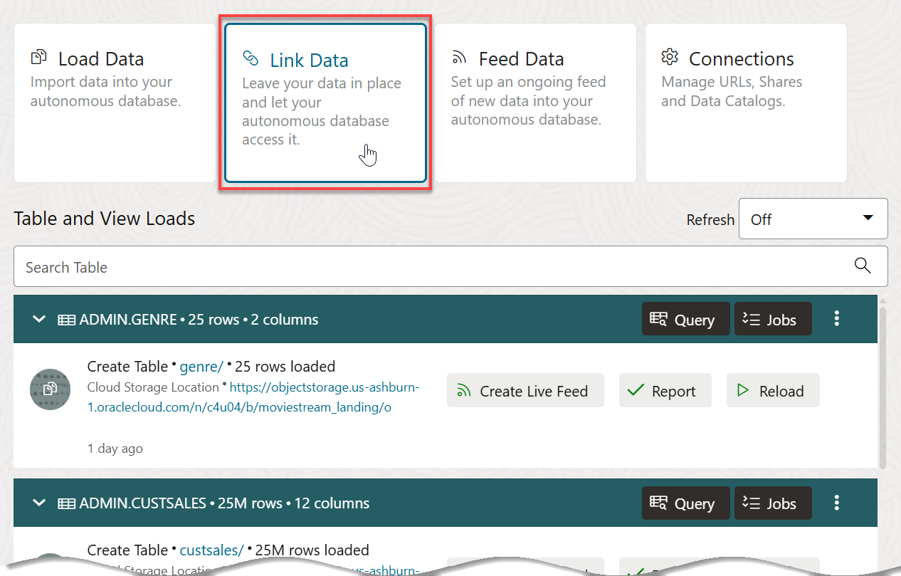

2. On the **Link Data** page, the **Cloud Store** tab is selected by default.

    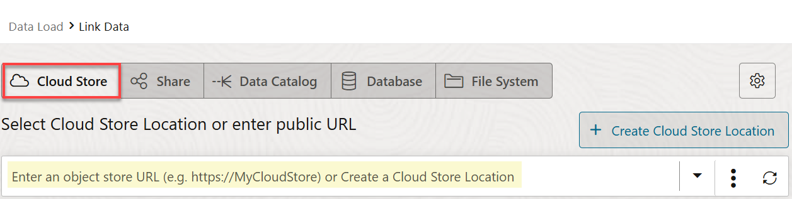

3. Copy the following object storage URL and paste it in the **Select Cloud Store Location or enter public URL** field. The **`moviestream_landing`** Oracle Object Storage bucket that contains the data is located in a different tenancy than yours, **c4u04**; therefore, you will use the following URL.

    ```
    <copy>
    https://objectstorage.us-ashburn-1.oraclecloud.com/n/c4u04/b/moviestream_landing/o
    </copy>
    ```

    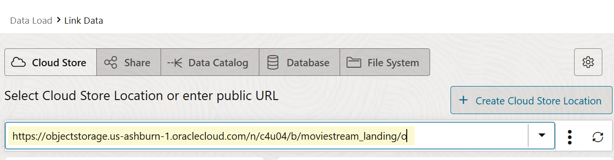

4. A list of the folders in the selected Object Storage bucket is displayed on left side section of the page. You can drag and drop the desired folders from this public bucket from this section to the data linking job section on the right.

    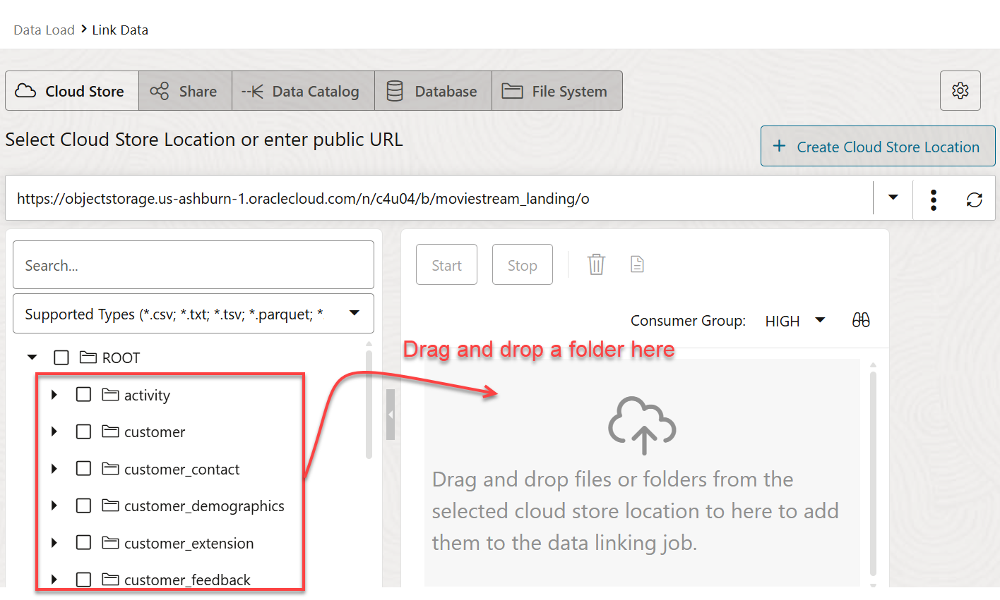

5. Drag the **`customer_contact`** folder and drop it onto the data linking job section.

    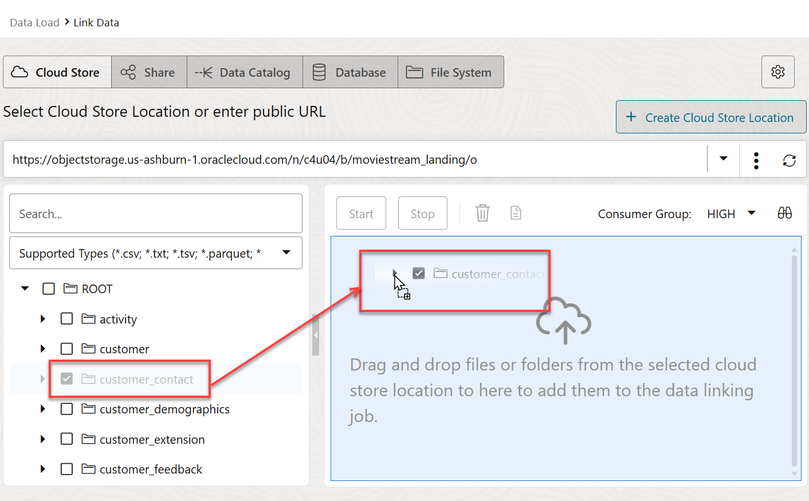

6. A **Link to Single Target Table** dialog box is displayed to prompt you whether or not you want to link all objects in this folder matching **.csv** to a single target table. This folder contains a single file, `customer-contact.csv`. In general, data lake folders contain many files of the same type, as you will see with sales data. Click **Yes**.

    The **`customer_contact`** target table to be created for the selected `.csv` file is displayed in the data linking job section.

    >**Note:** If you get a warning, ignore it.

    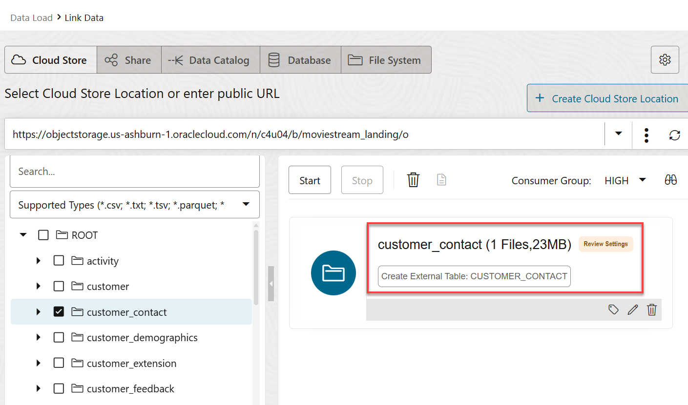

7. Drag and drop the **`sales_sample`** and **`pizza_location`** folders onto the data linking job section. Click **Yes** when prompted for each target table.

    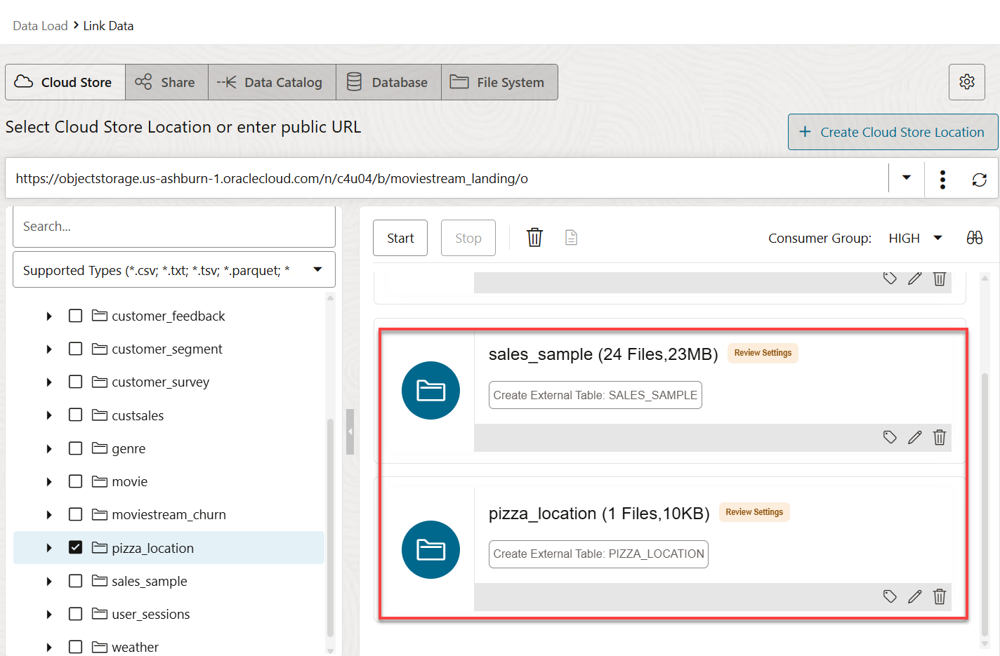

8. Click the **Settings** icon (pencil) for the **`customer_contact`** link task to view its settings.

    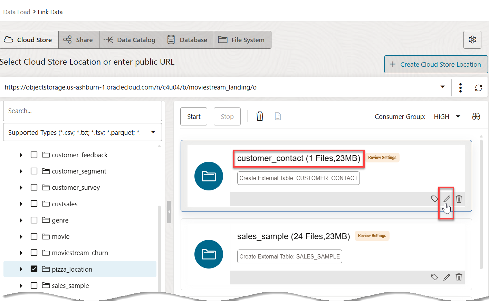

    The **Link Data from Cloud Store Location customer_contact** settings panel is displayed.

9. The **Database Actions** link job will create a **`CUSTOMER_CONTACT`** table with the listed columns and data types that are based on the selected *.csv file. Review the information and the loading options. In the **Mapping** section, notice that you can change the target column names, data types, and length/precision. Click **Close** to close the settings viewer panel.

    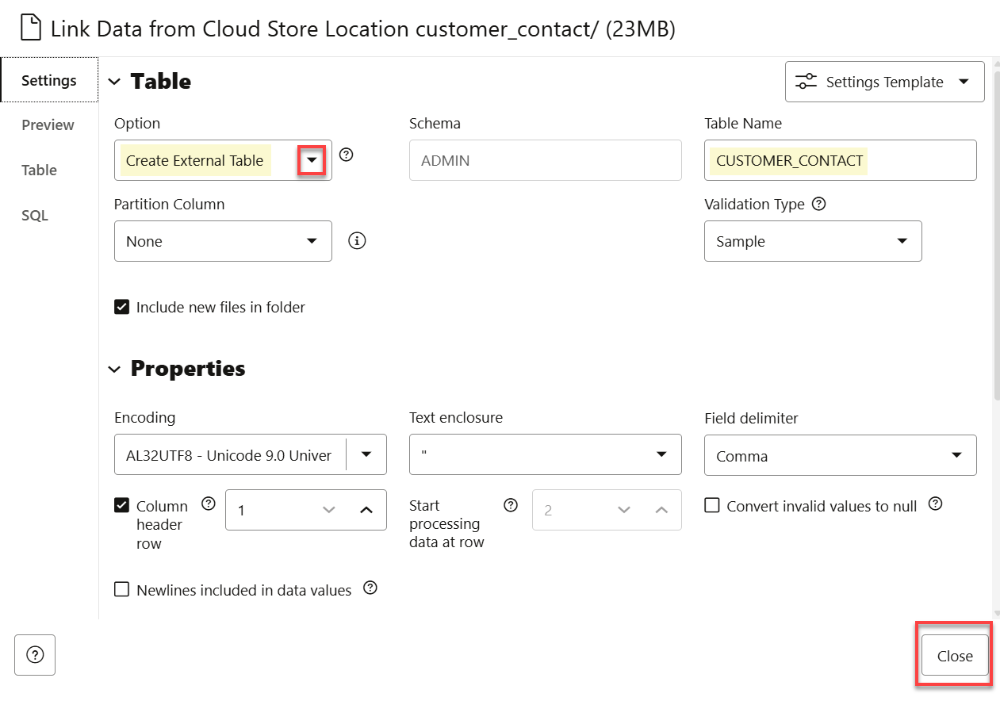

10. Click the **Settings** icon (pencil) for the **`sales_sample`** link task to view its settings.

    

11. The Load tool makes intelligent choices for the target table name and properties. Since this is an initial load, accept the default option of **Create Table**, which conveniently creates the target table in the Oracle Autonomous AI Database instance, without the need to predefine the table in SQL. Change the name of the target table to be created from **`SALES_SAMPLE`** to **`CUSTSALES_EXT`**. Next, click **Close**.

    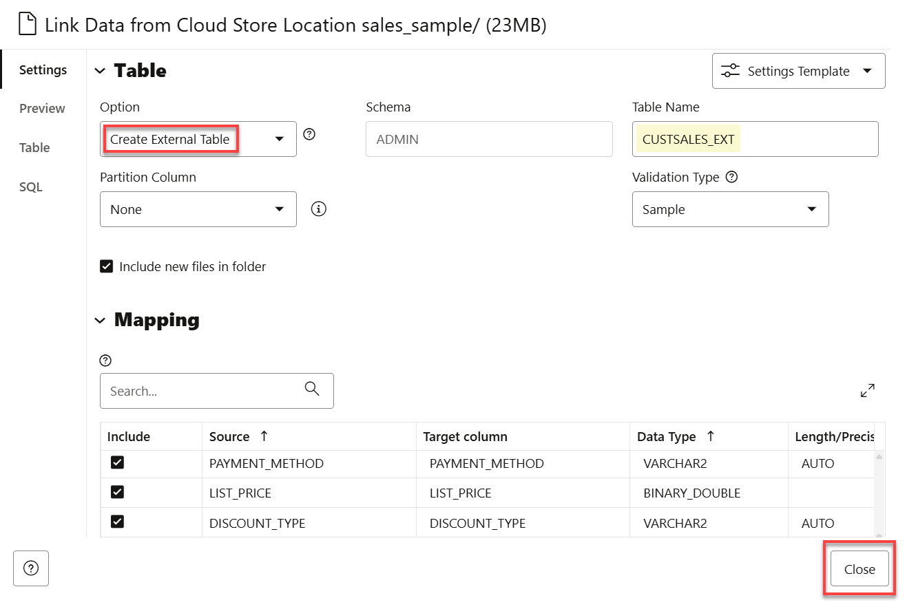

12. Click **Start** to run the data link job. In the **Start Link From Cloud Store** dialog box, click **Run**.

    

    In the **Start Link From Cloud Store** dialog box, click **Run**.

    

    > **Note:** The link job can take about 2 minutes to complete.

13. After the link job is completed, make sure that all of the data link cards have the link icons next to them. You can click the **Report** button for a link job to view a report of total rows processed successfully and failed for the selected table.

    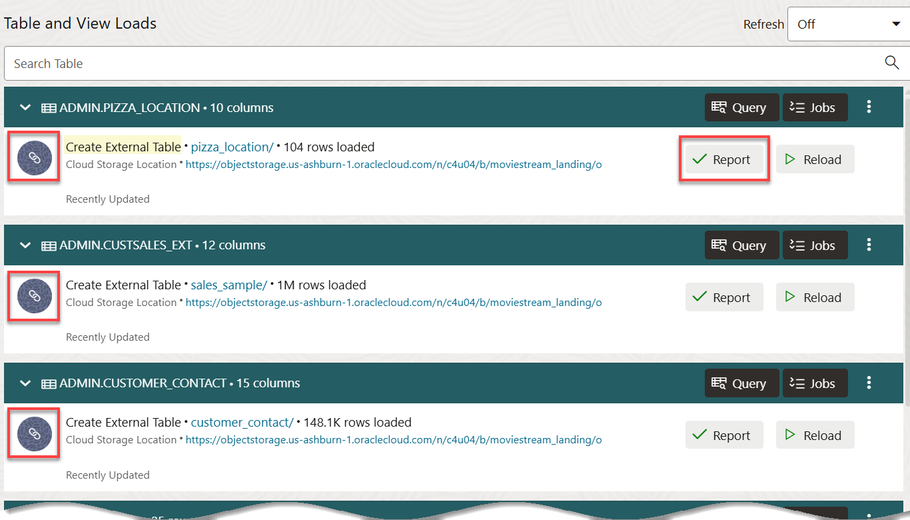

14. Click the **Settings** icon (pencil) for the **`CUSTSALES_EXT`** load task to view its settings. Next, select **Table > View Details**.

    

15. The **Preview** tab is selected by default. This shows the **`genre`** data.

    

16. Click **Close** to return to the Data Load Dashboard.

     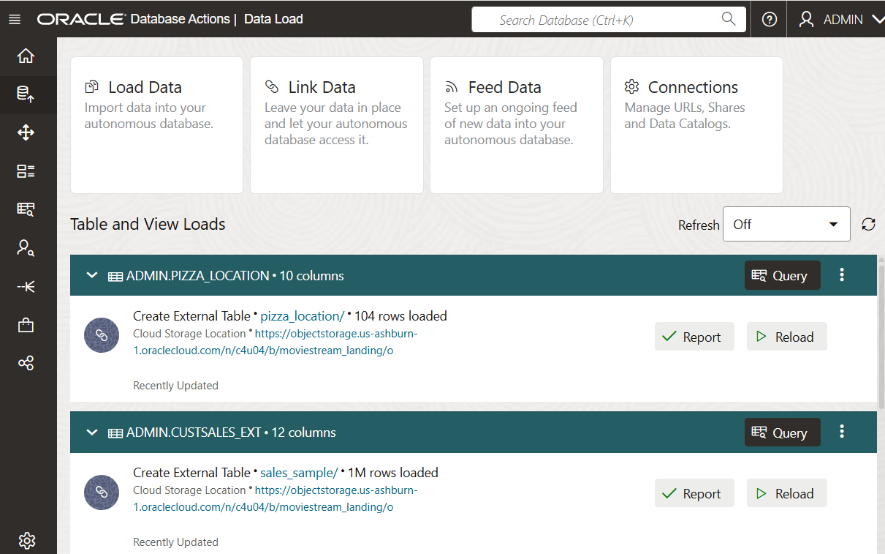

## Task 3: Create and Populate an External Table Using the DBMS_CLOUD Package

As an alternative to using the Database Actions data load utility that you used in the previous labs, you can use the PL/SQL package `DBMS_CLOUD` directly. This is the preferred method for any load automation. You can also use this package to create and populate external tables.

The `DBMS_CLOUD` package supports loading data files from the following Cloud sources:
* Oracle Cloud Infrastructure Object Storage
* Oracle Cloud Infrastructure Object Storage Classic
* Amazon AWS S3
* Microsoft Azure Cloud Storage
* Google Cloud Storage.

Use the `DBMS_CLOUD` package to create an external table and to also load it with the public Object Storage Parquet file data.

1. Click **Database Actions | Data Load** in the banner to display the **Launchpad** page.

    

2. Click the **Development** tab, and then click the **SQL** tab.

    

3. Create an external table and load it with data from a Parquet file in a _public_ OCI Object Storage bucket. Use the **`EXTERNAL_TABLE`** procedure in the **`DBMS_CLOUD`** package to create and populate the external table. You can access the Object Storage Parquet file using the OCI Object Storage Native URI format as follows:

    ```
    https://objectstorage.region.oraclecloud.com/n/namespace-string/b/bucket/o/filename
    ```
    > **Note:** The **moviestream\_landing** Object Storage bucket that contains the Parquet data file is located in a public tenancy named **c4u04**.

    The **`credential_name =>'OBJ_STORE_CRED'`** argument in the following code is not used since we are using a Parquet file in a public Object Storage bucket; otherwise, you must use the argument.

    Copy and paste the following script into your SQL Worksheet, and then click the Run Script (F5) icon in the Worksheet toolbar.

    ```
    <copy>
    BEGIN
    DBMS_CLOUD.CREATE_EXTERNAL_TABLE(
        table_name =>'custsales_2020_10',
        file_uri_list =>'https://objectstorage.us-ashburn-1.oraclecloud.com/n/c4u04/b/moviestream_landing/o/sales_sample/month=2020-10/custsales-2020-10.parquet',
        format =>  '{"type":"parquet", "schema": "first"}');
    END;
    /
    </copy>
    ```

    The external **custsales\_2020\_10** table is created.

    

4. To view the data in the new external table, run the following query.

    ```
    <copy>
    SELECT *
    from custsales_2020_10;
    </copy>
    ```

    

    You can also use the **Navigator** tab to view the table. You might need to click the **Refresh** icon before you can see the newly created table.

You may now proceed to the next lab.

## Learn more

* [Load Data from Files in the Cloud](https://www.oracle.com/pls/topic/lookup?ctx=en/cloud/paas/autonomous-data-warehouse-cloud&id=CSWHU-GUID-07900054-CB65-490A-AF3C-39EF45505802).
* [Load Data with Oracle Autonomous AI Database](https://docs.oracle.com/en/cloud/paas/autonomous-data-warehouse-cloud/user/load-data.html#GUID-1351807C-E3F7-4C6D-AF83-2AEEADE2F83E)
* [DBMS_CLOUD Package](https://docs.oracle.com/en/cloud/paas/autonomous-database/adbsa/dbms-cloud-package.html#GUID-CE359BEA-51EA-4DE2-88DB-F21A9FC10721)

You may now proceed to the next lab.

## Acknowledgements

* **Author:** Lauran K. Serhal, Consulting User Assistance Developer
* **Contributors:**
    * Alexey Filanovskiy, Senior Principal Product Manager
    * Mike Matthews, Autonomous AI Database Product Management
    * Marty Gubar (Retired), Autonomous AI Database Product Management
* **Last Updated By/Date:** Lauran K. Serhal, October 2025

Data about movies in this workshop were sourced from Wikipedia.

Copyright (C) 2025 Oracle Corporation.

Permission is granted to copy, distribute and/or modify this document
under the terms of the GNU Free Documentation License, Version 1.3
or any later version published by the Free Software Foundation;
with no Invariant Sections, no Front-Cover Texts, and no Back-Cover Texts.
A copy of the license is included in the section entitled [GNU Free Documentation License](https://oracle-livelabs.github.io/adb/shared/adb-15-minutes/introduction/files/gnu-free-documentation-license.txt)
