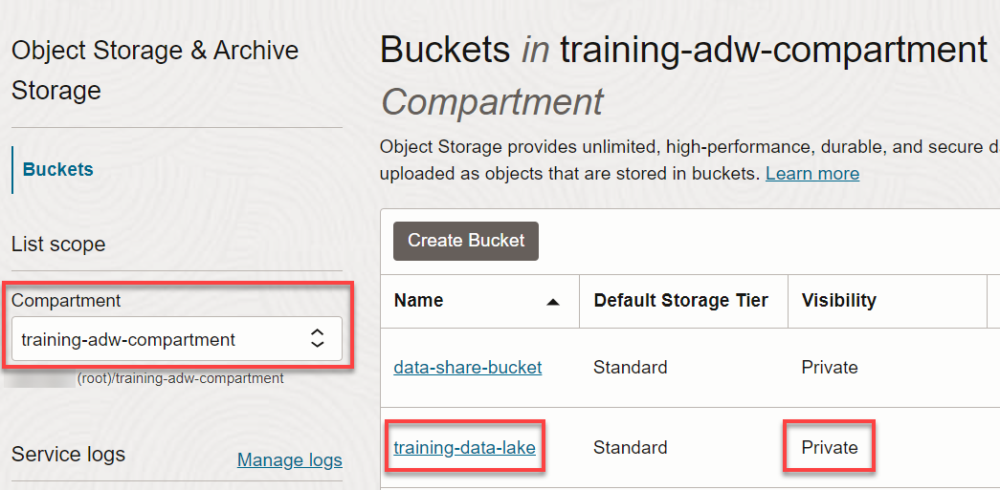

# Use Oracle as a Data Provider

## Introduction

In this lab, you will use the **`EXPORT_DATA`** procedure in the **`DBMS_CLOUD`** PL/SQL package to export a table (internal or external) from your Oracle Autonomous AI Lakehouse instance to a **`Parquet`** file in an Object Storage bucket (private or public) of your choice based on the result of a query that you specify. Depending on the format **type** parameter, the procedure exports rows to the Cloud Object Storage as text files in CSV, JSON, Parquet, or XML.

Estimated Time: 5 minutes

### Objectives

In this lab, you will:

* Navigate to the SQL Worksheet.
* Use the **`EXPORT_DATA`** procedure in the **`DBMS_CLOUD`** PL/SQL package to export a table from your ADW instance to your Oracle Object Storage bucket.
* Navigate to the Object Storage bucket to view the newly exported `Parquet` file.

### Prerequisites

This lab requires the completion of the following labs/tasks from the **Contents** menu on the left:

* **Lab 1**: Set up the Workshop Environment > **Task 2**: Provision the Autonomous AI Database Instance.
* **Lab 4**: Link to Data in Public Object Storage Buckets > **Task 2**: Link to Data in Public Object Storage Buckets and Create Tables.
* An Oracle Object Storage bucket. If you don't have one, see [Putting Data into Object Storage](https://docs.oracle.com/en-us/iaas/Content/GSG/Tasks/addingbuckets.htm#Putting_Data_into_Object_Storage) on how to create a bucket.

## Task 1: Navigate to the SQL Worksheet

If your SQL Worksheet is still displayed from the previous task, skip over to **Task 2**. If you closed the Web browser tab where the SQL Worksheet was displayed, navigate to the SQL Worksheet as follows:

1. Log in to the **Oracle Cloud Console**.

2. Open the **Navigation** menu and click **Oracle AI Database**. Under **Oracle AI Database**, click **Autonomous AI Database**.

<if type="livelabs">
3. On the **Autonomous AI Databases** page, click your **DB-DCAT** ADB instance.
</if>

<if type="freetier">
3. On the **Autonomous AI Databases** page, click your **ADW-Data-Lake** ADB instance.
</if>

4. On the **Autonomous AI Database details** page, click the **Database actions** drop-down list, and then click **SQL**.

## Task 2: Export a Table as a Parquet File to an Object Storage Bucket

1. Export the **`PIZZA_LOCATIONS`** table from your ADW instance to a **`Parquet`** file in a private (or public) Object Storage bucket of your choice. Provide the location of your OCI Object Storage bucket using the Native URI format as follows. _**Note:** You need to use your own **`region`** name, **`tenancy (namespace)`** name, **`bucket`** name, and the **`filename`** that will be created_.

    ```
    https://objectstorage.region.oraclecloud.com/n/namespace-string/b/bucket/o/filename
    ```

2. Copy and paste the following code into your SQL Worksheet. The **`credential_name`** is the name of the credential to access your Cloud Object Storage bucket where the file will be exported. You created this credential in **Lab 5 > Task 6**. Replace the **`file_uri_list`** value with your own value. The **`format`** parameter values indicates that the results of the query you specify in the **`query`** parameter will be exported as a `Parquet` file to your bucket. Don't provide the **`.parquet`** extension for the file in the **URI**. It will be automatically appended to the file name when it gets created. Next, click the **Run Script** icon in the Worksheet toolbar.

    ```
    <copy>
    BEGIN
    DBMS_CLOUD.EXPORT_DATA(
        credential_name => 'OBJ_STORAGE_CRED',
        file_uri_list =>
        'https://objectstorage.ca-toronto-1.oraclecloud.com/n/use-your-namespace/b/training-data-lake/o/pizza_locations',
        format => json_object('type' value 'parquet'),
        query => 'select * from PIZZA_LOCATION'
    );
    END;
    /
    </copy>
    ```

    It can take up to a minute or so for the PL/SQL procedure to complete successfully.

    

    > **Note:** If your target Object Storage bucket is **private** like in our example, then you must use **`credential_name => OBJ_STORAGE_CRED`** argument. If you use a **public** Object Storage bucket, the argument is optional.

## Task 3: View the Exported Parquet File in the Object Storage Bucket

**`DBMS_CLOUD.EXPORT_DATA`** performs the query specified with the `query` parameter and sends the results to text files on Object Store. The output format depends on the `format` parameter type you specify CSV, JSON, Parquet, or XML. In our example, we used Parquet. For detailed information about the generated file format and name, see  [File Naming for Text Output (CSV, JSON, Parquet, or XML)](https://docs.oracle.com/en/cloud/paas/autonomous-database/adbsa/export-data-file-namingl.html#GUID-1A52F59C-2797-48A5-A058-950318DBE9AF).

1. Open the **Navigation** menu in the Oracle Cloud console and click **Storage**. Under **Object Storage & Archive Storage**, click **Buckets**.

2. On the **Buckets** page, select the compartment that contains your bucket from the **Compartment** field. If you are using a sandbox reservation, you can always access the **Reservation Information** panel to view your assigned compartment name. Make sure you are in the region that contains your bucket.

    <if type="livelabs">
    
    </if>

    <if type="freetier">
    
    </if>

3. Click your bucket's name link in the **Name** column. The **Bucket Details** page is displayed. Click the **Objects** tab. The exported **Parquet** file is displayed.

    

## Learn more

* [DBMS_CLOUD Package](https://docs.oracle.com/en/cloud/paas/autonomous-database/adbsa/dbms-cloud-package.html#GUID-CE359BEA-51EA-4DE2-88DB-F21A9FC10721)
* [DBMS\_CLOUD Package Format Options for EXPORT_DATA with Text Files (CSV, JSON, Parquet, or XML)](https://docs.oracle.com/en/cloud/paas/autonomous-database/adbsa/format-options-json.html#GUID-3CE7574F-E78B-49D6-9F32-DC00AEE418F4)
* [EXPORT_DATA Procedure](https://docs.oracle.com/en/cloud/paas/autonomous-database/adbsa/dbms-cloud-subprograms.html#GUID-F8A70BE2-6060-48A7-9667-0A6B39198071)
* [File Naming for Text Output (CSV, JSON, Parquet, or XML)](https://docs.oracle.com/en/cloud/paas/autonomous-database/adbsa/export-data-file-namingl.html#GUID-1A52F59C-2797-48A5-A058-950318DBE9AF)

You may now proceed to the next lab.

## Acknowledgements

* **Author:** Lauran K. Serhal, Consulting User Assistance Developer
* **Contributor:** Alexey Filanovskiy, Senior Principal Product Manager
* **Last Updated By/Date:** Lauran K. Serhal, October 2025

Data about movies in this workshop were sourced from Wikipedia.

Copyright (C) 2025 Oracle Corporation.

Permission is granted to copy, distribute and/or modify this document
under the terms of the GNU Free Documentation License, Version 1.3
or any later version published by the Free Software Foundation;
with no Invariant Sections, no Front-Cover Texts, and no Back-Cover Texts.
A copy of the license is included in the section entitled [GNU Free Documentation License](https://oracle-livelabs.github.io/adb/shared/adb-15-minutes/introduction/files/gnu-free-documentation-license.txt)