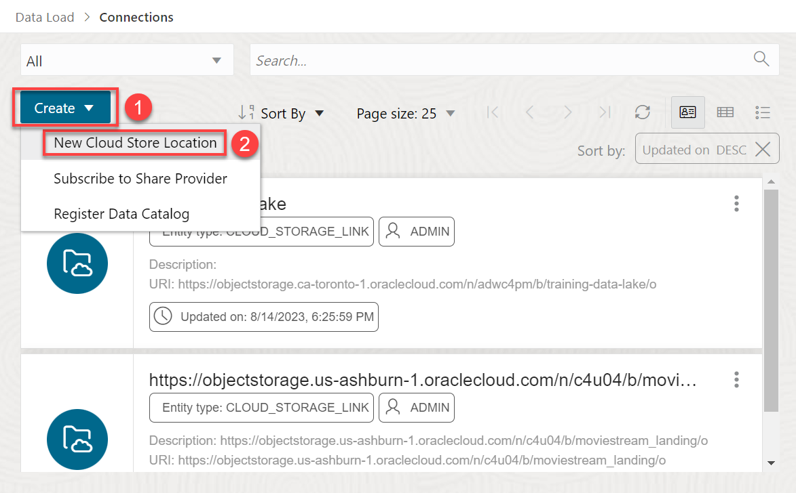
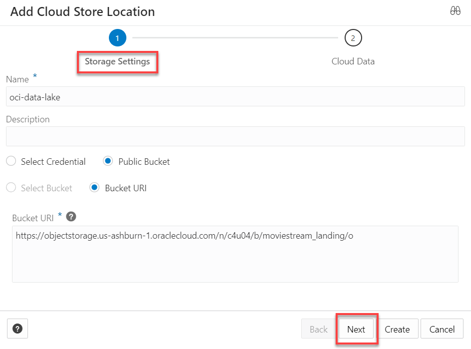
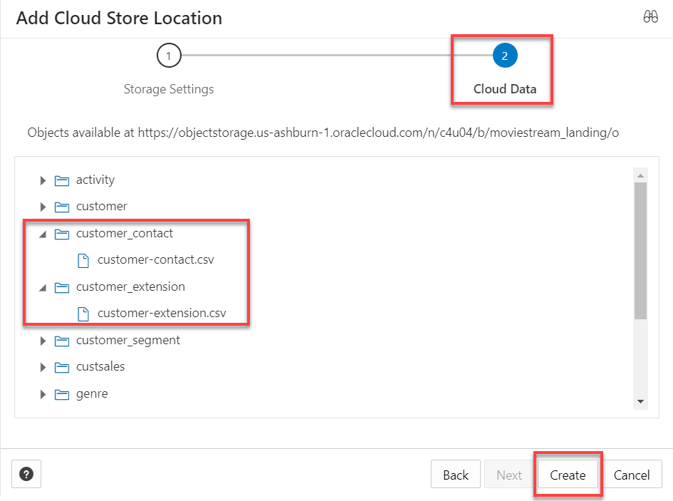
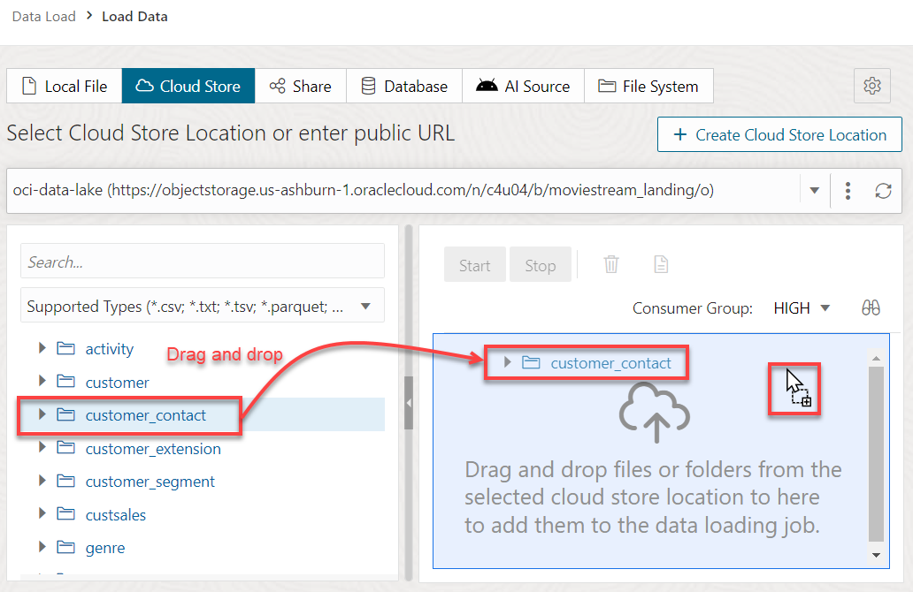
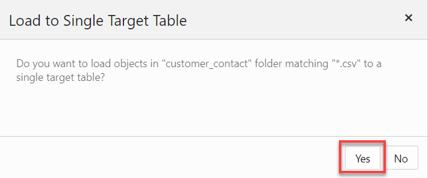
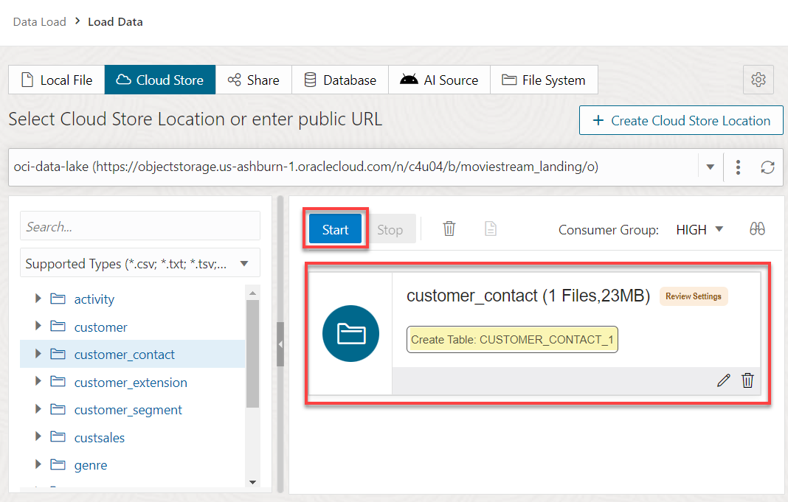
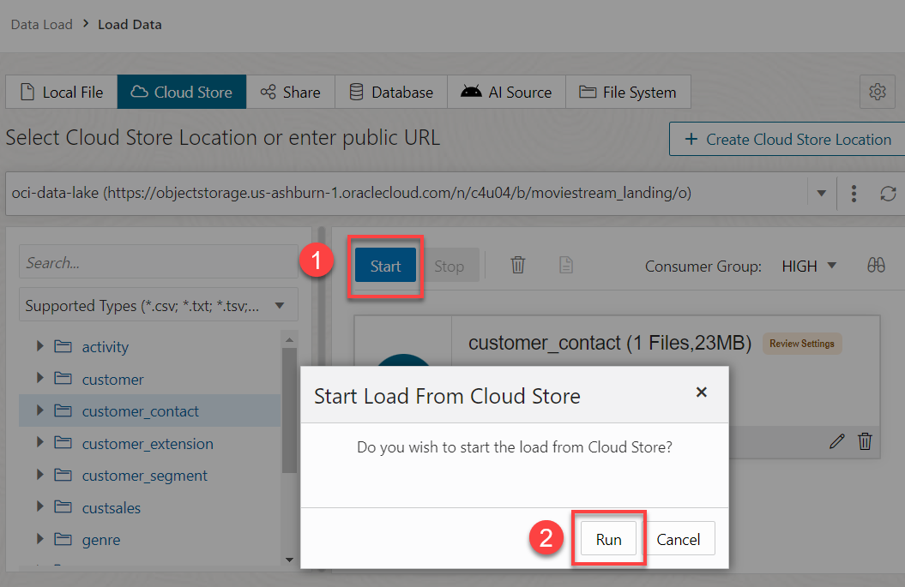
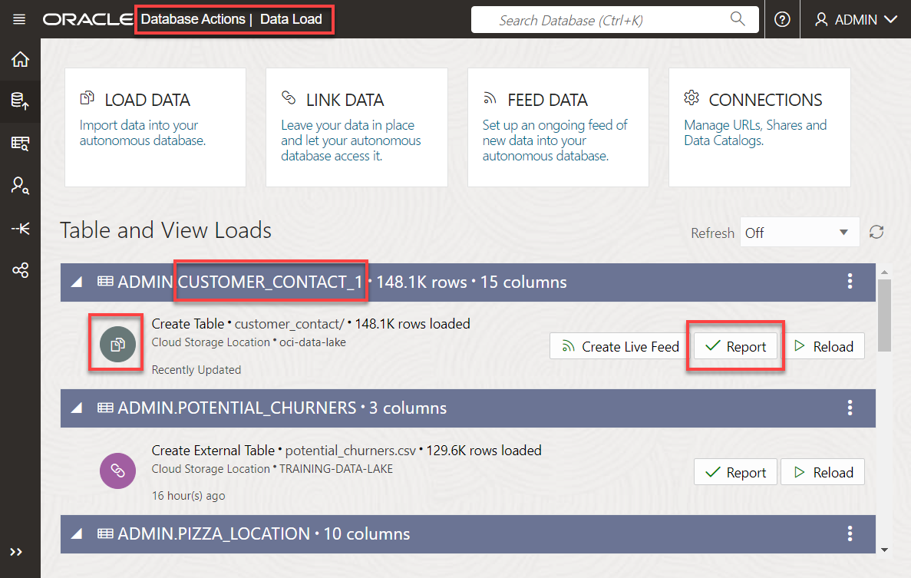
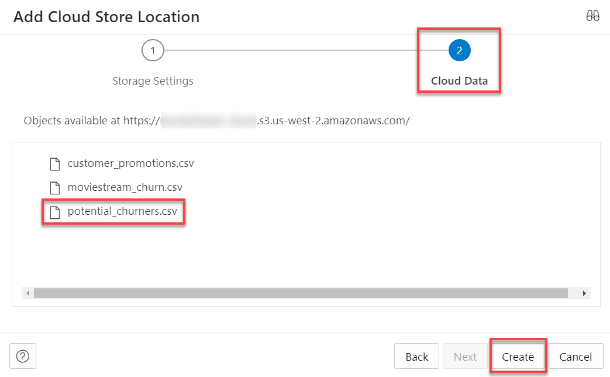
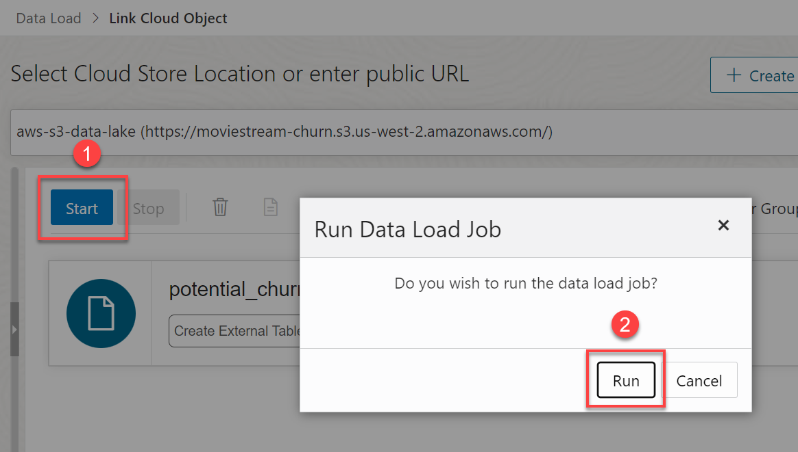

# Query Data from Multi-Cloud Data Lakes

## Introduction

In this demo, you will learn how to identify customers who might churn. The customers data is available in an OCI Object Storage bucket. We will load this data into our ADB instance and create database tables. The information about potential customers that will churn is found in an Amazon S3 (Simple Storage Service) bucket. We will link to that data and create an external table. Linking is preferred because if the data changes, we won't have to reload it. Finally, we will query the data from both the OCI and Amazon S3 buckets.

Estimated Time: 10 minutes

<!-- Comments:  -->

### Objectives

In this lab, we will show you how to do the following:

* Create an OCI Object Storage bucket cloud location and load customers data from this location into ADB and create database tables.
* Create an Amazon S3 bucket cloud location and link to potential customers churners and create an external table.
* Create a new table that joins the three created tables to show customers data and churners. The tables data originated from the OCI and Amazon S3 buckets.

### Prerequisites
Access to an ADW and Data Catalog instances, if you choose to perform the steps.

>**Note:**
_**This is not a hands-on lab; instead, it is a demo of how to query data from different clouds: OCI Object Storage and Amazon S3 buckets.**_

## Task 1: Navigate to the Data Load Page

1. Log in to the **Oracle Cloud Console**.

2. Open the **Navigation** menu and click **Oracle Database**. Under **Oracle Database**, click **Autonomous Database**.

<if type="livelabs">
3. On the **Autonomous Databases** page, click your **DB-DCAT** ADB instance.
</if>

<if type="freetier">
3. On the **Autonomous Databases** page, click your **ADW-Data-Lake** ADB instance.
</if>

4. On the **Autonomous Database details** page, click the **Database actions** drop-down list, and then click **Data Load**.

## Task 2: Define an OCI Oracle Cloud Location

In this task, we will get some customers information from a public OCI Object Storage bucket.

In this task, we define a **Connection** to connect to a public Oracle Object Storage bucket in order to load data from the **`customer-contact.csv`** and **`customer-extension.csv`** files to create detailed customers tables.

1. On the **Data Load** page, in the **Administration** section, click **CONNECTIONS**.

    

2. On the **Connections** page, click the **Create** drop-down list and then select **New Cloud Store Location** from the list.

    

3. Specify the following in the **Add Cloud Store Location** panel.
    + **Name:** Enter **`oci-data-lake`**.
    + **Description:** Enter an optional description.
    + Select the **Public Bucket** option.
    + The **Bucket URI** option is selected.
    + **Bucket URI:** Enter the URI for the public Object Storage bucket.

        ```
        <copy>
        https://objectstorage.us-ashburn-1.oraclecloud.com/n/c4u04/b/moviestream_landing/o
        </copy>
        ```

        

4. Click **Next** to see the available objects in the selected bucket. This bucket contains several folders. We will load the **`customer-contact.csv`** and **`customer-extension.csv`** files from their respective folders into our ADB instance and use them to create tables that will help us identify the potential customers churners.

    

5. Click **Create**. The **oci-data-lake** cloud location is displayed in the **Connections** page.

    

6. Click on the **Data Load** link in the breadcrumbs to return to the previous page.

## Task 3: Load Data from the OCI Cloud Location and Create a Table

In this task, we will load data and create the **customer\_contact** table in your Autonomous Database instance.

>**Note:** In **Lab 3: Load Data from Local Files**, we already loaded the **customer-extension.csv** file into our ADB instance; therefore, we won't perform this step. In addition, in **Lab 4: Link to Data in Public Object Storage Buckets**, we already linked to the **`customer_contact`** file and created the external table; however, in this task, we will load the same **`customer_contact`** data into our ADB instance and create a new database table under a new name. Querying data stored inside the database is much faster than querying data that is stored in external tables outside the database.

1. In the **What do you want to do with your data?** section, click **LOAD DATA**.

2. In the **Where is your data?** section, select **CLOUD STORE**, and then click **Next**.

3. The **Load Cloud Object** page is displayed. Use this page to drag and drop tables from the public object storage bucket to the data linking job.

    Copy the following public object storage URL and paste it in the **Select Cloud Store Location or enter public URL** field. Alternatively, you can select it from the drop-down list.

    ```
    <copy>
    https://objectstorage.us-ashburn-1.oraclecloud.com/n/c4u04/b/moviestream_landing/o
    </copy>
    ```

    Click **[ENTER]** on your keyboard. A list of the folders in the selected Object Storage bucket is displayed on left side section of the page. You can drag and drop the desired folders from this section to the data loading job section.

4. Drag the **`customer_contact`** folder and drop it onto the data linking job section.

    

5. A dialog box is displayed to prompt you whether or not if you want to load all objects in this folder matching **.csv** to a single target table. This folder contains a single file, **`customer_contact.csv`**. In general, data lake folders contain many files of the same type, as you will see with sales data. Click **Yes**.

    

    The **`customer_contact`** target table to be created for the selected **`.csv`** file is displayed in the data linking job section. Again, since we already have linked to the **`customer_contact`** file in a previous lab, the data load utility changed the name of the newly created external table to **`customer_contact_1`**.

    >**Note:** You can click the **`customer_contact (23 MB)`** link to display the settings for the table that will be created. You can preview the external table and change its name, data type, and so on.

    

6. Click **Start** to start the load job. The **Run Data Load Job** dialog box is displayed. Click **Run** to start the load job and to create the new external table.

    

    If the load job completes successfully, a green checkmark with the status **Complete** is displayed next to the file's name.

    

7. Navigate to the SQL Worksheet. Click **Oracle Database Actions** in the banner to display the **Launchpad** landing page.

    

8. In the **Development** section, click the **SQL** card to display the SQL Worksheet.

    The two tables that we created and will use in this demo are displayed in the **Navigator** tab, namely, **`CUSTOMER_CONTACT_1`** and **`CUSTOMER_EXTENSION`**.

    

## Task 4: Define an Amazon S3 Cloud Location

_**Note:** This is not a hands-on task; instead, it is a demo of how to define an Amazon S3 location._

In this task, we define a **Connection** to connect to our **`moviestream-churn`** AWS S3 bucket that contains the **`potential_churners.csv`** file. We will use this file in our demo to identify potential customers who might churn.


1. Click **Oracle Database Actions** in the banner to display the Launchpad landing page. In the **Data Studio** section, click the **DATA LOAD** card. On the **Data Load** card, in the **Administration** section, click **CONNECTIONS**.

2. On the **Connections** page, click the **Create** drop-down list, and then select **New Cloud Store Location**.

3. Specify the following in the **Add Cloud Store Location** panel.
    + **Name:** Enter **`aws-s3-data-lake`**.
    + **Description:** Enter an optional description.
    
        Click **Create Credential**. The **Create Credential** dialog box is displayed. Specify the following:
    
        + **Cloud Username and Password:** Select this option, if not already selected.
        + **Cloud Store:** Select **Amazon S3** option from the drop-down list.
        + **Credential Name:** Enter **`aws_s3_credential`**.
        + **AWS access key ID:** Enter the access key id.
        + **AWS secret access key:** Enter the secret access key.
    
            

        Click **Create Credential**. The **Add Cloud Store Location** panel is re-displayed. Specify the following: 

        + **Bucket URI:** Leave this option as selected which is the default.
        + **Bucket URI:** Enter your AWS endpoint. The URL format is as follows:

            `https://<bucket-name>.s3.<region>.amazonaws.com/`

            

4. Click **Next** to see the available objects in the bucket that you specified. We will only use the **`potential_churners.csv`** file.

    

5. Click **Create**. The **aws-s3-data-lake** cloud location is displayed in the **Manage Cloud Store** page.

    

6. Click on the **Data Load** link in the breadcrumbs to return to the previous page.

## Task 5: Link to Data from the AWS S3 Cloud Location and Create an External Table

In this task, we will link to the `potential_churners.csv` data from the AWS S3 cloud location that we created. A link is preferred so that if the data changes, we don't have to re-load the data. We are always looking at up-to-date data.

1. In the **What do you want to do with your data?** section, click **LINK DATA**.

2. In the **Where is your data?** section, select **CLOUD STORE**, and then click **Next**.

3. The **Link Cloud Object** page is displayed. Select the **`aws-s3-data-lake`** from the **Select Cloud Store Location or enter public URL** drop-down list, if not already selected from the previous task. Next, drag and drop the **`potential_churners`** table from the Amazon S3 public bucket to the data linking job.

    

4. Click **Start** and then click **Run**.

    

    If the **`potential_churners`** link job completes successfully, a green checkmark with the status **Complete** is displayed next to the file's name.

    

## Task 6: Query Data from the OCI and Amazon Data lakes

We now have the needed tables to analyze the data and identify the potential customers that might churn.

1. Click **Oracle Database Actions** in the banner to display the **Launchpad** landing page.

2. In the **Development** section, click the **SQL** card to display the SQL Worksheet.

3. Let's query the **`POTENTIAL_CHURNERS`** table. Copy and paste the following code into your SQL Worksheet, and then click the **Run Statement** icon in the Worksheet toolbar.

    ```
    <copy>
    select *
    from POTENTIAL_CHURNERS pc;
    </copy>
    ```

    The output shows whether or not the customer will churn and the probability of the churn by **`CUST_ID`**.

    

4. Let's query the **`CUSTOMER_EXTENSION`** table. Copy and paste the following code into your SQL Worksheet, and then click the **Run Statement** icon in the Worksheet toolbar.

    ```
    <copy>
    select *
    from CUSTOMER_EXTENSION e;
    </copy>
    ```

    The output shows typical information about the customers by `CUST_ID`.

    

5. Let's query the `CUSTOMER_CONTACT_1` table. In the SQL Worksheet, copy and paste the following code into your SQL Worksheet to query the data, and then click the **Run Statement** icon in the Worksheet toolbar.

    ```
    <copy>
    select *
    from CUSTOMER_CONTACT_1 cc;
    </copy>
    ```

    The output shows the customers geographical contact information by **`CUST_ID`**.

    

6. Create a new table that joins all three tables that originated from the OCI and AWS S3 data lakes based on the **`cust_id`** column. This table will show the customers that will churn (from the **`POTENTIAL_CHURNERS`** table), the detailed customer information (from the **`customer_extension`** table), and the geographical customers information (from the **`CUSTOMER_CONTACT_1`** table). Copy and paste the following code into your SQL Worksheet, and then click the **Run Script (F5)** icon in the Worksheet toolbar.

    ```
    <copy>
    create table potential_churn_customers as
        select
        pc.prob_churn,
        e.*,
        cc.STREET_ADDRESS,
        cc.POSTAL_CODE,
        cc.CITY,
        cc.STATE_PROVINCE,
        cc.COUNTRY,
        cc.COUNTRY_CODE,
        cc.CONTINENT,
        cc.YRS_CUSTOMER,
        cc.PROMOTION_RESPONSE,
        cc.LOC_LAT,
        cc.LOC_LONG
        from POTENTIAL_CHURNERS pc, CUSTOMER_EXTENSION e, CUSTOMER_CONTACT_1 cc
        where
        pc.cust_id=e.cust_id
        and cc.cust_id=pc.cust_id
        and pc.will_churn=1
        and pc.prob_churn>0.99;
    /
    </copy>
    ```

    The table is created.

    

7.  Query the table. Copy and paste the following code into your SQL Worksheet, and then click the **Run Statement** icon in the Worksheet toolbar.

    ```
    <copy>
    select *
    from potential_churn_customers cc;
    </copy>
    ```

    

    
    You may now proceed to the next lab.
    
## Learn more

* [Load Data from Files in the Cloud](https://www.oracle.com/pls/topic/lookup?ctx=en/cloud/paas/autonomous-data-warehouse-cloud&id=CSWHU-GUID-07900054-CB65-490A-AF3C-39EF45505802).
* [Load Data with Autonomous Database](https://docs.oracle.com/en/cloud/paas/autonomous-data-warehouse-cloud/user/load-data.html#GUID-1351807C-E3F7-4C6D-AF83-2AEEADE2F83E)

You may now proceed to the next lab.

## Acknowledgements

* **Author:**
    * Lauran Serhal, Consulting User Assistance Developer, Oracle Database and Big Data
* **Contributor:**
    + Alexey Filanovskiy, Senior Principal Product Manager
* **Last Updated By/Date:** Lauran Serhal, August 2023

Data about movies in this workshop were sourced from Wikipedia.

Copyright (C) Oracle Corporation.

Permission is granted to copy, distribute and/or modify this document
under the terms of the GNU Free Documentation License, Version 1.3
or any later version published by the Free Software Foundation;
with no Invariant Sections, no Front-Cover Texts, and no Back-Cover Texts.
A copy of the license is included in the section entitled [GNU Free Documentation License](files/gnu-free-documentation-license.txt)

