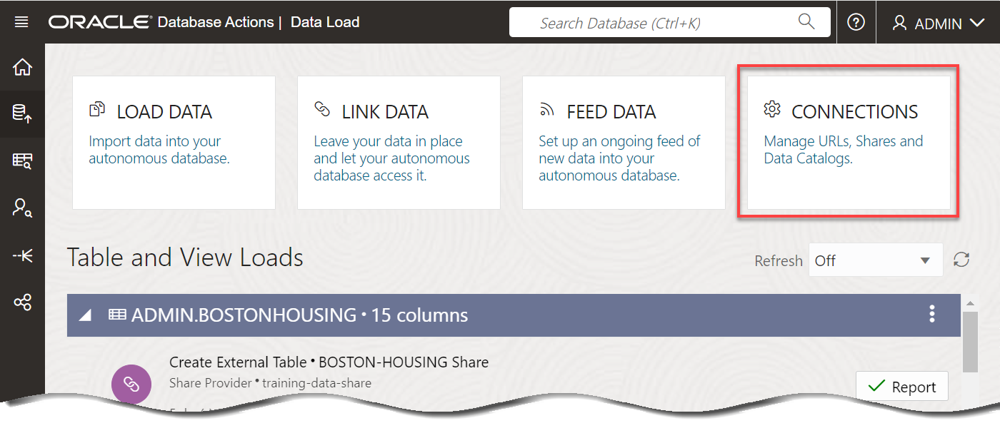
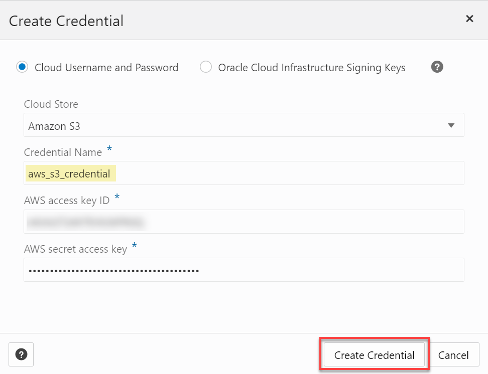
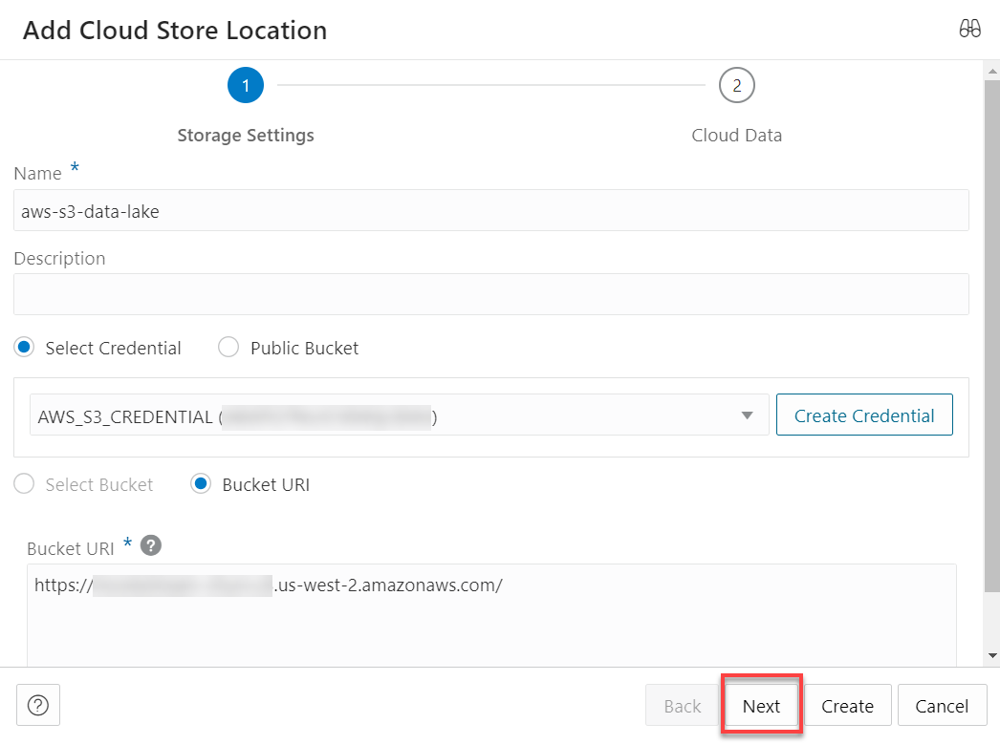
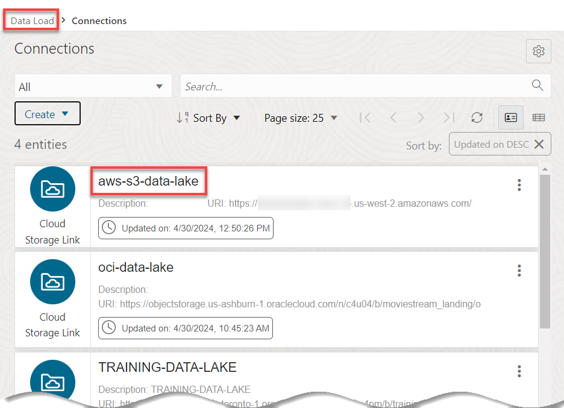

# Query Data from Multi-Cloud Data Lakes

## Introduction

In this demo, you will learn how to identify customers who might churn. The customers data is available in an OCI Object Storage bucket. We will load this data into our ADB instance and create database tables. The information about potential customers that will churn is found in an Amazon S3 (Simple Storage Service) bucket. We will link to that data and create an external table. Linking is preferred because if the data changes, we won't have to reload it. Finally, we will query the data from both the OCI and Amazon S3 buckets.

Estimated Time: 10 minutes

<!-- Comments:  -->

### Objectives

In this lab, we will show you how to do the following:

* Create an OCI Object Storage bucket cloud location and load customers data from this location into ADB and create database tables.
* Create an Amazon S3 bucket cloud location and link to potential customers churners and create an external table.
* Create a new table that joins the three created tables to show customers data and churners. The tables data originated from the OCI and Amazon S3 buckets.

### Prerequisites
Access to an ADW and Data Catalog instances, if you choose to perform the steps.

>**Note:**
_**This is not a hands-on lab; instead, it is a demo of how to query data from different clouds: OCI Object Storage and Amazon S3 buckets.**_

<!-- Comments:  -->

## Task 1: Define an Amazon S3 Cloud Location

_**Note:** This is not a hands-on task; instead, it is a demo of how to define an Amazon S3 location._

In this task, we define a **Connection** to connect to our **`moviestream-churn`** AWS S3 bucket that contains the **`potential_churners.csv`** file. We will use this file in our demo to identify potential customers who might churn.


1. Navigate to the **Data Load Dashboard**. Click **Database Actions | SQL** in the banner to display the **Launchpad** page. Click the **Data Studio** tab, and then click the **Data Load** tab.

2. Click the **CONNECTIONS** tile.

    

2. On the **Connections** page, click the **Create** drop-down list, and then select **New Cloud Store Location**.

    

3. Specify the following in the **Add Cloud Store Location** panel.
    + **Name:** Enter **`aws-s3-data-lake`**.
    + **Description:** Enter an optional description.
    
        Click **Create Credential**. The **Create Credential** dialog box is displayed. Specify the following:
    
        + **Cloud Username and Password:** Select this option, if not already selected.
        + **Cloud Store:** Select **Amazon S3** option from the drop-down list.
        + **Credential Name:** Enter **`aws_s3_credential`**.
        + **AWS access key ID:** Enter the access key id.
        + **AWS secret access key:** Enter the secret access key.
    
            

        Click **Create Credential**. The **Add Cloud Store Location** panel is re-displayed. Specify the following: 

        + **Bucket URI option:** Leave this option as selected which is the default.
        + **Bucket URI text box:** Enter your AWS endpoint. The URL format is as follows:

            `https://<bucket-name>.s3.<region>.amazonaws.com/`

            

4. Click **Next** to see the available objects in the bucket that you specified. We will only use the **`potential_churners.csv`** file.

    

5. Click **Create**. The **aws-s3-data-lake** cloud location is displayed in the **Connections** page.

    

6. Click on the **Data Load** link in the breadcrumbs to return to the **Data Load** page.

## Task 2: Link to Data from the AWS S3 Cloud Location and Create an External Table

In this task, we will link to the `potential_churners.csv` data from the AWS S3 cloud location that we created. A link is preferred so that if the data changes, we don't have to re-load the data. We are always looking at up-to-date data.

1. On the **Data Load** page, click the **LINK DATA** tile.

2. The **Link Data** page is displayed and the **CLOUD STORE** tab is selected. Select the **`aws-s3-data-lake`** from the **Select Cloud Store Location or enter public URL** drop-down list.

    

3. Drag and drop the **`potential_churners`** table from the Amazon S3 public bucket to the data linking job.

    

4. Click **Start** and then click **Run**. If the **`potential_churners`** link job completes successfully, the data link card has the link icon next to it. You can click the Report button for the link job to view a report of total rows processed successfully and failed for the selected table.

    

## Task 3: Query Data from the OCI and Amazon Data lakes

We now have the needed tables to analyze the data and identify the potential customers that might churn.

1. Click **Database Actions | Data Load** in the banner to display the **Launchpad** page. Click the **Development** tab, and then click the **SQL** tab to display the SQL Worksheet.

2. Let's query the **`POTENTIAL_CHURNERS`** table. Copy and paste the following code into your SQL Worksheet, and then click the **Run Statement** icon in the Worksheet toolbar.

    ```
    <copy>
    select *
    from POTENTIAL_CHURNERS pc;
    </copy>
    ```

    The output shows whether or not the customer will churn and the probability of the churn by **`CUST_ID`**.

    

4. Let's query the **`CUSTOMER_EXTENSION`** table. Copy and paste the following code into your SQL Worksheet, and then click the **Run Statement** icon in the Worksheet toolbar.

    ```
    <copy>
    select *
    from CUSTOMER_EXTENSION e;
    </copy>
    ```

    The output shows typical information about the customers by `CUST_ID`.

    

5. Let's query the `CUSTOMER_CONTACT_1` table. In the SQL Worksheet, copy and paste the following code into your SQL Worksheet to query the data, and then click the **Run Statement** icon in the Worksheet toolbar.

    ```
    <copy>
    select *
    from CUSTOMER_CONTACT_1 cc;
    </copy>
    ```

    The output shows the customers geographical contact information by **`CUST_ID`**.

    

6. Create a new table that joins all three tables that originated from the OCI and AWS S3 data lakes based on the **`cust_id`** column. This table will show the customers that will churn (from the **`POTENTIAL_CHURNERS`** table), the detailed customer information (from the **`customer_extension`** table), and the geographical customers information (from the **`CUSTOMER_CONTACT_1`** table). Copy and paste the following code into your SQL Worksheet, and then click the **Run Script (F5)** icon in the Worksheet toolbar.

    ```
    <copy>
    create table potential_churn_customers as
        select
        pc.prob_churn,
        e.*,
        cc.STREET_ADDRESS,
        cc.POSTAL_CODE,
        cc.CITY,
        cc.STATE_PROVINCE,
        cc.COUNTRY,
        cc.COUNTRY_CODE,
        cc.CONTINENT,
        cc.YRS_CUSTOMER,
        cc.PROMOTION_RESPONSE,
        cc.LOC_LAT,
        cc.LOC_LONG
        from POTENTIAL_CHURNERS pc, CUSTOMER_EXTENSION e, CUSTOMER_CONTACT_1 cc
        where
        pc.cust_id=e.cust_id
        and cc.cust_id=pc.cust_id
        and pc.will_churn=1
        and pc.prob_churn>0.99;
    /
    </copy>
    ```

    The table is created.

    

7.  Query the table. Copy and paste the following code into your SQL Worksheet, and then click the **Run Statement** icon in the Worksheet toolbar.

    ```
    <copy>
    select *
    from potential_churn_customers cc;
    </copy>
    ```

    

    You may now proceed to the next lab.
    
## Learn more

* [Load Data with Oracle Autonomous AI Database](https://docs.oracle.com/en/cloud/paas/autonomous-data-warehouse-cloud/user/load-data.html#GUID-1351807C-E3F7-4C6D-AF83-2AEEADE2F83E)

You may now proceed to the next lab.

## Acknowledgements

* **Author:** Lauran K. Serhal, Consulting User Assistance Developer
* **Contributor:** Alexey Filanovskiy, Senior Principal Product Manager
* **Last Updated By/Date:** Lauran K. Serhal, October 2025

Data about movies in this workshop were sourced from Wikipedia.

Copyright (C) 2025 Oracle Corporation.

Permission is granted to copy, distribute and/or modify this document
under the terms of the GNU Free Documentation License, Version 1.3
or any later version published by the Free Software Foundation;
with no Invariant Sections, no Front-Cover Texts, and no Back-Cover Texts.
A copy of the license is included in the section entitled [GNU Free Documentation License](https://oracle-livelabs.github.io/adb/shared/adb-15-minutes/introduction/files/gnu-free-documentation-license.txt)
